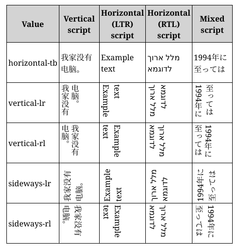
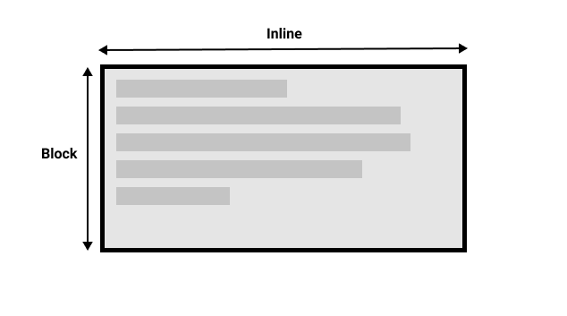
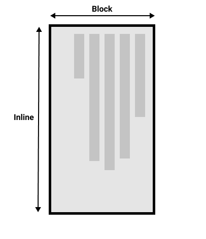

// NOTE

# 文本

## writing-mode 属性

##### writing-mode

- 定义书写模型

```css
.example {
  /* 横向, 从左到右 */
  writing-mode: horizontal-tb;
  /* 纵向, 从右到左 */
  writing-mode: vertical-rl;
  /* 纵向, 从左到右 */
  writing-mode: vertical-lr;
}
```



## 块级布局和内联布局




## 文本布局

### text-align 属性

##### text-align 属性

- 水平对齐方式

```css
.example {
  text-align: start;
  text-align: end;
  text-align: left;
  text-align: right;
  text-align: center;
  text-align: justify;
}
```

### line-height 属性

##### line-height 属性

- 修改行间距.

```css
div {
  /* 默认值 */
  line-height: normal;
  line-height: 1.2;
}
```

### letter-spacing 属性

##### letter-spacing 属性

- 修改字间距.

```css
.normal {
  /* 默认值 */
  letter-spacing: normal;
  letter-spacing: 1.2;
}
```

### word-spacing 属性

##### word-spacing

- 修改词间距.

```css
#mozdiv1 {
  /* 默认值 */
  word-spacing: normal;
  word-spacing: 1.2;
}
```

## text-transform 属性

##### text-transform 属性

- 字体变换.

```css
span {
  text-transform: none;
  text-transform: capitalize;
  text-transform: uppercase;
  text-transform: lowercase;
  text-transform: full-width;
}
```

## text-shadow 属性

##### text-shadow 属性

- 添加字体阴影.
- offset-x | offset-y | blur-radius | color.

```css
.red-text-shadow {
  text-shadow: 1px 2px 2px red;
  /* 可叠加, 逗号分隔 */
  text-shadow: 1px 1px 2px black, 0 0 1em blue, 0 0 0.2em blue;
}
```

## 字体修饰

### text-decoration 属性

##### text-decoration 属性

- 添加字体修饰线.

```css
.over {
  text-decoration: wavy overline lime;
}
```

##### 成分属性

- text-decoration-color: 字体装饰线颜色, 同 color 属性;
- text-decoration-line;
- text-decoration-style.

### text-decoration-line 属性

##### text-decoration-line 属性

- 添加字体装饰线.

```css
.both {
  text-decoration-line: none;
  text-decoration-line: underline;
  text-decoration-line: overline;
  text-decoration-line: line-through;
  /* 可叠加 */
  text-decoration-line: underline overline;
}
```

### text-decoration-style 属性

##### text-decoration-style 属性

- 装饰线样式.

```css
.wavy {
  text-decoration-style: solid;
  text-decoration-style: double;
  text-decoration-style: dotted;
  text-decoration-style: dashed;
  text-decoration-style: wavy;
}
```

## 逻辑属性

### inline-size 和 block-size 属性

##### 作用

- 适用于不同书写模式.

##### 机制

- inline-size: inline 方向;
- block-size: block 方向.

### padding, border 和 margin

##### 逻辑属性

- xxx-block-start;
- xxx-block-end;
- xxx-inline-start;
- xxx-inline-end;

##### 上下左右对应逻辑值

- block-start;
- block-end;
- inline-start:
- inline-end.

## 超链接样式

### 默认样式

##### link

- 下划线.

##### unvisited

- 蓝色.

##### visited

- 紫色.

##### hover

- 鼠标显示为小手图标.

##### focus

- 方框包裹.

##### active

- 红色.

### cursor 属性

##### cursor 属性

- 修改鼠标样式.

```css
.bar {
  cursor: auto;
  cursor: none;
  cursor: help;
  cursor: pointer;
  cursor: progress;
  cursor: wait;
  cursor: text;
  cursor: move;
  cursor: wait;
  cursor: not-allowed;
  cursor: grab;
  cursor: zoom-in;
  cursor: zoom-out;
}
```
