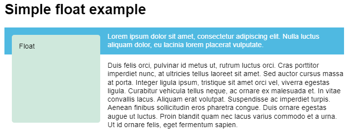

// NOTE

# floats 和 shapes

## float 布局

### float 属性

##### float 属性

- 设置 floats 布局.

```css
section {
  float: none;
  float: left;
  float: right;
  float: inline-start;
  float: inline-end;
}
```

##### float 和 normal flow 的关系

- float 所属标签与 normal flow 分离,
- float 所属标前在 normal flow 层级之上.

##### float 问题

- float 脱离了 normal flow,
- 父标签无法获取其任何信息,
- float 所属标签依旧会对 normal flow 中的 content box 造成影响,
- 但是无法影响其 padding 和 margin box,
- 产生了所谓的 float 问题.



### clear 属性

##### 作用

- 决定标签是否移动至其之前的 floating 标签底部.

```css
.left {
  border: 1px solid black;
  /* 不移动 */
  clear: none;
  /* 左侧标签底部 */
  clear: left;
  /* 右侧标签底部 */
  clear: right;
  /* 左右侧标签底部 */
  clear: right;
  /* 逻辑属性 */
  clear: inline-start;
  clear: inline-end;
}
```

### 清除浮动

##### clearfix hack

- .wrapper 标签最后生成一个空的子标签;
- 由于其是块级标签,
- 况且 clear 属性值为 both,
- 所以该子标签必须在 floating 子标签底部,
- 从而拉高了其父标签 .wrapper 标签的高度,
- 达到清除浮动的效果.

```css
.wrapper::after {
  content: "";
  clear: both;
  display: block;
}
```

##### overflow

- overflow 创建一个块级上下文.

```css
.wrapper {
  background-color: rgb(79, 185, 227);
  padding: 10px;
  color: #fff;
  overflow: auto; /* other than visible */
}
```

##### display: flow-root

- display: flow-root 创建块级上下文;

```css
.wrapper {
  background-color: rgb(79, 185, 227);
  padding: 10px;
  color: #fff;
  display: flow-root;
}
```
