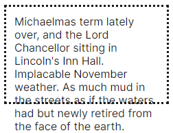

// NOTE

# positioning

## Width and Height

### max-width 属性

##### 作用

- 设置最大宽度;

```css
table {
  max-width: auto;
  max-width: 75%;
  max-width: 100px;
}
```

### 其余属性

- min-width 属性;
- min-height 属性;
- max-height 属性;

## 溢出

### 溢出

##### 溢出



### overflow 属性

##### 作用

- 设置文字溢出样式;

```css
p {
  /* 文字不会被裁剪 */
  overflow: visible;
  /* 文字被裁剪, 无滚动条, 可通过 js 滚动 */
  overflow: hidden;
  /* 文字被裁剪, 无滚动条, 不可通过 js 滚动 */
  overflow: clip;
  /* 文字被裁剪, 具有滚动条 */
  overflow: scroll;
  /* 文字被裁剪, 按需设置滚动条 */
  overflow: auto;
}
```

##### 成分属性

- overflow-x;
- overflow-y;

##### 多值属性

- 1 value;
- 2 value: x + y;

## positioning

### position 属性

##### 作用

- 设置 position 样式;

```css
positioned {
  position: static;
  position: relative;
  position: absolute;
  position: fixed;
  position: sticky;
}
```

### top/bottom/left/right 属性

##### 作用

- 用于定位元素位置;
- 见 [[040_类型_变量#position 类型]] ;

```css
positioned {
  position: absolute;
  top: 40px;
  left: 40px;
}
```

### static positioning

##### 机制

- normal flow 默认值,
- top/right/bottom/left/z-index 无效;

```css
positioned {
  position: static;
  background: yellow;
}
```

### relative positioning

##### 作用

- 设置为 relative positioning 类型;

```css
positioned {
  position: relative;
  background: yellow;
}
```

##### 定位机制

- 根据其 normal position 定位,
- 再根据 top/bottom/left/right 偏移;

### absolute positioning

##### 作用

- 设置为 absolute positioning 类型;

```css
positioned {
  position: absolute;
  background: yellow;
}
```

##### 隔离机制

- 脱离 normal flow, 与其隔离;
- 拥有自己的图层;

##### 定位机制

- 根据其 containing block 计算;

### fixed positioning

##### 作用

- 设置为 fixed positioning 类型;

```css
positioned {
  position: fixed;
  background: yellow;
}
```

##### 定位机制

- 根据 viewport 计算;

### sticky positioning

##### 作用

- 设置为 sticky positioning 类型;

```css
positioned {
  position: sticky;
  background: yellow;
}
```

##### 机制

- 像是 relative 和 fixed 的混合体;
- 默认根据 relative 定位;
- 当其滚动到 fixed 定位生效的位置时, 转换成 fixed;

##### 定位机制

- 根据 containing block 计算;

##### scrolling index 机制

- 当存在多个 position 属性值为 sticky 的元素时;
- 按照其次序一层层覆盖叠加;

### positioning context

##### containing block

- static/relative/sticky;
  - 最近的祖先元素,
  - 且是 block container;
- absolute;
  - 最近的祖先元素,
  - 且其 position 属性值不是 static;
- fixed:
  - viewport;

##### initial containing block

- 具有 viewport 的尺寸,
- 包含 \<html\> 标签;

##### positioning context

- position 属性值非 static 即可,
- 推荐使用 relative;

```css
.positioned {
  position: relative;
}
```

## z-index

##### 作用

- 设置对应标签的 stack level;

```css
dashed-box {
  position: relative;
  z-index: 1;
}
```

##### 机制

- z-index 属性值越大, 其 stack level 越高;
- 当元素重叠时, stack level 高者优先被显示;
