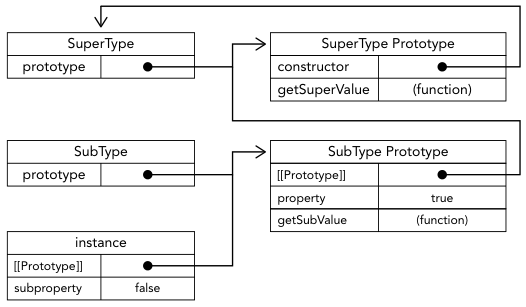
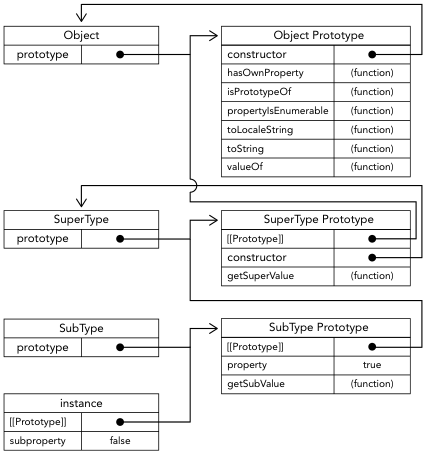

# 对象和类

## 对象进阶

### 对象属性种类

##### 数据属性

- 保存属性值;
- 属性行为;
  - configurable: 表示属性可被删除/重新定义, 默认为 true;
  - enumerable: 表示属性可枚举, 应用于 for-in 循环, 默认为 true;
  - writable: 表示属性值可被改变, 默认为 true;
  - value: 表示属性值, 默认为 undefined;

##### 访问器属性

- 表示访问属性时的行为, 必须通过 defineProperty() 定义;
- 属性行为;
  - configurable: 表示属性可被删除/重新定义, 默认为 true;
  - enumerable: 表示属性可枚举, 应用于 for-in 循环, 默认为 true;
  - get: 当属性被读时调用的函数, 默认值为 undefined;
  - set: 当属性被写时调用的函数, 默认值为 undefined;

### 对象语法增强

##### 属性值简写

```typescript
// 传统
let name = "Matt";
let person = {
  name: name,
};
// 属性值简写
let name = "Matt";
let person = {
  name,
};
```

##### 可计算属性

```typescript
// 传统
const nameKey = "name";
let person = {};
person[nameKey] = "Matt"; // { name: 'Matt' }
// 可计算属性
const nameKey = "name";
const ageKey = "age";
const jobKey = "job";
let person = {
  [nameKey]: "Matt",
}; // { name: 'Matt' }
console.log(person); // { name: 'Matt' }
```

##### 简写方法名

```typescript
// 传统
let person = {
  sayName: function (name) {
    console.log("My name is ${name}");
  },
};
// 简写方法名, 广泛应用于 class
let person = {
  sayName(name) {
    console.log("My name is ${name}");
  },
};
```

### Object 解构

##### Object 解构

```typescript
// 未赋值的属性为 undefined
let person = {
  name: "Matt",
  age: 27,
};
let { name, job } = person;
console.log(name); // Matt
console.log(job); // undefined

// 函数参数使用解构
let person = {
  name: "Matt",
  age: 27,
};
function printPerson(foo, { name: personName, age: personAge }, bar) {
  console.log(arguments);
  console.log(personName, personAge);
}
printPerson("1st", person, "2nd");
// ['1st', { name: 'Matt', age: 27 }, '2nd']
// 'Matt', 27
```

### 工厂模式

```typescript
// 无法自定义返回对象类型
function createPerson(name, age, job) {
  let o = new Object();
  o.name = name;
  o.age = age;
  o.job = job;
  o.sayName = function () {
    console.log(this.name);
  };
  return o;
}
let person1 = createPerson("Nicholas", 29, "Software Engineer");
```

### 构造函数模型

##### 语法格式

```typescript
// 只能使用普通函数形式定义
function Person(name, age, job) {
  this.name = name;
  this.age = age;
  this.job = job;
  this.sayName = function () {
    console.log(this.name);
  };
}
// 创建一个新对象
// object 的 [[prototype]] 赋值 constructor function 的 prototype 属性
// constructor function 的 this 指向 object;
// 执行 constructor function 内部代码;
// 返回 object;
let person1 = new Person("Nicholas", 29, "Software Engineer");
let person2 = new Person("Greg", 27, "Doctor");
// 不同 Person 实例的 constructor 指向 Person
console.log(person1.constructor === Person); // true
console.log(person2.constructor === Person); // true
// Person 实例可被表示为自定义类型
console.log(person1 instanceof Person); // true
```

##### 构造函数和普通函数

```typescript
// 普通函数调用时不使用 new()
// this 默认指向 global
let person = new Person("Nicholas", 29, "Software Engineer");
person.sayName(); // "Nicholas"
Person("Greg", 27, "Doctor"); // adds to window
window.sayName(); // "Greg"
```

##### 构造函数模式的缺陷

```typescript
// 每创建一个新的实例, 其方法属性会重新创建;
// 不同实例中的同一方法引用不同;
function Person(name, age, job) {
  this.name = name;
  this.age = age;
  this.job = job;
  this.sayName = function () {
    console.log(this.name);
  };
}
console.log(person1.sayName === person2.sayName); // false

// 可通过下列代码解决
// 但实现非常丑陋
function Person(name, age, job) {
  this.name = name;
  this.age = age;
  this.job = job;
  this.sayName = sayName;
}
function sayName() {
  console.log(this.name);
}
let person1 = new Person("Nicholas", 29, "Software Engineer");
let person2 = new Person("Greg", 27, "Doctor");
console.log(person1.sayName === person2.sayName); // true
```

### 原型模式

##### prototype 属性

```typescript
// prototype 属性包含特定引用类型实例共享的属性和方法
// prototype 属性的 enumerable 定义为 false, 不可枚举
function Person() {}
Person.prototype.name = "Nicholas";
Person.prototype.age = 29;
Person.prototype.job = "Software Engineer";
Person.prototype.sayName = function () {
  console.log(this.name);
};
let person1 = new Person();
person1.sayName(); // "Nicholas"
let person2 = new Person();
person2.sayName(); // "Nicholas"
console.log(person1.sayName == person2.sayName); // true
```

##### prototype 属性机制

- 每当创建一个 function, 自动定义一个 prototype 属性, 指向原型对象;
  - 原型对象 为一个 object;
    - 原型对象 自动定义一个 constructor 属性;
    - constructor 属性指向 function;
- 若 function 为 constructor function;
  - 根据 constructor function 创建的实例自动定义一个 \[\[prototype\]\],
  - 实例的 \[\[prototype\]\] 指向 constructor function 的 prototype 属性;
  - 不同实例指向同一个 prototype 属性;
  - \[\[prototype\]\] 在浏览器中往往使用 \_\_proto\_\_ 属性;


##### 对象属性的访问流程

- 一个属性被访问;
- 首先根据其名称在实例本身进行搜索;
- 若未找到, 再从实例指向的 prototype 中进行搜索;

##### prototype 的覆写机制

- prototype 中的属性无法被覆写;
- 若在实例中定义与 prototype 中同名的属性;
- 将其定义于实例, 即无法访问 prototype 中的属性;
- 可通过 delete 删除实例定义的同名属性, 进而访问 prototype 中的同名属性;

##### 重写 prototype 问题

```typescript
// 对象实例仅有对 prototype 的引用
function Person() {}
let friend = new Person();
Person.prototype = {
  constructor: Person,
  name: "Nicholas",
  age: 29,
  job: "Software Engineer",
  sayName() {
    console.log(this.name);
  },
};
friend.sayName(); // error
```


### 枚举对象

##### in 操作符

```typescript
// 判断对象是否具有属性, 包括实例属性和原型属性
function Person() {}
Person.prototype.name = "Nicholas";
let person1 = new Person();
console.log("name" in person1); // true

// 判断对象是否具有原型属性
!object.hasOwnProperty(prop) && prop in object;
```

##### 枚举顺序

- 以下操作无明确枚举顺序;
  - for-in;
  - Object.keys();
- 以下操作有明确枚举顺序
  - 枚举顺序;
    - 先数字属性升序排列,
    - 后字符串和 symbol 根据插入顺序排列.
  - 方法/函数.
    - Object.getOwnPropertyNames();
    - Object.getOwnPropertySymbols;
    - Object.assign();

### 常用 API

##### 创建对象

```typescript
// 创建一个 me 对象, 并将 me.prototype 指向 person
const me = Object.create(person);
```

##### 操作属性

```typescript
// 定义属性种类
// 使用 defineProperty() 定义对象属性
// 三个参数依次为对象, 属性名, 属性描述
Object.defineProperty(object1, "property1", {
  value: 42,
  writable: false,
});
// 定义多个属性种类
const object1 = {};
Object.defineProperties(object1, {
  property1: {
    value: 42,
    writable: true,
  },
  property2: {},
});

// 获取属性描述
const descriptor1 = Object.getOwnPropertyDescriptor(object1, "property1");
console.log(descriptor1.configurable);
console.log(descriptor1.value);
// 获取 object1 所有属性名
console.log(Object.getOwnPropertyNames(object1));
// 获取 object1 所有 symbol 属性
const objectSymbols = Object.getOwnPropertySymbols(object1);

// 合并属性
// 将可枚举的属性浅复制, 合并至目标 object
const target = { a: 1, b: 2 };
const source = { b: 4, c: 5 };
const returnedTarget = Object.assign(target, source); // Object { a: 1, b: 4, c: 5 }

// 判断是否具有实例属性
const object1 = {};
object1.property1 = 42;
// 判断 object1 实例是否具有 property1 属性
console.log(object1.hasOwnProperty("property1"));
```

##### 对象判等

```typescript
// === 的缺陷
// 不同的 0 看作相等
console.log(+0 === -0); // true
// 不同的 NaN 看作不相等
console.log(NaN === NaN); // false
// 使用 is()
console.log(Object.is(-0, 0)); // false
console.log(Object.is(NaN, NaN)); // true
```

##### 原型

```typescript
const bar = new Bar();
// 检验 bar 实例指向的 [[prototype]] 是否是 Bar 的 prototype 属性
console.log(Bar.prototype.isPrototypeOf(bar)); // true
// 获得 bar 实例的 [[prototype]] 属性
Object.getPrototypeOf(bar);
// 设置 bar 实例的 [[prototype]] 属性
Object.setPrototypeOf(bar, { foo: "bar" });
console.log(bar.foo); // "bar"
```

##### 枚举

```typescript
const object1 = {
  a: "somestring",
  b: 42,
  c: false,
};
// 获取 object 所有可被枚举的属性名数组
console.log(Object.keys(object1)); // ["a", "b", "c"]
// 获取 object 所有可被枚举的属性值数组
console.log(Object.values(object1)); //["somestring", 42, false]
// 获取 object 所有可被枚举的属性数组
for (const [key, value] of Object.entries(object1)) {
  console.log(`${key}: ${value}`);
}
```

##### 原型和继承关系

```typescript
// instanceof 操作符
console.log(instance instanceof Object); // true
console.log(instance instanceof SuperType); // true
// isPrototypeOf() 方法
console.log(Object.prototype.isPrototypeOf(instance)); // true
console.log(SuperType.prototype.isPrototypeOf(instance)); // true
console.log(SubType.prototype.isPrototypeOf(instance)); // true
```

## 继承

### 原型链

##### 原型链

```typescript
function SuperType() {
  this.property = true;
}
SuperType.prototype.getSuperValue = function () {
  return this.property;
};
function SubType() {
  this.subproperty = false;
}
// 继承 SuperType
SubType.prototype = new SuperType();
// 新方法
SubType.prototype.getSubValue = function () {
  return this.subproperty;
};

// SubType 及其示例 instance 指向 SubType.prototype, SubType.prototype 指向 SuperType.prototype
// 通过原型链访问到 SuperType.prototype.getSuperValue
let instance = new SubType();
console.log(instance.getSuperValue()); // true
```



##### 默认原型

- 任何 reference type 都继承于 Object.



##### 原型链问题

- SuperType 属性共享, 某一实例的引用值属性的修改会导致所有引用值属性的修改;
- SubType 创建时无法传递参数至 SuperType.

### 盗用构造函数

##### 语法格式

```typescript
function SuperType() {
  this.colors = ["red", "blue", "green"];
}
function SubType() {
  // 继承 SuperType 属性
  SuperType.call(this);
}
let instance1 = new SubType();
instance1.colors.push("black");
console.log(instance1.colors); // "red,blue,green,black"
let instance2 = new SubType();
console.log(instance2.colors); // "red,blue,green"
```

##### 传递参数

```typescript
function SuperType(name) {
  this.name = name;
}
function SubType() {
  // 继承 SuperType 属性并传递参数
  SuperType.call(this, "Nicholas");
  this.age = 29;
}
let instance = new SubType();
console.log(instance.name); // "Nicholas";
console.log(instance.age); // 29
```

##### 盗用构造函数缺点

- SuperType() 中的方法无法复用;
- 无法使用 SuperType.Prototype 中的方法;

### 组合继承

```typescript
// 原型链和盗用构造函数的结合
// 使用 prototype chaining 继承 prototype 上的属性
// 使用 Constructor Stealing 继承 constructor function 上的属性
function SuperType(name) {
  this.name = name;
  this.colors = ["red", "blue", "green"];
}
SuperType.prototype.sayName = function () {
  console.log(this.name);
};
function SubType(name, age) {
  // 继承 SuperType 属性
  SuperType.call(this, name);
  this.age = age;
}
// 继承 SuperType 方法
SubType.prototype = new SuperType();
SubType.prototype.sayAge = function () {
  console.log(this.age);
};
```

### 原型式继承

##### 原型函数

```typescript
// 等效于 Object.create(o)
function object(o) {
  function F() {}
  F.prototype = o;
  return new F();
}
```

### 寄生式继承

##### 语法格式

```typescript
function createAnother(original) {
  // 首先继承 original 属性
  let clone = object(original);
  // 创建自己实例属性
  clone.sayHi = function () {
    console.log("hi");
  };
  return clone;
}
```

##### 寄生式继承的缺点

- 方法难以复用;

### 寄生式组合继承

```typescript
// 结合寄生继承和组合继承
// 只调用一次 SuperType()
function inheritPrototype(subType, superType) {
  let prototype = object(superType.prototype); // create object
  prototype.constructor = subType; // augment object
  subType.prototype = prototype; // assign object
}
function SuperType(name) {
  this.name = name;
  this.colors = ["red", "blue", "green"];
}
SuperType.prototype.sayName = function () {
  console.log(this.name);
};
function SubType(name, age) {
  SuperType.call(this, name);
  this.age = age;
}
inheritPrototype(SubType, SuperType);
SubType.prototype.sayAge = function () {
  console.log(this.age);
};
```

## Classes

### Class 基础

##### 定义 Class

```typescript
// class 声明
class Person {}
// class 表达式
const Animal = class {};
```

##### 变量提升

- class 声明不会发生变量提升.

##### 作用域

- 块作用域.

##### 命名原则

- 大驼峰;
- instance 和 class 命名相关.

### 构造函数

```typescript
// constructor 可选, 默认为一个空函数
const Person = class {
  constructor() {
    console.log("person ctor");
  }
};
```

### 实例化

##### 实例化机制

```typescript
// 在内存中创建一个 object
// object 的 prototype 指向 constructor 的 prototype
// constructor 的 this 指向 object
// 执行 constructor 内语句
// 若 constructor 返回一个 object, 则返回该 object, 否则返回 this, 即新创建的对象
const Person = class {
  constructor() {
    console.log("0");
  }
};
let p1 = new Person(); // 0
```

##### 构造函数参数

```typescript
// 类实例化时传入的参数会用作构造函数的参数
class Person {
  constructor(name) {
    console.log(arguments.length);
    this.name = name || null;
  }
}
let p1 = new Person(); // 0
console.log(p1.name); // null

let p2 = new Person("Jake"); // 1
console.log(p2.name); // Jake
```

##### new 的强制使用

- 与 function 不同, class 强制使用 new;
- 当 function 不使用 new 时, this 指向 global, class 则会报错;

### 两种函数形式

##### 两种函数形式

```typescript
class Test {
  // 普通函数
  fun() {
    console.log(this.color);
  }

  // 箭头函数
  arrow = () => {
    console.log(this.color);
  };
}
```

##### this 的指向

```typescript
// 普通函数的 this 指向函数被调用时所在作用域的 variable object
// 箭头函数的 this 指向箭头函数定义时所在作用域的 variable object
// 但是箭头函数形式等效于在 constructor 中定义函数, 每个实例之间不会共享
class Test {
  color = "red";
  fun() {
    console.log(this.color);
  }

  arrow = () => {
    console.log(this.color);
  };
}

const instance = new Test();

const a = {
  color: "green",
};
a.fun = instance.fun;
a.arrow = instance.arrow;

instance.fun(); // red
instance.arrow(); // red
a.fun(); // green
a.arrow(); // red
```

##### 绑定 this

```typescript
class Person {
  constructor(name) {
    this.name = name;
    this.talk = this.talk.bind(this); // 在构造器里显式调用 bind 函数绑定 this
  }

  talk() {
    console.log(`${this.name} says hello`);
  }
}
```

### 实例成员

##### 实例成员

```typescript
// 定义在 constructor 中, 使用 this 定义
// 实例的自有属性, 不同实例之间相互隔离
class Person {
  constructor() {
    this.name = new String("Jack");
    this.sayName = () => console.log(this.name);
    this.nicknames = ["Jake", "J-Dog"];
  }
}

let p1 = new Person(),
p1.sayName(); // Jack
p1.name = p1.nicknames[0];
p1.sayName(); // Jake
```

### 原型方法和访问器

##### 原型方法

```typescript
// 类中定义的方法在 class.prototype 中
// 保证不同实例之间共享
class Person {
  constructor() {
    this.locate = () => console.log("instance");
  }
  locate() {
    console.log("prototype");
  }
}
let p = new Person();
p.locate(); // instance
Person.prototype.locate(); // prototype
```

##### 访问器

```typescript
// 写 name 属性时触发 set
// 读 name 属性时触发 get
class Person {
  set name(newName) {
    this.name_ = newName;
  }
  get name() {
    return this.name_;
  }
}
let p = new Person();
p.name = "Jake";
console.log(p.name); // Jake
```

### 静态方法

##### 静态方法

```typescript
class Person {
  constructor() {
    // 实例方法
    this.locate = () => console.log("instance", this);
  }
  // 原型方法
  locate() {
    console.log("prototype", this);
  }
  // 静态方法, 定义在 class 对应的 object 上, 不需要实例化即可访问
  static locate() {
    console.log("class", this);
  }
}
let p = new Person();
p.locate(); // instance, Person {}
Person.prototype.locate(); // prototype, {constructor: ... }
Person.locate(); // class, class Person {}
```

### 迭代器和生成器

##### 语法格式

```typescript
class Person {
  // 定义在原型上
  *createNicknameIterator() {
    yield "Jack";
    yield "Jake";
    yield "J-Dog";
  }
  // 定义在类上
  static *createJobIterator() {
    yield "Butcher";
    yield "Baker";
    yield "Candlestick maker";
  }
}
let jobIter = Person.createJobIterator();
console.log(jobIter.next().value); // Butcher
console.log(jobIter.next().value); // Baker
console.log(jobIter.next().value); // Candlestick maker
let p = new Person();
let nicknameIter = p.createNicknameIterator();
console.log(nicknameIter.next().value); // Jack
console.log(nicknameIter.next().value); // Jake
console.log(nicknameIter.next().value); // J-Dog
```

##### 定义默认 iterator

```typescript
class Person {
  constructor() {
    this.nicknames = ["Jack", "Jake", "J-Dog"];
  }
  *[Symbol.iterator]() {
    yield* this.nicknames.entries();
  }
}
let p = new Person();
for (let [idx, nickname] of p) {
  console.log(nickname);
}
// Jack
// Jake
// J-Dog
```

### 深入理解类

##### class 的本质

```typescript
// js 中的类就是一个特殊的函数
const Person = class {};
console.log(Person); // class Person {}
console.log(typeof Person); // function
```

##### prototype 属性

- class 具有 prototype 属性;
- 对应原型对象具有 constructor 属性, 指向 class 本身.

##### instanceof 操作符

```typescript
class Person {}
let p = new Person();
// 根据检测对象的 prototype chain 对应的 constructor function 判断
console.log(p instanceof Person); // true
```

## 类继承

### 继承基础

##### 定义和调用

```typescript
// 使用 extends 关键字;
// 父类具有 construct 和 prototype 属性;
// 子类继承父类所有的属性和方法.
class Vehicle {
  identifyPrototype(id) {
    console.log(id, this);
  }
}
class Bus extends Vehicle {}
let v = new Vehicle();
let b = new Bus();
b.identifyPrototype("bus"); // bus, Bus {}
v.identifyPrototype("vehicle"); // vehicle, Vehicle {}
```

### super

##### super

```typescript
// 只能用于子类 constructor 和 static method 中;
// 用于调用父类的 construct 并赋值给子类的 this;
// 当不自定义 constructor 时, 自动调用 super;
class Vehicle {
  constructor() {
    this.hasEngine = true;
  }
}
class Bus extends Vehicle {
  constructor() {
    // 调用 super() 之前, 子类无法使用 this
    // 自定义 constructor 必须使用 super(), 或返回一个自定义 object
    super();
    console.log(this instanceof Vehicle); // true
    console.log(this); // Bus { hasEngine: true }
  }
}
```

### 抽象基类

##### 抽象基类

- 不会被实例化的类.

##### 定义抽象基类

```typescript
// 使用 new.target 属性, 禁止实例化
class Vehicle {
  constructor() {
    console.log(new.target);
    if (new.target === Vehicle) {
      throw new Error("Vehicle cannot be directly instantiated");
    }
  }
}
// Derived class
class Bus extends Vehicle {}
new Bus(); // class Bus {}
new Vehicle(); // class Vehicle {}
// Error: Vehicle cannot be directly instantiated
```

##### 检查某方法是否存在

```typescript
// constructor 中判断
class Vehicle {
  constructor() {
    if (new.target === Vehicle) {
      throw new Error("Vehicle cannot be directly instantiated");
    }
    if (!this.foo) {
      throw new Error("Inheriting class must define foo()");
    }
    console.log("success!");
  }
}
class Bus extends Vehicle {
  foo() {}
}
class Van extends Vehicle {}
new Bus(); // success!
new Van(); // Error: Inheriting class must define foo()
```

### 继承内置类型

```typescript
class SuperArray extends Array {
  shuffle() {
    // 洗牌算法
    for (let i = this.length - 1; i > 0; i--) {
      const j = Math.floor(Math.random() * (i + 1));
      [this[i], this[j]] = [this[j], this[i]];
    }
  }
}
let a = new SuperArray(1, 2, 3, 4, 5);
console.log(a instanceof Array); // true
console.log(a instanceof SuperArray); // true
a.shuffle();
console.log(a); // [3, 1, 4, 5, 2]
```

### 多类继承

```typescript
// js 没有显式支持多类继承
// 只能迭代模拟
class Vehicle {}
let FooMixin = (Superclass) =>
  class extends Superclass {
    foo() {
      console.log("foo");
    }
  };
let BarMixin = (Superclass) =>
  class extends Superclass {
    bar() {
      console.log("bar");
    }
  };
class Bus extends FooMixin(BarMixin(Vehicle)) {}
let b = new Bus();
b.foo(); // foo
b.bar(); // bar
```
