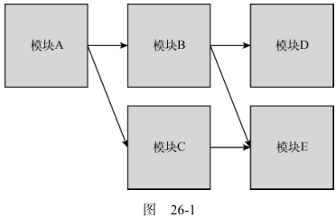

# 模块

## 模块模式

### 基本概念

##### 模块标识符

- 模块的标识;

##### 模块依赖

- 模块系统依赖的外部模块;

##### 模块加载

- 加载依赖模块;
- 执行入口模块;

##### 入口

- 代码执行的起点;

##### 依赖关系

- 使用有向图表示依赖关系;



##### 加载策略

- 同步加载: 按顺序依次加载;
  - 性能问题: 同步加载堵塞进程;
  - 复杂性: 管理加载顺序;
- 异步加载: 按需加载, 加载后执行回调;
- 动态加载: 运行时确定是否加载某模块, 加大静态分析难度;

##### 静态分析

- 检查代码结构, 在不执行代码的情况下推断其行为;

##### 循环依赖

- 依赖之间循环依赖;

### ES6 之前的模块加载器

##### Commonjs

```typescript
// 加载模块
var moduleB = require('./moduleB');
// 导出模块
module.exports = {
stuff: moduleB.doStuff();
};
```

##### AMD

```typescript
define("moduleA", ["require", "exports"], function (require, exports) {
  var moduleB = require("moduleB");
  exports.stuff = moduleB.doStuff();
});
```

##### UMD

- 统一 Commonjs 和 AMD

## ES6 模块

### 模块标签

##### 定义模块标签

```html
<script type="module">
  // 模块代码
</script>
<script type="module" src="path/to/myModule.js"></script>
```

##### 执行顺序

```html
<!-- 第二个执行 -->
<script type="module">
  // 模块代码
</script>
<!-- 第三个执行 -->
<script type="module" src="path/to/myModule.js"></script>
<!-- 第一个执行 -->
<script></script>
```

##### 加载次数

```html
<!-- moduleA 在这个页面上只会被加载一次 -->
<script type="module">
  import './moduleA.js'
  <script>
  <script type="module">
  import './moduleA.js'
  <script>
  <script type="module" src="./moduleA.js">
</script>
<script type="module" src="./moduleA.js"></script>
```

### 工作者模块

```typescript
// 第二个参数默认为{ type: 'classic' }
const scriptWorker = new Worker("scriptWorker.js");
const moduleWorker = new Worker("moduleWorker.js", { type: "module" });
```

### 模块导出

##### 位置

```typescript
// 必须在模块顶级
// 允许
export ...
// 不允许
if (condition) {
export ...
}
```

##### 命名导出

```typescript
export const foo = "foo";
// 别名
export { foo as myFoo };
// 一个模块可声明多个命名导出
const foo = "foo";
const bar = "bar";
const baz = "baz";
export { foo, bar as myBar, baz };
```

##### 默认导出

```typescript
// 一个模块只能有一个默认导出
const foo = "foo";
export default foo;

// default 别名关键字
export { foo as default }; // 等同于 export default foo;
```

##### 命名导出和默认导出

```typescript
// 支持同时使用两种导出
const foo = "foo";
const bar = "bar";
export { foo as default, bar };
```

##### 编程风格

- 声明和导出最好分开;

### 模块导入

##### 位置

```typescript
// 必须在模块顶级
// 允许
import ...
// 不允许
if (condition) {
import ...
}
```

##### 命名导出的导入

```typescript
// foo.js
const foo = "foo",
  bar = "bar",
  baz = "baz";
export { foo, bar, baz };

// * 导入所有
import * as Foo from "./foo.js";
console.log(Foo.foo); // foo
console.log(Foo.bar); // bar
console.log(Foo.baz); // baz
// 自定义导入
import { foo, bar, baz as myBaz } from "./foo.js";
console.log(foo); // foo
console.log(bar); // bar
console.log(myBaz); // baz
```

##### 默认导出的导入

```typescript
// 等效
import { default as foo } from "./foo.js";
import foo from "./foo.js";
```

##### 命名导出和默认导出的导入

```typescript
// 等效
import foo, { bar, baz } from "./foo.js";
import { default as foo, bar, baz } from "./foo.js";
import foo, * as Foo from "./foo.js";
```

### 模块转移导出

```typescript
// 导出所有
export * from "./foo.js";
// 使用别名
export { foo, bar as myBar } from "./foo.js";
// 重用默认导出
export { default } from "./foo.js";
// 命名导出转换为默认导出
export { foo as default } from "./foo.js";
```
