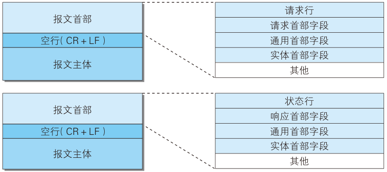
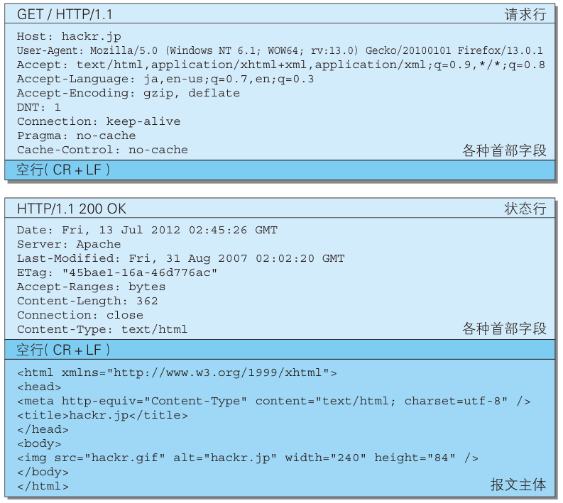
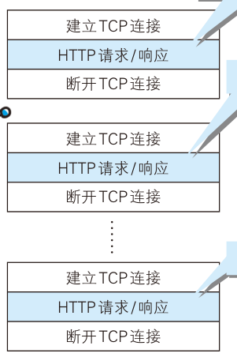
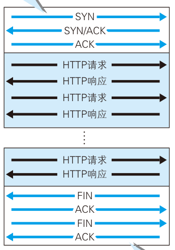
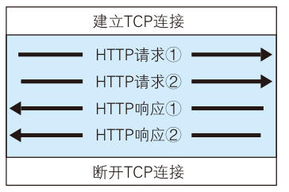
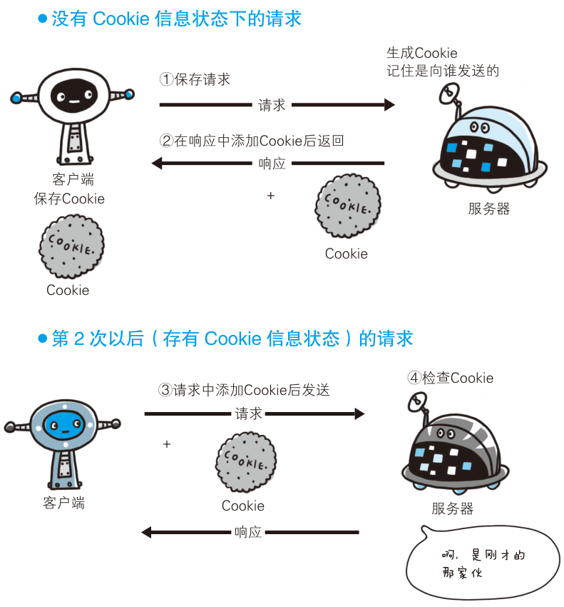

# http 基础

## web 基础

### web 构建技术

- HTML: 网页文本标记语言;
- HTTP: 文档传递协议;
- URL: 文档地址定位符;

### HTTP 协议

- 超文本传输协议 (HyperText Transfer Protocol);
- 用于 WEB 客户端和服务器端的通信;

### URI 和 URL

##### URI

- 统一资源标识符 (Uniform Resource Identifier);
- 表示某个协议方案表示的资源的定位标识符;

```bash
ftp://ftp.is.co.za/rfc/rfc1808.txt
http://www.ietf.org/rfc/rfc2396.txt
ldap://[2001:db8::7]/c=GB?objectClass?one
mailto:John.Doe@example.com
news:comp.infosystems.www.servers.unix
tel:+1-816-555-1212
telnet://192.0.2.16:80/
urn:oasis:names:specification:docbook:dtd:xml:4.1.2
```

##### URL

- 统一资源定位符 (Uniform Resource Locator);

##### URI 和 URL 的关系

- URL 是 URI 在 HTTP 协议下的子集;

```typescript
┌────────────────────────────────────────────────────────────────────────────────────────────────┐
│                                              href                                              │
├──────────┬──┬─────────────────────┬────────────────────────┬───────────────────────────┬───────┤
│ protocol │  │        auth         │          host          │           path            │ hash  │
│          │  │                     ├─────────────────┬──────┼──────────┬────────────────┤       │
│          │  │                     │    hostname     │ port │ pathname │     search     │       │
│          │  │                     │                 │      │          ├─┬──────────────┤       │
│          │  │                     │                 │      │          │ │    query     │       │
"  https:   //    user   :   pass   @ sub.example.com : 8080   /p/a/t/h  ?  query=string   #hash "
│          │  │          │          │    hostname     │ port │          │                │       │
│          │  │          │          ├─────────────────┴──────┤          │                │       │
│ protocol │  │ username │ password │          host          │          │                │       │
├──────────┴──┼──────────┴──────────┼────────────────────────┤          │                │       │
│   origin    │                     │         origin         │ pathname │     search     │ hash  │
├─────────────┴─────────────────────┴────────────────────────┴──────────┴────────────────┴───────┤
│                                              href                                              │
└────────────────────────────────────────────────────────────────────────────────────────────────┘
(All spaces in the "" line should be ignored. They are purely for formatting.)
```

### HTTP 密切相关协议

- IP: 负责不同主机的通信;;
- TCP: 负责不同进程的通信;
- DNS: 负责 URL 到 IP 的解析;;

## HTTP 报文

### 基本术语

##### 请求报文

- 客户端发送的报文;

##### 响应报文

- 服务器端发送的报文;

### 报文结构

- 报文首部;
  - 请求行: 方法 + URL + 版本;
  - 状态行: 版本 + 状态码 + 状态码短语;
  - 首部字段: 通用首部/请求首部/响应首部/实体首部;
- 空行;
- 报文主体;



### 报文实例



### HTTP 方法

- GET: 请求资源;
- POST: 传输报文主体;
- PUT: 传输文件, 不常用;
- DELETE: 删除文件, 不常用;
- HEAD: 获得首部字段, 不返回报文主体;
- OPTIONS: 查询支持的方法;
- TRACE: 查询请求的通讯路径;
- CONNECT: 使用通道协议连接代理;
  - SSL: 安全套接字;
  - TLS: 传输层安全;

## 持久连接

##### 非持久连接

- 一次 HTTP 请求建立并断开一次 TCP 连接;
- 增加无用的通信开销;



##### 持久连接

- HTTP keep-alive;
- 任意一端没有断开连接, 保持 TCP 连接状态;
- 减少 TCP 重复建立和断开的开销;
- HTTP/1.1 以上版本默认为持久连接;



##### 管线化

- HTTP 初始版本只能串行发送请求;
- 管线化技术做到并行发送多个请求;



## 状态管理

##### 无状态

- HTTP 为无状态协议;
- 不保存请求和响应之间的通讯状态;
- 减少服务器端开销;

##### cookie 状态管理

- 服务器端生成 cookie;
- 响应报文设置 `Set-Cookie` 首部字段;
- 通知客户端使用 cookie 保存状态信息;
- 下次请求报文自动添加并发送 cookie;



## HTTP 编码

### 内容编码

##### 目的

- 压缩报文体积;

##### 常用编码

- gzip: GNU zip;
- compress: UNIX 标准压缩;
- deflate: zlib;
- identity: 不进行编码

### 分块传输编码

- Chunked Transfer Coding;
- 用于大体积数据传输;
- 分隔报文实体为若干块 (chunk);
- 客户端负责解码, 恢复报文实体;

## MIME

##### MIME

- 多用途因特网邮箱拓展 (Multipurpose Internet Mail Extensions);
- 标识数据类型;

##### 多部分对象集合

- 一份报文容纳多种类型数据;
- 常见多部分对象集合;
  - multipart/form-data: 表单文件上传;
  - multipart/byteranges: 206 状态码;

## 范围请求

- 客户端指定请求的发送范围;
- 使用 `Range` 首部字段;
- 服务器端;
  - 若响应请范围求: 返回 206 状态码, 使用 multipart/byteranges 格式;
  - 若无法响应范围请求: 返回 200 状态码和完整实体内容;

```bash
# 5001 - 10000 字节
Range: bytes=5001-10000
# 5001 之后所有字节
Range: bytes=5001-
# 0 - 3000 字节, 5000 - 7000 字节
Range: bytes=-3000, 5000-7000
```

## 内容协商

##### 内容协商

- 服务器端根据客户端语言, 字符集或编码方式;
- 提供客户端最为合适的资源;

##### 首部字段

- Accept;
- Accept-Charset;
- Accept-Encoding;
- Accept-Language;
- Content-Language;

##### 技术类型

- 服务器协商: 服务器根据客户端首部字段自动处理;
- 客户端协商: 客户端用户或 js 脚本自动处理;
- 同名协商: 服务器端和客户端各自协商;

## HTTP 状态码

### 状态码概述

|     | 类别                             | 状态短语                   |
| --- | -------------------------------- | -------------------------- |
| 1XX | Informational（信息性状态码）    | 接收的请求正在处理         |
| 2XX | Success（成功状态码）            | 请求正常处理完毕           |
| 3XX | Redirection（重定向状态码）      | 需要进行附加操作以完成请求 |
| 4XX | Client Error（客户端错误状态码） | 服务器无法处理请求         |
| 5XX | Server Error（服务器错误状态码） | 服务器处理请求出错         |

### 2XX

- 200 OK: 请求正常处理;
- 204 No Content: 请求正常处理, 但响应报文无报文主体;
- 206 Partial Content: 请求正常处理, 返回指定范围的报文主体;

### 3XX

##### 状态码

- 301 Moved Permanently: 永久性重定向, 永久使用 URL;
- 302 Found: 临时性重定向, 临时使用其他 URL;
- 303 See Other: 同 302, 但希望客户端使用 GET 方法获取资源;
- 304 Not Modified: 客户端发送附带条件的请求, 服务器端允许访问资源, 但未满足条件;
- 307 Temporary Redirect: 同 302, 但不会从 POST 变为 GET;

##### 强制转换

- 301, 302, 303 返回时;
- 几乎所有浏览器都会将 HTTP 方法转换为 GET;

### 4XX

- 400 Bad Request: 请求报文存在语法错误;
- 401 Unauthorized: 请求需要具有 HTTP 认证信息;
- 403 Forbidden: 服务器端拒绝请求;
- 404 Not Found: 服务器端未找到资源;

### 5XX

- 500 Internal Server Error: 服务器端执行请求报错;
- 503 Service Unavailable: 服务器端停机维护;
