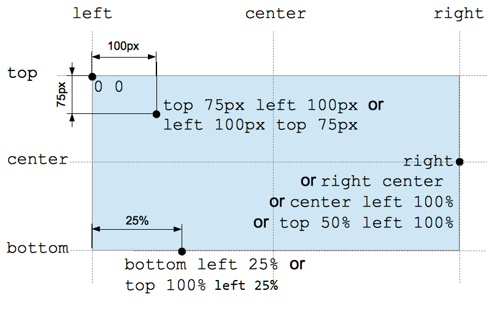

# 单位, 类型, 变量

## 数字类型

### \<integer\> 类型

```integer
12          Positive integer (without a leading + sign)
+123        Positive integer (with a leading + sign)
-456        Negative integer
0           Zero
+0          Zero, with a leading +
-0          Zero, with a leading -
```

### \<number\> 类型

```number
12          A raw <integer> is also a <number>.
4.01        Positive fraction
-456.8      Negative fraction
0.0         Zero
+0.0        Zero, with a leading +
-0.0        Zero, with a leading -
.60         Fractional number without a leading zero
10e3        Scientific notation
-3.4e-2     Complicated scientific notation
```

### \<dimension\> 类型

```dimension
12px      12 pixels
1rem      1 rem
1.2pt     1.2 points
2200ms    2200 milliseconds
5s        5 seconds
200hz     200 Hertz
200Hz     200 Hertz (values are case insensitive)
```

## 长度类型

### 绝对长度

- px.

### 相对长度

#### \<percentage\> 类型

```json
12%         Positive integer (without a leading + sign)
+123%       Positive integer (with a leading + sign)
-456%       Negative integer
0%          Zero
+0%         Zero, with a leading +
-0%         Zero, with a leading -
```

#### em 和 rem

##### em

- n \* em 等于父类 n \* font-size;

```css
body {
  font-size: 16px;
}
.slogan {
  font-size: 1.2em;
}
```

##### 字体缩小问题

- em 会不断递归继承;
- 导致深层标签 font-size 极小;

##### rem

- n \* em 等于 \<html\> 标签 n \* font-size;

```css
:root {
  font-size: 0.875em;
}
ul {
  font-size: 0.8rem;
}
```

#### 视口的相对单位

##### 视口的相对单位

- vh: 视口高度的 1/100;
- vw: 视口宽度的 1/100;

##### 配合 calc() 设置字号

```css
/* 字体平滑缩放且保证了一个最小值 */
:root {
  font-size: calc(0.5em + 0.4 * vw);
}
```

## 像素

### css 像素

- css 的长度单位;
- px;

### 设备像素

##### 基础

- device pixel;
- 设备的物理像素;
- 单位为 pt;

##### 与 css 要素的关系

- 同一设备, 1 个 css 像素对应的物理像素可以变化: 改变分辨率;
- 不同设备, 1 个 css 像素对应的物理像素不同;

### 设备独立像素

##### 基础

- 与设备无关的逻辑像素;
- 一个设备独立像素存在多个物理要素点;
- 用于处理 css 像素和设备像素;

##### dpr

- 设备像素比;
- 设备独立像素与设备像素的转化关系;
- 定义在 window.devicePixelRatio 属性;
- 若 dpr 为 2, 2 \* 2 个设备像素对应一个 css 像素, 以此类推;

##### ppi

- 每英寸像素;

## 特殊类型

### \<color\> 类型

##### \<color\> 属性值

```css
/* keyword */
background-color: red;
/* 十六进制值 */
background-color: #ff0000;
/* rgb(a) */
background-color: rgb(255, 0, 0);
background-color: rgb(255, 0, 153, 1);
/* hsl(a) */
background-color: hsl(0, 100%, 50%);
background-color: hsl(0, 100%, 50%, 1);
```

##### 渐变色

- 生成颜色渐变图象;

```css
.radial-gradient {
  background: radial-gradient(red, yellow, rgb(30, 144, 255));
}

.radial-repeat {
  background: repeating-radial-gradient(
    powderblue,
    powderblue 8px,
    white 8px,
    white 16px
  );
}
```

### \<image\> 类型

##### [\<image\>](https://developer.mozilla.org/en-US/docs/Web/CSS/image)

- url();
- \<gradeient\>.

```css
background-image: url("star.gif");
background-color: linear-gradient(#f69d3c, #3f87a6);
```

### position 类型

##### \<position\> 属性值

- keyword;
  - left/right;
  - top/bottom;
  - center.
- \<length\> 类型;
- \<percentage\> 类型.

##### 定位机制

- 左上角起点;
- 右和下为正方向.

##### 多值语法

- 1 - value;
  - keyword: keyword + center (other axis);
  - value: value (x) + center (y).
- 2 - value.
  - keyword + keyword: keyword (对应方向);
  - keyword + value: keyword (对应方向) + value (另一方向);
  - value + value: x + y.
- 4 - value.
  - keyword value keyword value;
    - keyword: 对应方向;
    - value: 对应方向偏移.



## 函数和变量

### cal() 函数

##### 语法格式

- 混合计算;
- 运算符号: 加减乘除;
- 书写原则: 运算符号前后必须加空格;

```python
width: calc(100% - 80px);
```

### css 变量

##### 定义 css 变量

```css
:root {
  --main-font: Helvetica, Arial, sans-serif;
}
```

##### 使用 css 变量

```css
:root {
  --main-font: Helvetica, Arial, sans-serif;
}
p {
  font-family: var(--main-font);
}
```

##### 备用值

- 第一个参数无效, 使用第二个;

```css
:root {
  --main-font: Helvetica, Arial, sans-serif;
  --brand-color: #369;
}
p {
  font-family: var(--main-font, sans-serif);
  color: var(--secondary-color, blue);
}
```

##### js 动态改变 css 变量

```typescript
var rootElement = document.documentElement;
rootElement.style.setProperty("--main-bg", "#cdf");
```

## 最佳实践

### 视口

##### 最佳实践

- rem 设置字号;
- px 设置边框;
- em 设置其他大部分属性;

##### 响应式

```css
:root {
  font-size: 0.75em;
}
@media (min-width: 800px) {
  :root {
    font-size: 0.875em;
  }
}
@media (min-width: 1200px) {
  :root {
    font-size: 1em;
  }
}
```
