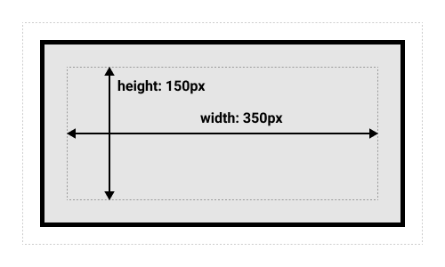

# 盒子模型

## display

##### display 属性

- 控制元素显示类型;
  - outside;
  - inside;
  - outside + inside;

```css
/* 外部属性 */
span {
  display: block;
}

/* 内部属性 */
span {
  display: flex;
}

/* 外部属性 + 内部属性 */
span {
  display: block flex;
}
```

##### 属性值分类

- 外部显示类型;
  - 标签在 flow layout 中的布局;
- 内部显示类型;
  - 标签内部子标签的布局;

##### 外部属性

- 标签在外界布局中的样式;

```css
span {
  /* 块级标签样式 */
  display: block;
  /* 内联标签样式 */
  display: inline;
}
```

##### 内部属性

- 标签内部子标签的布局;

```css
span {
  /* 块级上下文 */
  display: flow-root;
  /* flex 布局 */
  display: flex;
  /* grid 布局 */
  display: grid;
}
```

## 块级盒子

### 块状盒子

##### 特性

- 不同块级标签之间换行;
- 具有 width/height 属性;
- padding/margin/border 会造成其他元素推出盒子;
- 盒子会沿着 inline 方向扩展以填充空白;

##### 常见块级标签

- \<hx\>;
- \<p\>;
- \<div\>;
- \<ul\>;
- \<ol\>;
- \<dl\>/\<dt\>/\<dd\>;

### 标准盒子模型

##### 组成

- content box;
- padding box;
- border box;
- margin box;


##### 宽度/高度机制

- content box + padding box + border box;



### 替代盒子模型

##### 替代盒子模型

- 盒子高度宽度包括 padding box 和 border box;

```css
box {
  box-sizing: border-box;
}
```


##### 全局设置替代盒子模型

```css
:root {
  box-sizing: border-box;
}
*,
::before,
::after {
  box-sizing: inherit;
}
```

## 内联盒子

### 内联盒子

##### 特性

- 不同标签之间不自动换行;
- width/height 属性无效;
- padding/margin/border 水平方向会造成其他元素推出盒子, 竖直方向无效;

##### 常见行内标签

- \<a\>;
- \<span\>;
- \<strong\>;
- \<em\>;
- \<u\>;

## 内联块级盒子

- 不同标签不自动换行;
- width/height 属性有效;
- padding/margin/border 会造成其他元素推出盒子;

```css
span {
  display: inline-block;
}
/* inline-block equivalent to inline flow-root */
span {
  display: inline flow-root;
}
```

## 替换元素

### 基础

##### 替换元素

- css 只能设置其位置,
- 无法改变其内部布局;

##### 常见替换元素

- 图片相关标签;
- 视频相关标签;

##### 调整图像大小

- 设置 max-height/max-width 属性;
- 设置 object-fit 属性;

##### 拉伸机制

- 替换元素默认不拉伸,
- 强制拉伸如下;

```css
img {
  width: 100%;
  height: 100%;
}
```

### object-fit 属性

- 设置替换元素显示方式;

```css
fill {
  /* 原始尺寸 */
  object-fit: none;
  /* 保留纵横比, 尽可能放大, 保留空白 */
  object-fit: contain;
  /* 保留纵横比, 填满容器, 多余部分裁剪 */
  object-fit: cover;
  /* 不保留横纵比, 填满容器 */
  object-fit: fill;
  /* 取 none 和 contain 中的小尺寸 */
  object-fit: scale-down;
}
```

## padding, borders, outlines 和 margins

### padding 属性

##### padding 属性

```css
h3 {
  background-color: cyan;
  padding: 110px 50px 50px 110px;
}
```

##### 成分属性

- padding-bottom;
- padding-left;
- padding-right;
- padding-top;

##### 多值语法格式

- 1 value: 四个边;
- 2 value: 竖直 + 水平;
- 3 value: top + 水平 + bottom;
- 4 value: top + right + bottom + left;

##### 属性值

- \<length\> 类型;
- \<percentage\> 类型;

##### 属性值百分比机制

- 无论是 height 还是 width,
- 都以父容器 inline size 为基准;

### border 属性

##### border 属性

- 设置 border 样式;

```css
div {
  border: 0rem outset pink;
}
```

##### 成分属性

- border-color 属性;
- border-style 属性;
- border-width 属性;

##### 简写属性规则

```css
/* style */
/* color | style */
/* style | width */
/* color | style | width */
```

##### border-color 属性

- border-bottom-color 属性;
- border-left-color 属性;
- border-right-color 属性;
- border-top-color 属性;

##### border-style 属性

- border-bottom-style 属性;
- border-left-style 属性;
- border-right-style 属性;
- border-top-style 属性;

```css
b1 {
  border-style: none;
  border-style: hidden;
  border-style: dotted;
  border-style: dashed;
  border-style: solid;
  border-style: double;
}
```

##### border-width 属性

- border-bottom-width 属性;
- border-left-width 属性;
- border-right-width 属性;
- border-top-width 属性;

```css
b1 {
  border-width: 15px;
  border-width: thin;
  border-width: medium;
  border-width: thick;
}
```

### margin 属性

##### margin 属性

```css
h3 {
  background-color: cyan;
  margin: 110px 50px 50px 110px;
}
```

##### 成分属性

- margin-bottom;
- margin-left;
- margin-right;
- margin-top;

##### 多值语法格式

- 同 padding 属性;

##### 属性值

- 关键字;
- \<length\> 类型;
- \<percentage\> 类型;

##### 百分比机制

- 无论是 height 还是 width,
- 都以父容器 inline size 为基准;

##### margin 叠加

- 两个正数: 取最大值;
- 两个负数: 取最小值;
- 一正一负: 两者相加;

### outline 属性

##### outline 属性

- 生成轮廓线;
- 紧贴 border 外的一条线;
- 同 border 属性;

```css
a:focus {
  outline: 4px dotted #e73;
  outline-offset: 4px;
}
```

##### outline-offset 属性

- outline 偏移量,
- 向外为正方向;

```css
a:focus {
  outline: 4px dotted #e73;
  outline-offset: 4px;
}
```

### border-radius 属性

##### border-radius 属性

- 设置 border/outline 属性圆角;

```css
div {
  border-radius: 10px 100px / 120px;
}
```

##### 成分属性

- border-top-left-radius;
- border-top-right-radius;
- border-bottom-right-radius;
- border-bottom-left-radius;

##### 多值语法

- 单参数;
  - 1 value: 四角;
  - 2 value: 左上-右下 + 右上-左下;
  - 3 value: 左上 + 右上-左下 + 右下;
  - 4 value: 左上 + 右上 + 右下 + 左下;
- 双参数
  - / 分割;
  - / 前后的两个参数分别表示圆角椭圆的两个半径;
  - 前后两个参数分别按照单参数的机制;
