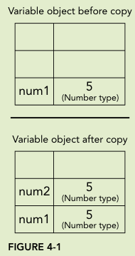
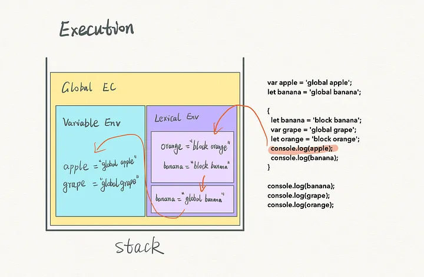

# 变量, 作用域和内存

## 原始值和引用值

### primitive values

##### primitive values

- 原生数据类型;
- 原子数据类型.

##### 分类

- undefined;
- null;
- boolean;
- number;
- string;
- symbol.

##### 操作机制

- 变量存储栈中 primitive values 的内存地址,
- primitive value 直接存储在栈中,
- 直接操作存储在栈里面的实际值.

### reference values

##### reference values

- 存储在栈里面,
- 是对存储在堆中的 object 的引用.

##### 操作机制

- 变量存储栈中 reference values 的内存地址,
- 栈中存储 reference value 在堆中的内存地址,
- 操作对 object 的引用, 并不直接操作 object 本身.

### 动态属性

```typescript
// primitive values 无属性;
// reference values 有属性.
let name = "Nicholas";
name.age = 27;
console.log(name.age); // undefined
let person = new Object();
person.name = "Nicholas";
console.log(person.name); // "Nicholas"
```

### 复制值

##### primitive value

- 在栈中创建一个新空间,
- 然后将旧变量在栈中的实际值赋值给新空间,
- 将新空间栈中的内存地址赋值给新变量,
- 两者相互隔绝.



##### reference value

- 在栈中创建一个新空间,
- 然后将旧变量在栈中的实际值赋值给新空间,
- 将新空间栈中的内存地址赋值给新变量,
- 但新变量在栈中的对应值是指向对象的堆内存地址,
- 两者实际还是指向一个对象.

```typescript
let obj1 = new Object();
let obj2 = obj1;
obj1.name = "Nicholas";
console.log(obj2.name); // "Nicholas"
```


### 传递参数

##### 机制

- JavaScript 中的函数参数全是值传递,
- 将其一个副本传递给函数内部,
- 对于 primitive value,
  - 传递其 value 的副本,
  - 两者相互隔离,
  - 函数内部的改变不会影响函数外部.
- 对于 reference value,
  - 传递其 value 副本,
  - 但 reference value 是指向 object 的指针,
  - 其副本依旧指向 object,
  - 函数内部的改变会影响函数外部.

```typescript
function setName(obj) {
  obj.name = "Nicholas";
  obj = new Object();
  obj.name = "Greg";
}
let person = new Object();
setName(person);
console.log(person.name); // "Nicholas"
```

## typeof 和 instanceof

### typeof 操作符

##### 语法格式

```typescript
// 检测 reference value 和 primitive value 数据类型
let message = "some string";
console.log(typeof message); // "string"
```

##### 返回值

| 检测对象       | 返回值      |
| -------------- | ----------- |
| undefined      | "undefined" |
| Boolean        | "boolean"   |
| string         | "string"    |
| number         | "number"    |
| object or null | "object"    |
| function       | "function"  |
| symbol         | "symbol"    |

##### function

- ECMA-262 规定具有 call 方法的对象返回 function,
- 正则表达式同样具有 call, 故也返回 function;

### instanceof 操作符

##### 作用

- 检测 reference value 具体数据类型.

##### 语法格式

```typescript
// 判断 variable 是否是 constructor 的实例
console.log(person instanceof Object); // is the variable person an Object?
console.log(colors instanceof Array); // is the variable colors an Array?
console.log(pattern instanceof RegExp); // is the variable pattern a RegExp?
```

##### variable instanceof object

- 检测 reference value, 总是 true,
- 检测 primitive value, 总是 false.

## 执行上下文

### 词法环境

##### lexicalEnvironment

- 定义标识符与变量, 函数等类型的关联;

##### lexicalEnvironment 的组成

- Environment Record: 存储标识符与变量, 函数等类型的关联;
- outer: 指向的上级 lexicalEnvironment;
- this: lexicalEnvironment 绑定的 this;

##### Environment Record 的分类

- Declarative Environment Record;
  - Function Environment Record: 对应于函数执行上下文;
  - Module Environment Record: 对应与 ESM 模块的顶级上下文, outer 为 Global Environment Record;
- Object Environment Record: 对应于 with 创建的执行上下文;
- Global Environment Record: 对应于全局上下文;

##### this 的确定

- 全局执行上下文;
  - 严格模式为 undefined;
  - 非严格模式为 windows/global;
- 函数执行上下文;
  - 普通函数: 根据函数被调用时的方式;
    - 函数被对象调用, this 指向该对象 (对象/构造函数/类实例);
    - 函数不被对象调用, this 指向 undefined/windows;
  - 箭头函数;
    - 箭头函数创建的执行上下文的 lexicalEnvironment 无 this binding;
    - 其沿着 lexicalEnvironment 中 outer 获得最邻近 this, 使用该 this;

```typescript
function test() {
  console.log(this);
}

const o = {
  test: test,
};

// 普通函数不被被对象调用, this 指向该对象
test(); // windows
// 普通函数被对象 o 调用, this 指向 o
o.test(); // Object: o
```

```typescript
const o = {
  test0: () => {
    console.log(this);
  },
  test1: function () {
    (() => {
      console.log(this);
    })();
  },
};

// 箭头函数 test0 最邻近的lexicalEnvironment为全局上下文的 LexicalEnvironment, this 指向 undefined/windows
o.test0();
// test1 中的匿名箭头函数最邻近的lexicalEnvironment为 test1 的生成的函数执行上下文的 LexicalEnvironment, this 指向 test1 的 this, 即对象 o
o.test1();
```

### 执行上下文

##### 执行上下文

- 全局执行上下文: 默认执行上下文;
- 函数执行上下文: 调用函数时创建一个全新的执行上下文;

##### 执行上下文的组成

- LexicalEnvironment: 存储 let/const/function 等对应标识符的 lexicalEnvironment;
- VariableEnvironment: 存储 var 对应标识符的 lexicalEnvironment;

##### 执行栈

- 使用栈存储代码执行期间创建的执行上下文;
- 程序运行创建全局执行上下文压入栈底;
- 某一函数被调用时, 创建一个新的函数执行上下文压入栈顶;
- 函数调用完毕后移除栈顶;
- 与作用域链相关;


##### 执行上下文的创建

- 创建阶段;
  - 创建 LexicalEnvironment 和 VariableEnvironment;
  - 确定 this;
- 执行阶段: 完成变量赋值并执行代码;

```typescript
let a = 20;
const b = 30;
var c;
function multiply(e, f) {
  var g = 20;
  return e * f * g;
}
c = multiply(20, 30);
```

- 全局执行上下文的创建和执行;

```typescript
// 全局上下文的创建
GlobalExectionContext = {
  LexicalEnvironment: {
    EnvironmentRecord: {
      Type: "Object",
      // Identifier bindings go here
      a: < uninitialized > ,
      b: < uninitialized > ,
      multiply: < func >
    }
    outer: < null > ,
    ThisBinding: < Global Object >
  },
  VariableEnvironment: {
    EnvironmentRecord: {
      Type: "Object",
      // Identifier bindings go here
      c: undefined,
    }
    outer: < null > ,
    ThisBinding: < Global Object >
  }
}

// 全局上下文的执行
GlobalExectionContext = {
  LexicalEnvironment: {
      EnvironmentRecord: {
        Type: "Object",
        // Identifier bindings go here
        a: 20,
        b: 30,
        multiply: < func >
      }
      outer: <null>,
      ThisBinding: <Global Object>
    },
  VariableEnvironment: {
      EnvironmentRecord: {
        Type: "Object",
        // Identifier bindings go here
        c: undefined,
      }
      outer: <null>,
      ThisBinding: <Global Object>
    }
  }
```

- 函数执行上下文的创建和执行

```typescript
// 函数执行上下文的创建
FunctionExectionContext = {
LexicalEnvironment: {
    EnvironmentRecord: {
      Type: "Declarative",
      // Identifier bindings go here
      Arguments: {0: 20, 1: 30, length: 2},
    },
    outer: <GlobalLexicalEnvironment>,
    ThisBinding: <Global Object or undefined>,
  },
VariableEnvironment: {
    EnvironmentRecord: {
      Type: "Declarative",
      // Identifier bindings go here
      g: undefined
    },
    outer: <GlobalLexicalEnvironment>,
    ThisBinding: <Global Object or undefined>
  }
}

// 函数执行上下文的执行
FunctionExectionContext = {
LexicalEnvironment: {
    EnvironmentRecord: {
      Type: "Declarative",
      // Identifier bindings go here
      Arguments: {0: 20, 1: 30, length: 2},
    },
    outer: <GlobalLexicalEnvironment>,
    ThisBinding: <Global Object or undefined>,
  },
VariableEnvironment: {
    EnvironmentRecord: {
      Type: "Declarative",
      // Identifier bindings go here
      g: 20
    },
    outer: <GlobalLexicalEnvironment>,
    ThisBinding: <Global Object or undefined>
  }
}
```

##### var 变量提升的本质

- 执行上下文创建时, var 声明的变量赋值为 undefined, let/const 声明的变量赋值为 uninitialized;
- 所以 var 变量在对应语句声明之前便可以使用;

##### LexicalEnvironment 和 VariableEnvironment 区分的原因

- 处理 ES6 引入的 let 和 const;
- 当执行上下文中执行 {} 时;
  - 首先保存当前执行上下文的 LexicalEnvironment 为 oldEnv;
  - 创建一个新的没有 this binding 的 DeclarativeEnvironment 为 blockEnv;
  - 将当前执行上下文的 LexicalEnvironment 的 LexicalEnvironment 设置为 blockEnv;
  - 执行 block 中的语句, 将对应标识符添加至 LexicalEnvironment 或 VariableEnvironment;
  - block 执行完毕, 移除 blockEnv, 将当前执行上下文的 LexicalEnvironment 的 LexicalEnvironment 设置为 oldEnv;
- {} 会生成一个临时的 LexicalEnvironment 也是 let/const/function 具有块级作用域的原因;

```typescript
const a = 1;
{
  const a = 2;

  var test0 = function () {
    console.log(this);
  };
  function test1() {
    console.log(this);
  }

  // a 保存至 {} 创建的 LexicalEnvironment
  console.log(a); // 2
}

// 在 {} 创建的 LexicalEnvironment 已经被移除并替换, 无法访问到
// 在全局执行上下文中的 LexicalEnvironment 中检索到 a
console.log(a); // 1

// 匿名函数被 var 声明 test0 保存至执行上下文中的 VariableEnvironment 中, 因此可以检索到, this 指向 undefined
console.log(test0()); // undefined
// test1 保存至 {} 临时创建的 LexicalEnvironment, 此时已经被移除并替换, 无法访问到
console.log(test1()); // ReferenceError: test1 is not defined
```

### 作用域和作用域链

##### 作用域

- var/const/let/function 等标识符可以访问的 lexicalEnvironment;

##### 作用域分类

- 全局作用域;
  - 存储在全局执行上下文的 LexicalEnvironment 或 VariableEnvironment 中;
  - 可以被执行栈上的任意执行上下文的 LexicalEnvironment 或 VariableEnvironment 中的任意标识符访问;
- 函数作用域;
  - 存储在对应的函数执行上下文的 LexicalEnvironment 或 VariableEnvironment 中;
  - 可以被该函数执行上下文下级的执行上下文的 LexicalEnvironment 或 VariableEnvironment 中的标识符访问;
- 块级作用域;
  - 存储在 {} 临时创建的 LexicalEnvironment 中;
  - 仅能被该 LexicalEnvironment 中的标识符访问;

##### 作用域链

- 基于执行上下文 LexicalEnvironment 或 VariableEnvironment 中的 outer 访问执行栈中的变量和函数,

##### 标识符查找机制

- 首先为自身所在执行上下文;
  - 首先在 LexicalEnvironment 查找;
  - 若 VariableEnvironment 存在, 然后在 VariableEnvironment 查找;
- 其次为执行栈中的父级执行上下文, 以此类推, 直至到达 global context;



### 执行上下文增强

##### 机制

- 特定语句临时在执行上下文前增加上下文,
- 代码结束后移除.

##### 特定语句

- try-catch 语句中的 catch 块;
- with 语句, 不推荐使用.

##### with 机制详解

```typescript
// 对象 o 对应执行上下文在 buildUrl() 对应执行上下文后面,
// 利用 with 语句, 临时将其添加至 buildUrl() 对应执行上下文前面,
// 故可访问 buildUrl() 中的 qs 变量, 并在对象 o 中创建变量 url
// 代码执行完毕, 将其移除,
let o = { href: "kxh" };
function buildUrl() {
  let qs = "?debug=true";
  with (o) {
    href = "2222";
    var url = href + qs;
  }
  return url;
}
var result = buildUrl();
console.log(result); // 2222?debug=true
```

## 垃圾回收

### 基本概念

##### js 垃圾回收

- js 自动进行垃圾回收;
- 即自动释放内存, 释放不再使用的变量;

### 垃圾回收策略

##### mark-and-sweep

- 每当变量进入 context, 其被标记;
- 每当 garbage collector 运行时;
- 记录所有存储在内存中的变量并清除其标记;
- 最后销毁仍被标记的变量及释放其内存;

##### reference counting

- 记录每个值被各变量引用多少次;
- 当引用次数为 0 时释放其内存.

##### circular reference 问题

```typescript
// A 和 B 循环引用
// 对象 A 和 B 的 reference counting 永远增加两次
// 永远不会释放其内存
// 可通过手动赋值 null 解决
function problem() {
  let objectA = new Object();
  let objectB = new Object();
  objectA.someOtherObject = objectB;
  objectB.anotherObject = objectA;
}
```

### 性能

##### 主要问题

- garbage-collection 耗费较大,
- 需要寻找一个好时机去清理垃圾,
- 以防影响设备性能.

##### 确定时机

- 依赖于 js 运行时环境,
- 一般根据 object 的数量和大小确定.

### 内存管理

##### 背景

- web 内存使用相比于桌面程序少得多;
- 限制了变量声明, 调用栈和单线程句柄的性能;

### 最佳实践

##### 手动垃圾回收

- 当数据不再使用时;
- 手动赋值 null;
  - 手动赋值 null 并不会自动释放对应变量内存;
  - 而是确保其下一次垃圾回收时一定被清理;

##### let 和 const

- 多多使用 let 和 const;
- 因为其块作用域;
- 更容易被垃圾回收;

##### hidden classes

- v8 引擎在运行时创建 hidden classes 连接每个 object,
- 共享同一个 hidden classes 的 object 具有更好的性能.
- 优化原则;
  - 设计 object 时预先设计所有属性;
  - 初始化和删除属性时赋值 null;
