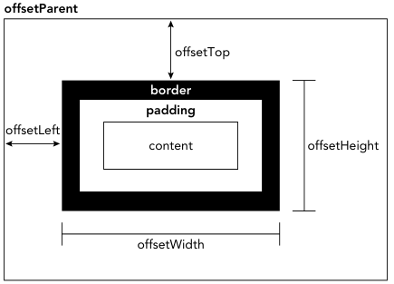

# dom

## 节点层级

### 基础

##### 层级结构

- 通过 DOM 表示 HTML 的一个层级结构;
- html 中每个元素对应层级结构中的一个节点;
- DOM 总共有 12 种类型节点;

##### 固定节点

- 每个文档具有一个 document 根节点;
- document 根节点具有唯一的 html 节点, 称作 documentElement;

### Node 类型

##### Node

- 所有类型节点继承 Node 类型;

##### 节点属性

```typescript
// 通过 node.nodeType 属性获取节点类型
if (someNode.nodeType == Node.ELEMENT_NODE) {
  console.log("Node is an element.");
}
// 节点类型常量
Node.ELEMENT_NODE(1);
Node.ATTRIBUTE_NODE(2);
Node.TEXT_NODE(3);
Node.CDATA_SECTION_NODE(4);
Node.ENTITY_REFERENCE_NODE(5);
Node.ENTITY_NODE(6);
Node.PROCESSING_INSTRUCTION_NODE(7);
Node.COMMENT_NODE(8);
Node.DOCUMENT_NODE(9);
Node.DOCUMENT_TYPE_NODE(10);
Node.DOCUMENT_FRAGMENT_NODE(11);
Node.NOTATION_NODE(12);

// node.nodeName 属性存储节点对应元素标签名
if (someNode.nodeType == 1) {
  const value = someNode.nodeName;
}
// node.nodeValue 恒为 null
```

##### 节点关系

```typescript
// node.childNodes 属性存储子节点数组
const firstChild = someNode.childNodes[0]; // 使用索引访问
const secondChild = someNode.childNodes.item(1); // 使用 item() 访问
const count = someNode.childNodes.length; // 获取子节点数组长度
// node.parentNode 属性存储父节点
const parentNode = node.parentNode;
// node.previousSibling 属性表示前一个同级节点, 第一个其值为 null
const previousNode = node.previousSibling;
// node.nextSibling 属性表示后一个同级节点, 最后一个其值为 null
const nextNode = node.nextSibling;
// node.fistChild 属性表示第一个子节点
const fistChild = node.fistChild;
// node.lastChild 属性表示最后一个子节点
const lastChild = node.lastChild;
// hasChildNodes(): boolean 方法判断是否具有子节点
if (node.hasChildNodes()) {
  const childNodes = node.childNodes;
}
```

##### 操作节点

```typescript
// 末尾添加子节点
const returnedNode = someNode.appendChild(newNode);
// 插入到指定节点的前一个位置
const returnedNode = someNode.insertBefore(newNode, null); // 插入到末尾
const returnedNode = someNode.insertBefore(newNode, someNode.firstChild); // 插入到开头
// 替换节点
const returnedNode = someNode.replaceChild(newNode, someNode.firstChild); // 替换第一个节点
// 移除节点
let formerFirstChild = someNode.removeChild(someNode.firstChild); // 移除第一个节点
// 复制节点
const shallowList = myList.cloneNode(); // 浅复制, 仅复制节点
const deepList = myList.cloneNode(true); // 深复制, 复制节点及其子树
```

### Document 类型

##### Document 类型

- 表示整个 HTML 界面;
- nodeType 为 9;
- nodeName 为 `#document`;

##### 子节点属性

```typescript
// documentElement 属性恒指向 html 标签
const html = document.documentElement;
// body 属性恒指向 body 标签
const body = document.body;
```

##### 文档信息属性

```typescript
// title 属性表示 title 标签, 只读;
const originalTitle = document.title;
// URL 属性表示完整 URL, 只读
const url = document.URL;
// domain 属性表示域名, 读写, 但只能为 URL 的字串
const domain = document.domain;
```

##### 定位元素

```typescript
// 返回第一个 id 为 myDiv 的元素
const div = document.getElementById("myDiv");

// 返回 img 标签的 HTMLCollection, 具有 length 属性, [], item() 方法
const images = document.getElementsByTagName("img");
// HTMLCollection.namedItem() 返回指定 name 的元素
const myImage = images.namedItem("myImage");
// [] 返回指定 name 的元素
const myImage = images["myImage"];

// 返回 Name 属性为 color 的 HTMLCollection, 具有 length 属性, [], item() 方法
const radios = document.getElementsByName("color");
```

### Element 类型

##### Element 类型

- nodeType 为 1;
- nodeName 为标签名(全大写);

##### HTMLElement 类型

```typescript
// HTMLElement 具有一堆属性
<div id="myDiv" class="bd" title="Body text" lang="en" dir="ltr"></div>;
let div = document.getElementById("myDiv");
console.log(div.id); // "myDiv"
console.log(div.className); // "bd"
// 属性可写
div.id = "someOtherId";
div.className = "ft";
```

##### HTMLElement 具体类型

- 太多了, 略;

##### 操作属性

```typescript
const div = document.getElementById("myDiv");
// 获取属性
// . 对于 style 和 event 属性会返回对应对象
// getAttribute() 会返回属性的字符串形式, 不推荐使用 getAttribute()
console.log(div.getAttribute("class")); // "bd"
console.log(div.className); // "bd"
// 设置属性
div.setAttribute("id", "someOtherId");
// 移除属性
div.removeAttribute("class");
```

##### attributes 属性

```typescript
// 一般不使用 attributes 属性
// attributes 属性指向 NamedNodeMap 示例, 存储 Attr 节点
// nodeName 为属性名, nodeValue 为属性值
// 获取 id 属性节点
const id = element.attributes.getNamedItem("id");
const id = element.attributes["id"];
// 设置 id 属性
id.nodeValue = "someOtherId";
// 删除 id 属性节点
const oldAttr = element.attributes.removeNamedItem("id");
// 迭代属性节点
for (let i = 0, len = element.attributes.length; i < len; ++i) {
  const attribute = element.attributes[i];
  console.log(`${attribute.nodeName}="${attribute.nodeValue}"`);
}
```

##### 创建元素

```typescript
// 创建元素
const div = document.createElement("div");
// 设置属性
div.id = "myNewDiv";
```

### Text 类型

##### Text 类型

- nodeType 为 3;
- nodeName 为 `#text`;
- nodeValue 为节点中的文本;

##### 操作文本

```typescript
// length 属性获取字符数量
// appendData(text) 添加文本
// deleteData(offset, count) 从 offset 开始删除 count 个字符;
// insertData(offset, text,在 offset 插入 text
// replaceData(offset, count, text) 用 text 替换 [offset, offset + count) 的文本
// splitText(offset) 在 offset 拆分文本, 第一个包含 offset
// substringData(offset, count) 提取 [offset, offset + count) 的文本
```

##### 创建文本节点

```typescript
const textNode = document.createTextNode("<strong>Hello</strong> world!");
```

##### 文本节点数量

- 文本内容的每个元素规定最多只能有一个文本节点;
- 但可以存在多个文本节点;

##### 合并和拆分文本节点

```typescript
let element = document.createElement("div");
let textNode = document.createTextNode("Hello world!");
element.appendChild(textNode);
let anotherTextNode = document.createTextNode("Yippee!");
element.appendChild(anotherTextNode);
document.body.appendChild(element);
console.log(element.childNodes.length); // 2
element.normalize();
console.log(element.childNodes.length); // 1
console.log(element.firstChild.nodeValue); // "Hello world!Yippee!"
// 在 offset 位置拆分, 第一个包含 offset
let newNode = element.firstChild.splitText(5);
console.log(element.firstChild.nodeValue); // "Hello"
console.log(newNode.nodeValue); // " world!Yippee!!"
console.log(element.childNodes.length); // 2
```

### Comment 类型

##### Comment 类型

- nodeType 为 8;
- nodeName 为 `#comment`;
- nodeValue 为注释内容;

##### 与 Text 类型的关系

- 两者继承于同一个基类;
- 除 splitText() 之外;
- Comment 类型和 Text 类型别无二致;

### CDATASection 类型

##### CDATASection 类型

- nodeType 为 8;
- nodeName 为 `#cdata-section`;
- nodeValue 为 CDATA 区块的内容;

##### 与 Text 类型的关系

- 两者继承于同一个基类;
- Comment 类型和 Text 类型别无二致;

### DocumentType 类型

##### DocumentType 类型

- nodeType 为 10;
- nodeName 为文档类型的名称;
- parentNode 值为 Document 对象;

### DocumentFragment 类型

##### DocumentFragment 类型

- nodeType 为 11;
- nodeName 为 `#document-fragment`;

### Attr 类型

##### Attr 类型

- nodeType 为 2;
- nodeName 为属性名;
- nodeValue 为属性值;
- 一般不使用, 推荐使用 getAttribute(), removeAttribute()和 setAttribute()方法

## DOM 编程

### 动态脚本

```typescript
// 通过 script 动态添加脚本;
let script = document.createElement("script");
script.src = "foo.js";
document.body.appendChild(script);
```

### 动态样式

```typescript
let link = document.createElement("link");
link.rel = "stylesheet";
link.type = "text/css";
link.href = "styles.css";
let head = document.getElementsByTagName("head")[0];
head.appendChild(link);
```

### 操作表格

##### \<table\> API

- caption: 指向\<caption\>元素的指针(如果存在);
- tBodies: 包含\<tbody\>元素的 HTMLCollection;
- tFoot: 指向\<tfoot\>元素(如果存在);
- tHead: 指向\<thead\>元素(如果存在);
- rows: 包含表示所有行的 HTMLCollection;
- createTHead(): 创建\<thead\>元素,放到表格中, 返回引用;
- createTFoot(): 创建\<tfoot\>元素,放到表格中, 返回引用;
- createCaption(): 创建\<caption\>元素,放到表格中, 返回引用;
- deleteTHead(): 删除\<thead\>元素;
- deleteTFoot(): 删除\<tfoot\>元素;
- deleteCaption(): 删除\<caption\>元素;
- deleteRow(pos): 删除给定位置的行;
- insertRow(pos): 在行集合中给定位置插入一行;

##### \<tbody\> API

- rows: 包含\<tbody\>元素中所有行的 HTMLCollection;
- deleteRow(pos): 删除给定位置的行;
- insertRow(pos): 在行集合中给定位置插入一行, 返回该行的引用;

##### \<tr\> API

- cells: 包含\<tr\>元素所有表元的 HTMLCollection;
- deleteCell(pos): 删除给定位置的表元;
- insertCell(pos): 在表元集合给定位置插入一个表元, 返回该表元的引用;

### NodeList 对象

##### 实时性

```typescript
// NodeList 实时反应 DOM 结构
// 下列代码会永久循环
let divs = document.getElementsByTagName("div");
for (let i = 0; i < divs.length; ++i) {
  let div = document.createElement("div");
  document.body.appendChild(div);
}
```

## MutationObserver 接口

### 基础

##### MutationObserver 接口

- DOM 变化时异步执行回调;

### 基本用法

##### 创建实例

```typescript
let observer = new MutationObserver(() => console.log("DOM was mutated!"));
```

##### 操作 DOM

```typescript
// 创建 MutationObserver 对象
// mutationRecords 包含按顺序入队的 MutationRecord 实例的数组
// mutationObserver 为 observer 实例
let observer = new MutationObserver((mutationRecords, mutationObserver) =>
  console.log(mutationRecords)
); // 创建示例
// observe() 观察具体 DOM
// 第一个参数为观察标签, body 标签发生变化变执行 MutationObserver 回调
// 第二个参数为 MutationObserverInit 对象
observer.observe(document.body, { attributes: true }); // 观察 body

// disconnect() 取消 observer()
// disconnect() 并不会停止 observer, 之后可以重新观察
let observer = new MutationObserver(() =>
  console.log("<body> attributes changed")
);
observer.observe(document.body, { attributes: true });
document.body.className = "foo";
setTimeout(() => {
  observer.disconnect();
}, 0); // 通过 setTImeout(), 保证回调函数先执行一次

// 复用 MutationObserver
let observer = new MutationObserver((mutationRecords) =>
  console.log(mutationRecords.map((x) => x.target))
); // 通过 target 属性辨别不同观察对象
observer.observe(childA, { attributes: true });
observer.observe(childB, { attributes: true });
observer.disconnect(); // 停止所有观察对象
```

##### MutationRecord 属性

- target: 目标节点;
- type: 变化类型;
- oldValue: 变化前的值;
- attributeName: 修改后的属性;
- addedNodes: 添加的节点及其子节点;
- removedNodes: 删除的节点及其子节点;
- previousSibling: 变化节点的前一个同级节点;
- nextSibling: 变化节点的后一个同级节点;

### MutationObserverInit

##### MutationObserverInit 对象

- 控制 MutationObserver 的观察范围;

##### MutationObserverInit 对象详解

```typescript
// attributes 默认为 false, 表示是否观察属性变化
observer.observe(document.body, { attributes: true });
// attributeFilter 默认为所有属性, 表示观察属性范围
observer.observe(document.body, { attributeFilter: ["foo"] });
// attributeOldValue 默认为 false, 表示是否保存变化前的值
observer.observe(document.body, { attributeOldValue: true });
// characterData 默认为 false, 表示否是观察文字节点修改
observer.observe(document.body.firstChild, { characterData: true });
// characterDataOldValue 默认为 false, 表示是否保存文字节点变化前的值
observer.observe(document.body.firstChild, { characterDataOldValue: true });
// childList 默认为 false, 表示是否观察子节点变化
observer.observe(document.body, { childList: true });
// childList 默认为 false, 表示是否观察子树变化
observer.observe(document.body, { attributes: true, subtree: true });
```

### 记录队列

##### 记录队列

- DOM 变化后, MutationRecord 实例添加至 MutationObserver 记录队列;
- 只有在任务队列为空时;
- MutationObserver 回调才会添加至任务队列;

##### 清空记录队列

```typescript
let observer = new MutationObserver((mutationRecords) =>
  console.log(mutationRecords)
);
observer.observe(document.body, { attributes: true });
document.body.className = "foo";
console.log(observer.takeRecords()); // [MutationRecord]
console.log(observer.takeRecords()); // []
```

### 垃圾回收

##### MutationObserver

- MutationObserver 具有目标节点的弱引用;
- 目标节点具有 MutationObserver 的强引用;
- 故 MutationObserver 不会妨碍目标节点的垃圾回收, 目标节点的移除会导致 MutationObserver 垃圾回收;

##### MutationRecord

- MutationRecord 至少存在一个对 DOM 的强引用;
- 保存其信息会妨碍对应节点的垃圾回收;
- 建议保存 MutationRecord 信息至一个新对象;
- 然后赋值 MutationRecord 为 null;

## 元素查询和元素遍历

### 元素查询

##### 机制

- 通过 css 选择符匹配 DOM 元素;

##### 查询单个元素

```typescript
// 返回单个元素, 未找到返回 **null**
// 取得<body>元素
let body = document.querySelector("body");
// 取得 ID 为"myDiv"的元素
let myDiv = document.querySelector("#myDiv");
// 取得类名为"selected"的第一个元素
let selected = document.querySelector(".selected");
// 取得类名为"button"的图片
let img = document.body.querySelector("img.button");
```

##### 查询所有元素

```typescript
// 返回所有元素的 NodeList (ArrayLike)
// 取得 ID 为"myDiv"的<div>元素中的所有<em>元素
let ems = document.getElementById("myDiv").querySelectorAll("em");
// 取得所有类名中包含"selected"的元素
let selecteds = document.querySelectorAll(".selected");
// 取得所有是<p>元素子元素的<strong>元素
let strongs = document.querySelectorAll("p strong");
```

##### 匹配元素

```typescript
// 匹配成功返回 true, 反之返回 false
if (document.body.matches("body.page1")) {
  // true
}
```

### 元素遍历

##### dom 元素遍历相关属性

- childElementCount: 子元素数量 (不包含文本节点);
- firstElementChild: 第一个 Element 类型的子元素;
- lastElementChild: 最后一个 Element 类型的子元素;
- previousElementSibling: 前一个 Element 类型的同级元素;
- nextElementSibling: 后一个 Element 类型的同级元素;

## html5

### css 类拓展

##### getElementsByClassName()

```typescript
// 返回 class 中包含 usename 和 current 的所有元素
let allCurrentUsernames = document.getElementsByClassName("username current");
```

##### classList 属性

```typescript
// 删除"disabled"类
div.classList.remove("disabled");
// 添加"current"类
div.classList.add("current");
// 切换"user"类
div.classList.toggle("user");
// 检测类名
if (div.classList.contains("bd") && !div.classList.contains("disabled")){
// 执行操作
}
// 迭代类名
for (let class of div.classList){
doStuff(class);
}
```

### 焦点管理

##### activeElement 属性

```typescript
// 始终为当前拥有焦点的 DOM 元素
let button = document.getElementById("myButton");
button.focus();
console.log(document.activeElement === button); // true
```

##### hasFocus()

```typescript
// 检测文档是否具有焦点
let button = document.getElementById("myButton");
button.focus();
console.log(document.hasFocus()); // true
```

### HTMLDocument 拓展

##### readyState 属性

```typescript
// 表示文档是否加载完成, 有 loading 和 complete 两种值
if (document.readyState == "complete") {
  // 执行操作
}
```

##### compatMode 属性

```typescript
// 表示 html 渲染模式
if (document.compatMode == "CSS1Compat") {
  console.log("Standards mode");
} else {
  console.log("Quirks mode");
}
```

##### head 属性

```typescript
// 指向 <head> 元素
let head = document.head;
```

### 字符集属性

```typescript
console.log(document.characterSet); // "UTF-16"
document.characterSet = "UTF-8";
```

### 自定义数据属性

##### 语法格式

```typescript
// 使用 data- 前缀
// 通过 data- 后面的字符串访问
<div id="myDiv" data-appId="12345" data-myname="Nicholas"></div>
```

### 插入标记

##### innerHTML 属性

```typescript
// 读取时 DOM 子树的 HTML 字符串
// 写入时字符串作为 DOM 子树解析
div.innerHTML = "Hello & welcome, <b>\"reader\"!</b>"
// 等效于下列代码
<div id="content">Hello &amp; welcome, <b>&quot;reader&quot;!</b></div>
```

##### outerHTML 属性

```typescript
// 读取时返回调用元素 (及所有后代元素) 的 HTML 字符串
// 写入时字符串作为 DOM 子树解析, 并替换调用元素
div.outerHTML = "<p>This is a paragraph.</p>";
// 等效于下列代码
let p = document.createElement("p");
p.appendChild(document.createTextNode("This is a paragraph."));
div.parentNode.replaceChild(p, div);
```

##### insertAdjacentHTML()与 insertAdjacentText()

```typescript
// 作为前一个同胞节点插入
element.insertAdjacentHTML("beforebegin", "<p>Hello world!</p>");
element.insertAdjacentText("beforebegin", "Hello world!");
// 作为第一个子节点插入
element.insertAdjacentHTML("afterbegin", "<p>Hello world!</p>");
element.insertAdjacentText("afterbegin", "Hello world!");
// 作为最后一个子节点插入
element.insertAdjacentHTML("beforeend", "<p>Hello world!</p>");
element.insertAdjacentText("beforeend", "Hello world!");
// 作为下一个同胞节点插入
element.insertAdjacentHTML("afterend", "<p>Hello world!</p>");
element.insertAdjacentText("afterend", "Hello world!");
```

##### 内存问题

- 若存在移除 DOM 元素的引用;
- 移除 DOM 元素不会垃圾回收;

##### 安全问题

- innerHTML 会导致 XSS 攻击;

### 滚动

##### scrollIntoView()

```typescript
// 顶部对齐
document.forms[0].scrollIntoView(); // alignToTop 默认 true
document.forms[0].scrollIntoView(true);
document.forms[0].scrollIntoView({ block: "start" }); // block 默认为 start
// 底部对齐
document.forms[0].scrollIntoView(false);
document.forms[0].scrollIntoView({ block: "end" });
// 平滑滚动
document.forms[0].scrollIntoView({ behavior: "smooth", block: "start" }); // behavior 默认为 auto
```

## 样式

### 存取元素样式

##### style 属性

```typescript
// css 属性 js 都有对应的 style 属性
let myDiv = document.getElementById("myDiv");
// 设置背景颜色
myDiv.style.backgroundColor = "red";
// 修改大小
myDiv.style.width = "100px";
myDiv.style.height = "200px";
```

##### 操作 style 属性

```typescript
// 读写对应的 css 代码
myDiv.style.cssText = "width: 25px; height: 100px; background-color: green";
// 获取 css 属性值
value = myDiv.style.getPropertyValue(prop);
// 删除 css 属性
myDiv.style.removeProperty("border");
// 迭代  css 属性
for (let i = 0, len = myDiv.style.length; i < len; i++) {
  console.log(myDiv.style[i]); // 或者用 myDiv.style.item(i)
}
```

### 操作样式表

##### 操作样式表

```typescript
// 遍历样式表
let sheet = null;
for (let i = 0, len = document.styleSheets.length; i < len; i++) {
  sheet = document.styleSheets[i];
  console.log(sheet.href);
}
```

##### 操作 css 规则

```typescript
// 操作 css 规则
let sheet = document.styleSheets[0];
let rules = sheet.cssRules || sheet.rules; // 取得规则集合
let rule = rules[0]; // 取得第一条规则
console.log(rule.selectorText); // "div.box"
console.log(rule.style.cssText); // 完整的 CSS 代码
console.log(rule.style.backgroundColor); // "blue"
console.log(rule.style.width); // "100px"
console.log(rule.style.height); // "200px"
// 创建 css 规则
sheet.insertRule("body { background-color: silver }", 0); // 使用 DOM 方法
// 删除 css 规则
sheet.deleteRule(0);
```

### 元素尺寸

##### 偏移尺寸

```typescript
// 元素占用的视觉空间, 只读属性
const left = element.offsetLeft;
const top = element.offsetTop;
const height = element.offsetHeight;
const width = element.offsetWidth;
```



##### 客户端尺寸

```typescript
// 元素可见内容空间, 只读属性
const height = element.clientHeight;
const width = element.clientWidth;
```


##### 滚动尺寸

```typescript
// 元素总内容空间, 只读属性
const left = element.scrollLeft;
const top = element.scrollTop;
const height = element.scrollHeight;
const width = element.scrollWidth;
```


##### 客户端存储和滚动尺寸的关系

- 没有滚动条时, 两者相等;
- 具有滚动条时, 滚动偏移量 + 客户端尺寸 = 滚动尺寸;

## 遍历

##### NodeIterator

```typescript
// 深度优先遍历
let iterator = document.createNodeIterator(root);
let node = iterator.nextNode(); // 下一个节点
while (node !== null) {
  node = iterator.nextNode();
}
node = iterator.previousNode();
while (node !== null) {
  node = iterator.previousNode(); // 上一个节点
}
```

##### TreeWalker

```typescript
// 深度优先遍历, NodeIterator 的高级版
let iterator = document.createTreeWalker(root);
let node = iterator.nextNode(); // 下一个节点
node = iterator.previousNode(); // 上一个节点
// 以下 API 提供定位能力
node = iterator.parentNode(); // 遍历至当前节点的父节点
node = iterator.firstChild(); // 遍历至当前节点的第一个子节点
node = iterator.lastChild(); // 遍历至当前节点的最后一个子节点
node = iterator.nextSibling(); // 遍历至当前节点的上一个同级节点
node = iterator.previousSibling(); // 遍历至当前节点的下一个同级节点
```

## 范围

### DOM 范围

```typescript
// 创建 DOM 范围对象
let range = document.createRange();
```

### 简单选择

```typescript
range1.selectNode(p1); // 整个节点
range2.selectNodeContents(p1); // 子节点
```
