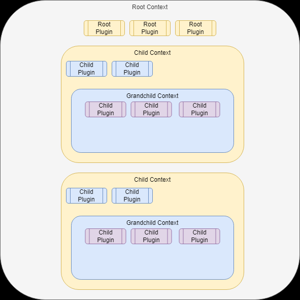

# fastify 教程

## 生命周期

### fastify 生命周期

```json
Incoming Request
  │
  └─▶ Routing
        │
        └─▶ Instance Logger
             │
   4**/5** ◀─┴─▶ onRequest Hook
                  │
        4**/5** ◀─┴─▶ preParsing Hook
                        │
              4**/5** ◀─┴─▶ Parsing
                             │
                   4**/5** ◀─┴─▶ preValidation Hook
                                  │
                            400 ◀─┴─▶ Validation
                                        │
                              4**/5** ◀─┴─▶ preHandler Hook
                                              │
                                    4**/5** ◀─┴─▶ User Handler
                                                    │
                                                    └─▶ Reply
                                                          │
                                                4**/5** ◀─┴─▶ preSerialization Hook
                                                                │
                                                                └─▶ onSend Hook
                                                                      │
                                                            4**/5** ◀─┴─▶ Outgoing Response
                                                                            │
                                                                            └─▶ onResponse Hook
```

### reply 生命周期

```json
                  ★ schema validation Error
                              │
                              └─▶ schemaErrorFormatter
                                         │
                    reply sent ◀── JSON ─┴─ Error instance
                                                │
                                                │         ★ throw an Error
               ★ send or return                 │                 │
                      │                         │                 │
                      │                         ▼                 │
 reply sent ◀── JSON ─┴─ Error instance ──▶ setErrorHandler ◀─────┘
                                                │
                           reply sent ◀── JSON ─┴─ Error instance ──▶ onError Hook
                                                                          │
                                                                          └─▶ reply sent
```

## 插件

### 思想

- Fastify 中一切且为插件;
- 路由/hook/中间件... 一切通过插件定义;

```typescript
const fastify = Fastify({
  logger: true,
});
fastify.register(anything);
```

### 定义插件

```typescript
export const testPlugin = async (fastify, opts, done) => {
  fastify.decorate("utility", function () {});
  fastify.get("/", handler);
  fastify.register(require("./other-plugin"));
};
```

### 异步

- 异步写法下 done() 回调不必使用;
- 使用可能出现未知结果;

### 使用插件

```typescript
fastify.register(plugin, [options]);
// esm
fastify.register(import("./plugin.mjs"));
```

### 生命周期

- 使用 after/ready/listen hook;

### 插件执行顺序

- 根据插件声明顺序加载插件;
- 推荐使用下列顺序;

```yaml
└── plugins (from the Fastify ecosystem)
└── your plugins (your custom plugins)
└── decorators
└── hooks
└── your services
```

## 封装

### 封装上下文

- fastify 自顶向下分为 Root/Child/Grandchild 三个层级上下文;
- 后代上下文可访问父上下文;



```typescript
"use strict";

const fastify = require("fastify")();

fastify.decorateRequest("answer", 42);

fastify.register(async function authenticatedContext(childServer) {
  childServer.register(require("@fastify/bearer-auth"), { keys: ["abc123"] });

  childServer.route({
    path: "/one",
    method: "GET",
    handler(request, response) {
      response.send({
        answer: request.answer,
        // request.foo will be undefined as it's only defined in publicContext
        foo: request.foo,
        // request.bar will be undefined as it's only defined in grandchildContext
        bar: request.bar,
      });
    },
  });
});

fastify.register(async function publicContext(childServer) {
  childServer.decorateRequest("foo", "foo");

  childServer.route({
    path: "/two",
    method: "GET",
    handler(request, response) {
      response.send({
        answer: request.answer,
        foo: request.foo,
        // request.bar will be undefined as it's only defined in grandchildContext
        bar: request.bar,
      });
    },
  });

  childServer.register(async function grandchildContext(grandchildServer) {
    grandchildServer.decorateRequest("bar", "bar");

    grandchildServer.route({
      path: "/three",
      method: "GET",
      handler(request, response) {
        response.send({
          answer: request.answer,
          foo: request.foo,
          bar: request.bar,
        });
      },
    });
  });
});

fastify.listen({ port: 8000 });
```

### 获取后代上下文

- 使用 fastify-plugin 插件;

```typescript
"use strict";
fastify.register(async function publicContext(childServer) {
  childServer.decorateRequest("foo", "foo");

  childServer.route({
    // ...
  });

  childServer.register(fastifyPlugin(grandchildContext));
  async function grandchildContext(grandchildServer) {
    //...
  }
});

fastify.listen({ port: 8000 });
```

## 修饰器

### 作用

- 自定义核心 fastify 对象;
- 可以再生命周期中的任何 hook 中获取;

### 初始值

- 初始值尽量接近未来动态设置的值;

### 添加至 fastify 实例

##### 定义修饰器

```typescript
fastify.decorate("utility", function () {
  // Something very useful
});

fastify.decorate("conf", {
  db: "some.db",
  port: 3000,
});
```

##### 使用修饰器

```typescript
fastify.utility();
console.log(fastify.conf.db);
```

##### this 指向

- 修饰器函数使用普通函数形式;
- 路由中将 fastify 实例绑定到 this;
- 否则显式使用 fastify;

```typescript
fastify.decorate("db", new DbConnection());

fastify.get("/", async function (request, reply) {
  // using return
  return { hello: await this.db.query("world") };
});
```

##### 修饰器值类型

- 修饰器的值可以是任何类型;

### 添加至 Reply

##### 定义装饰器

```typescript
fastify.decorateReply("utility", function () {
  // Something very useful
});
```

##### 使用修饰器

```typescript
req.utility();
```

##### this 指向

- 修饰器函数使用普通函数形式;
- 路由中将 fastify 实例绑定到 this;
- 否则显式使用 req;

```typescript
fastify.decorate("db", new DbConnection());

fastify.get("/", async function (request, reply) {
  // using return
  return { hello: await this.db.query("world") };
});
```

##### 值类型

- 修饰器值仅能为值类型和函数;
- 使用引用类型, 会导致所有类型共享同一对象;
- 正确使用如下;

```typescript
import fastify-plugin from "fastify-plugin"

const myPlugin = async (app) => {
  app.decorateReply("foo", null);
  app.addHook("onRequest", async (req, reply) => {
    req.foo = { bar: 42 };
  });
};

export fp(myPlugin)
```

### 添加至 Request

- 使用 decorateRequest();
- 同 decorateReply();

### 装饰器和封装

- 同一级上下文中不可定义同名装饰器;
- 不同级上下文可以;

## 错误处理

### setErrorHandler

- fastify.setErrorHandler(handler(error, request, reply));
- 定义错误处理程序;
- 错误发生调用其回调函数;

```typescript
// Register parent error handler
fastify.setErrorHandler((error, request, reply) => {
  reply.status(500).send({ ok: false });
});
```

### 封装上下文

- setErrorHandler 会被限制于定义时的封装上下文;
- 若存在多个处理程序, 优先使用最邻近处理程序;

```typescript
// Register parent error handler
fastify.setErrorHandler((error, request, reply) => {
  reply.status(500).send({ ok: false });
});

fastify.register((app, options, next) => {
  // Register child error handler
  fastify.setErrorHandler((error, request, reply) => {
    throw error;
  });
});
```

### 自定义中间件

- 用于 setErrorHandler 会被限制于定义时的封装上下文;
- 需使用 fastify-plugin 保留中间件定义的 setErrorHandler;

```typescript
import { FastifyTypebox } from "@/type/app.type";
import { generateResponse } from "@/util/app";
import fp from "fastify-plugin";

const globalErrorHandler = fp(async (app: FastifyTypebox) => {
  app.setErrorHandler((error, _, res) => {
    if (error) {
      res.code(500).send(generateResponse(0, "error", null));
    }
  });
});

app.register(globalErrorHandler);
```
