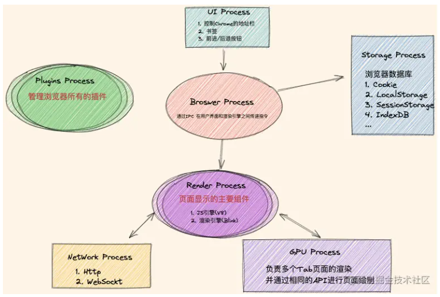

# 浏览器

## 浏览器缓存

### 强缓存

##### 相关首部

- Expires;
- Cache-Control;

##### Expires

- http/1.0 使用;
- 指定资源过期时间;
- 当前时间早于 Expires, 强制使用缓存, 反之不使用缓存;
- 服务器时间可能与浏览器时间不一致, http/1.1 废弃;

##### Cache-Control

- http/1.1 使用;
- 控制缓存行为, 返回响应指定时间内可以使用缓存;
- 相关指令;
  - public: 对应响应可以被任意终端缓存;
  - private: 对应响应只能被单个总段缓存;
  - no-cache: 跳过缓存, 进入协商缓存阶段;
  - no-store: 不使用任何缓存;
- Cache-Control 优先级高于 Expires;

```bash
Cache-Control:public, max-age=86400
```

### 协商缓存

##### 工作机制

- 强缓存失效;
- 服务器根据协商缓存相关字段确定浏览器能否使用缓存;

##### 相关首部

- Last-Modified/If-Modified-Since;
- ETag/If-None-Match;

##### Last-Modified/If-Modified-Since

- 浏览器首次发送请求, 服务器在响应报文添加 Last-Modified 首部;
- 浏览器再次发送请求, 添加 If-Modified-Since 首部;
- 服务器比较两者对应时间;
  - 若请求报文首部时间晚于响应报文首部时间, 使用缓存, 返回 304;
  - 反之返回 200, 即新资源;
- 最小更新时间为秒, 若文件 1s 内发生变化, 无法识别;

##### ETag/If-None-Match

- 服务器根据资源文件, 哈希生成 ETag, 通过响应报文发送给浏览器;
- 浏览器设置 If-None-Match 首部值为 ETag 值, 发送给服务器;
- 服务器对比浏览器 If-None-Match 和 ETag;
  - 若两者相同, 使用缓存, 返回 304;
  - 反之返回 200, 即新资源;
- If-None-Match 优先级高于 If-Modified-Since;

### 使用场景

- 强制缓存: 使用本地缓存;
  - 静态文件;
  - 首部设置强制缓存命令;
  - 不敏感的资源文件;
- 协商缓存: 发送唯一标识, 与服务器进行通信, 验证资源是否变化;
  - 频繁变动的实时数据;
  - 需要验证缓存有效性;

### 优缺点

- 强制缓存: 使用本地缓存, 无须服务器通信, 响应速度快;
- 协商缓存;
  - 需要计算文件哈希, 性能耗费大;
  - 精确度高;

## 渲染过程

### 基本步骤

- 构建 DOM 树: 解析 HTML;
- 构建 CSSOM 树: 计算 CSS;
- 构建渲染树: 合并 DOM 和 CSSOM;
- 构建布局树: 计算 HTML 元素布局 (位置和大小);
- 绘制: 遍历渲染树, 根据布局树绘制, 生成像素位图;
- 合成: 通过 GPU 显示;

### 解析 HTML

- 浏览器接受 HTTP 请求的字节数据;
- 浏览器转换字节数据为字符串;
- 浏览器基于词法分析, 将字符串转换为 token;
- 浏览器将 token 转换为 Node;
- 浏览器基于 Node 构建 DOM 树;

### 解析 CSS

- 等同于解析 HTML;
- 字节数据 ==> 字符串 ===> token ===> Node ===> CSSOM;

### 构建渲染树

- 合并 DOM 树和 CSSOM 树;
- 包括显示节点极其样式信息;


### 操作 DOM

##### 性能

- DOM 线程为工作线程, 与浏览器主线程分离;
- 操作 DOM, 需要两个线程通信, 具有性能耗费;

##### 如何操作大量 DOM

- 使用虚拟滚动技术;
- 只渲染可视区域内的元素;

### 渲染堵塞

##### DOM 树和 CSSOM 树

- 渲染树需要 DOM 树和 CSSOM 树;
- 解析 HTML 和 CSS 必然堵塞渲染;

##### css 和 js

- 解析 HTML 时;
- 遇到 link/style/script 时, 引入外部 css 和 js 文件;
- 首先解析并执行 css/js 文件, 完成后继续构建 DOM 树, 因此堵塞 DOM 解析;

##### 首屏加载

- HTML 存在大量 css 和 js, 降低首屏加载速度;
- css;
  - 内联 css 于 HTML 中;
  - 将大体积 css 放置于 body 底部;
  - 使用 js 动态加载 css;
- js;
  - 避免 js 存在耗时操作;
  - 将 script 标签放置于 body 底部;
  - 使用 defer/async 属性延迟或异步加载;

## 浏览器进程

### 主要进程

- 基于 IPC 进行进程间的通信;
- Render Process: js 引擎和渲染引擎;
- NetWork Process: 负责网络协议;
- GPU Process: 负责页面渲染;
- Plugins Process: 负责浏览器插件;
- UI Process: 负责地址栏/书签/跳转等;
- Storage Process: 负责本地存储;



## 内存泄露

### 导致原因

- 意外生成的全局变量, 导致无法被垃圾回收;
- 遗忘的定时器或回调函数;
- 大量的 console;
- 不正确的使用闭包;
- 不正确的删除 DOM, 浏览器依旧保持对 DOM 的引用;
- 循环引用问题;

## GPU

### 加速操作

- 页面滚动;
- transform;
- css 动画;
- canvas 绘图;
