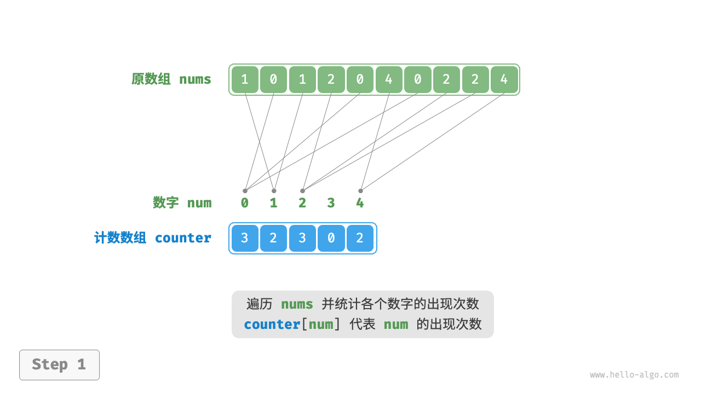
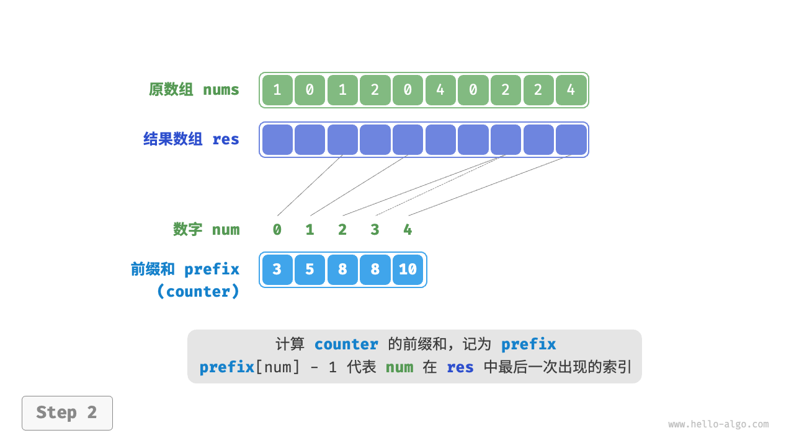
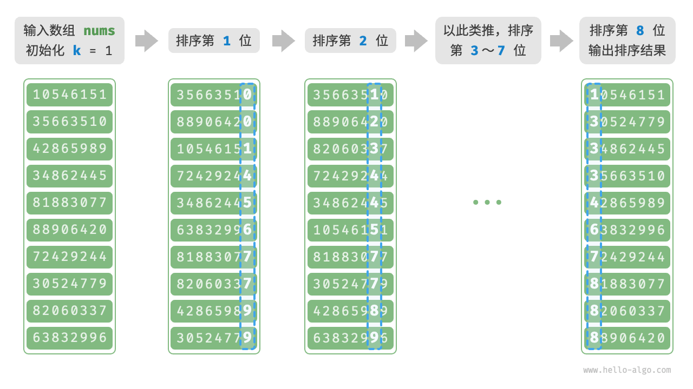
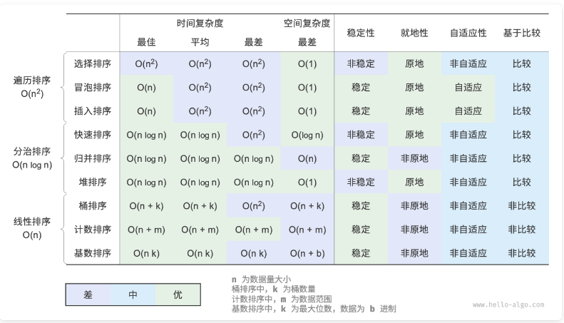

# 数组

## 数组

### 基础

##### 数组

- 相同类型元素;
- 线性数据结构;

##### 优点

- 通过内存地址 O(1) 时间复杂度直接访问;

##### 缺点

- 初始化长度不可变;
  - 超过数组范围元素丢失;
  - 内存浪费;
- 插入和删除效率低;
  - 时间复杂度为 O(n);

### 数组基础题目

#### 轮转数组

##### 问题

- [189](https://leetcode.cn/problems/rotate-array/description/);

##### 思路

- 数组元素向右移动 k 次后;
- 尾部 k mod n 个元素移动至头部, 其余后移 k mod n 个位置;
- 翻转思路;
  - 首先反转数组;
  - 其次反转 `[0, k % n - 1]`;
  - 最后反转 `[k % n, n - 1]`;

```typescript
const reverse = (nums, start, end) => {
  while (start < end) {
    const temp = nums[start];
    nums[start] = nums[end];
    nums[end] = temp;
    start += 1;
    end -= 1;
  }
};

const rotate = function (nums, k) {
  k %= nums.length;
  reverse(nums, 0, nums.length - 1);
  reverse(nums, 0, k - 1);
  reverse(nums, k, nums.length - 1);
};
```

##### 时间复杂度

- 时间: n;
- 空间: 1;

#### 对角线遍历

##### 问题

- [498](https://leetcode.cn/problems/diagonal-traverse/description/);

##### 思路

- 一共 m + n - 1 跳对角线;
- 当 "行号 + 列号"为偶数, 遍历顺序从左下到右上;
- 当为奇数, 遍历顺序从右上的左下;
- 右上方移动时;
  - 最后一列: 向下移动;
  - 第一行: 向右移动:
  - 其余: 右上移动;
- 左下方移动时;
  - 最后一行: 向右移动;
  - 第一列: 向下移动;
  - 其余: 左下移动;
- 首先判断最后一行或最后一列, 避免主对角线问题;

```typescript
/**
 * @param {number[][]} mat
 * @return {number[]}
 */
var findDiagonalOrder = function (mat) {
  const m = mat.length;
  const n = mat[0].length;
  const count = m * n;
  let row = 0;
  let col = 0;

  const result = [];
  for (let i = 0; i < count; i++) {
    result.push(mat[row][col]);
    if ((row + col) % 2 !== 1) {
      if (col === n - 1) {
        row += 1;
      } else if (row === 0) {
        col += 1;
      } else {
        col += 1;
        row -= 1;
      }
    } else {
      if (row === m - 1) {
        col += 1;
      } else if (col === 0) {
        row += 1;
      } else {
        col -= 1;
        row += 1;
      }
    }
  }

  return result;
};
```

##### 复杂度

- 时间: m \* n;
- 空间: m \* n;

#### 旋转图像

##### 问题

- [048](https://leetcode.cn/problems/rotate-image/);

##### 思路

- `mat[row][col]` 旋转后移动至 `mat[col][n-row-1]`;
- 四次旋转;
  - i,j/j,n-i-1,/n-i-1,n-j-1/n-j-1,i 形成一个循环;
  - 使用 temp 缓存;

```typescript
/**
 * @param {number[][]} matrix
 * @return {void} Do not return anything, modify matrix in-place instead.
 */
var rotate = function (matrix) {
  const n = matrix.length;
  for (let i = 0; i < Math.floor(n / 2); i++) {
    for (let j = 0; j < Math.floor((n + 1) / 2); j++) {
      const temp = matrix[i][j];
      matrix[i][j] = matrix[n - j - 1][i];
      matrix[n - j - 1][i] = matrix[n - i - 1][n - j - 1];
      matrix[n - i - 1][n - j - 1] = matrix[j][n - i - 1];
      matrix[j][n - i - 1] = temp;
    }
  }
};
```

##### 复杂度

- 时间: n^2;
- 空间: 1;

#### 螺旋矩阵 1

##### 问题

- [054](https://leetcode.cn/problems/spiral-matrix/);

##### 思路

- 使用 ans 存储答案, 定义四个边界;
- 按照顺时针顺序从边界访问元素;
- 访问完当前边界后, 更新边界位置;
- 递归进行以上两步;

```typescript
/**
 * @param {number[][]} matrix
 * @return {number[]}
 */
var spiralOrder = function (matrix) {
  let left = 0;
  let right = matrix[0].length - 1;
  let top = 0;
  let down = matrix.length - 1;

  const result = [];
  while (1) {
    for (let i = left; i <= right; i++) {
      result.push(matrix[top][i]);
    }
    top++;
    if (top > down) {
      break;
    }

    for (let i = top; i <= down; i++) {
      result.push(matrix[i][right]);
    }
    right--;
    if (left > right) {
      break;
    }

    for (let i = right; i >= left; i--) {
      result.push(matrix[down][i]);
    }
    down--;
    if (top > down) {
      break;
    }

    for (let i = down; i >= top; i--) {
      result.push(matrix[i][left]);
    }
    left++;
    if (left > right) {
      break;
    }
  }

  return result;
};
```

##### 复杂度

- 时间: m \* n;
- 空间: m \* n;

#### 螺旋矩阵 2

##### 题目

- [059](https://leetcode.cn/problems/spiral-matrix-ii/);

##### 思路

- 同螺旋矩阵 1;

```typescript
/**
 * @param {number} n
 * @return {number[][]}
 */
var generateMatrix = function (n) {
  let left = 0;
  let right = n - 1;
  let top = 0;
  let down = n - 1;

  const result = new Array(n).fill(0).map(() => new Array(n).fill(0));
  let num = 1;
  while (1) {
    for (let i = left; i <= right; i++) {
      result[top][i] = num;
      num++;
    }
    top++;
    if (top > down) {
      break;
    }

    for (let i = top; i <= down; i++) {
      result[i][right] = num;
      num++;
    }
    right--;
    if (left > right) {
      break;
    }

    for (let i = right; i >= left; i--) {
      result[down][i] = num;
      num++;
    }
    down--;
    if (top > down) {
      break;
    }

    for (let i = down; i >= top; i--) {
      result[i][left] = num;
      num++;
    }
    left++;
    if (left > right) {
      break;
    }
  }

  return result;
};
```

##### 复杂度

- 时间: n^2;
- 空间: n^2;

#### 只出现一次的数字

##### 问题

- [136](https://leetcode.cn/problems/single-number/);

##### 思路

- 基于位运算中的异或操作;
- 遍历数组, 递归进行异或操作, 最终值即只出现一次的元素;

```typescript
/**
 * @param {number[]} nums
 * @return {number}
 */
var singleNumber = function (nums) {
  let ans = nums[0];
  for (let i = 1; i < nums.length; i++) {
    ans ^= nums[i];
  }
  return ans;
};
```

##### 复杂度

- 时间: n;
- 空间: 1;

## 列表

### 扩容机制

- 长度可变的数组;
- 当数组元素数量超过当前容量后;
- 容量扩充至当前 2 倍;

### 列表操作

##### 访问

- 时间复杂度为 O(1);

##### 插入

- 时间复杂度为 O(n);

##### 删除

- 时间复杂度为 O(n);

##### 添加

- 时间复杂度为 O(1);
- 扩容时为 O(n);

### 代码实现

```typescript
export class List<T> {
  capacity: number;
  size: number;
  array: T[];
  constructor(capacity: number) {
    this.capacity = capacity;
    this.size = 0;
    this.array = new Array(capacity);
  }

  get(index: number): T {
    if (index >= this.size || index < 0) throw new Error("exceed");
    return this.array[index];
  }

  insert(position: number, value: T): boolean {
    if (position >= this.size || position < 0) throw new Error("exceed");
    if (this.size === this.capacity) {
      const array = new Array(2 * this.capacity);
      this.capacity *= 2;
      for (let index = 0; index < position; index++) {
        const element = this.array[index];
        array[index] = element;
      }
      array[position] = value;
      for (let index = position; index < this.array.length; index++) {
        const element = this.array[index];
        array[index + 1] = element;
      }
      this.size++;
      this.array = array;
      return true;
    }
    for (let index = this.size - 1; index >= position; index--) {
      const element = this.array[index];
      this.array[index + 1] = element;
    }
    this.array[position] = value;
    this.size++;
    return true;
  }

  delete(position: number): T {
    if (position >= this.size || position < 0) throw new Error("exceed");
    const deleteElement = this.array[position];
    for (let index = position + 1; index < this.array.length; index++) {
      const element = this.array[index];
      this.array[index - 1] = element;
    }
    this.size--;
    return deleteElement;
  }

  append(value: T) {
    if (this.size === this.capacity) {
      const array = new Array(2 * this.capacity);
      this.capacity *= 2;
      for (let index = 0; index < this.array.length; index++) {
        const element = this.array[index];
        array[index] = element;
      }
      array[this.size] = value;
      this.size++;
      this.array = array;
      return true;
    }
    this.array[this.size] = value;
    this.size++;
    return true;
  }
}
```

## 数组排序

### 选择排序

##### 工作原理

- 数组长度为 n;
- 选择 [0, n-1] 中最小的元素, 与 0 处元素交换;
- 选择 [1, n-1] 中最小的元素, 与 1 处元素交换;
- 依次类推, 重复 n - 1 轮;

##### 算法特性

- 时间复杂度: O(n^2);
- 空间复杂度: O(1);
- 非稳定排序;

##### 代码

- [192](https://leetcode.cn/problems/sort-an-array/);

```typescript
/* 选择排序 */
function selectionSort(nums: number[]): void {
  let n = nums.length;
  // 外循环: 未排序区间为 [i, n-1]
  for (let i = 0; i < n - 1; i++) {
    // 内循环: 找到未排序区间内的最小元素
    let k = i;
    for (let j = i + 1; j < n; j++) {
      if (nums[j] < nums[k]) {
        k = j; // 记录最小元素的索引
      }
    }
    // 将该最小元素与未排序区间的首个元素交换
    [nums[i], nums[k]] = [nums[k], nums[i]];
  }
}
```

### 冒泡排序

##### 工作原理

- 从数组最左端开始向右遍历, 若'左元素>右元素', 交换两者;
- 数组长度为 n;
- 首先对 n 个元素进行冒泡, 最大元素交换至最后位置;
- 其次对 n -1 个元素进行冒泡, 第二大元素交换至倒数第二位置;
- 依次类推, 重复 n - 1 轮;

##### 算法特性

- 时间复杂度: O(n^2);
- 空间复杂度: O(1);
- 稳定排序;

##### 代码

- [192](https://leetcode.cn/problems/sort-an-array/);

```typescript
/* 冒泡排序 */
function bubbleSort(nums: number[]): void {
  // 外循环: 未排序区间为 [0, i]
  for (let i = nums.length - 1; i > 0; i--) {
    // 内循环: 将未排序区间 [0, i] 中的最大元素交换至该区间的最右端
    for (let j = 0; j < i; j++) {
      if (nums[j] > nums[j + 1]) {
        // 交换 nums[j] 与 nums[j + 1]
        let tmp = nums[j];
        nums[j] = nums[j + 1];
        nums[j + 1] = tmp;
      }
    }
  }
}
```

### 插入排序

##### 工作原理

- 数组长度为 n;
- 数组第 1 个元素已完成排序;
- 选取数组第 2 个元素, 与排序部分 (第 1 个元素) 比较, 插入正确位置;
- 选取数组第 3 个元素, 与排序部分 (前 2 个元素) 比较, 插入正确位置;
- 依次类推, 重复 n - 1 次;

##### 算法特性

- 时间复杂度: O(n^2);
- 空间复杂度: O(1);
- 稳定排序;

##### 插入排序优势

- 适用于小数据量;
- 冒泡排序涉及交换元素, 开销高;
- 选择排序不稳定;

##### 代码

- [192](https://leetcode.cn/problems/sort-an-array/);

```typescript
/* 插入排序 */
function insertionSort(nums: number[]): void {
  // 外循环: 已排序元素数量为 1, 2, ..., n
  for (let i = 1; i < nums.length; i++) {
    const base = nums[i];
    let j = i - 1;
    // 内循环: 将 base 插入到已排序部分的正确位置
    while (j >= 0 && nums[j] > base) {
      nums[j + 1] = nums[j]; // 将 nums[j] 向右移动一位
      j--;
    }
    nums[j + 1] = base; // 将 base 赋值到正确位置
  }
}
```

### 希尔排序

##### 工作原理

- 插入排序的改进;
- 按照一定间隔, 划分为若干数组, 对子数组进行插入排序;
- 不断缩小间隔, 递归执行上一步, 直至间隔为 1;

##### 算法特性

- 时间: n\*log2n - n^2;
- 空间: 1;
- 非稳定排序;

##### 代码

- 此处 gap 不断除以 2, 时间复杂度为 n^2, 但实现简单;
- [192](https://leetcode.cn/problems/sort-an-array/);

```typescript
const shellSort = (nums) => {
  let gap = Math.floor(nums.length / 2);

  while (gap > 0) {
    for (let i = gap; i < nums.length; i++) {
      const base = nums[i];
      let j = i - gap;
      while (j >= 0 && nums[j] > base) {
        nums[j + gap] = nums[j];
        j -= gap;
      }
      nums[j + gap] = base;
    }
    gap = Math.floor(gap / 2);
  }
};
```

### 快速排序

##### 哨兵划分

- 选取数组最左端作为 base, 两个标识符 start, end 执行数组两端;
- 首先 end 向左寻找第一个小于 base 的元素;
- 其次 start 向右寻找第一个大于 base 的元素;
- 交换两个元素;
- 重复以上步骤, 直至 start 和 end 相遇;
- base 设置为 start;
- 哨兵划分完成后, 数组被划分成三部分, 左子数组, 基准数, 右子数组, 且左子数组 < 基准数 < 右子数组;

##### 快速排序

- 对原数组进行哨兵排序;
- 对左子数组和右子数组递归执行哨兵排序, 直至所有子数组长度为 1;

##### 算法特性

- 时间复杂度: O(nlogn), 最差为 O(n^2);
- 空间复杂度: O(n);
- 非稳定排序;

##### 代码

- [192](https://leetcode.cn/problems/sort-an-array/);

```typescript
/* 元素交换 */
swap(nums: number[], i: number, j: number): void {
    let tmp = nums[i];
    nums[i] = nums[j];
    nums[j] = tmp;
}

/* 哨兵划分 */
partition(nums: number[], left: number, right: number): number {
    // 以 nums[left] 为基准数
    let i = left,
        j = right;
    while (i < j) {
        while (i < j && nums[j] >= nums[left]) {
            j -= 1; // 从右向左找首个小于基准数的元素
        }
        while (i < j && nums[i] <= nums[left]) {
            i += 1; // 从左向右找首个大于基准数的元素
        }
        // 元素交换
        this.swap(nums, i, j); // 交换这两个元素
    }
    this.swap(nums, i, left); // 将基准数交换至两子数组的分界线
    return i; // 返回基准数的索引
}

/* 快速排序 */
quickSort(nums: number[], left: number, right: number): void {
    // 子数组长度为 1 时终止递归
    if (left >= right) {
        return;
    }
    // 哨兵划分
    const pivot = this.partition(nums, left, right);
    // 递归左子数组, 右子数组
    this.quickSort(nums, left, pivot - 1);
    this.quickSort(nums, pivot + 1, right);
}
```

### 归并排序

##### 工作原理

- 划分阶段;
  - 通过递归从中点划分数组;
  - 首先递归左子数组, 其次右子数组, 最后合并;
- 合并阶段;
  - 当子数组长度为 1 时终止递归;
  - 持续的将左右较短的有序数组排序并合并为较长的有序数组;


##### 算法特性

- 时间复杂度: O(nlongn);
- 空间复杂度: O(n);
- 稳定排序;

##### 代码

- [192](https://leetcode.cn/problems/sort-an-array/);

```javascript
/* 合并左子数组和右子数组 */
function merge(nums, left, mid, right) {
  // 左子数组区间为 [left, mid], 右子数组区间为 [mid+1, right]
  const tmp = new Array(right - left + 1);
  // 初始化左子数组和右子数组的起始索引
  let i = left;
  let j = mid + 1;
  let k = 0;
  // 当左右子数组都还有元素时, 进行比较并将较小的元素复制到临时数组中
  while (i <= mid && j <= right) {
    if (nums[i] <= nums[j]) {
      tmp[k++] = nums[i++];
    } else {
      tmp[k++] = nums[j++];
    }
  }
  // 将左子数组和右子数组的剩余元素复制到临时数组中
  while (i <= mid) {
    tmp[k++] = nums[i++];
  }
  while (j <= right) {
    tmp[k++] = nums[j++];
  }
  // 将临时数组 tmp 中的元素复制回原数组 nums 的对应区间
  for (k = 0; k < tmp.length; k++) {
    nums[left + k] = tmp[k];
  }
}

/* 归并排序 */
function mergeSort(nums, left, right) {
  // 终止条件
  if (left >= right) return; // 当子数组长度为 1 时终止递归
  // 划分阶段
  let mid = Math.floor((left + right) / 2); // 计算中点
  mergeSort(nums, left, mid); // 递归左子数组
  mergeSort(nums, mid + 1, right); // 递归右子数组
  // 合并阶段
  merge(nums, left, mid, right);
}
```

### 堆排序

##### 工作原理

- 基于输入数组建立大顶堆;
- 堆顶元素和堆底元素交换, 交换完成后, 堆长度 -1, 排序元素长度 +1;
- 从顶到底执行自顶向下的交换操作, 重新建立堆;
- 循环执行以上 2 步, n-1 轮后完成数组排序;

##### 算法特性

- 时间复杂度: O(nlongn);
- 空间复杂度: O(1);
- 非稳定排序;

##### 代码

- [192](https://leetcode.cn/problems/sort-an-array/);

```javascript
/* 堆的长度为 n , 从节点 i 开始, 从顶至底堆化 */
function siftDown(nums, n, i) {
  while (true) {
    // 判断节点 i, l, r 中值最大的节点, 记为 ma
    let l = 2 * i + 1;
    let r = 2 * i + 2;
    let ma = i;
    if (l < n && nums[l] > nums[ma]) {
      ma = l;
    }
    if (r < n && nums[r] > nums[ma]) {
      ma = r;
    }
    // 若节点 i 最大或索引 l, r 越界, 则无须继续堆化, 跳出
    if (ma === i) {
      break;
    }
    // 交换两节点
    [nums[i], nums[ma]] = [nums[ma], nums[i]];
    // 循环向下堆化
    i = ma;
  }
}

/* 堆排序 */
function heapSort(nums) {
  // 建堆操作: 堆化除叶节点以外的其他所有节点
  for (let i = Math.floor(nums.length / 2) - 1; i >= 0; i--) {
    siftDown(nums, nums.length, i);
  }
  // 从堆中提取最大元素, 循环 n-1 轮
  for (let i = nums.length - 1; i > 0; i--) {
    // 交换根节点与最右叶节点 (交换首元素与尾元素)
    [nums[0], nums[i]] = [nums[i], nums[0]];
    // 以根节点为起点, 从顶至底进行堆化
    siftDown(nums, i, 0);
  }
}
```

### 桶排序

##### 工作原理

- 长度为 n 的整数数组;
- 初始化 k 个桶, 将 n 个元素分配到 k 个桶中;
- 对每个桶分别进行排序;
- 根据桶的大小合并结果;


##### 算法特性

- 时间复杂度: O(n + k);
  - 排序需要 n;
  - 合并需要 k;
- 空间复杂度: O(n + k);
  - k 个桶;
  - n 个元素;

##### 应用场景

- 针对有限范围内的数字, 或通过 hash 转换为数字;

##### 代码

- [192](https://leetcode.cn/problems/sort-an-array/);

```javascript
/* 桶排序 */
function bucketSort(nums, size) {
  // 初始化 k 个桶
  const k = Math.floor(nums.length / size);
  const buckets = [];
  for (let i = 0; i < k; i++) {
    buckets.push([]);
  }
  // 1. 将数组元素分配到各个桶中
  const min = Math.min(...nums);
  const range = Math.max(...nums) - min;
  // 判断数组长度或者数组是否都是一个值
  if (range === 0) return;
  for (const num of nums) {
    const i = Math.floor(((num - min) / range) * (k - 1));
    buckets[i].push(num);
  }
  // 2. 对各个桶执行排序
  for (const bucket of buckets) {
    // 使用内置排序函数, 也可以替换成其他排序算法
    bucket.sort((a, b) => a - b);
  }
  // 3. 遍历桶合并结果
  let i = 0;
  for (const bucket of buckets) {
    for (const num of bucket) {
      nums[i++] = num;
    }
  }

  return nums;
}
```

### 计数排序

##### 工作原理

- 给定长度 n 为整数数组 nums;
- 遍历数组, 找出最大数字 m, 创建一个 m + 1 的数组 counter;
- 统计 nums 中个数字出现的次数, counter[num] 对应 num 的出现次数;
- 基于 counter 生成前缀和 prefix;
  - prefix[i] = $\sum^i_{j=1}counter[j]$;
- 倒序遍历 nums;
  - `res[prefix[num]-1]=num`;
  - prefix[num] -= 1;





##### 算法特性

- 时间复杂度: O(n + m);
- 空间复杂度: O(n + m);
- 稳定排序;

##### 计数排序和堆排序

- 可将 counter 的每个索引看作一个桶;
- 计数排序是桶排序在整数数组下的特例;

##### 应用场景

- 正整数数组;
- 数据量大但数据范围小;

##### 代码

- [192](https://leetcode.cn/problems/sort-an-array/);

```javascript
/**
 * @param {number[]} nums
 * @return {number[]}
 */
var sortArray = function (nums) {
  const countingSort = (nums) => {
    const max = Math.max(...nums);
    const min = Math.min(...nums);

    const counters = new Array(max - min + 1).fill(0);
    for (const num of nums) {
      counters[num - min]++;
    }
    for (let i = 0; i < counters.length - 1; i++) {
      counters[i + 1] += counters[i];
    }

    const res = new Array(nums.length);
    for (let i = 0; i < nums.length; i++) {
      const value = nums[i];
      res[counters[value - min] - 1] = value;
      counters[value - min]--;
    }
    for (let i = 0; i < nums.length; i++) {
      nums[i] = res[i];
    }
  };

  countingSort(nums);

  return nums;
};
```

### 基数排序

##### 工作原理

- 核心原理同计数排序, 在计数排序的基础上, 理由数字各位的递进关系, 依次对每一位进行排序;
- 初始化 k = 1;
- 对数字第 k 位进行计数排序;
- k + 1, 重复上一步骤, 直至所有为排序完成;



##### 算法特性

- 时间复杂度: O(nk);
- 空间复杂度: O(n + d);
- 稳定排序;

##### 应用场景

- 数据范围大;

##### 代码

- [192](https://leetcode.cn/problems/sort-an-array/);

```javascript
/* 获取元素 num 的第 k 位, 其中 exp = 10^(k-1) */
function digit(num, exp) {
  // 传入 exp 而非 k 可以避免在此重复执行昂贵的次方计算
  return Math.floor(num / exp) % 10;
}

/* 计数排序 (根据 nums 第 k 位排序)  */
function countingSortDigit(nums, exp) {
  // 十进制的位范围为 0~9 , 因此需要长度为 10 的桶数组
  const counter = new Array(10).fill(0);
  const n = nums.length;
  // 统计 0~9 各数字的出现次数
  for (let i = 0; i < n; i++) {
    const d = digit(nums[i], exp); // 获取 nums[i] 第 k 位, 记为 d
    counter[d]++; // 统计数字 d 的出现次数
  }
  // 求前缀和, 将 "出现个数" 转换为 "数组索引"
  for (let i = 1; i < 10; i++) {
    counter[i] += counter[i - 1];
  }
  // 倒序遍历, 根据桶内统计结果, 将各元素填入 res
  const res = new Array(n).fill(0);
  for (let i = n - 1; i >= 0; i--) {
    const d = digit(nums[i], exp);
    const j = counter[d] - 1; // 获取 d 在数组中的索引 j
    res[j] = nums[i]; // 将当前元素填入索引 j
    counter[d]--; // 将 d 的数量减 1
  }
  // 使用结果覆盖原数组 nums
  for (let i = 0; i < n; i++) {
    nums[i] = res[i];
  }
}

/* 基数排序 */
function radixSort(nums) {
  // 获取数组的最大元素, 用于判断最大位数
  let m = Number.MIN_VALUE;
  for (const num of nums) {
    if (num > m) {
      m = num;
    }
  }
  // 按照从低位到高位的顺序遍历
  for (let exp = 1; exp <= m; exp *= 10) {
    // 对数组元素的第 k 位执行计数排序
    // k = 1 -> exp = 1
    // k = 2 -> exp = 10
    // 即 exp = 10^(k-1)
    countingSortDigit(nums, exp);
  }
}
```

### 排序算法优劣

- 冒泡, 选择, 插入排序稳定;
  - 时间 n^2,空间 1;
  - 插入排序适合小数据量;
- 快速, 归并, 堆排序;
  - 时间 nlogn;
  - 快速: 存在基准值劣化风险;
  - 堆排序: 空间复杂度低 1;
- 桶, 计数排序;
  - 时间 m+n, 空间 m+n;
  - 桶排序: 适合大数据量;
  - 计数排序: 适合大数据量且取值范围有限;
- 基数排序: 时间 nk, 空间 n+b;



### 数组排序题目

#### 数组中的第 K 个最大元素

##### 题目

- [215](https://leetcode.cn/problems/kth-largest-element-in-an-array/);

##### 思路

- 堆排序;
  - 使用堆排序, 堆排序每次排序后, 便会得到当前最大的数;
  - 当递归排序 k 次后, 直接输出即可, 无需排序整个数组;
  - 其实我写的堆排序, 百分百比自带排序慢;
- 快速排序;
  - 每一次快速排序后, 对于基准值的确定已经完成;
  - 判断 mid 是否等于 n-k;
    - 等于返回 mid;
    - 小于递归 mid + 1, right;
    - 大于递归 left, mid;
    - 划分思路即二分查找;

```typescript
/**
 * @param {number[]} nums
 * @param {number} k
 * @return {number}
 */
var findKthLargest = function (nums, k) {
  const siftDown = (nums, n, i) => {
    while (1) {
      let left = 2 * i + 1;
      let right = left + 1;
      let temp = i;

      if (left < n && nums[left] > nums[temp]) {
        temp = left;
      }
      if (right < n && nums[right] > nums[temp]) {
        temp = right;
      }

      if (temp === i) break;
      [nums[temp], nums[i]] = [nums[i], nums[temp]];
      i = temp;
    }
  };

  const findK = (nums, k) => {
    for (let i = nums.length - 1; i >= 0; i--) {
      siftDown(nums, nums.length, i);
    }

    for (let i = nums.length - 1; i > nums.length - k; i--) {
      [nums[0], nums[i]] = [nums[i], nums[0]];
      siftDown(nums, i, 0);
    }
  };

  findK(nums, k);

  return nums[0];
};
```

```typescript
/**
 * @param {number[]} nums
 * @param {number} k
 * @return {number}
 */
var findKthLargest = function (nums, k) {
  const partition = (nums, left, right) => {
    let i = left;
    let j = right;
    let index = Math.floor(Math.random() * (right - left + 1) + left);
    [nums[left], nums[index]] = [nums[index], nums[left]];

    while (i < j) {
      while (i < j && nums[j] >= nums[left]) j--;
      while (i < j && nums[i] <= nums[left]) i++;
      [nums[i], nums[j]] = [nums[j], nums[i]];
    }

    [nums[i], nums[left]] = [nums[left], nums[i]];

    return i;
  };

  const quickSort = (nums, left, right) => {
    if (left >= right) return nums[left];
    const mid = partition(nums, left, right);
    if (mid === nums.length - k) return nums[mid];
    else if (mid > nums.length - k) {
      return quickSort(nums, left, mid);
    } else {
      return quickSort(nums, mid + 1, right);
    }
  };

  return quickSort(nums, 0, nums.length - 1);
};
```

##### 复杂度

- 时间: n \* logn;
- 空间: 1;

#### 排序数组

##### 问题概述

- [912](https://leetcode.cn/problems/sort-an-array/);

##### 思路

- 经典的排序算法即可;

#### 合并区间

##### 问题

- [56](https://leetcode.cn/problems/merge-intervals/);

##### 思路

- 首先根据 intervals 的区间左端点进行升序排序;
- 遍历所有区间;
  - 如果区间左端点在前一区间右端点右侧, 两区间不重合, 直接添加;
  - 反之两者重合, 判断两个区间的右区间值大小, 更新前一区间的右端点值;

```typescript
/**
 * @param {number[][]} intervals
 * @return {number[][]}
 */
var merge = function (intervals) {
  intervals = intervals.sort((a, b) => a[0] - b[0]);

  let res = [intervals[0]];
  for (let i = 1; i < intervals.length; i++) {
    const current = intervals[i];
    const before = res[res.length - 1];

    if (current[0] > before[1]) {
      res.push(current);
    } else {
      before[1] = Math.max(before[1], current[1]);
    }
  }

  return res;
};
```

##### 复杂度

- 时间: n \* logn;
- 空间: n;

#### 颜色分类

##### 题目

- [75](https://leetcode.cn/problems/sort-colors/description/);

##### 思路

- 最简单算法: 任何一个排序算法即可;
- 进阶: 快速排序 + 双指针;
  - 将 1 作为基准数;
  - 定义首尾指针 left, right;
  - 遍历数组, 当前索引为 index;
    - 若为 0, 交换 index 和 left, left++;
    - 若为 1, 不做任何操作;
    - 若为 2, 交换 index 和 right, right--;
    - 直至 index 移动到 right 位置;

```typescript
/**
 * @param {number[]} nums
 * @return {void} Do not return anything, modify nums in-place instead.
 */
var sortColors = function (nums) {
  let left = 0;
  let right = nums.length - 1;
  for (let i = 0; i <= right; i++) {
    if (nums[i] === 0) {
      [nums[i], nums[left]] = [nums[left], nums[i]];
      left++;
    } else if (nums[i] === 1) {
      continue;
    } else {
      [nums[i], nums[right]] = [nums[right], nums[i]];
      right--;
      i--;
    }
  }
};
```

##### 复杂度

- 时间:n;
- 空间:1;

#### 最大数

##### 问题

- [179](https://leetcode.cn/problems/largest-number/);

##### 思路

- 假设 x,y 为数组相邻两个元素;
  - 拼接字符串 `xy` 和 `yx`, 利用字符串比较规则 (逐字符比较编码顺序), 判断大小;
  - 选择较大数字对应的 xy 顺序;
- 通过大小为 2 的滑动窗口, 遍历数组, 根据以上比较规则, 更改数组顺序;

```typescript
/**
 * @param {number[]} nums
 * @return {string}
 */
var largestNumber = function (nums) {
  nums.sort((a, b) => {
    if (`${a}${b}` < `${b}${a}`) {
      return 1;
    } else {
      return -1;
    }
  });

  if (nums[0] === 0) return "0";
  return nums.join("");
};
```

##### 复杂度

- 时间: 根据字符串的比较算法不同而不同;
  - 假设比较算法时间复杂度为 a;
  - 时间复杂度为 n \* a;
- 空间: n;

#### 最大间距

##### 题目

- [164](https://leetcode.cn/problems/maximum-gap/solutions/);

##### 思路

- 使用复杂度为 n 的排序算法即可;
  - 堆/基数/计数/桶;
- 因为本题为正整数, 使用桶排序和基数排序皆可;

```typescript
/**
 * @param {number[]} nums
 * @return {number}
 */
var maximumGap = function (nums) {
  const bucketSort = (nums, size) => {
    const k = Math.floor(nums.length / 3);
    const bucketList = [];
    for (let i = 0; i < k + 1; i++) {
      bucketList.push([]);
    }

    const min = Math.min(...nums);
    const range = Math.max(...nums) - min;
    if (range === 0) return nums;
    for (let i = 0; i < nums.length; i++) {
      const num = nums[i];
      const index = Math.floor(((num - min) / range) * k);
      bucketList[index].push(num);
    }

    for (let i = 0; i < bucketList.length; i++) {
      const bucket = bucketList[i];
      bucket.sort((a, b) => a - b);
    }

    const res = [];
    for (let i = 0; i < bucketList.length; i++) {
      const bucket = bucketList[i];
      res.push(...bucket);
    }

    return res;
  };

  if (nums.length < 2) return 0;

  const arr = bucketSort(nums, 3);
  let res = -Infinity;
  for (let i = 1; i < arr.length; i++) {
    res = Math.max(res, arr[i] - arr[i - 1]);
  }

  return res;
};
```

##### 复杂度

- 时间:n;
- 空间:n;

#### 打乱数组

##### 题目

- [384 ](https://leetcode.cn/problems/shuffle-an-array/);

##### 思路

- 该问题可转换为, n 个位置, 选择填入某个数的概率相同, 即洗牌算法;
- 洗牌算法;
  - 对于第 0 个位置, 选择 0 - n - 1 的随机数, 交换位置;
  - 对于第 1 个位置, 选择 1 - n - 1 的随机数, 交换位置;
  - 以此类推;

```typescript
/**
 * @param {number[]} nums
 */
var Solution = function (nums) {
  this.state = nums;
  this.origin = [...nums];
};

/**
 * @return {number[]}
 */
Solution.prototype.reset = function () {
  this.state = [...this.origin];
  return this.state;
};

/**
 * @return {number[]}
 */
Solution.prototype.shuffle = function () {
  const arr = this.state;
  for (let i = arr.length - 1; i >= 0; i--) {
    const index = Math.floor(Math.random() * (i + 1));
    [arr[i], arr[index]] = [arr[index], arr[i]];
  }
  return arr;
};

/**
 * Your Solution object will be instantiated and called as such:
 * var obj = new Solution(nums)
 * var param_1 = obj.reset()
 * var param_2 = obj.shuffle()
 */
```

#### 数组中的逆序对

##### 题目

- [lcr170](https://leetcode.cn/problems/shu-zu-zhong-de-ni-xu-dui-lcof/);

##### 思路

- 基于归并排序;
- 定义 count 维护逆序对数量;
- 当 `nums[i] > nums[j]`, 说明 `nums[i,mid]` 都大于, 因此 count+=mid-i+1;

```typescript
/**
 * @param {number[]} record
 * @return {number}
 */
var reversePairs = function (record) {
  function merge(nums, left, mid, right) {
    const tmp = new Array(right - left + 1);

    let i = left;
    let j = mid + 1;
    let k = 0;
    while (i <= mid && j <= right) {
      if (nums[i] <= nums[j]) {
        tmp[k++] = nums[i++];
      } else {
        tmp[k++] = nums[j++];
        res += mid - i + 1;
      }
    }
    while (i <= mid) {
      tmp[k++] = nums[i++];
    }
    while (j <= right) {
      tmp[k++] = nums[j++];
    }

    for (k = 0; k < tmp.length; k++) {
      nums[left + k] = tmp[k];
    }
  }

  function mergeSort(nums, left, right) {
    if (left >= right) return;

    let mid = Math.floor((left + right) / 2);
    mergeSort(nums, left, mid);
    mergeSort(nums, mid + 1, right);

    merge(nums, left, mid, right);
  }

  let res = 0;
  mergeSort(record, 0, record.length - 1);

  return res;
};
```

##### 复杂度

- 时间:nlogn;
- 空间:n;

## 二分查找

### 基础

##### 中间值

- mid = Math.floor(left + (right-left)/2);
- 避免极大值超出 int 的影响;

##### 旋转排序数组总体思路

- 旋转数组具有一段有序或两端有序;
  - 一段有序也可看作两端有序;
  - 故统一为两端有序;
- 计算中间节点 mid, 向下取整;
- 比较 nums[mid] 和 nums[right];
  - 因为 mid 向下取整, 所以 mid !== right;
  - nums[mid] > nums[right], 左半部分, right = mid - 1;
  - 反之右半部分, left = mid + 1;

### 二分查找细节

##### 等于号问题

- 一律使用 left < right;

##### 区间问题

- 由于使用 left < right, 此时区间为 [left, right);
- right 为开区间, 所以初始 right 从 nums.length 开始;
- 如果第一次比较需要使用 right, right 从 nums.length-1 开始;

##### mid 问题

- 由于 left 为闭区间, right 为开区间, 基于 mid 缩小范围时;
- left 往往是 mid + 1, right 往往是 mid;

##### left 取值问题

- 终止条件;
  - 由于使用 left < right, 终止条件为 left === right;
  - 此次返回结果为 [left, right], 区间中仍存在结果;
  - 如果结果值可能不存在, 需要在循环外对 nums[left] 进行判断;
- 边界条件;
  - 由于 left 为闭区间, 且 left 往往为 mid + 1;
  - 当 mid 为数组最后一个元素时, left 为超出数组索引范围;
  - 所以如果结果可能不存在, 循环外需要对 left 进行索引检查;

### 二分查找题目

#### 二分查找

##### 题目

- 给定升序数组 nums, 和目标值 target;
  - nums 元素不重复;
- 返回 target 在 nums 的索引, 不存在返回 -1;
- [704](https://leetcode.cn/problems/binary-search/);

##### 思想

- 初始化指针 start = 0 和 end = n;
- 取中点 m = Math.floor((start + end) / 2);
- 判断 arr[m] 与 target 的关系;
  - 若 `arr[m] < target`, start = m + 1;
  - 若 arr[m] > target, end = m;
  - 若 arr[m] = target, 返回 m;
- 循环结束条件为 start >= end, 寻找判断 nums[start] === target;

```typescript
/**
 * @param {number[]} nums
 * @param {number} target
 * @return {number}
 */
var search = function (nums, target) {
  let left = 0;
  let right = nums.length;
  while (left < right) {
    const mid = Math.floor(left + (right - left) / 2);
    if (target === nums[mid]) {
      return mid;
    } else if (target < nums[mid]) {
      right = mid;
    } else {
      left = mid + 1;
    }
  }
  if (nums[left] === target) return left;

  return -1;
};
```

##### 复杂度

- 时间: logn;
- 空间: 1;

#### 二分查找插入点

##### 适用场景

- 给定升序 (降序)数组;
- 将 target 插入数组中, 并保持升序 (降序);

##### 数组无重复元素

- 使用二分查找搜索 target;
- 若数组存在 target, 插入其左边, 即 target 所处位置, 返回 m;
- 若数组不存在 target, 插入首个大于 target 的元素的位置, 即 start, 返回 start;

```typescript
export const binarySearchInsertion = (
  numArray: number[],
  target: number
): number => {
  let start = 0;
  let end = numArray.length;

  while (start <= end) {
    const currentIndex = Math.floor((start + end) / 2);
    const value = numArray[currentIndex];
    if (value > target) {
      end = currentIndex - 1;
    } else if (value === target) {
      return currentIndex;
    } else {
      start = currentIndex + 1;
    }
  }
  return start;
};
```

##### 数组存在重复元素

- 基于二分查找的实现;
- 若数组不存在 target, 插入首个大于 target 的元素的位置, 即 start, 返回 start;
- 若数组存在 target, 插入其左边, 即最左边 target 的元素的位置;
  - 当 value > target 或 value = target 时;
  - 首个小于 target 的元素必然在 [start, m - 1] 区间中;
  - 当 start > end 时, start 指向最左边的 target;
  - 故返回 start;

```typescript
export const binarySearchInsertion = (
  numArray: number[],
  target: number
): number => {
  let start = 0;
  let end = numArray.length;

  while (start <= end) {
    const mid = Math.floor((start + end) / 2);
    if (target <= nums[mid]) {
      end = mid - 1;
    } else {
      start = mid + 1;
    }
  }
  return start;
};
```

#### 在排序数组中查找元素的第一个和最后一个位置

##### 问题

- [034](https://leetcode.cn/problems/find-first-and-last-position-of-element-in-sorted-array/);

##### 思想

- 若数组不存在 target, start 指向首个大于 target 的位置, 返回 -1;
- 左边界;
  - 若数组存在 target, 返回最左边 target 的元素的位置;
    - 当 value > target 或 value = target 时;
    - 最左 target 的元素必然在 [start, m - 1] 区间中;
    - 当 start > end 时, start 指向最左边的 target;
    - 故返回 start;
- 右边界;
  - 若数组存在 target, 返回最右边 target 元素位置;
    - 当 value < target 或 value = target 时;
    - 最右 target 的元素必然在 [m+1, end] 区间中;
    - 当 start > end 时, end 指向最右边的 target;
    - 故返回 end;

```typescript
/**
 * @param {number[]} nums
 * @param {number} target
 * @return {number[]}
 */
var searchRange = function (nums, target) {
  const res = [-1, -1];
  let left = 0;
  let right = nums.length;
  while (left < right) {
    const mid = Math.floor(left + (right - left) / 2);
    if (nums[mid] === target) right = mid;
    else if (nums[mid] > target) right = mid;
    else left = mid + 1;
  }
  if (nums[left] === target) res[0] = left;

  left = 0;
  right = nums.length;
  while (left < right) {
    const mid = Math.floor(left + (right - left) / 2);
    if (nums[mid] === target) left = mid + 1;
    else if (nums[mid] > target) right = mid;
    else left = mid + 1;
  }
  if (nums[left - 1] === target) res[1] = left - 1;

  return res;
};
```

##### 复杂度

- 时间: log2n;
- 空间: 1;

#### 寻找旋转排序数组中的最小值 1

##### 题目

- [153](https://leetcode.cn/problems/find-minimum-in-rotated-sorted-array/);

##### 思路

- 数组旋转后, 两种排序情况;
  - 原先的排序: 最小值为第一个元素;
  - 两端升序的序列;
    - 第一段整体大于第二段;
    - 最小值为第二段升序的第一个元素;
- 创建指针 start, end;
- 计算中间指针 mid;
  - 若 `nums[mid] > nums[right]`, 最小值不可能在 mid 左侧, left = mid + 1;
  - 若 `nums[mid] <= nums[right]`, 最小值一定在 mid 或 mid 左侧, right = mid;
- 直至 left = right, 此时对应值即最小值;

```typescript
/**
 * @param {number[]} nums
 * @return {number}
 */
var findMin = function (nums) {
  let start = 0;
  let end = nums.length - 1;

  while (start < end) {
    const mid = Math.floor((start + end) / 2);
    if (nums[mid] === nums[end]) {
      end = mid;
    } else if (nums[mid] < nums[end]) {
      end = mid;
    } else {
      start = mid + 1;
    }
  }

  return nums[left];
};
```

##### 复杂度

- 时间: logn;
- 空间: 1;

#### 寻找旋转排序数组中的最小值 2

##### 题目

- [154](https://leetcode.cn/problems/find-minimum-in-rotated-sorted-array-ii/);

##### 思路

- 类似寻找旋转排序数组中的最小值 1;
  - 创建指针 start, end;
  - 计算中间指针 mid;
    - 若 nums[mid] > nums[right], 最小值不可能在 mid 左侧, left = mid + 1;
    - 若 nums[mid] < nums[right], 最小值一定在 mid 或 mid 左侧, right = mid;
    - 若 nums[mid] === nums[right];
      - 由于数字可能存在重复元素, nums[right] 可能横跨数组末端和开头;
      - 无法判断最小值在 right 左端还是右端;
      - 直接 right -= 1;
      - 如果 nums[mid] 为最小值, 因为 mid < right, 仍在二分区间内;
      - 反之 nums[mid] 不是最小值, 即最小值必然在 mid 左侧, right-- 排除错误答案;
- 巧妙算法;
  - 直接排除重复元素横跨数组的情况, 将 left 放置于第一个不等于 nums[-1] 的位置;
  - 其余直接同寻找旋转排序数组中的最小值 1;

```typescript
/**
 * @param {number[]} nums
 * @return {number}
 */
var findMin = function (nums) {
  let start = 0;
  let end = nums.length - 1;

  while (start < end) {
    const mid = Math.floor((start + end) / 2);
    if (nums[mid] === nums[end]) {
      end -= 1;
    } else if (nums[mid] < nums[end]) {
      end = mid;
    } else {
      start = mid + 1;
    }
  }

  return nums[left];
};
```

```typescript
/**
 * @param {number[]} nums
 * @return {number}
 */
var findMin = function (nums) {
  let start = 0;
  let end = nums.length - 1;

  while (start < end && nums[start] === nums[end]) start++;
  while (start < end) {
    const mid = Math.floor((start + end) / 2);
    if (nums[mid] === nums[end]) {
      end = mid;
    } else if (nums[mid] < nums[end]) {
      end = mid;
    } else {
      start = mid + 1;
    }
  }

  return nums[left];
};
```

##### 复杂度

- 时间:logn;
- 空间:1;

#### 搜索旋转数组

##### 题目

- [33](https://leetcode.cn/problems/search-in-rotated-sorted-array/);

##### 思路

- 数组旋转后, 两种排序情况;
  - 原先的排序: 最小值为第一个元素;
  - 两端升序的序列;
    - 第一段整体大于第二段;
    - 最小值为第二段升序的第一个元素;
- 创建指针 start, end;
- 计算中间指针 mid;
  - 若 nums[mid] = target, 返回下标;
  - 若 nums[mid] > num[right], mid 在左半部分;
    - 如果 target < nums[mid] && target >= nums[left], target 位于 [left, mid-1];
    - 反之 target 位于 [mid+1,right]
  - 若 nums[mid] < nums[left], mid 在右半部分;
    - 参考以上思路;

```typescript
/**
 * @param {number[]} nums
 * @param {number} target
 * @return {number}
 */
var search = function (nums, target) {
  let left = 0;
  let right = nums.length - 1;
  while (left < right) {
    const mid = Math.floor(left + (right - left) / 2);
    if (nums[mid] === target) return mid;
    else if (nums[mid] > nums[right]) {
      if (target >= nums[left] && target <= nums[mid]) right = mid;
      else left = mid + 1;
    } else {
      if (target >= nums[mid] && target <= nums[right]) left = mid + 1;
      else right = mid;
    }
  }
  if (nums[left] === target) return left;

  return -1;
};
```

##### 复杂度

- 时间: logn;
- 空间: 1;

#### 寻找峰值

##### 问题

- [162](https://leetcode.cn/problems/find-peak-element/);

##### 思路

- 因为相邻元素不相等, 因此沿着上升方向, 一定可以找到峰值;
- 使用两端指针 left, right;
- 取中间节点 mid, 比较 nums[mid] 和 mid[mid + 1];
  - 若 nums[mid] < nums[mid+1], 右侧必然存在峰值, left = mid + 1;
  - 反之左侧存在峰值, right = mid;

```typescript
/**
 * @param {number[]} nums
 * @return {number}
 */
var findPeakElement = function (nums) {
  let left = 0;
  let right = nums.length - 1;
  while (left < right) {
    const mid = Math.floor(left + (right - left) / 2);
    if (nums[mid] > nums[mid + 1]) {
      right = mid;
    } else {
      left = mid + 1;
    }
  }

  return left;
};
```

##### 复杂度

- 时间: logn;
- 空间: 1;

#### 搜索二维矩阵 1

##### 题目

- [74](https://leetcode.cn/problems/search-a-2d-matrix/);

##### 思路

- 使用两次二分查找;
  - 第一次定位行;
    - target > matrix[mid][0] 时, 需要对 matrix[mid][-1] 进行二次比较;
    - 如果 target > matrix[mid][-1], left=mid+1;
    - 反之即本行, left = mid, 并跳出循环;
    - 需要对 row 范围进行检查;
  - 第二次定位列;
- 双指针;
  - 同搜索二维矩阵 2;
  - 故不列具体代码;

```typescript
/**
 * @param {number[][]} matrix
 * @param {number} target
 * @return {boolean}
 */
var searchMatrix = function (matrix, target) {
  const m = matrix.length;
  const n = matrix[0].length;

  let left = 0;
  let right = m;
  while (left < right) {
    const mid = Math.floor(left + (right - left) / 2);
    if (target === matrix[mid][0]) {
      return true;
    } else if (target < matrix[mid][0]) {
      right = mid;
    } else {
      if (target <= matrix[mid][n - 1]) {
        left = mid;
        break;
      } else {
        left = mid + 1;
      }
    }
  }
  if (left >= m) return false;
  const row = left;

  left = 0;
  right = n;
  while (left < right) {
    const mid = Math.floor(left + (right - left) / 2);
    if (target === matrix[row][mid]) {
      return true;
    } else if (target < matrix[row][mid]) {
      right = mid;
    } else {
      left = mid + 1;
    }
  }

  return false;
};
```

##### 复杂度

- 时间: m + n;
- 空间: 1;

#### 搜索二维矩阵 2

##### 题目

- [240](https://leetcode.cn/problems/search-a-2d-matrix-ii/);

##### 思路

- 二分查找;
  - 对每行进行二分查找即可;
- 双指针;
  - 从右上角搜索元素;
  - 若 matrix[row,col] === target, 返回 true;
  - 若 matrix[row,col] > target, 因为列升序, 所以 col 列全部大于 target, col--;
  - 若 matrix[row,col] < target, 因为行升序, 所以 row 列全部大于 target, row++;

```typescript
/**
 * @param {number[][]} matrix
 * @param {number} target
 * @return {boolean}
 */
var searchMatrix = function (matrix, target) {
  const rows = matrix.length;
  const cols = matrix[0].length;

  let row = 0;
  let col = cols - 1;
  while (row < rows && col >= 0) {
    const current = matrix[row][col];
    if (target === current) return true;
    if (target < current) {
      col--;
    } else {
      row++;
    }
  }
  return false;
};
```

##### 复杂度

- 时间: m + n;
- 空间: 1;

#### x 的平方根

##### 问题

- [69](https://leetcode.cn/problems/sqrtx/);

##### 思路

- 基于二分, 从 0 到 x 遍历, 找到 `k^2<=x` 的最大结果;
- 循环中可能无法 return, 因为向下取整, 退出循环后返回 right;

```typescript
/**
 * @param {number} x
 * @return {number}
 */
var mySqrt = function (x) {
  let left = 0;
  let right = x;

  while (left <= right) {
    const mid = Math.floor(left + (right - left) / 2);
    const temp = mid * mid;
    if (temp > x) {
      right = mid - 1;
    } else if (temp < x) {
      left = mid + 1;
    } else {
      return mid;
    }
  }

  return right;
};
```

##### 复杂度

- 时间: logn;
- 空间: 1;

#### 寻找重复数

##### 题目

- [287](https://leetcode.cn/problems/find-the-duplicate-number/);

##### 思路

- 定义首尾指针;
- 计算 nums[mid], 统计 num 中小于等于 mid 的数量 count;
  - 如果 `count <= mid`, 重复元素其值不可能在 [1,mid] 中, left=mid+1;
    - 因为 [1,mid] 有 mid 个不重复的数, 如果重复元素在 [1,mid] 中 count 必然大于 mid;
  - 反之 right = mid;

```typescript
/**
 * @param {number[]} nums
 * @return {number}
 */
var findDuplicate = function (nums) {
  let left = 0;
  let right = nums.length - 1;
  while (left < right) {
    const mid = Math.floor(left + (right - left) / 2);
    let count = 0;
    for (const num of nums) {
      if (num <= mid) count++;
    }
    if (count <= mid) left = mid + 1;
    else right = mid;
  }

  return left;
};
```

##### 复杂度

- 时间:nlogn;
- 空间:1;

### 最长递增子序列

##### 题目

- [300](https://leetcode.cn/problems/longest-increasing-subsequence/);

##### 思路

- 我不知道原理, 死记硬背吧...
- 维护一个单调递减栈;
- 遍历数组, 如果数组大于栈顶, 直接添加;
- 反之覆盖掉比他大的第一个元素, 使用二分查找降低复杂度;

```typescript
/**
 * @param {number[]} nums
 * @return {number}
 */
var lengthOfLIS = function (nums) {
  const minStack = [nums[0]];
  for (let i = 1; i < nums.length; i++) {
    const num = nums[i];
    if (num > minStack[minStack.length - 1]) {
      minStack.push(num);
    } else {
      let left = 0;
      let right = minStack.length;
      while (left < right) {
        const mid = Math.floor(left + (right - left) / 2);
        if (num < minStack[mid]) right = mid;
        else if (num === minStack[mid]) right = mid;
        else if (num > minStack[mid]) left = mid + 1;
      }
      minStack[left] = num;
    }
  }

  return minStack.length;
};
```

##### 复杂度

- 时间: nlogn;
- 空间: n;

### 数据流的中位数

##### 题目

- [295](https://leetcode.cn/problems/find-median-from-data-stream/);

##### 思路

- 使用二分查找找到第一个大于其的位置;
- 堆;
  - 维护一个小顶堆 A 和大顶堆 B;
  - 添加元素;
    - 若 A.length === B.length, 向 A 添加;
      - 首先向 B 添加, 然后向 A 添加 B 的堆顶;
    - 反之向 B 添加;
      - 首先向 A 添加, 然后向 B 添加 A 的堆顶;
  - 返回元素;
    - 若 A.length === B.length, 返回 A 和 B 的堆顶的平均数;
    - 反之返回 A 的堆顶;

```typescript
var MedianFinder = function () {
  this.arr = [];
};

/**
 * @param {number} num
 * @return {void}
 */
MedianFinder.prototype.addNum = function (num) {
  let left = 0;
  let right = this.arr.length;
  while (left < right) {
    const mid = Math.floor(left + (right - left) / 2);
    if (this.arr[mid] === num) right = mid;
    else if (this.arr[mid] > num) right = mid;
    else left = mid + 1;
  }
  this.arr.splice(left, 0, num);
};

/**
 * @return {number}
 */
MedianFinder.prototype.findMedian = function () {
  const mid = Math.floor((this.arr.length - 1) / 2);
  if (this.arr.length % 2 === 1) {
    return this.arr[mid];
  } else {
    return (this.arr[mid] + this.arr[mid + 1]) / 2;
  }
};

/**
 * Your MedianFinder object will be instantiated and called as such:
 * var obj = new MedianFinder()
 * obj.addNum(num)
 * var param_2 = obj.findMedian()
 */
```

## 双指针法

### 基础

#### 对撞指针

##### 基本概念

- 使用两个指针 left, right, 指向数组两端;
- left 不断递增, right 不断递减, 直至两个指针碰撞;

```python
left, right = 0, len(nums) - 1

while left < right:
    if 满足要求的特殊条件:
        return 符合条件的值
    elif 一定条件 1:
        left += 1
    elif 一定条件 2:
        right -= 1

return 没找到 或 找到对应值

```

##### 适用范围

- 查找有序数组中某约束条件的元素问题;
- 字符串反转问题;

#### 快慢指针

##### 基本概念

- 使用快慢指针 slow, fast;
  - slow 指向第一个元素;
  - fast 指向第二个元素;
- 根据不同的条件移动不同的指针;
- 根据不同条件跳出循环;
  - 快指针移动至数组末端;
  - 两指针相交;
  - 其他条件...

```python
slow = 0
fast = 1
while 没有遍历完:
    if 满足要求的特殊条件:
        slow += 1
    fast += 1
return 合适的值

```

##### 适用范围

- 数组的移动, 删除问题;
- 链表是否有环, 长度问题;

#### 分离指针

##### 基本概念

- 两个指针属于不同的数组;
- 使用两个指针 left1, left2;
- 根据不同的条件移动不同的指针;
- 一个数组遍历完, 或其他特殊条件跳出循环体;

```python
left_1 = 0
left_2 = 0

while left_1 < len(nums1) and left_2 < len(nums2):
    if 一定条件 1:
        left_1 += 1
        left_2 += 1
    elif 一定条件 2:
        left_1 += 1
    elif 一定条件 3:
        left_2 += 1
```

##### 适用范围

- 有序数组的合并, 交集, 并集问题;

### 双指针题目

#### 两数之和 - 输入有序数组

##### 题目

- [167](https://leetcode.cn/problems/two-sum-ii-input-array-is-sorted/);

##### 思路

- 使用数组两端指针 left, right;
- 判断对应元素之和与 target 关系;
  - 等于 target, 返回结果;
  - 大于 target, right -= 1;
  - 小于 target, left += 1;

```typescript
/**
 * @param {number[]} numbers
 * @param {number} target
 * @return {number[]}
 */
var twoSum = function (numbers, target) {
  let left = 0;
  let right = numbers.length;
  while (left < right) {
    const sum = numbers[left] + numbers[right];
    if (sum === target) return [left + 1, right + 1];
    else if (sum < target) left++;
    else right--;
  }

  return [-1, -1];
};
```

##### 复杂度

- 时间: n;
- 空间: 1;

#### 三数之和

##### 问题

- [15](https://leetcode.cn/problems/3sum/);

##### 思路

- 首先对数组进行排序, 便于去重;
- 遍历数组, 当前位置为 a;
  - 使用对撞指针 left, right;
    - left 指向 a + 1, right 指向数组末尾;
  - 如果 nums[a] === nums[a-1], continue;
  - 判断三元组;
    - 如果 nums[a] + nums[left] + nums[right] === 0, 添加三元组;
      - 如果 nums[left] === nums[left+1], left++
      - right 同理, right--;
    - 若 > 0, right--;
    - 若 < 0, left++;

```typescript
/**
 * @param {number[]} nums
 * @return {number[][]}
 */
var threeSum = function (nums) {
  nums = nums.sort((a, b) => a - b);
  const res = [];
  for (let i = 0; i < nums.length; i++) {
    if (i > 0 && nums[i - 1] === nums[i]) continue;
    let j = i + 1;
    let k = nums.length - 1;
    while (j < k) {
      const sum = nums[i] + nums[j] + nums[k];
      if (sum === 0) {
        res.push([nums[i], nums[j], nums[k]]);
        while (j < k && nums[j] === nums[j + 1]) {
          j++;
        }
        while (j < k && nums[k] === nums[k - 1]) {
          k--;
        }
        j++;
        k--;
      } else if (sum < 0) {
        j++;
      } else {
        k--;
      }
    }
  }

  return res;
};
```

##### 复杂度

- 时间: n^2;
- 空间: n;

#### 最接近的三数之和

##### 题目

- [16](https://leetcode.cn/problems/3sum-closest/solutions/);

##### 思路

- 同三数之和, 只是将结果变为 sum 和 target 的差值;
- 不需要去重;

```typescript
/**
 * @param {number[]} nums
 * @param {number} target
 * @return {number}
 */
var threeSumClosest = function (nums, target) {
  nums = nums.sort((a, b) => a - b);
  let res = Infinity;
  for (let i = 0; i < nums.length; i++) {
    let j = i + 1;
    let k = nums.length - 1;
    while (j < k) {
      const sum = nums[i] + nums[j] + nums[k];
      if (Math.abs(target - res) > Math.abs(target - sum)) res = sum;
      if (sum === target) {
        return res;
      } else if (sum < target) {
        j++;
      } else {
        k--;
      }
    }
  }

  return res;
};
```

##### 复杂度

- 时间: n^2;
- 空间: n;

#### 验证回文串

##### 问题

- [125](https://leetcode.cn/problems/valid-palindrome/);

##### 思路

- 给定 s 两端指针 left, right;
- 判断 left 和 right 是否相等;
  - 相等, left++, right--;
  - 不相等, 返回 false;
- 若 left === right, 跳出循环;

```typescript
/**
 * @param {string} s
 * @return {boolean}
 */
var isPalindrome = function (s) {
  s = s
    .replace(/[^0-9a-zA-Z]/g, "")
    .replace("/s/g", "")
    .toLowerCase();
  let left = 0;
  let right = s.length - 1;
  while (left < right) {
    if (s[left] === s[right]) {
      left++;
      right--;
    } else {
      return false;
    }
  }
  return true;
};
```

##### 复杂度

- 时间/空间: s.length;

#### 盛最多水的容器

##### 问题

- [11](https://leetcode.cn/problems/container-with-most-water/);

##### 思路

- 给定 height 两端指针 left, right;
- 容器有两个隔板构成, 定义状态为两个隔板的索引 `[left,right]`;
- 容器容量为 `cap[i,j] = min(ht[left],ht[right]) * (left-right)`;
- 假设较短板为 left, 只有 left 向 right 靠近时, 容器容量可能增大, 同时更新 cap;
- 直至 left, right, 返回最大 cap;

```typescript
/**
 * @param {number[]} height
 * @return {number}
 */
var maxArea = function (height) {
  let left = 0;
  let right = height.length - 1;
  let cap = 0;
  while (left < right) {
    cap = Math.max(cap, Math.min(height[left], height[right]) * (right - left));
    if (height[right] > height[left]) left++;
    else right--;
  }

  return cap;
};
```

##### 复杂度

- 时间: n;
- 空间: 1;

#### 删除有序数组重复项

##### 问题

- [26](https://leetcode.cn/problems/remove-duplicates-from-sorted-array/);

##### 思路

- 定义快慢指针 slow, fast;
  - slow 指向去重数组后的末尾位置;
  - fast 指向当前元素;
- slow = 0, fast = 1;
- 判断 nums[slow] 和 nums[fast] 是否相等;
  - 不相等, slow++, nums[slow] = nums[fast];
- fast++;
- 重复以上两步, 直至 fast = nums.length;

```typescript
/**
 * @param {number[]} nums
 * @return {number}
 */
var removeDuplicates = function (nums) {
  let slow = 0;
  let fast = 1;
  while (fast < nums.length) {
    if (nums[slow] !== nums[fast]) {
      slow++;
      nums[slow] = nums[fast];
    }
    fast++;
  }

  return slow + 1;
};
```

##### 复杂度

- 时间: n;
- 空间: 1;

#### 移除元素

##### 题目

- [27](https://leetcode.cn/problems/remove-element/);

##### 思路

- 同删除有序数组重复项;

```typescript
/**
 * @param {number[]} nums
 * @param {number} val
 * @return {number}
 */
var removeElement = function (nums, val) {
  let left = 0;
  let right = 0;
  while (right < nums.length) {
    if (nums[right] !== val) nums[left++] = nums[right];
    right++;
  }
  return left;
};
```

##### 复杂度

- 时间: n;
- 空间: 1;

#### 移动零

##### 问题

- [283](https://leetcode.cn/problems/move-zeroes/);

##### 思路

- 使用快慢指针, slow 指向非零数组末端, fast 指向当前元素, 两者初始均为 0;
- 不断右移 fast, 如果 nums[fast] 非零, 交换 nums[fast] 和 nums[slow], slow++;
- fast 移动至数组末端, slow 其后所有元素均为 0;

```typescript
/**
 * @param {number[]} nums
 * @return {void} Do not return anything, modify nums in-place instead.
 */
var moveZeroes = function (nums) {
  let slow = 0;
  let fast = 0;
  while (fast < nums.length) {
    if (nums[fast] !== 0) {
      [nums[slow], nums[fast]] = [nums[fast], nums[slow]];
      slow++;
    }
    fast++;
  }
};
```

##### 复杂度

- 空间: n;
- 时间: 1;

#### 合并两个有序数组

##### 题目

- [88](https://leetcode.cn/problems/merge-sorted-array/);

##### 思路

- 基于快慢指针;
- index1, index2 分别指向 nums1, nums2 尾部;
- index 指向 nums1 尾部;
- 比较 `nums1[index1]` 和 `nums2[index2]` 大小, 较大值存入 nums1, 然后向前继续遍历;
- 若 num 剩余元素;
  - nums2: 将 nums2 剩余元素一一赋值;
  - nums1: 剩余元素即最后结果位置, 不用移动;

```typescript
/**
 * @param {number[]} nums1
 * @param {number} m
 * @param {number[]} nums2
 * @param {number} n
 * @return {void} Do not return anything, modify nums1 in-place instead.
 */
var merge = function (nums1, m, nums2, n) {
  let i = m - 1;
  let j = n - 1;
  let k = m + n - 1;

  while (i >= 0 && j >= 0) {
    if (nums1[i] > nums2[j]) {
      nums1[k--] = nums1[i--];
    } else {
      nums1[k--] = nums2[j--];
    }
  }

  while (j >= 0) {
    nums1[k--] = nums2[j--];
  }
};
```

##### 复杂度

- 时间/空间: m + n;

#### 求两个数组交集

##### 题目

- [349](https://leetcode.cn/problems/intersection-of-two-arrays/);

##### 思路

- 排序 nums1, nums2;
- 使用分离指针 i, j, 分别指向两个数组;
- 如果 nums[i] === nums[j], 加入答案数组, 两者右移;
- 如果 nums[i] > nums[j], j++;
- 如果 nums[i] < nums[j], i++;

```typescript
/**
 * @param {number[]} nums1
 * @param {number[]} nums2
 * @return {number[]}
 */
var intersection = function (nums1, nums2) {
  nums1.sort((a, b) => a - b);
  nums2.sort((a, b) => a - b);

  let i = 0;
  let j = 0;
  const res = new Set();
  while (i < nums1.length && j < nums2.length) {
    if (nums1[i] === nums2[j]) {
      res.add(nums1[i]);
      i++;
      j++;
    } else if (nums1[i] > nums2[j]) j++;
    else i++;
  }

  return [...res];
};
```

##### 复杂度

- 时间: n;
- 空间: 1;

#### 字符串相加

##### 问题

- [415](https://leetcode.cn/problems/add-strings/);

##### 思路

- 使用字符串模拟加法运算;
- 字符串使用数组形式存储, 一位对应一个数;
  - 判断两者数组长度, 超出位数者, 使用前导零补充;
- 使用分离指针, 指向两个数组末端;
- 使用 carry 表示是否进位;

```typescript
/**
 * @param {string} num1
 * @param {string} num2
 * @return {string}
 */
var addStrings = function (num1, num2) {
  let right1 = num1.length - 1;
  let right2 = num2.length - 1;

  const sum = [];
  let carry = 0;
  while (carry || right1 >= 0 || right2 >= 0) {
    const value1 = right1 >= 0 ? Number(num1[right1]) : 0;
    const value2 = right2 >= 0 ? Number(num2[right2]) : 0;
    right1--;
    right2--;
    let value = value1 + value2 + carry;
    if (value >= 10) {
      value %= 10;
      carry = 1;
    } else {
      carry = 0;
    }
    sum.unshift(value);
  }

  return sum.join("");
};
```

##### 复杂度

- 时间/空间: max(len(nums1),len(nums2));

#### 下一个排列

##### 题目

- [31](https://leetcode.cn/problems/next-permutation/solutions/);

##### 思路

- 基本思想;
  - 低位寻找较大的数字, 替换前面较小的数字;
  - 变大幅度尽量的小;
- 实现步骤;
  - 从右向左寻找第一个比右邻居小的元素 nums[i];
  - nums[i+1,-1] 必然是降序排列;
  - 从右向左寻找第一个大于 nums[i] 的元素 nums[j], 交换两者;
  - 倒序排列 nums[i+1,-1], 使其更小;

```typescript
/**
 * @param {number[]} nums
 * @return {void} Do not return anything, modify nums in-place instead.
 */
var nextPermutation = function (nums) {
  let i = nums.length - 2;
  while (i >= 0) {
    if (nums[i] < nums[i + 1]) break;
    i--;
  }
  if (i >= 0) {
    let j = nums.length - 1;
    while (j >= 0 && nums[j] <= nums[i]) {
      j--;
    }
    [nums[i], nums[j]] = [nums[j], nums[i]];
  }
  let left = i + 1;
  let right = nums.length - 1;
  while (left < right) {
    [nums[left], nums[right]] = [nums[right], nums[left]];
    left++;
    right--;
  }

  return nums;
};
```

##### 复杂度

- 时间:n;
- 空间:1;

#### 有效三角形个数

##### 题目

- [611](https://leetcode.cn/problems/valid-triangle-number/);

##### 思路

- 三角形要求两边之和大于第三边;
- 首先对数组进行排序;
- 假设 `a<=b<=c`, 如果 `a+b>c, a+c>b, b+c>a` 一定成立;
- 从 i = 2 开始遍历;
  - 维护有效三角形数量 res;
  - 定义首尾指针, 执行 0 和 i-1;
  - 如果 `nums[left] + nums[right] <= nums[i]`, left++;
  - 反之三角形成立, 所以 [left,right) 都成立, res += right-left, 同时 right--;
- 固定最大边的原理;
  - 如果固定最小边, 使 `a+b>c` 成立, 可能存在 b++ 或 c -- 两种情况;

```typescript
/**
 * @param {number[]} nums
 * @return {number}
 */
var triangleNumber = function (nums) {
  nums = nums.sort((a, b) => a - b);

  let res = 0;
  for (let i = 2; i < nums.length; i++) {
    let left = 0;
    let right = i - 1;
    while (left < right) {
      if (nums[left] + nums[right] > nums[i]) {
        res += right - left;
        right--;
      } else {
        left++;
      }
    }
  }

  return res;
};
```

##### 复杂度

- 时间:n^2;
- 空间:logn;

#### 训练计划

##### 题目

- [lcr139](https://leetcode.cn/problems/diao-zheng-shu-zu-shun-xu-shi-qi-shu-wei-yu-ou-shu-qian-mian-lcof/description/);

##### 思路

- 原理同移动 0;
- 基于快慢指针, 定义 slow 和 fast;
- 如果 fast 遇到奇数, 交换 slow, 反之不操作;

```typescript
/**
 * @param {number[]} actions
 * @return {number[]}
 */
var trainingPlan = function (actions) {
  let slow = 0;
  let fast = 0;
  while (fast < actions.length) {
    if (actions[fast] % 2 === 1) {
      [actions[slow], actions[fast]] = [actions[fast], actions[slow]];
      slow++;
    }
    fast++;
  }

  return actions;
};
```

##### 复杂度

- 时间:n;
- 空间:1;

### 压缩字符串

##### 题目

- [443](https://leetcode.cn/problems/string-compression/description/);

##### 思路

- 定义快慢指针 slow,fast;
  - slow 指向压缩后当前字符位置, fast 压缩前当前字符位置;
- 使用 start 记录 fast 开始的位置, 过滤相同字符;
- str[slow]=str[start], slow++;
- 基于 start 和 fast 判断压缩字符数量;
  - 如果为 1, 不用记录;
  - 如果大于 1,存入对应字符数量;

```typescript
/**
 * @param {character[]} chars
 * @return {number}
 */
var compress = function (chars) {
  let slow = 0;
  let fast = 0;
  while (fast < chars.length) {
    const start = fast;
    while (fast + 1 < chars.length && chars[fast] === chars[fast + 1]) {
      fast++;
    }
    chars[slow] = chars[start];
    slow++;

    const count = fast - start + 1;
    if (count > 1) {
      const str = String(count);
      for (const ch of str) {
        chars[slow++] = ch;
      }
    }

    fast++;
  }

  return slow;
};
```

##### 复杂度

- 时间:n;
- 空间:1;

## 滑动窗口

### 基础

#### 滑动窗口算法

- 数组/字符串维护一个固定长度或不定长度的窗口;
- 窗口可进行滑动操作和缩放操作;
- 是快慢指针的特殊形式;

#### 适用范围

- 查找满足一定条件, 连续区间的性质;

#### 固定长度滑动窗口

- 使用两个指针 left, right, 指向 0;
- 若窗口小于固定长度, 右移 right;
- 当窗口到达固定长度, 判断窗口元素是否满足题目限定条件;
  - 满足, 更新结果;
  - 向右移动窗口;
- 重复上一步, 直至 right 到达数组末尾;

```python
left = 0
right = 0

while right < len(nums):
    window.append(nums[right])

    # 超过窗口大小时, 缩小窗口, 维护窗口中始终为 window_size 的长度
    if right - left + 1 >= window_size:
        # ... 维护答案
        window.popleft()
        left += 1

    # 向右侧增大窗口
    right += 1
```

#### 不定长度滑动窗口

- 使用两个指针 left, right, 指向 0;
- 不断右移 right, 直至满足要求;
- 不断左移, 直至满足要求;
- 重复以上两步, 直至 right 到达末尾;

```python
left = 0
right = 0

while right < len(nums):
    window.append(nums[right])

    while 窗口需要缩小:
        # ... 可维护答案
        window.popleft()
        left += 1

    # 向右侧增大窗口
    right += 1

```

#### 答案维护

- 维护 res 时;
- 可能需要在循环或条件外面进行一些情况的判断, 或者更新一次 res, 避免达不到条件, 导致 res 错误;

### 滑动窗口题目

#### 大于 K 且平均值大于阈值的子数组数目

##### 题目

- [1343](https://leetcode.cn/problems/number-of-sub-arrays-of-size-k-and-average-greater-than-or-equal-to-threshold/);

##### 思路

- 使用固定长度滑动窗口, 定义指针 left, right, 窗口长度为 k;
- 当窗口长度为 k 时, 判断窗口平均值是否大于阈值;
  - 大于, 则保存答案, 反之不做任何处理;

```typescript
/**
 * @param {number[]} arr
 * @param {number} k
 * @param {number} threshold
 * @return {number}
 */
var numOfSubarrays = function (arr, k, threshold) {
  let right = 0;
  let left = 0;
  let ans = 0;
  let sum = 0;

  while (right < arr.length) {
    sum += arr[right];
    if (right - left + 1 === k) {
      if (sum >= threshold * k) {
        ans++;
      }
      sum -= arr[left];
      left++;
    }
    right++;
  }

  return ans;
};
```

##### 复杂度

- 时间/空间: n;

#### 无重复字符的最长子串

##### 题目

- [3](https://leetcode.cn/problems/longest-substring-without-repeating-characters/);

##### 思路

- 使用不定滑动窗口, 定义 right, left = 0,0;
- 右移 right, 添加右侧字符, 直至出现重复字符;
- 右移 left, 直至重复字符消失;
  - 更新维护无重复字符的最长子串长度;
- 重复以上两步, 直至 right 达到字符串末尾;

```typescript
/**
 * @param {string} s
 * @return {number}
 */
var lengthOfLongestSubstring = function (s) {
  let left = 0;
  let right = 0;
  let res = 0;

  const map = {};
  while (right < s.length) {
    if (map[s[right]]) {
      map[s[right]] += 1;
    } else {
      map[s[right]] = 1;
    }

    while (map[s[right]] > 1) {
      map[s[left]] -= 1;
      left++;
    }

    res = Math.max(res, right - left + 1);
    right++;
  }

  return res;
};
```

##### 复杂度

- 时间: n;
- 空间: 字符集大小;

#### 长度最小的子数组

##### 问题

- [209](https://leetcode.cn/problems/minimum-size-subarray-sum/);

##### 思路

- 使用不定长度滑动窗口, 定义指针 left, right = 0;
- 右移 right, 直至 sum > target;
- 右移 left, 直至 sum < target;
  - 维护更新最小长度 min;
- 重复以上操作, 直至 right 到达数组末尾;

```typescript
/**
 * @param {number} target
 * @param {number[]} nums
 * @return {number}
 */
var minSubArrayLen = function (target, nums) {
  let left = 0;
  let right = 0;
  let sum = 0;
  let res = nums.length + 1;

  while (right < nums.length) {
    sum += nums[right];

    while (sum >= target) {
      res = Math.min(res, right - left + 1);
      sum -= nums[left];
      left++;
    }
    right++;
  }

  return res === nums.length + 1 ? 0 : res;
};
```

##### 复杂度

- 时间: n;
- 空间: 1;

#### 乘积小于 k 的子数组

##### 问题

- [713](https://leetcode.cn/problems/subarray-product-less-than-k/);

##### 思路

- 使用不定长度滑动窗口, 定义指针 left, right = 0;
- 右移 right, 直至 dot > target;
- 右移 left, 直至 dot < target;
  - 维护更新子数组个数 count, 子数组个数为 right-left+1;
- 重复以上操作, 直至 right 到达数组末尾;

```typescript
/**
 * @param {number[]} nums
 * @param {number} k
 * @return {number}
 */
var numSubarrayProductLessThanK = function (nums, k) {
  if (k <= 1) return 0;
  let left = 0;
  let right = 0;
  let dot = 1;
  let res = 0;

  while (right < nums.length) {
    dot *= nums[right];

    while (dot >= k) {
      dot /= nums[left];
      left++;
    }

    res += right - left + 1;
    right++;
  }

  return res;
};
```

##### 复杂度

- 时间: n;
- 空间: 1;

#### 最小覆盖子串

##### 问题

- [76](https://leetcode.cn/problems/minimum-window-substring/);

##### 思路

- 使用不定长度滑动窗口;
  - 定义 left, right = 0;
  - 最小字符串起始位置 start, 最小字符串长度 min;
  - 记录 t 缺失的字符极其数量 need;
  - 记录当前缺失字符数种类 miss;
- 右移 right, 直至 miss ===0;
- 右移 left, 直至 miss !== 0;
- 重复以上操作, 直至 right 到达数组末尾;

```typescript
/**
 * @param {string} s
 * @param {string} t
 * @return {string}
 */
var minWindow = function (s, t) {
  let left = 0;
  let right = 0;
  let start = s.length;
  let min = s.length + 1;
  let need = {};
  let miss = 0;

  for (const str of t) {
    if (need[str]) {
      need[str] += 1;
    } else {
      need[str] = 1;
      miss++;
    }
  }

  while (right < s.length) {
    if (need[s[right]] != null) {
      need[s[right]]--;
    }
    if (need[s[right]] === 0) {
      miss--;
    }

    while (miss === 0) {
      if (right - left + 1 < min) {
        start = left;
        min = right - left + 1;
      }
      if (need[s[left]] != null) {
        need[s[left]]++;
      }
      if (need[s[left]] > 0) miss++;
      left++;
    }
    right++;
  }

  return s.slice(start, start + min);
};
```

##### 复杂度

- 时间: n;
- 空间: s 和 t 的字符集大小;

### 最大连续 1 的个数 3

##### 题目

- [1004](https://leetcode.cn/problems/max-consecutive-ones-iii/);

##### 思路

- 定义不定长度滑动窗口 left 和 right;
- 定义 maxCount 维护包含 1 的最长连续子数组长度, zero 维护窗口内 0 的个数;
- zero>k, left 左移直至 `zero <= k`, 同时维护 maxCount;
- 最后返回 maxCount;

```typescript
/**
 * @param {number[]} nums
 * @param {number} k
 * @return {number}
 */
var longestOnes = function (nums, k) {
  let left = 0;
  let right = 0;
  let max = 0;
  let zero = 0;
  while (right < nums.length) {
    if (nums[right] === 0) zero++;
    while (zero > k) {
      if (nums[left] === 0) zero--;
      left++;
    }
    max = Math.max(max, right - left + 1);
    right++;
  }

  return max;
};
```

##### 复杂度

- 时间: n;
- 空间: 1;

## 前缀和

- 前缀和: num[0:i]的和;
  - 定义前缀和数组 prefixSum[i]=nums[0]+...+nums[i];
  - 数组某项 = 相邻前缀和之差: nums[i]=prefixSum[i]-prefixSum[i-1];
  - nums[i:j]的和: prefixSum[j]-prefixSum[i-1];
- 移除边界的条件的前缀和: num 前 i 项的和;
  - 定义前缀和数组 prefixSum[i]=nums[0]+...+nums[i-1];
  - 数组某项 = 相邻前缀和之差: nums[i]=prefixSum[i+1]-prefixSum[i];
  - nums[i:j]的和: prefixSum[j+1]-prefixSum[i];

## 前缀和题目

### 和为 K 的子数组

##### 题目

- [560](https://leetcode.cn/problems/subarray-sum-equals-k/);

##### 思路

- 基于前缀和思想;
- 题目转换;
  - 有多少种 i,j 组合, 使得 nums[i:j] 和为 k;
  - 即 prefixSum[j+1]-prefixSum[i] = k;
- 暴力解法: 双重循环前缀和;
- 空间优化: 基于两数之和思想;
  - 手动添加 [0:1] 适配边界条件;
  - 遍历数组, 求前缀和, 将 [sum,count] 存入 Map 或递增 count;
  - 如果 Map 存在[当前前缀和-k], count+=Map[当前前缀和-k];
  - 返回 count;

```typescript
/**
 * @param {number[]} nums
 * @param {number} k
 * @return {number}
 */
var subarraySum = function (nums, k) {
  const map = {
    0: 1,
  };
  let res = 0;
  let sum = 0;
  for (const num of nums) {
    sum += num;

    if (map[sum - k]) {
      res += map[sum - k];
    }

    if (map[sum]) map[sum]++;
    else map[sum] = 1;
  }

  return res;
};
```

##### 复杂度

- 时间:n;
- 空间:n;

### 和至少为 K 的最短子数组

##### 题目

- [862](https://leetcode.cn/problems/shortest-subarray-with-sum-at-least-k/description/);

##### 思路

- 计算前缀和;
- 暴力计算会超时, 使用单调栈优化;
  - 第一层优化;
    - 如果 prefixSum[i] - prefixSum[minStack[0]] >= k;
    - 无论 i 后面的 prefixSum 大还是小, 都不可能得到比 i - minStack[0] 更小的值;
    - 此时为最短值, 维护 res, 并把 minStack[0] 移除;
  - 第二层优化;
    - 如果 prefixSum[i] < prefixSum[minStack.at(-1)];
    - 若后续存在 x - prefixSum[minStack.at(-1)] >= k;
    - 必然 x - prefixSum[i] >= k, 此长度更短, 因此移除 prefixSum[minStack.at(-1)];

```typescript
/**
 * @param {number[]} nums
 * @param {number} k
 * @return {number}
 */
var shortestSubarray = function (nums, k) {
  const n = nums.length;
  const prefixSum = new Array(n + 1);
  prefixSum[0] = 0;
  for (let i = 1; i <= n; i++) {
    prefixSum[i] = prefixSum[i - 1] + nums[i - 1];
  }

  let res = n + 1;
  const minStack = [];
  for (let i = 0; i <= n; i++) {
    while (
      minStack.length !== 0 &&
      prefixSum[i] - prefixSum[minStack[0]] >= k
    ) {
      const index = minStack.shift();
      res = Math.min(i - index, res);
    }
    while (minStack.length !== 0 && prefixSum[i] < prefixSum[minStack.at(-1)]) {
      minStack.pop();
    }
    minStack.push(i);
  }

  return res === n + 1 ? -1 : res;
};
```

##### 复杂度

- 时间:n^2;
- 空间:n;
