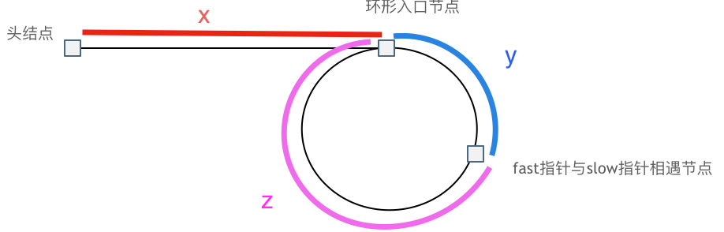

# 链表

## 链表

### 基础

##### 链表

- 非线性数据结构;
- 相同数据类型;

##### 节点结构

- 节点值;
- 下一节点的引用;

#### 头结点

- 一个虚拟节点;
- 用于链表初始化, 指向第一个结点或 null;

##### 尾节点

- 尾节点指向 null;

### 链表变形

##### 单向链表

- 节点值 + 后一节点的指针;

##### 环形链表

- 尾节点指向第一个节点;

##### 双向链表

- 节点值 +前一节点的指针 + 后一节点的指针;


### 链表操作(基于双向链表)

##### 插入

- 改变插入位置前后两个指针;
- 时间复杂度为 O(1);

##### 删除

- 改变删除位置前后两个指针;
- 双向链表时间复杂度为 O(1), 其余形式为 O(n);

##### 访问

- 时间复杂度为 O(n);

```typescript
class DoublyLinkedListNode<T> {
  value: T;
  next: DoublyLinkedListNode<T> | null;
  before: DoublyLinkedListNode<T> | null;

  constructor(
    value: T,
    next: DoublyLinkedListNode<T> | null = null,
    before: DoublyLinkedListNode<T> | null = null
  ) {
    this.value = value;
    this.next = next;
    this.before = before;
  }
}

class DoublyLinkedList<T> {
  head: DoublyLinkedListNode<T>;
  size: number;
  constructor() {
    this.head = new DoublyLinkedListNode(null as T, null, null);
    this.size = 0;
  }

  isEmpty(): boolean {
    return this.size === 0;
  }

  isLast(node: DoublyLinkedListNode<T>): boolean {
    return node.next === null;
  }

  find(
    value: T,
    callback: ((value: T) => boolean) | null = null
  ): DoublyLinkedListNode<T> | null {
    if (this.isEmpty()) return null;
    let node: DoublyLinkedListNode<T> | null = this.head
      .next as DoublyLinkedListNode<T>;
    while (node) {
      if (callback && callback(node.value)) {
        return node;
      }
      if (node.value === value) return node;
      node = node.next;
    }
    return null;
  }

  delete(node: DoublyLinkedListNode<T>): boolean {
    const beforeNode = node.before;
    if (!beforeNode) return false;
    const next = node.next;
    if (next) {
      next.before = beforeNode as DoublyLinkedListNode<T>;
    }
    beforeNode.next = node.next;
    this.size -= 1;
    return true;
  }

  insert(node: DoublyLinkedListNode<T>, position: DoublyLinkedListNode<T>) {
    const next = position.next;
    node.next = position.next;
    position.next = node;
    node.before = position;
    if (next) next.before = node;
    this.size += 1;
    return true;
  }
}
```

## 链表基础题目

### 删除排序链表中的重复元素

##### 问题

- [83](https://leetcode.cn/problems/remove-duplicates-from-sorted-list/);

##### 思路

- 遍历链表;
- 判断 current 是否和 current.next 相等;
  - 若相等, current.next = current.next.next;
  - 反之, current = current.next;

```typescript
/**
 * Definition for singly-linked list.
 * function ListNode(val, next) {
 *     this.val = (val===undefined ? 0 : val)
 *     this.next = (next===undefined ? null : next)
 * }
 */
/**
 * @param {ListNode} head
 * @return {ListNode}
 */
var deleteDuplicates = function (head) {
  if (head == null) return head;

  let current = head;
  while (current.next) {
    if (current.val === current.next.val) {
      current.next = current.next.next;
    } else {
      current = current.next;
    }
  }

  return head;
};
```

##### 复杂度

- 时间:n;
- 空间:1;

### 删除排序链表中的重复元素 2

##### 题目

- [82](https://leetcode.cn/problems/remove-duplicates-from-sorted-list-ii/);

##### 思路

- 构造哑节点 dummy 指向 head, 防止 head 就是重复元素;
- 遍历链表, current 指向当前元素, 从 dummy 开始遍历;
- 比较 current.next 和 current.next.next;
  - 如果两者相同, 使用 temp 遍历所有相同元素;
    - current.next = temp.next;
    - current = current.next;
  - 如果不同, current = current.next;
- 返回 dummy.next;

```typescript
/**
 * Definition for singly-linked list.
 * function ListNode(val, next) {
 *     this.val = (val===undefined ? 0 : val)
 *     this.next = (next===undefined ? null : next)
 * }
 */
/**
 * @param {ListNode} head
 * @return {ListNode}
 */
var deleteDuplicates = function (head) {
  const dummy = new ListNode(null, head);
  let cur = dummy;
  let pre = null;
  while (cur != null && cur.next != null) {
    if (cur.val != cur.next.val) {
      pre = cur;
      cur = cur.next;
    } else {
      while (cur.next != null && cur.val === cur.next.val) cur = cur.next;
      pre.next = cur.next;
      cur = cur.next;
    }
  }

  return dummy.next;
};
```

##### 复杂度

- 时间:n;
- 空间:1;

### 反转链表 1

##### 题目

- [206](https://leetcode.cn/problems/reverse-linked-list/);

##### 迭代思路

- 定义指针 current, pre;
  - current 指向当前元素;
  - pre 指向前一个元素;
- 更换指针顺序;
  - 定义 next = current.next;
  - current.next = pre;
  - pre = current;
  - cur = next;
- 重复以上步骤, 直至 cur = null, 此时 cur 即头结点;

```typescript
/**
 * Definition for singly-linked list.
 * function ListNode(val, next) {
 *     this.val = (val===undefined ? 0 : val)
 *     this.next = (next===undefined ? null : next)
 * }
 */
/**
 * @param {ListNode} head
 * @return {ListNode}
 */
var reverseList = function (head) {
  let pre = null;
  let cur = head;
  while (cur) {
    const next = cur.next;
    cur.next = pre;
    pre = cur;
    cur = next;
  }

  return pre;
};
```

##### 迭代复杂度

- 时间:n;
- 空间:1;

##### 递归思路

- 定义反转递归函数;
- 从 head.next 调用递归函数;
- 改变 head 和 head.next 的指向;

  - head.next.next = head.next;
  - head.next = null;

```typescript
/**
 * Definition for singly-linked list.
 * function ListNode(val, next) {
 *     this.val = (val===undefined ? 0 : val)
 *     this.next = (next===undefined ? null : next)
 * }
 */
/**
 * @param {ListNode} head
 * @return {ListNode}
 */
var reverseList = function (head) {
  if (head == null || head.next == null) return head;
  const res = reverseList(head.next);
  head.next.next = head;
  head.next = null;
  return res;
};
```

##### 递归复杂度

- 时间:n;
- 空间:n;

### 反转链表 2

##### 题目

- [92](https://leetcode.cn/problems/reverse-linked-list-ii/);

##### 思路

- 构造哑节点 dummy 指向 head;
- 从 dummy 遍历链表, 使用 index 记录元素序号;
- 定义 start, 逐步遍历至 left 前一个节点;
- 判断 left 对应节点是否为空;
- 定义 cur 指向 left, pre 指向 left - 1;
- 若 cur 不为空, 且 index 位于反转区间, 反转 cur 和 pre, 参照反转链表 1;
- 重复上一步, 直至离开反转区间或到达链表末尾;
- 连接反转区间首尾节点;
  - start.next 指向反转前的首个节点, 此时为最后一个节点, 将其指向 cur;
  - 同理 start.next = pre;

```typescript
/**
 * Definition for singly-linked list.
 * function ListNode(val, next) {
 *     this.val = (val===undefined ? 0 : val)
 *     this.next = (next===undefined ? null : next)
 * }
 */
/**
 * @param {ListNode} head
 * @param {number} left
 * @param {number} right
 * @return {ListNode}
 */
var reverseBetween = function (head, left, right) {
  const dummy = new ListNode(null, head);
  let pre = null;
  let cur = dummy;
  let index = 0;
  while (index < left) {
    pre = cur;
    cur = cur.next;
    index++;
  }

  let start = pre;
  while (index <= right && cur != null) {
    const next = cur.next;
    cur.next = pre;
    pre = cur;
    cur = next;
    index++;
  }
  start.next.next = cur;
  start.next = pre;

  return dummy.next;
};
```

##### 复杂度

- 时间: n;
- 空间: 1;

### k 个一组反转链表

##### 题目

- [25](https://leetcode.cn/problems/reverse-nodes-in-k-group/);

##### 思路

- 构造 dummy, 根据反转链表 1 构造 reverse 辅助函数;
- 向前遍历 k 次, 如果遍历期间达到链表末尾, 不反转, 反之使用 reverse 函数反转;
- 递归以上步骤;

```typescript
/**
 * Definition for singly-linked list.
 * function ListNode(val, next) {
 *     this.val = (val===undefined ? 0 : val)
 *     this.next = (next===undefined ? null : next)
 * }
 */
/**
 * @param {ListNode} head
 * @param {number} k
 * @return {ListNode}
 */
var reverseKGroup = function (head, k) {
  const reverse = (head) => {
    let pre = null;
    let cur = head;
    while (cur != null) {
      const next = cur.next;
      cur.next = pre;
      pre = cur;
      cur = next;
    }
    return pre;
  };

  const dummy = new ListNode(null, head);
  let cur = dummy;
  while (cur != null) {
    const pre = cur;
    for (let i = 0; i < k; i++) {
      cur = cur.next;
      if (cur == null) return dummy.next;
    }

    const start = pre.next;
    const next = cur.next;
    cur.next = null;
    pre.next = reverse(start);
    start.next = next;
    cur = start;
  }

  return dummy.next;
};
```

##### 复杂度

- 时间:n;
- 空间:1;

### LRU

##### 题目

- [146](https://leetcode.cn/problems/lru-cache/solutions/2456294/tu-jie-yi-zhang-tu-miao-dong-lrupythonja-czgt/);

##### 思路

- 手写;
  - 使用双向循环链表 + 哈希表;
    - 哈希表用于 O(1) 拿到节点;
    - 存储 [node.key, node];
  - 添加 dummy 节点, 指向 head 和被 tail 指向;
  - 操作;
    - get;
      - 哈希表存在, 返回 node, 反之返回 -1;
      - 将该节点移至表尾;
    - put;
      - 哈希表不存在, 表尾添加节点, 若超出容量, 删除表头;
      - 哈希表存在, 跟新节点值, 将该节点移至表尾;
- Map 数据结构;
  - Map 属性顺序根据插入顺序排列;

```typescript
const ListNode = function (key, val, pre, next) {
  this.key = key;
  this.val = val;
  this.pre = pre || null;
  this.next = next || null;
};

/**
 * @param {number} capacity
 */
var LRUCache = function (capacity) {
  this.capacity = capacity;
  this.dummy = new ListNode(0, -1);
  this.dummy.pre = this.dummy.next = this.dummy;
  this.hash = new Map();
};

LRUCache.prototype.remove = function (node) {
  node.pre.next = node.next;
  node.next.pre = node.pre;
};

LRUCache.prototype.push = function (node) {
  const tail = this.dummy.pre;
  tail.next = node;
  node.pre = tail;
  node.next = this.dummy;
  this.dummy.pre = node;
};

/**
 * @param {number} key
 * @return {number}
 */
LRUCache.prototype.get = function (key) {
  if (this.hash.has(key)) {
    const node = this.hash.get(key);
    this.remove(node);
    this.push(node);
    return node.val;
  }
  return -1;
};

/**
 * @param {number} key
 * @param {number} value
 * @return {void}
 */
LRUCache.prototype.put = function (key, value) {
  if (this.hash.has(key)) {
    const node = this.hash.get(key);
    this.remove(node);
    this.push(node);
    node.val = value;
    return;
  }
  const node = new ListNode(key, value, null, null);
  this.push(node);
  this.hash.set(key, node);
  if (this.hash.size > this.capacity) {
    const head = this.dummy.next;
    this.remove(head);
    this.hash.delete(head.key);
  }
};

/**
 * @param {number} capacity
 */
var LRUCache = function (capacity) {
  this.map = new Map();
  this.size = capacity;
};

/**
 * @param {number} key
 * @return {number}
 */
LRUCache.prototype.get = function (key) {
  if (this.map.has(key)) {
    const value = this.map.get(key);
    this.map.delete(key);
    this.map.set(key, value);
    return value;
  }
  return -1;
};

/**
 * @param {number} key
 * @param {number} value
 * @return {void}
 */
LRUCache.prototype.put = function (key, value) {
  if (this.map.has(key)) {
    this.map.delete(key);
  }
  this.map.set(key, value);
  if (this.map.size > this.size) {
    const key = this.map.keys().next().value;
    this.map.delete(key);
  }
};

/**
 * Your LRUCache object will be instantiated and called as such:
 * var obj = new LRUCache(capacity)
 * var param_1 = obj.get(key)
 * obj.put(key,value)
 */
```

##### 复杂度

- 时间:1;
- 空间:n;

### 奇偶链表

##### 题目

- [328](https://leetcode.cn/problems/odd-even-linked-list/);

##### 思路

- 使用 odd 和 even 表示奇数链表和偶数链表;
- 使用 isOdd 表示当前节点 cur 为奇数还是偶数节点;

```typescript
/**
 * Definition for singly-linked list.
 * function ListNode(val, next) {
 *     this.val = (val===undefined ? 0 : val)
 *     this.next = (next===undefined ? null : next)
 * }
 */
/**
 * @param {ListNode} head
 * @return {ListNode}
 */
var oddEvenList = function (head) {
  if (head == null || head.next == null || head.next.next == null) return head;
  let oddHead = head;
  let evenHead = head.next;
  let odd = head;
  let even = evenHead;
  let cur = evenHead.next;
  let isOdd = true;

  while (cur != null) {
    if (isOdd) {
      odd.next = cur;
      odd = cur;
    } else {
      even.next = cur;
      even = cur;
    }
    isOdd = !isOdd;
    cur = cur.next;
  }
  odd.next = evenHead;
  even.next = null;

  return oddHead;
};
```

##### 复杂度

- 时间: n;
- 空间: 1;

### 复制带随机指针的链表

##### 题目

- [138](https://leetcode.cn/problems/copy-list-with-random-pointer/);

##### 思路

- 遍历链表, 仅建立新节点, 使用哈希表建立旧-新节点映射;
  - 哈希表使用 Map, 因为 object 不能使用 object 作为键;
- 遍历链表, 处理 next 和 random 指针;

```typescript
/**
 * // Definition for a _Node.
 * function _Node(val, next, random) {
 *    this.val = val;
 *    this.next = next;
 *    this.random = random;
 * };
 */

/**
 * @param {_Node} head
 * @return {_Node}
 */
var copyRandomList = function (head) {
  const hash = new Map();
  let cur = head;
  while (cur != null) {
    const node = new ListNode(cur.val);
    hash.set(cur, node);
    cur = cur.next;
  }

  cur = head;
  while (cur != null) {
    hash.get(cur).next = hash.get(cur.next) || null;
    hash.get(cur).random = hash.get(cur.random) || null;
    cur = cur.next;
  }

  return hash.get(head);
};
```

##### 复杂度

- 时间:n;
- 空间:n;

### 旋转链表

##### 题目

- [61](https://leetcode.cn/problems/rotate-list/);

##### 思路

- 首先将链表连接成环;
- 其次倒数第 k%count 个节点为断开链表的头结点;
  - 从 head 出发, 遍历 count - k%count 次即可到达该节点 res;
  - 使用 pre 保存其上一个节点, pre.next = null, 返回 res;

```typescript
/**
 * Definition for singly-linked list.
 * function ListNode(val, next) {
 *     this.val = (val===undefined ? 0 : val)
 *     this.next = (next===undefined ? null : next)
 * }
 */
/**
 * @param {ListNode} head
 * @param {number} k
 * @return {ListNode}
 */
var rotateRight = function (head, k) {
  if (head == null) return head;

  let cur = head;
  let count = 1;
  while (cur.next != null) {
    count++;
    cur = cur.next;
  }
  cur.next = head;

  k %= count;
  let n = count - k;
  let pre = null;
  cur = head;
  while (n != 0) {
    n--;
    pre = cur;
    cur = cur.next;
  }
  pre.next = null;

  return cur;
};
```

##### 复杂度

- 时间:n;
- 空间:1;

## 链表排序

### 基础

##### 不适合链表的排序

- 希尔排序;
  - 希尔排序中需要进行 i + gap 的操作;
  - 链表不支持随机访问的特性;
- 堆排序;
  - 堆排序本质上是一颗完全二叉树;
  - 适合使用数组进行存储, 可通过下标确定父子节点;
  - 链表不支持随机访问, 寻找父子节点费时;

### 插入排序

##### 问题

- [147](https://leetcode.cn/problems/insertion-sort-list/);

##### 思路

- 定义指向 header 的 dummy 指针;
- 定义指向已排序部分的最后一个节点 sort;
- 定义当前节点 cur 和前一节点 pre;

```typescript
/**
 * Definition for singly-linked list.
 * function ListNode(val, next) {
 *     this.val = (val===undefined ? 0 : val)
 *     this.next = (next===undefined ? null : next)
 * }
 */
/**
 * @param {ListNode} head
 * @return {ListNode}
 */
var insertionSortList = function (head) {
  const dummy = new ListNode(-1, head);
  let sort = head;
  let cur = head.next;
  while (cur != null) {
    if (cur.val >= sort.val) {
      sort = sort.next;
    } else {
      let pre = dummy;
      while (pre.next.val < cur.val) {
        pre = pre.next;
      }
      sort.next = cur.next;
      cur.next = pre.next;
      pre.next = cur;
    }
    cur = sort.next;
  }
  return dummy.next;
};
```

### 归并排序

##### 问题

- [148](https://leetcode.cn/problems/sort-list/);

##### 思路

```typescript
/**
 * Definition for singly-linked list.
 * function ListNode(val, next) {
 *     this.val = (val===undefined ? 0 : val)
 *     this.next = (next===undefined ? null : next)
 * }
 */
/**
 * @param {ListNode} head
 * @return {ListNode}
 */
var sortList = function (head) {
  const merge = (left, right) => {
    const dummy = new ListNode(0);
    let cur = dummy;
    while (left && right) {
      if (left.val < right.val) {
        cur.next = left;
        left = left.next;
      } else {
        cur.next = right;
        right = right.next;
      }
      cur = cur.next;
    }
    if (left) {
      cur.next = left;
    }
    if (right) {
      cur.next = right;
    }

    return dummy.next;
  };

  const mergeSort = (head) => {
    if (head == null || head.next == null) return head;
    let slow = head;
    let fast = head;
    let pre = null;
    while (fast && fast.next) {
      pre = slow;
      slow = slow.next;
      fast = fast.next.next;
    }
    pre.next = null;
    const left = mergeSort(head);
    const right = mergeSort(slow);
    return merge(left, right);
  };
  const res = mergeSort(head);
  return res;
};
```

## 链表排序题目

### 合并两有序链表

##### 题目

- [21](https://leetcode.cn/problems/merge-two-sorted-lists/);

##### 思路

```typescript
/**
 * Definition for singly-linked list.
 * function ListNode(val, next) {
 *     this.val = (val===undefined ? 0 : val)
 *     this.next = (next===undefined ? null : next)
 * }
 */
/**
 * @param {ListNode} list1
 * @param {ListNode} list2
 * @return {ListNode}
 */
var mergeTwoLists = function (list1, list2) {
  const dummy = new ListNode(0);
  let cur = dummy;
  while (list1 && list2) {
    if (list1.val < list2.val) {
      cur.next = list1;
      list1 = list1.next;
    } else {
      cur.next = list2;
      list2 = list2.next;
    }
    cur = cur.next;
  }
  if (list1) cur.next = list1;
  if (list2) cur.next = list2;
  return dummy.next;
};
```

##### 复杂度

- 时间:n;
- 空间:1;

### 排序奇升偶降链表

##### 题目

- 给定一个链表, 此链表奇数位为升序排列, 偶数位为降序排列;
- 如何能实现链表从小到大;

##### 思路

- 首先基于奇偶链表思路, 获取奇数链表和偶数链表;
- 反转偶数链表;
- 合并两个有序链表;

##### 复杂度

- 时间:n;
- 空间:1;

## 链表双指针

### 起点不一致的快慢指针

##### 思路

- 定义 slow, fast 指向 head;
- fast 先右移 n 步;
- 其次同时移动 slow, fast, 直至 fast = null;

```python
slow = head
fast = head

while n:
    fast = fast.next
    n -= 1
while fast.next:
    fast = fast.next
    slow = slow.next

```

##### 适用范围

- 对于链表倒数第 k 个节点进行操作;

### 步长不一致的快慢指针

##### 思路

- 定义 slow, fast 指向 head;
- 其次同时移动 slow, fast, 但移动不长不一致;
- 直至 fast 移动至链表尾部;

```python
fast = head
slow = head

while fast and fast.next:
    slow = slow.next
    fast = fast.next.next
```

##### 使用场景

- 寻找链表中点;
- 判断链表是否有环;
- 寻找两个链表交点;

### 分离双指针

##### 思路

- 定义 l1, l2 指向两个链表;
- 满足不同条件, 移动不同指针;
- 一个链表遍历完成, 或满足特殊条件跳出孙欢;

```python
left_1 = list1
left_2 = list2

while left_1 and left_2:
    if 一定条件 1:
        left_1 = left_1.next
        left_2 = left_2.next
    elif 一定条件 2:
        left_1 = left_1.next
    elif 一定条件 3:
        left_2 = left_2.next
```

##### 适用范围

- 有序链表合并;

## 链表双指针题目

### 链表中倒数第 k 个节点

##### 题目

- [lcr140](https://leetcode.cn/problems/lian-biao-zhong-dao-shu-di-kge-jie-dian-lcof/);

##### 思路

- 双指针;
  - 使用起点不一致的快慢指针;
  - fast 先行 n 步;
  - fast 为最后一个节点时, slow 指向倒数第 N 个节点;
- 直接遍历;
  - 从 head 出发, 走 n-k 步即倒数第 k 个节点;

```typescript
/**
 * Definition for singly-linked list.
 * function ListNode(val, next) {
 *     this.val = (val===undefined ? 0 : val)
 *     this.next = (next===undefined ? null : next)
 * }
 */
/**
 * @param {ListNode} head
 * @param {number} cnt
 * @return {ListNode}
 */
var trainingPlan = function (head, cnt) {
  const dummy = new ListNode(-1, head);
  let slow = dummy;
  let fast = dummy;
  while (cnt !== 0) {
    fast = fast.next;
    cnt--;
  }
  while (fast != null) {
    slow = slow.next;
    fast = fast.next;
  }

  return slow;
};
```

##### 复杂度

- 时间:n;
- 空间:1;

### 删除链表的倒数第 N 个节点

##### 题目

- [19](https://leetcode.cn/problems/remove-nth-node-from-end-of-list/);

##### 思路

- 使用起点不一致的快慢指针;
- fast 先行 n 步;
- fast 为最后一个节点时, slow 指向倒数第 N 个节点;

```typescript
/**
 * Definition for singly-linked list.
 * function ListNode(val, next) {
 *     this.val = (val===undefined ? 0 : val)
 *     this.next = (next===undefined ? null : next)
 * }
 */
/**
 * @param {ListNode} head
 * @param {number} n
 * @return {ListNode}
 */
var removeNthFromEnd = function (head, n) {
  const dummy = new ListNode(-1, head);
  let left = dummy;
  let right = dummy;
  while (n !== 0) {
    right = right.next;
    n--;
  }
  while (right.next != null) {
    left = left.next;
    right = right.next;
  }
  left.next = left.next.next;
  return dummy.next;
};
```

##### 复杂度

- 时间:n;
- 空间:1;

### 链表的中间节点

##### 题目

- [876](https://leetcode.cn/problems/middle-of-the-linked-list/);

##### 思路

- 使用快慢指针 slow, fast;
- 每次移动, slow 1 步, fast 2 步;

```typescript
/**
 * Definition for singly-linked list.
 * function ListNode(val, next) {
 *     this.val = (val===undefined ? 0 : val)
 *     this.next = (next===undefined ? null : next)
 * }
 */
/**
 * @param {ListNode} head
 * @return {ListNode}
 */
var middleNode = function (head) {
  let slow = head;
  let fast = head;
  while (fast && fast.next) {
    slow = slow.next;
    fast = fast.next.next;
  }
  return slow;
};
```

##### 复杂度

- 时间:n;
- 空间:1;

### 环形链表 1

##### 题目

- [141](https://leetcode.cn/problems/linked-list-cycle/);

##### 思路

- 使用快慢指针 fast, slow;
- 每次移动, slow 1 步, fast 2 步;
- 如果 slow 和 fast 可以相遇, 即说明有环;
- 如果 fast 到达链表尾部, 无环;

```typescript
/**
 * Definition for singly-linked list.
 * function ListNode(val) {
 *     this.val = val;
 *     this.next = null;
 * }
 */

/**
 * @param {ListNode} head
 * @return {boolean}
 */
var hasCycle = function (head) {
  let slow = head,
    fast = head;
  while (fast && fast.next) {
    slow = slow.next;
    fast = fast.next.next;
    if (slow === fast) return true;
  }
  return false;
};
```

##### 复杂度

- 时间:n;
- 空间:1;

### 环形链表 2

##### 题目

- [142](https://leetcode.cn/problems/linked-list-cycle-ii/);

##### 思路

- 基于判断链表是否有环;
- 此时 slow 走了 x + y 步, fast 走了 x + y + n(y+z) 步;
- 又因为 step(fast) = 2 \* step(slow), 故 x = (n-1)(y+z) + z;
- 当 n = 1 时, x = z;
- 意味着从头结点出发一个指针, 相遇节点出发一个指针, 步长为 1, 两者相遇时, 即环形入口;



```typescript
/**
 * Definition for singly-linked list.
 * function ListNode(val) {
 *     this.val = val;
 *     this.next = null;
 * }
 */

/**
 * @param {ListNode} head
 * @return {ListNode}
 */
var detectCycle = function (head) {
  let slow = head,
    fast = head;
  while (fast && fast.next) {
    slow = slow.next;
    fast = fast.next.next;
    if (slow === fast) {
      let res = head;
      while (res !== slow) {
        res = res.next;
        slow = slow.next;
      }
      return res;
    }
  }
  return null;
};
```

##### 复杂度

- 时间:n;
- 空间:1;

### 相交链表

##### 题目

- [160](https://leetcode.cn/problems/intersection-of-two-linked-lists/);

##### 思路

- 如果链表相交, 从相交到结束必定有等长且相等的节点;
- 首先求两个链表长度, 计算其差值 a;
- 定义 l1, l2 指向 head, 将较长链表首先移动 a 个节点;
- 依次移动, 比较 l1 和 l2 是否相同, 直至到达链表末尾;


```typescript
/**
 * Definition for singly-linked list.
 * function ListNode(val) {
 *     this.val = val;
 *     this.next = null;
 * }
 */

/**
 * @param {ListNode} headA
 * @param {ListNode} headB
 * @return {ListNode}
 */
var getIntersectionNode = function (headA, headB) {
  if (headA == null || headB == null) return null;
  let lenA = 0;
  let lenB = 0;
  let tempA = headA;
  let tempB = headB;
  while (tempA != null) {
    tempA = tempA.next;
    lenA++;
  }
  while (tempB != null) {
    tempB = tempB.next;
    lenB++;
  }

  tempA = headA;
  tempB = headB;
  let sub = Math.abs(lenA - lenB);
  while (sub > 0) {
    if (lenA > lenB) {
      tempA = tempA.next;
    } else {
      tempB = tempB.next;
    }
    sub--;
  }

  while (tempA != null && tempB != null && tempA !== tempB) {
    tempA = tempA.next;
    tempB = tempB.next;
  }

  return tempA;
};
```

##### 复杂度

- 时间: m + n;
- 空间: 1;

### 重排链表

##### 题目

- [143](https://leetcode.cn/problems/reorder-list/);

##### 思路

- 链表无法随机访问;
- 首先基于数组将链表转换为线性表;
- 其次根据顺序重新建立链表;
- 数组长度奇数和偶数需要单独判断;

```typescript
/**
 * Definition for singly-linked list.
 * function ListNode(val, next) {
 *     this.val = (val===undefined ? 0 : val)
 *     this.next = (next===undefined ? null : next)
 * }
 */
/**
 * @param {ListNode} head
 * @return {void} Do not return anything, modify head in-place instead.
 */
var reorderList = function (head) {
  const arr = [];
  let cur = head;
  while (cur != null) {
    arr.push(cur);
    cur = cur.next;
  }

  cur = head;
  let left = 1;
  let right = arr.length - 1;
  while (left <= right) {
    cur.next = arr[right];
    cur = cur.next;
    cur.next = arr[left];
    cur = cur.next;
    right--;
    left++;
  }
  cur.next = null;

  return head;
};
```

##### 复杂度

- 时间:n;
- 空间:n;

### 两数相加 1

##### 题目

- [2](https://leetcode.cn/problems/add-two-numbers/);

##### 思路

```typescript
/**
 * Definition for singly-linked list.
 * function ListNode(val, next) {
 *     this.val = (val===undefined ? 0 : val)
 *     this.next = (next===undefined ? null : next)
 * }
 */
/**
 * @param {ListNode} l1
 * @param {ListNode} l2
 * @return {ListNode}
 */
var addTwoNumbers = function (l1, l2) {
  const dummy = new ListNode(0);
  let cur = dummy;
  let carry = 0;
  while (l1 || l2 || carry) {
    let value1 = 0;
    let value2 = 0;
    if (l1) {
      value1 = l1.val;
      l1 = l1.next;
    }
    if (l2) {
      value2 = l2.val;
      l2 = l2.next;
    }
    let sum = value1 + value2 + carry;
    if (sum >= 10) {
      carry = 1;
      sum %= 10;
    } else {
      carry = 0;
    }
    cur.next = new ListNode(sum);
    cur = cur.next;
  }

  return dummy.next;
};
```

##### 复杂度

- 时间:max(m,n);
- 空间:1;

### 两数相加 2

##### 题目

- [445](https://leetcode.cn/problems/add-two-numbers-ii/);

##### 思路

```typescript
/**
 * Definition for singly-linked list.
 * function ListNode(val, next) {
 *     this.val = (val===undefined ? 0 : val)
 *     this.next = (next===undefined ? null : next)
 * }
 */
/**
 * @param {ListNode} l1
 * @param {ListNode} l2
 * @return {ListNode}
 */
var addTwoNumbers = function (l1, l2) {
  const numList1 = [];
  const numList2 = [];
  let cur = l1;
  while (cur != null) {
    numList1.push(cur.val);
    cur = cur.next;
  }
  cur = l2;
  while (cur != null) {
    numList2.push(cur.val);
    cur = cur.next;
  }

  let res = null;
  let carry = 0;
  while (numList1.length !== 0 || numList2.length !== 0 || carry !== 0) {
    const v1 = numList1.pop() || 0;
    const v2 = numList2.pop() || 0;
    let sum = v1 + v2 + carry;
    if (sum >= 10) {
      carry = Math.floor(sum / 10);
      sum %= 10;
    } else {
      carry = 0;
    }

    const node = new ListNode(sum);
    node.next = res;
    res = node;
  }

  return res;
};
```

##### 复杂度

- 时间: n;
- 空间: n;

### 寻找重复数

##### 题目

- [287](https://leetcode.cn/problems/find-the-duplicate-number/);

##### 思路

- 把 nums 看作一个特殊的链表, 索引 i 表示第 i 个节点, nums[i] 表示其指向的下一个节点, 即 nums[nums[i]];
- 存在一个重复的元素, 即链表中存在环, 此时便变为环形链表 2 问题;

```typescript
/**
 * @param {number[]} nums
 * @return {number}
 */
var findDuplicate = function (nums) {
  let slow = 0;
  let fast = 0;
  while (1) {
    slow = nums[slow];
    fast = nums[nums[fast]];
    if (slow === fast) break;
  }

  let finder = 0;
  while (finder !== slow) {
    slow = nums[slow];
    finder = nums[finder];
  }

  return finder;
};
```

##### 复杂度

- 时间:nlogn;
- 空间:1;

### 分隔链表

##### 题目

- [86](https://leetcode.cn/problems/partition-list/description/);

##### 思路

- 创建两个 dummy, 一个存储所有小于 x 的节点, 一个存储所有大于等于 x 的节点;
- 最后连接两个链表;

```typescript
/**
 * Definition for singly-linked list.
 * function ListNode(val, next) {
 *     this.val = (val===undefined ? 0 : val)
 *     this.next = (next===undefined ? null : next)
 * }
 */
/**
 * @param {ListNode} head
 * @param {number} x
 * @return {ListNode}
 */
var partition = function (head, x) {
  const small = new ListNode();
  const big = new ListNode();

  let cur = head;
  let curSmall = small;
  let curBig = big;
  while (cur != null) {
    if (cur.val >= x) {
      curBig.next = cur;
      curBig = curBig.next;
    } else {
      curSmall.next = cur;
      curSmall = curSmall.next;
    }
    cur = cur.next;
  }
  curBig.next = null;
  curSmall.next = big.next;

  return small.next;
};
```

##### 复杂度

- 时间: n;
- 空间: n;

### 回文链表

##### 题目

- [234](https://leetcode.cn/problems/palindrome-linked-list/);

##### 思路

- 根据链表创建数组;
- 使用双指针判断数组是否回文即可;

```typescript
/**
 * Definition for singly-linked list.
 * function ListNode(val, next) {
 *     this.val = (val===undefined ? 0 : val)
 *     this.next = (next===undefined ? null : next)
 * }
 */
/**
 * @param {ListNode} head
 * @return {boolean}
 */
var isPalindrome = function (head) {
  const arr = [];
  let cur = head;
  while (cur != null) {
    arr.push(cur.val);
    cur = cur.next;
  }

  let left = 0;
  let right = arr.length - 1;
  while (left < right) {
    if (arr[left] !== arr[right]) return false;
    left++;
    right--;
  }

  return true;
};
```

##### 复杂度

- 时间:n;
- 空间:n;
