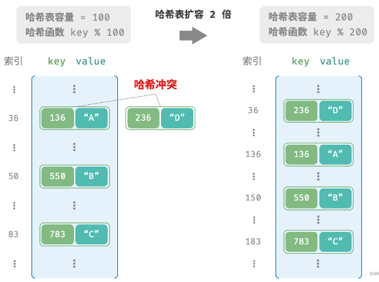

# 散列表

## 哈希表

### 基础

##### 哈希表

- 建立 key-value 映射;
- 在 O(1) 时间查找;

##### 时间复杂度

|      | 时间复杂度 |
| ---- | ---------- |
| 查找 | 1          |
| 插入 | 1          |
| 删除 | 1          |

### 哈希算法

##### 哈希算法的目标

- 确定性;
- 效率高;
- 平均分布;

##### 应用领域

- 密码存储;
- 数据完整性检查;

##### 安全标准

- 抗碰撞性;
- 雪崩效应;

##### 常用的哈希算法

|          | MD5                            | SHA-1            | SHA-2                        | SHA-3                |
| -------- | ------------------------------ | ---------------- | ---------------------------- | -------------------- |
| 推出时间 | 1992                           | 1995             | 2002                         | 2008                 |
| 输出长度 | 128 bits                       | 160 bits         | 256 / 512 bits               | 224/256/384/512 bits |
| 哈希冲突 | 较多                           | 较多             | 很少                         | 很少                 |
| 安全等级 | 低, 已被成功攻击               | 低, 已被成功攻击 | 高                           | 高                   |
| 应用     | 已被弃用, 仍用于数据完整性检查 | 已被弃用         | 加密货币交易验证, 数字签名等 | 可用于替代 SHA-2     |

### 数组实现

##### 数组

- 数组的每一个空位称作桶;
- 一个桶存储一个键值对;

##### 哈希函数

- 将一个较大的输入空间映射到较小的输出空间;
- 哈希表中即将 key 映射到 index;

##### 哈希计算

- 通过哈希函数得到哈希值;
- 基于哈希值对数组长度取模;

```json
index = hash(key) % capacity
```

## 哈希冲突和哈希扩容

### 基础

##### 哈希冲突

- 多个输入对应相同输出;

##### 哈希扩容

- 减少哈希冲突;
- 哈希表扩容计算开销极大;
- 尽量预留足够大的哈希表容量;



##### 负载因子

- 哈希表元素数量 / 桶数量;
- 当达到负载因子时, 触发哈希扩容;
- 简单的扩容策略;
  - 负载因子到达 0.75, 哈希表容量乘 2;

### 链式地址

##### 链式地址

- 数组存储一个链表节点;
- 哈希冲突的键值对存储在同一链表中;

##### 缺点

- 占用空间大;
- 查询效率低;

### 开放寻址

#### 线性探测

##### 插入元素

- 获取数组索引后, 若桶已存在元素;
- 根据设置步长向后线性遍历直至找到空位;

##### 查找元素

- 若哈希冲突;
- 根据设置步长向后线性遍历直至找到元素;
- 若遇到空位, 则不存在哈希表中;

##### 删除元素

- 不能直接删除元素;
- 需要使用一个标识位表示空位;

#### 多次哈希

##### 多次哈希

- 使用多个哈希函数;
- 若出现哈希冲突, 使用下一个哈希函数;

## 常用操作(基于链式地址)

##### 查询

```typescript
function has(key: string) {
  const index = this.hash(key);
  const linkedList = this.bucket[index];
  const result = linkedList.find(
    { key } as HashTableInterface,
    (object: object) => {
      const o = object as HashTableInterface;
      if (o.key === key) return true;
      else return false;
    }
  );
  if (result) {
    return true;
  } else {
    return false;
  }
}

function get(key: string) {
  const index = this.hash(key);
  const linkedList = this.bucket[index];
  const result = linkedList.find(
    { key } as HashTableInterface,
    (object: object) => {
      const o = object as HashTableInterface;
      if (o.key === key) return true;
      else return false;
    }
  );
  if (result) {
    return result.value.value;
  } else {
    return null;
  }
}
```

##### 添加

```typescript
function set(key: string, value: unknown) {
  const index = this.hash(key);
  const linkedList = this.bucket[index];
  const result = linkedList.find({ key, value }, (object: object) => {
    const o = object as HashTableInterface;
    if (o.key === key) return true;
    else return false;
  });
  if (result) {
    result.value = { key, value };
  } else {
    const node = new DoublyLinkedListNode({ key, value });
    linkedList.insert(node, linkedList.head);
  }
}
```

##### 删除

```typescript
function remove(key: string) {
  const index = this.hash(key);
  const linkedList = this.bucket[index];
  const result = linkedList.find(
    { key } as HashTableInterface,
    (object: object) => {
      const o = object as HashTableInterface;
      if (o.key === key) return true;
      else return false;
    }
  );
  if (result) {
    linkedList.delete(result);
    return result.value;
  } else {
    return null;
  }
}
```

##### 遍历

- 遍历键值对;
- 遍历键;
- 遍历值;

```typescript
function keys() {
  const keys = [];
  for (let index = 0; index < this.capacity; index++) {
    const linkedList = this.bucket[index];
    let currentNode: DoublyLinkedListNode<HashTableInterface> | null =
      linkedList.head.next;
    while (currentNode) {
      keys.push(currentNode.value.key);
      currentNode = currentNode.next;
    }
  }
  return keys;
}

function values() {
  const values = [];
  for (let index = 0; index < this.capacity; index++) {
    const linkedList = this.bucket[index];
    let currentNode: DoublyLinkedListNode<HashTableInterface> | null =
      linkedList.head.next;
    while (currentNode) {
      values.push(currentNode.value.value);
      currentNode = currentNode.next;
    }
  }
  return values;
}

function entries() {
  const entries = [];
  for (let index = 0; index < this.capacity; index++) {
    const linkedList = this.bucket[index];
    let currentNode: DoublyLinkedListNode<HashTableInterface> | null =
      linkedList.head.next;
    while (currentNode) {
      entries.push([currentNode.value.key, currentNode.value.value]);
      currentNode = currentNode.next;
    }
  }
  return entries;
}
```
