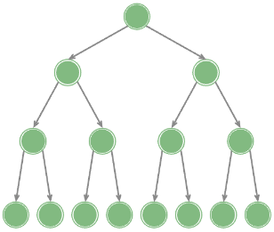
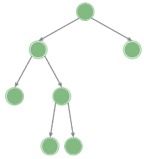
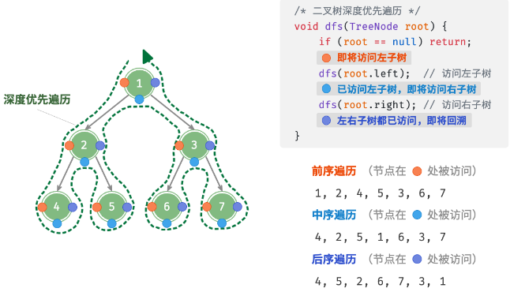

# 树

## 二叉树

### 基础

##### 二叉树

- 非线性数据结构;
- 最多两个子节点, 依次为左子节点和右子节点;
- 对应的树称为左子树和右子树;

##### 常见术语

- 根节点: 树的顶部节点;
- 叶节点: 没有子节点的节点;
- 层: 从顶到底递增, 根节点为 1;
- 度: 节点的子节点数量;
- 边: 连接两个节点的线段;
- 高度: 该节点到最远节点的边的数量;
- 深度: 根节点到该节点的边的数量;


### 常见二叉树类型

##### 完美二叉树

- 所有层的节点被填满;



##### 完全二叉树

- 只有最底层的节点没有填满;
- 最底层节点向左靠;


##### 完满二叉树

- 除叶节点之外的节点都有两个子节点;



##### 平衡二叉树

- 左子树和右子树高度之差不超过 1;


### 二叉树的退化

##### 二叉树的退化

- 所有节点偏向一侧, 退化为链表;


### 二叉树数组表示

##### 完美二叉树


##### 任意二叉树


##### 优点

- 遍历, 访问速度快;
- 允许随机访问;

##### 缺点

- 不适合存储过大的树;
- 插入和删除效率低;
- 存在大量空节点时, 空间利用率低;

### 二叉树计算公式

##### 二叉树查找路径

- 不管他是前序中序还是后序;
- 按照他的排序建树即可, 判断二叉树是否有效;

##### 节点公式

- 叶子节点数: 叶子节点数 = 度为 2 的节点数 + 1, 度为 1 的节点数量未知;
- 节点总数;
  - 总数最多 2^k-1;
  - 每层最多 2^(k-1);
- 最小深度: `log_2^{N+1}`;

## 二叉树遍历

### 层序遍历

- 逐层访问;
- 广度优先遍历;
- 时间复杂度为 O(n);
- 空间复杂度为 O(n);


### 前序, 中序, 后序遍历

##### 概述

- 深度优先遍历;
- 根据根节点的访问顺序, 分为前序, 中序和后序;
- 时间复杂度为 O(n);
- 空间复杂度为 O(n);

##### 遍历顺序

- 前序: 根节点 - 左子树 - 右子树;
- 中序: 左子树 - 根节点 - 右子树;
- 后序: 左子树 - 右子树 - 根节点;



##### 模板代码

```typescript
var traversal = function (root) {
  if (root == null) return [];
  const res = [];
  const stack = [];
  let node = root;
  while (node || stack.length! == 0) {
    while (node != null) {
      stack.push(node);
      node = node.left;
    }
    node = stack.pop();
    node = node.right;
  }
  return res;
};
```

## 二叉树遍历题目

### 二叉树前序遍历

##### 题目

- [144](https://leetcode.cn/problems/binary-tree-preorder-traversal/);

##### 思路

```typescript
/**
 * Definition for a binary tree node.
 * function TreeNode(val, left, right) {
 *     this.val = (val===undefined ? 0 : val)
 *     this.left = (left===undefined ? null : left)
 *     this.right = (right===undefined ? null : right)
 * }
 */
/**
 * @param {TreeNode} root
 * @return {number[]}
 */
var preorderTraversal = function (root) {
  if (root == null) return [];
  const res = [];

  const preorder = (node) => {
    res.push(node.val);
    if (node.left != null) {
      preorder(node.left);
    }
    if (node.right != null) {
      preorder(node.right);
    }
  };

  preorder(root);

  return res;
};
```

```typescript
/**
 * Definition for a binary tree node.
 * function TreeNode(val, left, right) {
 *     this.val = (val===undefined ? 0 : val)
 *     this.left = (left===undefined ? null : left)
 *     this.right = (right===undefined ? null : right)
 * }
 */
/**
 * @param {TreeNode} root
 * @return {number[]}
 */
var preorderTraversal = function (root) {
  const res = [];
  const stack = [];
  let node = root;
  while (node || stack.length! == 0) {
    while (node != null) {
      res.push(node.val);
      stack.push(node);
      node = node.left;
    }
    node = stack.pop();
    node = node.right;
  }
  return res;
};
```

### 二叉树的中序遍历

##### 题目

- [94](https://leetcode.cn/problems/binary-tree-inorder-traversal/);

##### 思路

```typescript
/**
 * Definition for a binary tree node.
 * function TreeNode(val, left, right) {
 *     this.val = (val===undefined ? 0 : val)
 *     this.left = (left===undefined ? null : left)
 *     this.right = (right===undefined ? null : right)
 * }
 */
/**
 * @param {TreeNode} root
 * @return {number[]}
 */
var inorderTraversal = function (root) {
  if (root == null) return [];
  const res = [];

  const preorder = (node) => {
    if (node.left != null) {
      preorder(node.left);
    }
    res.push(node.val);
    if (node.right != null) {
      preorder(node.right);
    }
  };

  preorder(root);

  return res;
};
```

```typescript
/**
 * Definition for a binary tree node.
 * function TreeNode(val, left, right) {
 *     this.val = (val===undefined ? 0 : val)
 *     this.left = (left===undefined ? null : left)
 *     this.right = (right===undefined ? null : right)
 * }
 */
/**
 * @param {TreeNode} root
 * @return {number[]}
 */
var preorderTraversal = function (root) {
  const res = [];
  const stack = [];
  let node = root;
  while (node || stack.length! == 0) {
    while (node != null) {
      stack.push(node);
      node = node.left;
    }
    node = stack.pop();
    res.push(node.val);
    node = node.right;
  }
  return res;
};
```

### 二叉树的后序遍历

##### 题目

- [145](https://leetcode.cn/problems/binary-tree-postorder-traversal/);

##### 思路

- 前序遍历: 中 - 左 - 右;
- 后序遍历: 左 - 右 - 中;
- 基于前序遍历, 遍历 "中 - 右 - 左";
- 最后将结果倒序即后序遍历;

```typescript
/**
 * Definition for a binary tree node.
 * function TreeNode(val, left, right) {
 *     this.val = (val===undefined ? 0 : val)
 *     this.left = (left===undefined ? null : left)
 *     this.right = (right===undefined ? null : right)
 * }
 */
/**
 * @param {TreeNode} root
 * @return {number[]}
 */
var postorderTraversal = function (root) {
  if (root == null) return [];
  const res = [];

  const preorder = (node) => {
    if (node.left != null) {
      preorder(node.left);
    }
    if (node.right != null) {
      preorder(node.right);
    }
    res.push(node.val);
  };

  preorder(root);

  return res;
};
```

```typescript
/**
 * Definition for a binary tree node.
 * function TreeNode(val, left, right) {
 *     this.val = (val===undefined ? 0 : val)
 *     this.left = (left===undefined ? null : left)
 *     this.right = (right===undefined ? null : right)
 * }
 */
/**
 * @param {TreeNode} root
 * @return {number[]}
 */
var postorderTraversal = function (root) {
  const res = [];
  const stack = [];
  let cur = root;
  while (stack.length !== 0 || cur != null) {
    while (cur != null) {
      res.push(cur.val);
      stack.push(cur);
      cur = cur.right;
    }
    cur = stack.pop();
    cur = cur.left;
  }

  return res.reverse();
};
```

### 二叉树的层序遍历

##### 题目

- [102](https://leetcode.cn/problems/binary-tree-level-order-traversal/);

##### 思路

```typescript
/**
 * Definition for a binary tree node.
 * function TreeNode(val, left, right) {
 *     this.val = (val===undefined ? 0 : val)
 *     this.left = (left===undefined ? null : left)
 *     this.right = (right===undefined ? null : right)
 * }
 */
/**
 * @param {TreeNode} root
 * @return {number[][]}
 */
var levelOrder = function (root) {
  if (root == null) return [];
  const res = [];
  const queue = [root];

  while (queue.length !== 0) {
    let size = queue.length;
    const level = [];

    while (size > 0) {
      const node = queue.shift();
      level.push(node.val);
      if (node.left != null) {
        queue.push(node.left);
      }
      if (node.right != null) {
        queue.push(node.right);
      }
      size--;
    }

    level.length !== 0 && res.push(level);
  }

  return res;
};
```

##### 复杂度

- 时间: n;
- 空间: n;

### 二叉树的锯齿形层序遍历

##### 题目

- [103](https://leetcode.cn/problems/binary-tree-zigzag-level-order-traversal/);

##### 思路

- 设置表示为 odd 表示是奇数层还是偶数层;
- 奇数层 level 队尾添加, 偶数层队尾添加;

```typescript
/**
 * Definition for a binary tree node.
 * function TreeNode(val, left, right) {
 *     this.val = (val===undefined ? 0 : val)
 *     this.left = (left===undefined ? null : left)
 *     this.right = (right===undefined ? null : right)
 * }
 */
/**
 * @param {TreeNode} root
 * @return {number[][]}
 */
var zigzagLevelOrder = function (root) {
  if (root == null) return [];
  const res = [];
  const queue = [root];
  let odd = true;
  while (queue.length > 0) {
    const level = [];
    const size = queue.length;
    for (let i = 0; i < size; i++) {
      const node = queue.shift();
      if (odd) {
        level.push(node.val);
      } else {
        level.unshift(node.val);
      }
      if (node.left != null) {
        queue.push(node.left);
      }
      if (node.right != null) {
        queue.push(node.right);
      }
    }
    res.push(level);
    odd = !odd;
  }

  return res;
};
```

##### 复杂度

- 时间:n;
- 空间:n;

### 二叉树的最近公共祖先

##### 题目

- [236](https://leetcode.cn/problems/lowest-common-ancestor-of-a-binary-tree/);

##### 思路

- 设 anc 为 p 和 q 的最近公共祖先;
  - p 和 q 分别在 anc 的左右子树;
  - p 或 q 为 anc, q 或 p 在 anc 的子树;
- 递归思路;
  - 从 root 开始递归;
  - 如果 cur 为 none, cur 不可能为最近公共祖先, 返回 null;
  - 如果 cur 为 p 或 q, 直接返回 cur;
  - 如果 cur 不为 null, 递归遍历左右子树;
    - 若左右子树结果不为空, p 和 q 分别在左右子树, 返回 cur;
    - 如果左子树为空, 说明 p 和 q 都在 右子树, 返回右子树, 右子树同理;
    - 如果都为空, 返回 none;

```typescript
/**
 * Definition for a binary tree node.
 * function TreeNode(val) {
 *     this.val = val;
 *     this.left = this.right = null;
 * }
 */
/**
 * @param {TreeNode} root
 * @param {TreeNode} p
 * @param {TreeNode} q
 * @return {TreeNode}
 */
var lowestCommonAncestor = function (root, p, q) {
  const dfs = (node) => {
    if (node == null) return null;
    if (node === p || node === q) return node;
    const left = dfs(node.left);
    const right = dfs(node.right);
    if (left != null && right != null) return node;
    if (left != null) return left;
    if (right != null) return right;
    return null;
  };

  return dfs(root);
};
```

##### 复杂度

- 时间: n;
- 空间: n;

### 二叉树的最大深度

##### 题目

- [104](https://leetcode.cn/problems/maximum-depth-of-binary-tree/);

##### 思路

- curHeight = max(leftHeight,rightHeight) + 1;

```typescript
/**
 * Definition for a binary tree node.
 * function TreeNode(val, left, right) {
 *     this.val = (val===undefined ? 0 : val)
 *     this.left = (left===undefined ? null : left)
 *     this.right = (right===undefined ? null : right)
 * }
 */
/**
 * @param {TreeNode} root
 * @return {number}
 */
var maxDepth = function (root) {
  const traversal = (cur) => {
    if (cur == null) return 0;
    const left = traversal(cur.left);
    const right = traversal(cur.right);
    const res = Math.max(left, right) + 1;
    return res;
  };

  const res = traversal(root);

  return res;
};
```

##### 复杂度

- 时间:n;
- 空间:n;

### 二叉树的最小深度

##### 题目

- [111](https://leetcode.cn/problems/minimum-depth-of-binary-tree/);

##### 思路

- 与二叉树的最大深度不同, 需要考虑子树是否为空的情况;
- 如果节点为空, 返回 0;
- 如果左右子树为空, 说明为叶子结点, 返回 1;
- 计算左右子树的高度, 判断子树是否存在;
- 将非空子树的较小深度+1 作为当前节点的最小叶子节点深度;
  - 这就是和最大深度的区别, 最大深度不用考虑子树是否为空;

```typescript
/**
 * Definition for a binary tree node.
 * function TreeNode(val, left, right) {
 *     this.val = (val===undefined ? 0 : val)
 *     this.left = (left===undefined ? null : left)
 *     this.right = (right===undefined ? null : right)
 * }
 */
/**
 * @param {TreeNode} root
 * @return {number}
 */
var minDepth = function (root) {
  const dfs = (node) => {
    if (node == null) return 0;
    if (node.left == null && node.right == null) return 1;
    const left = dfs(node.left);
    const right = dfs(node.right);
    let min = Infinity;
    if (node.left) min = Math.min(min, left);
    if (node.right) min = Math.min(min, right);
    return min + 1;
  };

  return dfs(root);
};
```

##### 复杂度

- 时间:n;
- 空间:n;

### 路径总和 1

##### 题目

- [112](https://leetcode.cn/problems/path-sum/);

##### 思路

- 定义递归函数, 传入当前节点 node, 目标值 target;
- 如果当前节点为空, 返回 false;
  - 反之 target -= node.val;
- 如果为叶子节点, 比较 target === 0;
  - 反之递归遍历左右子树;

```typescript
/**
 * Definition for a binary tree node.
 * function TreeNode(val, left, right) {
 *     this.val = (val===undefined ? 0 : val)
 *     this.left = (left===undefined ? null : left)
 *     this.right = (right===undefined ? null : right)
 * }
 */
/**
 * @param {TreeNode} root
 * @param {number} targetSum
 * @return {boolean}
 */
var hasPathSum = function (root, targetSum) {
  let res = false;

  const backtrack = (state, node, targetSum) => {
    if (node.left == null && node.right == null) {
      if (state === targetSum) res = true;
      return;
    }

    if (node.left != null) {
      backtrack(state + node.left.val, node.left, targetSum);
    }
    if (node.right != null) {
      backtrack(state + node.right.val, node.right, targetSum);
    }
  };

  if (root == null) return false;
  backtrack(root.val, root, targetSum);

  return res;
};
```

##### 复杂度

- 时间:n;
- 空间:n;

### 路径总和 2

##### 题目

- [113](https://leetcode.cn/problems/path-sum-ii/);

##### 思路

- 在路径总和 1 的基础上, 维护当前路径 path;
- 进入节点, 添加当前节点至 path;
- 回退节点, 从 path 删除当前节点;

```typescript
/**
 * Definition for a binary tree node.
 * function TreeNode(val, left, right) {
 *     this.val = (val===undefined ? 0 : val)
 *     this.left = (left===undefined ? null : left)
 *     this.right = (right===undefined ? null : right)
 * }
 */
/**
 * @param {TreeNode} root
 * @param {number} targetSum
 * @return {number[][]}
 */
var pathSum = function (root, targetSum) {
  const backtrace = (res, state, node, target) => {
    if (node.left == null && node.right == null) {
      if (target === 0) res.push([...state]);
      return;
    }

    if (node.left != null) {
      state.push(node.left.val);
      backtrace(res, state, node.left, target - node.left.val);
      state.pop();
    }

    if (node.right != null) {
      state.push(node.right.val);
      backtrace(res, state, node.right, target - node.right.val);
      state.pop();
    }
  };

  if (root == null) return [];
  const res = [];
  backtrace(res, [root.val], root, targetSum - root.val);

  return res;
};
```

##### 复杂度

- 时间: n^2;
- 空间: n;

### 对称二叉树

##### 题目

- [101](https://leetcode.cn/problems/symmetric-tree/);

##### 思路

- 若二叉树对称;
  - 左右子树内侧节点相等;
  - 左右子树外侧节点相等;
- 遍历思路;
  - 根节点为 null, 返回 true;
  - 反之递归遍历左右子树;
    - 子树皆为 null, 返回 true;
    - 只有一个为 null, 返回 false;
    - 子树节点值不同, 返回 false;
    - 子树节点值相同;
      - 递归遍历子树外侧节点是否相同;
      - 递归遍历子树内侧节点是否相同;
- 层序遍历思路;
  - 如果存在子树, queue 添加子树, 反之添加 null;
  - 判断 cur 是否为 null;
    - null: level.push(null);
    - 反之 level.push(node.val);
  - 人为创建完全二叉树, 缺失值赋值为 null;
  - 检查每一层正序倒序是否一致;

```typescript
/**
 * Definition for a binary tree node.
 * function TreeNode(val, left, right) {
 *     this.val = (val===undefined ? 0 : val)
 *     this.left = (left===undefined ? null : left)
 *     this.right = (right===undefined ? null : right)
 * }
 */
/**
 * @param {TreeNode} root
 * @return {boolean}
 */
var isSymmetric = function (root) {
  const dfs = (left, right) => {
    if (left == null && right == null) return true;
    if (left == null || right == null) return false;
    if (left.val !== right.val) return false;

    return dfs(left.left, right.right) && dfs(left.right, right.left);
  };

  if (root == null) return true;
  return dfs(root.left, root.right);
};
```

```typescript
/**
 * Definition for a binary tree node.
 * function TreeNode(val, left, right) {
 *     this.val = (val===undefined ? 0 : val)
 *     this.left = (left===undefined ? null : left)
 *     this.right = (right===undefined ? null : right)
 * }
 */
/**
 * @param {TreeNode} root
 * @return {boolean}
 */
var isSymmetric = function (root) {
  if (root == null) return [];
  const queue = [root];

  while (queue.length !== 0) {
    let size = queue.length;
    const level = [];

    while (size > 0) {
      size--;
      const node = queue.shift();
      if (node == null) {
        level.push(null);
        continue;
      } else {
        level.push(node.val);
      }
      if (node.left != null) {
        queue.push(node.left);
      } else {
        queue.push(null);
      }
      if (node.right != null) {
        queue.push(node.right);
      } else {
        queue.push(null);
      }
    }

    let left = 0;
    let right = level.length - 1;
    while (left < right) {
      if (level[left] !== level[right]) {
        return false;
      }
      left++;
      right--;
    }
  }

  return true;
};
```

##### 复杂度

- 时间:n;
- 空间:n;

### 二叉树的最大路径和

##### 题目

- [124](https://leetcode.cn/problems/binary-tree-maximum-path-sum/);

##### 思路

- 路径和;
  - 经过根节点 = 左子树贡献值 + 右子树贡献值 + 根节点节点值;
  - 不经过根节点 = 子树最大路径和;
  - 最大路径和 = max(左子树贡献值 + 右子树贡献值 + 根节点节点值, 所有子树的最大路径和);
- 定义递归函数;
  - 传入当前子树根节点, 计算经过该节点的子树贡献值;
    - 根节点为空, 贡献值为 0;
    - 递归计算子树贡献值, 若贡献值小于 0, 返回 0;
    - 返回子树的最大贡献值 + 当前子树根节点值;
  - 维护最大路径和 ans;

```typescript
/**
 * Definition for a binary tree node.
 * function TreeNode(val, left, right) {
 *     this.val = (val===undefined ? 0 : val)
 *     this.left = (left===undefined ? null : left)
 *     this.right = (right===undefined ? null : right)
 * }
 */
/**
 * @param {TreeNode} root
 * @return {number}
 */
var maxPathSum = function (root) {
  let res = -Infinity;

  const dfs = (node) => {
    if (node == null) return 0;
    const left = Math.max(dfs(node.left), 0);
    const right = Math.max(dfs(node.right), 0);
    const sum = left + right + node.val;
    res = Math.max(res, sum);
    return node.val + Math.max(left, right);
  };

  dfs(root);

  return res;
};
```

##### 复杂度

- 时间: n;
- 空间: n;

### 二叉树的右视图

##### 题目

- [199](https://leetcode.cn/problems/binary-tree-right-side-view/);

##### 思路

- 层序遍历二叉树;
- 每一层级返回最后一个节点;

```typescript
/**
 * Definition for a binary tree node.
 * function TreeNode(val, left, right) {
 *     this.val = (val===undefined ? 0 : val)
 *     this.left = (left===undefined ? null : left)
 *     this.right = (right===undefined ? null : right)
 * }
 */
/**
 * @param {TreeNode} root
 * @return {number[]}
 */
var rightSideView = function (root) {
  if (root == null) return [];
  const queue = [root];
  const res = [];
  while (queue.length !== 0) {
    res.push(queue[queue.length - 1].val);
    const size = queue.length;
    for (let i = 0; i < size; i++) {
      const node = queue.shift();
      if (node.left != null) {
        queue.push(node.left);
      }
      if (node.right != null) {
        queue.push(node.right);
      }
    }
  }

  return res;
};
```

##### 复杂度

- 时间:n;
- 空间:n;

### 翻转二叉树

##### 题目

- [226](https://leetcode.cn/problems/invert-binary-tree/);

##### 思路

- 基于递归 + 深度优先遍历;
- 递归翻转左右子树;
- 交换左右子树位置;

```typescript
/**
 * Definition for a binary tree node.
 * function TreeNode(val, left, right) {
 *     this.val = (val===undefined ? 0 : val)
 *     this.left = (left===undefined ? null : left)
 *     this.right = (right===undefined ? null : right)
 * }
 */
/**
 * @param {TreeNode} root
 * @return {TreeNode}
 */
var invertTree = function (root) {
  const dfs = (node) => {
    if (node == null) return null;
    node.left = dfs(node.left);
    node.right = dfs(node.right);
    [node.left, node.right] = [node.right, node.left];
    return node;
  };

  const res = dfs(root);

  return res;
};
```

##### 复杂度

- 时间:n;
- 空间:n;

### 相同的树

##### 题目

- [100](https://leetcode.cn/problems/same-tree/);

##### 思路

- 首先判断根节点是否相同;
- 其次判断两个子树是否相同;

```typescript
/**
 * Definition for a binary tree node.
 * function TreeNode(val, left, right) {
 *     this.val = (val===undefined ? 0 : val)
 *     this.left = (left===undefined ? null : left)
 *     this.right = (right===undefined ? null : right)
 * }
 */
/**
 * @param {TreeNode} p
 * @param {TreeNode} q
 * @return {boolean}
 */
var isSameTree = function (p, q) {
  const dfs = (p, q) => {
    if (p == null && q == null) return true;
    if (p == null || q == null) return false;
    if (p.val !== q.val) return false;

    return dfs(p.left, q.left) && dfs(p.right, q.right);
  };

  return dfs(p, q);
};
```

##### 复杂度

- 时间: n;
- 空间: n;

### 另一颗树的子树

##### 题目

- [572](https://leetcode.cn/problems/subtree-of-another-tree/);

##### 思路

- 即判断 s 的子树是否是 p;
- 原理同相同的树;

```typescript
/**
 * Definition for a binary tree node.
 * function TreeNode(val, left, right) {
 *     this.val = (val===undefined ? 0 : val)
 *     this.left = (left===undefined ? null : left)
 *     this.right = (right===undefined ? null : right)
 * }
 */
/**
 * @param {TreeNode} root
 * @param {TreeNode} subRoot
 * @return {boolean}
 */
var isSubtree = function (root, subRoot) {
  const isSameTree = (p, q) => {
    if (p == null && q == null) return true;
    if (p == null || q == null) return false;
    if (p.val !== q.val) return false;

    return isSameTree(p.left, q.left) && isSameTree(p.right, q.right);
  };

  const dfs = (root, sub) => {
    if (root == null && sub == null) return true;
    if (root == null || sub == null) return false;
    return isSameTree(root, sub) || dfs(root.left, sub) || dfs(root.right, sub);
  };

  return dfs(root, subRoot);
};
```

##### 复杂度

- 时间:mn;
- 空间:mn;

### 二叉树的序列化和反序列化

##### 题目

- [297](https://leetcode.cn/problems/serialize-and-deserialize-binary-tree/);

##### 思路

- 基于深度优先遍历即可;
- 节点之间 , 隔开;
- 空节点特殊符号隔开;

```typescript
/**
 * Definition for a binary tree node.
 * function TreeNode(val) {
 *     this.val = val;
 *     this.left = this.right = null;
 * }
 */

/**
 * Encodes a tree to a single string.
 *
 * @param {TreeNode} root
 * @return {string}
 */
var serialize = function (root) {
  const dfs = (node) => {
    if (node == null) return "kxh";
    const left = dfs(node.left);
    const right = dfs(node.right);

    return node.val + "," + left + "," + right;
  };

  return dfs(root);
};

/**
 * Decodes your encoded data to tree.
 *
 * @param {string} data
 * @return {TreeNode}
 */
var deserialize = function (data) {
  const dfs = (arr) => {
    const rootValue = arr.shift();
    if (rootValue === "kxh") return null;
    const rootNode = new TreeNode(rootValue);
    rootNode.left = dfs(arr);
    rootNode.right = dfs(arr);
    return rootNode;
  };

  return dfs(data.split(","));
};

/**
 * Your functions will be called as such:
 * deserialize(serialize(root));
 */
```

##### 复杂度

- 时间: n;
- 空间: n;

### 二叉树展开为链表

##### 题目

- [114](https://leetcode.cn/problems/flatten-binary-tree-to-linked-list/);

##### 思路

- 最简单方法;
  - 首先前序遍历;
  - 然后逐数组创建即可;
- 原地修改;
  - 左子树添加到右子树位置;
  - 右子树添加到左子树的最右节点;
  - 考虑新的右子树的根节点, 重复以上过程;

```typescript
/**
 * Definition for a binary tree node.
 * function TreeNode(val, left, right) {
 *     this.val = (val===undefined ? 0 : val)
 *     this.left = (left===undefined ? null : left)
 *     this.right = (right===undefined ? null : right)
 * }
 */
/**
 * @param {TreeNode} root
 * @return {void} Do not return anything, modify root in-place instead.
 */
var flatten = function (root) {
  let node = root;
  while (node != null) {
    if (node.left == null) {
      node = node.right;
      continue;
    }

    let rightOfLeft = node.left;
    while (rightOfLeft.right != null) {
      rightOfLeft = rightOfLeft.right;
    }

    rightOfLeft.right = node.right;
    node.right = node.left;
    node.left = null;
    node = node.right;
  }
};
```

##### 复杂度

- 时间: n;
- 空间: 1;

## 二叉树还原

##### 构造唯一二叉树

- 中序 + (前序/后序/层序) 可构造唯一二叉树;
- 前序 + 后序可构造二叉树, 但不唯一;

##### 构造思想

- 通过前序或者后序, 确定根节点值;
- 找到中序中的根节点值;
- 根据中序根节点索引, 确定左右子树;
- 分别对左右子树, 递归以上操作, 直至节点为空;

### 二叉树的完全性检验

##### 题目

- [958](https://leetcode.cn/problems/check-completeness-of-a-binary-tree/);

##### 思路

- 层序遍历变种;
- 空节点依旧加入队列, 如果队列遇到空节点之后, 又遇到非空节点, 说明不是完全二叉树;

```typescript
/**
 * Definition for a binary tree node.
 * function TreeNode(val, left, right) {
 *     this.val = (val===undefined ? 0 : val)
 *     this.left = (left===undefined ? null : left)
 *     this.right = (right===undefined ? null : right)
 * }
 */
/**
 * @param {TreeNode} root
 * @return {boolean}
 */
var isCompleteTree = function (root) {
  if (root == null) return [];
  const queue = [root];
  let isEmpty = false;

  while (queue.length !== 0) {
    let size = queue.length;

    while (size > 0) {
      const node = queue.shift();
      if (node == null) {
        isEmpty = true;
      } else {
        if (isEmpty) return false;
        queue.push(node.left);
        queue.push(node.right);
      }
      size--;
    }
  }

  return true;
};
```

##### 复杂度

- 时间: n;
- 空间: n;

## 二叉树还原题目

### 从前序和中序构造二叉树

##### 题目

- [105](https://leetcode.cn/problems/construct-binary-tree-from-preorder-and-inorder-traversal/);

##### 思路

```typescript
/**
 * Definition for a binary tree node.
 * function TreeNode(val, left, right) {
 *     this.val = (val===undefined ? 0 : val)
 *     this.left = (left===undefined ? null : left)
 *     this.right = (right===undefined ? null : right)
 * }
 */
/**
 * @param {number[]} preorder
 * @param {number[]} inorder
 * @return {TreeNode}
 */
var buildTree = function (preorder, inorder) {
  const createTree = (preorder, inorder, n) => {
    if (n === 0) return null;
    const root = preorder[0];
    const k = inorder.indexOf(root);
    const node = new TreeNode(root, null, null);
    node.left = createTree(preorder.slice(1, k + 1), inorder.slice(0, k), k);
    node.right = createTree(
      preorder.slice(k + 1),
      inorder.slice(k + 1),
      n - k - 1
    );
    return node;
  };

  const res = createTree(preorder, inorder, preorder.length);

  return res;
};
```

##### 复杂度

- 时间: n;
- 空间: n;

### 从中序和后序构造二叉树

##### 题目

- [106](https://leetcode.cn/problems/construct-binary-tree-from-inorder-and-postorder-traversal/);

##### 思路

```typescript
/**
 * Definition for a binary tree node.
 * function TreeNode(val, left, right) {
 *     this.val = (val===undefined ? 0 : val)
 *     this.left = (left===undefined ? null : left)
 *     this.right = (right===undefined ? null : right)
 * }
 */
/**
 * @param {number[]} inorder
 * @param {number[]} postorder
 * @return {TreeNode}
 */
var buildTree = function (inorder, postorder) {
  const createTree = (inorder, postorder, n) => {
    if (n === 0) return null;
    const root = postorder[postorder.length - 1];
    const k = inorder.indexOf(root);
    const node = new TreeNode(root, null, null);
    node.left = createTree(inorder.slice(0, k), postorder.slice(0, k), k);
    node.right = createTree(
      inorder.slice(k + 1),
      postorder.slice(k, postorder.length - 1),
      n - k - 1
    );
    return node;
  };

  const res = createTree(inorder, postorder, postorder.length);

  return res;
};
```

##### 复杂度

- 时间: n;
- 空间: n;

### 从前序和后序构造二叉树

##### 题目

- [889](https://leetcode.cn/problems/construct-binary-tree-from-preorder-and-postorder-traversal/);

##### 思路

- 已知前序和后序, 无法构造唯一二叉树;
  - 度为 1 时, 无法确定子树是左右;
- 默认前序第二个值为左子树的根节点;

```typescript
/**
 * Definition for a binary tree node.
 * function TreeNode(val, left, right) {
 *     this.val = (val===undefined ? 0 : val)
 *     this.left = (left===undefined ? null : left)
 *     this.right = (right===undefined ? null : right)
 * }
 */
/**
 * @param {number[]} preorder
 * @param {number[]} postorder
 * @return {TreeNode}
 */
var constructFromPrePost = function (preorder, postorder) {
  const dfs = (preorder, postorder) => {
    const root = preorder[0];
    if (root == null) return null;
    const leftRoot = preorder[1];
    const leftIndex = postorder.indexOf(leftRoot);
    const node = new TreeNode(root);
    node.left = dfs(
      preorder.slice(1, leftIndex + 2),
      postorder.slice(0, leftIndex + 1)
    );
    node.right = dfs(
      preorder.slice(leftIndex + 2),
      postorder.slice(leftIndex + 1, postorder.length - 1)
    );
    return node;
  };

  return dfs(preorder, postorder);
};
```

##### 复杂度

- 时间:n^2;
- 空间:n^2;

## 二叉搜索树

### 基础

##### 二叉搜索树

- 左子树所有节点值 < 根子树节点值 < 右子树所有节点值;
- 二叉搜索树不存在重复节点;

### 二叉搜索树的操作

##### 查找节点

- 从根节点出发;
- 循环比较节点值;
  - 小于节点值: 寻找左子树;
  - 等于节点值: 目标节点;
  - 大于节点值: 寻找右子树;

```typescript
function find(value: number): BinarySearchTreeNode | null {
  if (this._value === null) return null;
  if (this._value === value) return this;
  if (this._left && this._value > value) {
    return this._left.find(value);
  }
  if (this._right && this._value < value) {
    return this._right.find(value);
  }
  return null;
}
```

##### 插入节点

- 查找插入位置: 同查找节点;
- 插入节点: 若已存在, 不插入;

```typescript
function insert(value: number): boolean {
  if (this._value === null) {
    this._value = value;
    return true;
  }

  if (this._value > value) {
    if (this._left === null) {
      this._left = new BinarySearchTreeNode(value);
      this._left._parent = this;
      return true;
    }
    this._left.insert(value);
    return true;
  }

  if (this._value < value) {
    if (this._right === null) {
      this._right = new BinarySearchTreeNode(value);
      this._right._parent = this;
      return true;
    }
    this._right.insert(value);
    return true;
  }

  return false;
}
```

##### 删除节点

- 查找插入位置: 同查找节点;
- 删除节点;
  - 叶子节点: 直接删除;
  - 删除节点度为 1;
    - 删除节点值替换为子节点;
    - 删除原本子节点;
  - 删除节点度为 2;
    - 寻找右子树最小节点;
    - 删除节点值替换为最小节点;
    - 删除原本最小节点;

```typescript
function remove(value: number): boolean {
  const node = this.find(value);
  if (node === null) return false;
  // 2
  if (node._left && node._right) {
    const minNode = node._right.findMin();
    node._value = minNode._value;
    if (minNode._right) {
      (minNode._parent as BinarySearchTreeNode)._left = minNode._right;
      minNode._right._parent = minNode._parent as BinarySearchTreeNode;
      minNode._right = null;
    }
    minNode._parent = null;
    return true;
  }
  // 0
  if (!node._left && !node._right) {
    if (node._parent) {
      if (node._parent._left?._value === value) node._parent._left = null;
      if (node._parent._right?._value === value) node._parent._right = null;
    }
    node._parent = null;
    return true;
  }
  // 1
  if (node._left) {
    node._value = node._left._value;
    node._left._parent = null;
    node._left = null;
  }
  if (node._right) {
    node._value = node._right._value;
    node._right._parent = null;
    node._right = null;
  }
  return true;
}
```

### 二叉搜索树的效率

##### 理想情况

|      | 时间复杂度 |
| ---- | ---------- |
| 查找 | $\log n$   |
| 插入 | $\log n$   |
| 删除 | $\log n$   |

##### 退化情况

|      | 时间复杂度 |
| ---- | ---------- |
| 查找 | n          |
| 插入 | n          |
| 删除 | n          |

## 二叉搜索树题目

### 验证二叉搜索树

##### 题目

- [98](https://leetcode.cn/problems/validate-binary-search-tree/);

##### 思路

- 判断根节点值 root 是否在 [min,max] 内;
- 递归左子树, max 修改为 root;
- 递归右子树, min 修改为 root;

```typescript
/**
 * Definition for a binary tree node.
 * function TreeNode(val, left, right) {
 *     this.val = (val===undefined ? 0 : val)
 *     this.left = (left===undefined ? null : left)
 *     this.right = (right===undefined ? null : right)
 * }
 */
/**
 * @param {TreeNode} root
 * @return {boolean}
 */
var isValidBST = function (root) {
  const preorder = (root, min, max) => {
    if (root == null) return true;
    if (root.val <= min || root.val >= max) return false;
    const temp1 = preorder(root.left, min, root.val);
    const temp2 = preorder(root.right, root.val, max);
    return temp1 && temp2;
  };

  return preorder(root, -Infinity, Infinity);
};
```

##### 复杂度

- 时间: n;
- 空间: n;

### 平衡二叉树

##### 题目

- [110](https://leetcode.cn/problems/balanced-binary-tree/);

##### 思路

- 遍历左右子树, 判断其是否平衡;
- 再判断当前树是否平衡;
- 判断机制;
  - 计算子树高度判断, 平衡返回正常高度, 不平衡返回 -1;
  - 最后根据子树高度是否为 -1, 子树高度差是否为 -1 判断;

```typescript
/**
 * Definition for a binary tree node.
 * function TreeNode(val, left, right) {
 *     this.val = (val===undefined ? 0 : val)
 *     this.left = (left===undefined ? null : left)
 *     this.right = (right===undefined ? null : right)
 * }
 */
/**
 * @param {TreeNode} root
 * @return {boolean}
 */
var isBalanced = function (root) {
  const dfs = (node) => {
    if (node == null) return 0;
    const left = dfs(node.left);
    const right = dfs(node.right);
    if (left === -1 || right === -1 || Math.abs(left - right) > 1) return -1;
    return Math.max(left, right) + 1;
  };

  return dfs(root) !== -1;
};
```

##### 复杂度

- 时间:n;
- 空间:n;

### 删除二叉搜索树中的节点

##### 题目

- [450](https://leetcode.cn/problems/delete-node-in-a-bst/description/);

##### 思路

- 查找插入位置: 同查找节点;
- 删除节点;
  - 叶子节点: 直接删除;
  - 删除节点度为 1;
    - 删除节点值替换为子节点;
    - 删除原本子节点;
  - 删除节点度为 2;
    - 寻找右子树的最左节点;
    - 左子树作为最左节点的左子树;
    - 返回最左节点;

```typescript
/**
 * Definition for a binary tree node.
 * function TreeNode(val, left, right) {
 *     this.val = (val===undefined ? 0 : val)
 *     this.left = (left===undefined ? null : left)
 *     this.right = (right===undefined ? null : right)
 * }
 */
/**
 * @param {TreeNode} root
 * @param {number} key
 * @return {TreeNode}
 */
var deleteNode = function (root, key) {
  const dfs = (node) => {
    if (node == null) return node;
    if (node.val > key) node.left = dfs(node.left);
    if (node.val < key) node.right = dfs(node.right);
    if (node.val === key) {
      if (node.left == null && node.right == null) return null;
      if (node.left != null && node.right != null) {
        let cur = node.right;
        while (cur.left != null) {
          cur = cur.left;
        }
        cur.left = node.left;
        node.left = null;
        return node.right;
      }
      if (node.left != null) return node.left;
      if (node.right != null) return node.right;
    }

    return node;
  };

  return dfs(root);
};
```

##### 复杂度

- 时间:n;
- 空间:1;

### 寻找二叉搜索树中的目标节点

##### 题目

- [174](https://leetcode.cn/problems/er-cha-sou-suo-shu-de-di-kda-jie-dian-lcof/);

##### 思路

- 根据 "右-根-左" 遍历;
- 第 k 个即第 k 个最大节点;

```typescript
/**
 * Definition for a binary tree node.
 * function TreeNode(val, left, right) {
 *     this.val = (val===undefined ? 0 : val)
 *     this.left = (left===undefined ? null : left)
 *     this.right = (right===undefined ? null : right)
 * }
 */
/**
 * @param {TreeNode} root
 * @param {number} cnt
 * @return {number}
 */
var findTargetNode = function (root, cnt) {
  let node = root;
  const stack = [];
  while (stack.length !== 0 || node != null) {
    while (node) {
      stack.push(node);
      node = node.right;
    }
    node = stack.pop();
    cnt--;
    if (cnt === 0) return node.val;
    node = node.left;
  }
};
```

##### 复杂度

- 时间: n;
- 空间: n;

### 二叉搜索树中第 K 小的元素

##### 题目

- [230](https://leetcode.cn/problems/kth-smallest-element-in-a-bst/description/);

##### 思路

- 同寻找二叉搜索树中的目标节点, 只是换成中序遍历;

```typescript
/**
 * Definition for a binary tree node.
 * function TreeNode(val, left, right) {
 *     this.val = (val===undefined ? 0 : val)
 *     this.left = (left===undefined ? null : left)
 *     this.right = (right===undefined ? null : right)
 * }
 */
/**
 * @param {TreeNode} root
 * @param {number} k
 * @return {number}
 */
var kthSmallest = function (root, k) {
  let node = root;
  const stack = [];
  while (node || stack.length !== 0) {
    while (node != null) {
      stack.push(node);
      node = node.left;
    }
    node = stack.pop();
    k--;
    if (k == 00) return node.val;
    node = node.right;
  }
};
```

##### 复杂度

- 时间: n;
- 空间: n;

### 将二叉搜索树转换为排序的双向链表

##### 题目

- [lcr155](https://leetcode.cn/problems/er-cha-sou-suo-shu-yu-shuang-xiang-lian-biao-lcof/description/);

##### 思路

- 基于中序遍历;
- 如果当前节点为空, 直接返回;
- 如果不为空;
  - 递归左子树;
  - 如果尾节点不为空, 连接当前节点;
  - 如果为空, 初始化当前节点为头结点;
  - 将当前节点标记为尾节点;
  - 遍历右子树;
- 将头节点和尾节点连接;

```typescript
/**
 * // Definition for a Node.
 * function Node(val,left,right) {
 *    this.val = val;
 *    this.left = left;
 *    this.right = right;
 * };
 */
/**
 * @param {Node} root
 * @return {Node}
 */
var treeToDoublyList = function (root) {
  let head = (tail = null);
  const dfs = (node) => {
    if (node == null) return;

    dfs(node.left);
    if (tail != null) {
      tail.right = node;
      node.left = tail;
    } else {
      head = node;
    }
    tail = node;
    dfs(node.right);
  };

  if (root == null) return root;

  dfs(root);
  head.left = tail;
  tail.right = head;

  return head;
};
```

##### 复杂度

- 时间: n;
- 空间: n;

## AVL 树

### 基础

##### 节点高度

- 节点到最远叶节点的距离;
- 叶节点高度为 0;
- 空节点高度为 -1;

```typescript
  get leftHeight ():number {
    if (!this._left) return 0
    return this._left.height + 1
  }

  get rightHeight ():number {
    if (!this._right) return 0
    return this._right.height + 1
  }

  get height () {
    return Math.max(this.leftHeight, this.rightHeight)
  }
```

##### 高度平衡因子

- 左子树高度 - 右子树高度;
- 空节点平衡因子为 0;
- AVL 树中, 高度平衡因子范围为 [-1, 1]

### 旋转

##### 失衡节点

- 高度平衡因子绝对值大于 1 的节点;

```typescript
function balance(node: AVLTreeNode) {
  if (node.leftHeight - node.rightHeight > 1) {
    const children = node._left as AVLTreeNode;
    if (children.leftHeight > children.rightHeight) {
      this.rightRotate(node);
    } else {
      this.leftRightRotate(node);
    }
    return true;
  } else if (node.leftHeight - node.rightHeight < -1) {
    const children = node._right as AVLTreeNode;
    if (children.leftHeight > children.rightHeight) {
      this.rightLeftRotate(node);
    } else {
      this.leftRotate(node);
    }
    return true;
  } else {
    return false;
  }
}
```

##### 右旋


```typescript
function rightRotate(node: AVLTreeNode) {
  const parent = node._parent;
  const children = node._left as AVLTreeNode;
  node._parent = children;
  if (children._right) {
    node._left = children._right;
    children._right._parent = node;
  } else {
    node._left = null;
  }
  children._right = node;
  if (parent) {
    children._parent = parent;
    parent._left = children;
  } else {
    children._parent = null;
    this._root = children;
  }
}
```

##### 左旋


```typescript
function leftRotate(node: AVLTreeNode) {
  const parent = node._parent;
  const children = node._right as AVLTreeNode;
  node._parent = children;
  if (children._left) {
    node._right = children._left;
    children._left._parent = node;
  } else {
    node._right = null;
  }
  children._left = node;
  if (parent) {
    children._parent = parent;
    parent._right = children;
  } else {
    children._parent = null;
    this._root = children;
  }
}
```

##### 先左旋后右旋


```typescript
function leftRightRotate(node: AVLTreeNode) {
  const children = node._left as AVLTreeNode;
  const grandChildren = children._right as AVLTreeNode;
  children._parent = grandChildren;
  children._right = null;
  grandChildren._left = children;
  grandChildren._parent = node;
  node._left = grandChildren;
  this.rightRotate(node);
}
```

##### 先右旋后左旋


```typescript
function rightLeftRotate(node: AVLTreeNode) {
  const children = node._right as AVLTreeNode;
  const grandChildren = children._left as AVLTreeNode;
  children._parent = grandChildren;
  children._left = null;
  grandChildren._right = children;
  grandChildren._parent = node;
  node._right = grandChildren;
  this.leftRotate(node);
}
```

##### 旋转的选择


### AVL 树常用操作

##### 查找节点

- 同二叉搜索树;

##### 插入节点

- 同二叉搜索树插入节点;
- 插入节点后, 插入位置从底到顶寻找第一个失衡节点进行旋转;

```typescript
function insert(value: number) {
  this._root.insert(value);
  let currentNode = this._root.find(value);
  while (currentNode) {
    if (this.balance(currentNode)) break;
    currentNode = currentNode._parent;
  }
}
```

##### 删除节点

- 同二叉搜索树删除节点;
- 删除节点后对根节点进行旋转;

```typescript
function remove(value: number) {
  this._root.delete(value);
  this.balance(this._root);
}
```

## 并查集

### 并查集

- 树形结构;
- 处理集合的合并和查询问题;

### 操作

- 合并: 合并两个集合;
- 查找;
  - 查找 x 属于什么集合;
  - 查找 x 和 y 是否在同一集合;

### 实现

##### 快速查询

- 基于数组实现, 查询效率高;
- 数组存储集合编号;
- 初始化: 数组索引作为每个元素的集合编号;
- 合并: 将元素对应的集合编号修改为另外一个集合编号;
- 查找: 两个元素集合编号是否一致;

```python
class UnionFind:
    def __init__(self, n):                          # 初始化: 将每个元素的集合编号初始化为数组下标索引
        self.ids = [i for i in range(n)]

    def find(self, x):                              # 查找元素所属集合编号内部实现方法
        return self.ids[x]

    def union(self, x, y):                          # 合并操作: 将集合 x 和集合 y 合并成一个集合
        x_id = self.find(x)
        y_id = self.find(y)

        if x_id == y_id:                            # x 和 y 已经同属于一个集合
            return False

        for i in range(len(self.ids)):              # 将两个集合的集合编号改为一致
            if self.ids[i] == y_id:
                self.ids[i] = x_id
        return True

    def is_connected(self, x, y):                   # 查询操作: 判断 x 和 y 是否同属于一个集合
        return self.find(x) == self.find(y)
```

##### 快速合并

- 基于森林 (若干树) 实现, 每个树层数为 2;
- 一棵树代表一个集合;
  - 树每个节点为元素;
  - 根节点为集合的初始元素;
- 使用数组记录森林, fa[x] 保存 x 父节点的节点值;
- 初始化: 数组索引作为每个元素的集合编号, 即集合初始元素 fa[x] = x;
- 合并: 将一个集合的父节点值指向另一个集合编号;
- 查找: 不断递归元素的父节点, 直至到达根节点, 判断根节点是否一致;

```typescript
class UnionFind {
  constructor(n) {
    this.fa = new Array(n).map((_, index) => index);
  }

  find(x) {
    while (this.fa[x] !== x) {
      this.fa[x] = this.fa[this.fa[x]];
      x = this.fa[x];
    }
    return x;
  }

  union(x, y) {
    indexX = this.fa.indexOf(x);
    indexY = this.fa.indexOf(y);
    if (indexX !== indexY) {
      this.fa[x] = indexY;
    }
  }

  isConnected(x, y) {
    return this.find(x) === this.find(y);
  }
}
```

##### 隔代压缩

- 快速合并进行查找操作, 效率慢;
- 如果查找过程中, 访问的父节点不是根节点;
- 将当前节点的父节点设置为父节点的父节点;


```python
def find(self, x):                              # 查找元素根节点的集合编号内部实现方法
    while self.fa[x] != x:                      # 递归查找元素的父节点, 直到根节点
        self.fa[x] = self.fa[self.fa[x]]        # 隔代压缩
        x = self.fa[x]
    return x                                    # 返回元素根节点的集合编号
```
