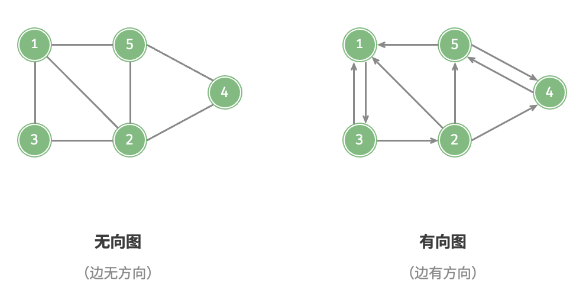
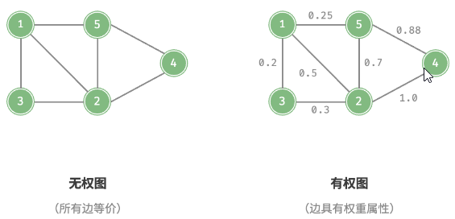
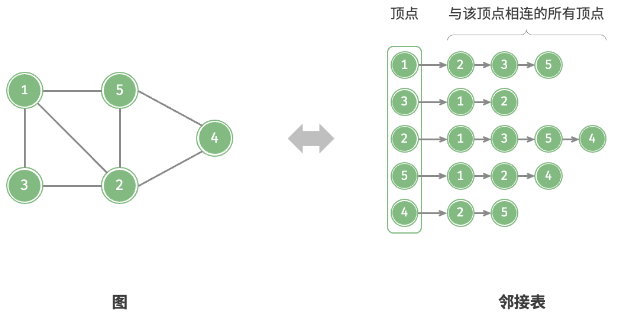
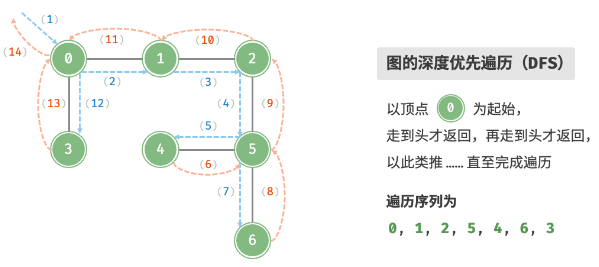

# 图

## 图

### 基础

##### 图

- 一组顶点 V 和一组边 E 的集合;

### 常见类型

##### 有向图和无向图

- 根据边是否具有方向判定;



##### 连通图和非连通图

- 从任一顶点出发, 可以到达任一顶点, 称作连通图;
- 反之称作非连通图;


##### 无权图和有权图

- 根据边是否具有权重判定;



### 常用术语

##### 邻接

- 两顶点存在边相连;

##### 路径

- 从任一顶点到其余任一顶点经过的边构成的序列;

##### 度

- 一个顶点具有的边数;
  - 入度: 多少条边指向该顶点;
  - 出度: 多少条边从该顶点指出;

## 图的表示

### 邻接矩阵

##### 邻接矩阵

- 若图顶点数量为 n;
- 使用 n\*n 的矩阵表示图;
- 通过 0 或 1 表示两顶点是否存在边;


##### 特性

- 邻接矩阵主对角线无意义, 恒为 0;
- 无向图关于主对角线对称;

##### 空间复杂度

- O(n^2);

### 邻接表

##### 邻接表

- 使用 n 个链表表示图;
- 链表节点表示顶点;
- 链表存储顶点的所有邻接顶点;



##### 空间复杂度

- 远小于 O(n^2);

## 图的基本操作

### 基于邻接矩阵

##### 添加和删除边

- 修改矩阵对应元素即可;

##### 添加顶点

- 邻接矩阵尾部添加一行一列;

##### 删除顶点

- 邻接矩阵删除一行一列;

##### 代码

```typescript
export class GraphAdjMat {
  _adjMat: number[][];
  _size: number;
  _isDirection: boolean;
  _index: {
    [propName: number]: string;
  };

  _vertices: {
    [propName: string]: number;
  };

  constructor(vertices: string[], edges: [string, string][]) {
    this._vertices = {};
    this._adjMat = [];
    this._size = 0;
    this._isDirection = false;
    this._index = {};
    for (let index = 0; index < vertices.length; index++) {
      const vertex = vertices[index];
      this.addVertex(vertex);
    }
    for (let index = 0; index < edges.length; index++) {
      const edge = edges[index];
      this.addEdge(edge[0], edge[1]);
    }
  }

  size() {
    return this._size;
  }

  getVertexIndex(value: string) {
    const index = this._vertices[value];
    if (typeof index === "number") {
      return index;
    } else {
      return null;
    }
  }

  addVertex(value: string) {
    const size = this._size;
    const newRow = new Array(size).fill(0);
    this._vertices[value] = size;
    this._index[size] = value;
    this._adjMat.push(newRow);
    for (let index = 0; index < this._adjMat.length; index++) {
      const row = this._adjMat[index];
      row.push(0);
    }
    this._size += 1;
  }

  removeVertex(value: string) {
    const vertexIndex = this.getVertexIndex(value);
    if (!(typeof vertexIndex === "number")) {
      throw new Error("the graph don't have this vertex");
    }
    delete this._vertices[value];
    delete this._index[vertexIndex];
    this._adjMat.splice(vertexIndex, 1);
    for (let index = 0; index < this._adjMat.length; index++) {
      const row = this._adjMat[index];
      row.splice(vertexIndex, 1);
    }
    this._size -= 1;
  }

  addEdge(startVertex: string, endVertex: string) {
    const startVertexIndex = this.getVertexIndex(startVertex);
    const endVertexIndex = this.getVertexIndex(endVertex);
    if (
      !(
        typeof startVertexIndex === "number" &&
        typeof endVertexIndex === "number"
      )
    ) {
      throw new Error("the graph don't have this vertex");
    }
    this._adjMat[startVertexIndex][endVertexIndex] = 1;
    if (!this._isDirection) {
      this._adjMat[endVertexIndex][startVertexIndex] = 1;
    }
  }

  removeEdge(startVertex: string, endVertex: string) {
    const startVertexIndex = this.getVertexIndex(startVertex);
    const endVertexIndex = this.getVertexIndex(endVertex);
    if (
      !(
        typeof startVertexIndex === "number" &&
        typeof endVertexIndex === "number"
      )
    ) {
      throw new Error("the graph don't have this vertex");
    }
    this._adjMat[startVertexIndex][endVertexIndex] = 0;
    if (!this._isDirection) {
      this._adjMat[endVertexIndex][startVertexIndex] = 0;
    }
  }

  graphBFS(vertex: string) {
    const headIndex = this.getVertexIndex(vertex);
    if (!(typeof headIndex === "number")) {
      throw new Error("the graph don't have this vertex");
    }
    const resIndex = [];
    const queueIndex = [headIndex];
    const visitedIndex = new Set([headIndex]);
    while (queueIndex.length !== 0) {
      const headIndex = queueIndex.shift() as number;
      resIndex.push(headIndex);
      for (let index = 0; index < this._adjMat[headIndex].length; index++) {
        const tag = this._adjMat[headIndex][index];
        if (tag === 0) continue;
        if (visitedIndex.has(index)) continue;
        queueIndex.push(index);
        visitedIndex.add(index);
      }
    }
    return resIndex.map((value) => this._index[value]);
  }

  graphDFS(vertex: string) {
    const headIndex = this.getVertexIndex(vertex);
    if (!(typeof headIndex === "number")) {
      throw new Error("the graph don't have this vertex");
    }
    const resIndex = [headIndex];
    const visitedIndex = new Set([headIndex]);

    const loop = (vertexLoopIndex: number) => {
      for (
        let index = 0;
        index < this._adjMat[vertexLoopIndex].length;
        index++
      ) {
        const tag = this._adjMat[vertexLoopIndex][index];
        if (tag === 0) continue;
        if (visitedIndex.has(index)) continue;
        resIndex.push(index);
        visitedIndex.add(index);
        loop(index);
      }
    };

    loop(headIndex);

    return resIndex.map((value) => this._index[value]);
  }
}
```

### 基于邻接表

##### 添加边

- 顶点对应链表末尾添加指定顶点;

##### 删除边

- 顶点对应链表删除指定顶点;

##### 添加顶点

- 添加一个链表并作为链表第一个节点;

##### 删除顶点

- 遍历链表, 删除指定顶点;

##### 代码实现

```typescript
import { DoublyLinkedList } from "../linked_list/doubly_linked_list";
import { DoublyLinkedListNode } from "../linked_list/doubly_linked_list_node";

export class GraphVertex {
  _value: string;
  constructor(value: string) {
    this._value = value;
  }

  get value() {
    return this._value;
  }

  set value(value: string) {
    this._value = value;
  }
}

export class GraphLinkedList {
  _linkList: DoublyLinkedList<GraphVertex>[];
  _size: number;
  _isDirection: boolean;

  constructor(vertices: GraphVertex[], edges: [GraphVertex, GraphVertex][]) {
    this._linkList = [];
    this._size = 0;
    this._isDirection = false;
    for (let index = 0; index < vertices.length; index++) {
      const vertex = vertices[index];
      this.addVertex(vertex);
    }
    for (let index = 0; index < edges.length; index++) {
      const edge = edges[index];
      this.addEdge(edge[0], edge[1]);
    }
  }

  size() {
    return this._size;
  }

  getVertexIndex(vertex: GraphVertex) {
    for (let index = 0; index < this._size; index++) {
      const linkedList = this._linkList[index];
      if (vertex === linkedList.head.next?.value) return index;
    }
    return null;
  }

  addVertex(vertex: GraphVertex) {
    const newLinkedList = new DoublyLinkedList<GraphVertex>();
    const node = new DoublyLinkedListNode(vertex);
    newLinkedList.insert(node, newLinkedList.head);
    this._linkList.push(newLinkedList);
    this._size += 1;
  }

  removeVertex(vertex: GraphVertex) {
    const vertexIndex = this.getVertexIndex(vertex);
    if (!(typeof vertexIndex === "number")) {
      throw new Error("the graph don't have this vertex");
    }
    this._linkList.splice(vertexIndex, 1);
    for (let index = 0; index < this._size - 1; index++) {
      const linkedList = this._linkList[index];
      const node = linkedList.find(vertex);
      if (node) {
        linkedList.delete(node);
      }
    }
    this._size -= 1;
  }

  addEdge(startVertex: GraphVertex, endVertex: GraphVertex) {
    const startVertexIndex = this.getVertexIndex(startVertex);
    const endVertexIndex = this.getVertexIndex(endVertex);
    if (
      !(
        typeof startVertexIndex === "number" &&
        typeof endVertexIndex === "number"
      )
    ) {
      throw new Error("the graph don't have this vertex");
    }

    const linkedList = this._linkList[startVertexIndex];
    const node = new DoublyLinkedListNode(endVertex);
    linkedList.insert(
      node,
      linkedList.head.next as DoublyLinkedListNode<GraphVertex>
    );
    if (!this._isDirection) {
      const linkedList = this._linkList[endVertexIndex];
      const node = new DoublyLinkedListNode(startVertex);
      linkedList.insert(
        node,
        linkedList.head.next as DoublyLinkedListNode<GraphVertex>
      );
    }
  }

  removeEdge(startVertex: GraphVertex, endVertex: GraphVertex) {
    const startVertexIndex = this.getVertexIndex(startVertex);
    const endVertexIndex = this.getVertexIndex(endVertex);
    if (
      !(
        typeof startVertexIndex === "number" &&
        typeof endVertexIndex === "number"
      )
    ) {
      throw new Error("the graph don't have this vertex");
    }
    const linkedList = this._linkList[startVertexIndex];
    const node = linkedList.find(endVertex);
    if (node) linkedList.delete(node);
    if (!this._isDirection) {
      const linkedList = this._linkList[endVertexIndex];
      const node = linkedList.find(startVertex);
      if (node) linkedList.delete(node);
    }
  }

  graphBFS(vertex: GraphVertex) {
    const vertexIndex = this.getVertexIndex(vertex);
    if (!(typeof vertexIndex === "number")) {
      throw new Error("the graph don't have this vertex");
    }
    const res = [];
    const queue = [vertex];
    const visited = new Set([vertex]);

    while (queue.length !== 0) {
      const currentVertex = queue.shift() as GraphVertex;
      res.push(currentVertex);
      const currentNode =
        this._linkList[this.getVertexIndex(currentVertex) as number].head.next;

      let loopNode = currentNode;
      while (loopNode !== null) {
        const loopVertex = loopNode.value;
        if (!visited.has(loopVertex)) {
          queue.push(loopVertex);
          visited.add(loopVertex);
        }
        loopNode = loopNode.next;
      }
    }

    return res;
  }

  graphDFS(vertex: GraphVertex) {
    const vertexIndex = this.getVertexIndex(vertex);
    if (!(typeof vertexIndex === "number")) {
      throw new Error("the graph don't have this vertex");
    }
    const res = [vertex];
    const visited = new Set([vertex]);

    const loop = (loopVertex: GraphVertex) => {
      const loopNode = this._linkList[this.getVertexIndex(loopVertex) as number]
        .head.next as DoublyLinkedListNode<GraphVertex>;
      let nextNode = loopNode.next;

      while (nextNode !== null) {
        const nextVertex = nextNode.value;
        if (!visited.has(nextVertex)) {
          res.push(nextVertex);
          visited.add(nextVertex);
          loop(nextVertex);
        }
        nextNode = nextNode.next;
      }
    };

    loop(vertex);

    return res;
  }
}
```

### 效率对比

##### 效率对比

- n 个顶点和 m 条边;

|              | 邻接矩阵 | 邻接表 (链表) | 邻接表 (哈希表) |
| ------------ | -------- | ------------- | --------------- |
| 判断是否邻接 | $O(1)$   | $O(m)$        | $O(1)$          |
| 添加边       | $O(1)$   | $O(1)$        | $O(1)$          |
| 删除边       | $O(1)$   | $O(m)$        | $O(1)$          |
| 添加顶点     | $O(n)$   | $O(1)$        | $O(1)$          |
| 删除顶点     | $O(n^2)$ | $O(n + m)$    | $O(n)$          |
| 内存空间占用 | $O(n^2)$ | $O(n + m)$    | $O(n + m)$      |

## 图的遍历(基于邻接表(哈希表))

### 广度优先遍历

##### 思想

- 从一个顶点出发;
- 首先遍历该顶点的所有邻接顶点;
- 然后遍历下一顶点的所有邻接顶点;
- 直至所有顶点遍历完毕;

##### 算法实现

- 使用队列实现, 并使用一个哈希表记录顶点是否已经加入队列;
- 起始顶点加入队列并开始迭代;
- 每次迭代弹出队首并记录访问, 然后将该顶点的所有邻接顶点加入队尾;
- 循环上一步, 直至所有顶点访问完毕;


##### 复杂度

- 时间复杂度: O(V + E);
- 空间复杂度: O(V);

### 深度优先遍历

##### 思想

- 从一个顶点出发;
- 首先遍历该顶点的某个邻接顶点, 走到尽头再返回;
- 依次类推, 直至所有顶点遍历完毕;

##### 算法实现

- 使用递归实现, 并使用一个哈希表记录顶点是否已经被访问;



##### 复杂度

- 时间复杂度: O(V + E);
- 空间复杂度: O(V);
