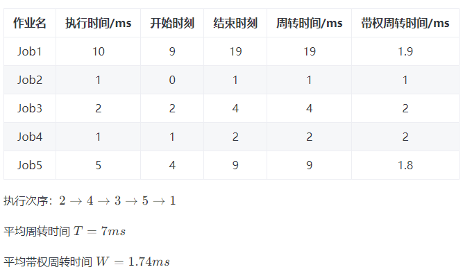

# 杂项

## 题目

### 用 rand7() 实现 rand10()

##### 题目

- [470](https://leetcode.cn/problems/implement-rand10-using-rand7/solutions/15898/javascript-100-6344-by-a-si-shua-ma-tong/);

##### 思路

- 小变大;
  - 基本公式: (randX() - 1) × Y + randY() 可以等概率的生成[1, X * Y]范围的随机数;
  - 假设小值为 randM, 大值为 randN;
  - 通过上述公式, 基于 randM , 构造出一个比 n 大的 randX();
  - 在通过大变小的思想, 得到 randN();
- 大变小;
  - 假设小值为 randM, 大值为 randN;
  - 寻找一个小于 n, m 的倍数, 记作 x;
  - 若 randN() 大于 x, 重新随机, 最后得到随机值 value;
  - (value%m)+1 即可得到 randM()

```typescript
/**
 * The rand7() API is already defined for you.
 * var rand7 = function() {}
 * @return {number} a random integer in the range 1 to 7
 */
var rand10 = function () {
  const rand49 = () => {
    return (rand7() - 1) * 7 + rand7();
  };

  let res = rand49();
  while (res > 40) res = rand49();

  return (res % 10) + 1;
};
```

##### 复杂度

- 时间:n;
- 空间:1;

### 第 N 位数字

##### 题目

- [400](https://leetcode.cn/problems/nth-digit/);

##### 思路

- 找规律;
  - 1 位: 起始 1, 一共 9 个, 位数数量 1\*9;
  - 2 位: 起始 1*10, 一共 90 个, 位数数量 2*90;
  - ...
  - 规律;
    - 位数 = 位数 + 1;
    - 起始 = 起始 \* 10
    - 数量 = 数量 \* 10;
    - 位数数量 = 位数 \* 数量;
- 思路;
  - 首先确定第 N 位数字所在数字的位数;
  - 其次找到所在数字;
  - 最后找到所在位数;

```typescript
/**
 * @param {number} n
 * @return {number}
 */
var findNthDigit = function (n) {
  let start = 1;
  let digit = 1;
  let count = 9;
  let digitCount = digit * count;
  while (n > digitCount) {
    n -= digitCount;
    start *= 10;
    digit += 1;
    count *= 10;
    digitCount = digit * count;
  }
  const num = start + Math.floor((n - 1) / digit);
  const temp = (n - 1) % digit;
  return new String(num)[temp];
};
```

##### 复杂度

- 时间:logn;
- 空间:1;

### 计算质数

##### 题目

- [204](https://leetcode.cn/problems/count-primes/);

##### 思路

- 埃氏筛;
  - 初始化长度为 n 的数组, 判断 n 是否为质数, 初始化全部为质数;
  - 从 2 开始, 首先判断当前数字 i 是否为质数;
  - 如果是, 将 i 的倍数全部标记为合数, 直至 sqrt(n);
    - 从 i\*i 开始, 因为之前的倍数已经被标记过;

```typescript
/**
 * @param {number} n
 * @return {number}
 */
var countPrimes = function (n) {
  const isPrime = new Array(n).fill(true);
  const end = Math.sqrt(n);
  for (let i = 2; i <= end; i++) {
    if (isPrime[i]) {
      for (let j = i * i; j < n; j += i) {
        isPrime[j] = false;
      }
    }
  }

  let res = 0;
  for (let i = 2; i < n; i++) {
    if (isPrime[i]) res++;
  }

  return res;
};
```

##### 复杂度

- 时间:nloglogn;
- 空间:n;

### 整数反转

##### 题目

- [007](https://leetcode.cn/problems/reverse-integer/);

##### 思路

- 首先将数字取绝对值和符号;
- 不断对 10 取余构造数组;
- 反转数组, 对 10 累乘, 同时判断不要超过最值;

```typescript
/**
 * @param {number} x
 * @return {number}
 */
var reverse = function (x) {
  const sign = Math.sign(x);
  let xAbs = Math.abs(x);
  const arr = [];
  while (xAbs > 0) {
    arr.push(xAbs % 10);
    xAbs = Math.floor(xAbs / 10);
  }

  const max = Math.pow(2, 31);
  let res = 0;
  for (const digit of arr) {
    if (sign) {
      if (res >= (max - digit) / 10) return 0;
    } else {
      if (res > (max - digit) / 10) return 0;
    }
    res = 10 * res + digit;
  }

  return sign * res;
};
```

##### 复杂度

- 时间: n;
- 空间: n;

### 回文数

##### 题目

- [9](https://leetcode.cn/problems/palindrome-number/description/);

##### 思路

- 首先判断整数正负号, 负数直接返回 false;
- 对整数对 10 取余, 构成各位数组;
- 使用双指针判断;

```typescript
/**
 * @param {number} x
 * @return {boolean}
 */
var isPalindrome = function (x) {
  if (x < 0) return false;
  const arr = [];
  while (x > 0) {
    arr.push(x % 10);
    x = Math.floor(x / 10);
  }

  let left = 0;
  let right = arr.length - 1;
  while (left < right) {
    if (arr[left] !== arr[right]) return false;
    left++;
    right--;
  }

  return true;
};
```

##### 复杂度

- 时间: n;
- 空间: n;

### 破冰游戏

##### 题目

- [LCR187](https://leetcode.cn/problems/yuan-quan-zhong-zui-hou-sheng-xia-de-shu-zi-lcof/description/);

##### 思路

- 直接使用计算公式;
  - ans = (m+ans)%i;

```typescript
/**
 * @param {number} num
 * @param {number} target
 * @return {number}
 */
var iceBreakingGame = function (num, target) {
  let res = 0;
  for (let i = 2; i <= num; i++) {
    res = (res + target) % i;
  }

  return res;
};
```

##### 复杂度

- 时间:n;
- 空间:1;

### Excel 表列名称

##### 题目

- [168](https://leetcode.cn/problems/excel-sheet-column-title/);

##### 思路

- 10 进制转 26 进制变种;
  - 因为题目从 1 开始, 所以每次循环 -1, 消除偏移;
  - 这个思想死记硬背吧, 不会理解...
- 注意 charCodeAt 和 fromCharCode 两个 API;

```typescript
/**
 * @param {number} columnNumber
 * @return {string}
 */
var convertToTitle = function (columnNumber) {
  const startCode = "A".charCodeAt(0);
  let res = [];
  while (columnNumber) {
    columnNumber--;
    const index = columnNumber % 26;
    res.unshift(String.fromCharCode(startCode + index));
    columnNumber = Math.floor(columnNumber / 26);
  }
  return res.join("");
};
```

##### 复杂度

- 时间: n;
- 空间: n;

## 乱七八糟的算法

### 短作业优先调度算法 (SFJ)

##### 目的

- 存在若干个项目, 每个项目需要耗费一定时间;
- 使得平均周转时间最小;

##### 项目顺序

- 根据耗费时间正序排列;

##### 计算公式

- 周转时间: 完成时间 - 最初开始时间;
- 带权周转时间: 周转时间 / 执行时间;
- 平均周转时间: 周转时间之和 / 项目个数;
- 平均带权周转时间: 带权周转时间之和 / 项目个数;


