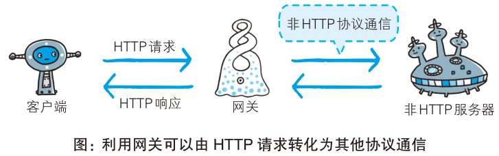

# http 进阶

## 数据转发和缓存

### 数据转发

#### 代理

##### 代理

- 服务器和客户端的中间商;
  - 接受客户端请求并转发给服务器;
  - 接受服务器响应并转发给客户端;
- 经过代理服务器写入 Via 首部字段;


##### 作用

- 基于缓存技术减少网络带宽;
- 控制访问;
- 日志管理;

##### 分类

- 缓存代理: 缓存请求资源;
- 透明代理: 不加工转发请求的代理;
- 非透明代理: 加工转发请求的代理;

#### 网关

- 类似于代理;
- 转发其他服务器数据的服务器;
- 可以将 HTTP 协议转换为其他通讯协议;



#### 隧道

- 建立客户端和服务器端的通信线路;
- 使用 SSL 进行加密通信;


### 缓存

##### 缓存

- 服务器端的资源副本;

##### 作用

- 减少对服务器的访问;
- 降低通信流量和响应时间;

##### 刷新缓存

- 根据客户端要求或者缓存有效期限;
- 缓存服务器再次请求服务器端, 刷新缓存资源;

##### 客户端缓存

- 临时网络文件, 存储在磁盘中;
- 具有缓存刷新机制;

## 功能追加协议

### SPDY

##### HTTP 弊端

- 一次连接只可发送一次请求;
- 请求只能从客户端开始;
- 首部信息冗余且不压缩;

##### SPDY (已废弃)

- 使用 SSL;
- 多路复用流: 单一 TCP 连接多个 HTTP 请求;
- 请求优先级;
- 强制压缩;
- 服务器推送功能;

### WebDAV

##### WebDAV

- 分布式文件系统;
- 客户端直接操作服务器内容

##### 相关方法和状态码

- HTTP/1.1 添加;

| 方法                     | 描述                                            |
| ------------------------ | ----------------------------------------------- |
| PROPFIND                 | 获取属性                                        |
| PROPPATCH                | 修改属性                                        |
| MKCOL                    | 创建集合                                        |
| COPY                     | 复制资源及属性                                  |
| MOVE                     | 移动资源                                        |
| LOCK                     | 资源加锁                                        |
| UNLOCK                   | 资源解锁                                        |
| 102 Processing           | 可正常处理请求,但目前是处理中状态               |
| 207 Multi-Status         | 存在多种状态                                    |
| 422 Unprocessible Entity | 格式正确,内容有误                               |
| 423 Locked               | 资源已被加锁                                    |
| 424 Failed Dependency    | 处理与某请求关联的请求失败,因此不再维持依赖关系 |
| 507 Insufficient Storage | 保存空间不足                                    |

## 跨域

### 浏览器同源策略

##### 同源策略

- 限制不同源之间的资源如何交互;
- 同源, 即两个 URL 协议, 主机和端口号都相同;

##### 限制内容

- js 无法读取非同源网页的 cookie, storage 和 indexedDB;
- js 无法读取非同源网页的 dom;
- ajax 和 fetch 不能发送跨域请求;
- iframe 无法访问非同源 dom;
- https 和 http 资源无法跨协议加载;

### 跨域方案

##### cors

- 通过设置 `Access-Control-Allow-Origin`;
- 设置允许的源;

##### 代理

- 同源页面发送请求至同源服务器;
- 服务器转发至跨域服务器;
- 将请求结果返回至同源页面;

##### websocket

- websocket 并非 http 协议, 不受同源策略限制;
- 使用 websocket 进行客户端和服务器端通信;

### 预检请求

##### options 请求

- 浏览器发送跨域请求之前;
- 发送 options 请求, 用于检查服务器是否允许该跨域请求;

##### 限制

- 请求方法必须为 POST, GET 或 HEAD;
- 指定 Header;
  - 规定的首部字段: Accept-_, Content-_;
  - POST 使用规定的表单数据类型: application/x-www-form-urlencoded, multipart/form-data, text/plain;
- 响应请求包含 `Access-Control-Allow-*` 首部字段;

## http/1.x

### GET 请求和 POST 请求的区别

##### 一览

|          | GET                 | POST                        |
| -------- | ------------------- | --------------------------- |
| 应用场景 | 幂等请求            | 非幂等请求                  |
| 缓存     | 会缓存              | 不会缓存                    |
| 传参方式 | 查询字符串          | 请求体                      |
| 安全性   | 明文                | 加密                        |
| 请求长度 | 浏览器限制 url 长度 | 无限制                      |
| 参数类型 | ASCII 字符          | 更多的数据类型 (二进制数据) |

##### URL 长度限制

- IE: 2083 字节;
- Firefox: 65535 字节;
- Safari: 80000 字节;
- Opera: 190000 字节;
- Chrome: 8182 字节;

### 常见的 Content-Type

- application/json;
- application/x-www-form-urlencoded;
- multipart/form-data;
- text/plain;
- text/html;
- image/jpeg;
- image/png;

### cookie

##### 属性

- path;
- domain;
- max-age;
- expires;
- secure;
- httponly;

##### 自动携带 cookie

- domain 相同;
- 协议相同, 或者 secure 为 false;
- 请求 url 和 path 及其子路径 一致;

##### 跨域携带 cookie

- 客户端设置 `"withCredentials": true;`;
- 服务器端配置;
  - `"Access-Control-Allow-Origin", "http://xxx:${port}"`;
  - `"Access-Control-Allow-Credentials", "true"`;

### http/1.0 和 http/1.1 区别

| 区别      | http/1.0         | http/1.1                           |
| --------- | ---------------- | ---------------------------------- |
| 缓存机制  | 仅支持客户端缓存 | 客户端缓存 + 服务器缓存            |
| 持久连接  | 默认非持久连接   | 持久连接                           |
| 超时机制  | 无明确超时机制   | 连接超时 + 读取超时 + 空闲连接超时 |
| 状态码    | xxxx             | 更多的状态码                       |
| 带宽优化  | xxx              | 分块传输 + 范围请求                |
| Host 头部 | xxx              | 引入 Host 首部字段                 |

## HTTP2.0

### 新特性

- 多路复用;
- 服务器推送: SSE;
- 请求优先级: 控制响应呼死你许;
- 二进制分帧: 提高传输效率;
- 首部压缩: 压缩 http 首部信息;

### 首部压缩算法

- 使用 HPACK 算法, 具有静态压缩和动态压缩两种方式;
- 静态压缩;
  - 预先建立称为静态表的字典, 将经常使用的首部字段预先编码并存储在静态表中;
  - 传递 HTTP 请求时, 仅发送静态表的编码值和索引号;
- 动态压缩;
  - 基于哈希算法, 对 HTTP 首部进行编码, 双方维护一张哈希表;
  - 传递 HTTP 请求时, 仅发送哈希表索引值;
  - 哈希表空间不足时, 优先删除最少使用的首部字段;

## WebSocket

##### WebSocket 协议

- 基于 HTTP/HTTPS;
- 全双工通信;
- 持续时间内保持连接状态;

##### 一次握手

- 客户端发送 HTTP/HTTPS 请求;
  - Upgrade 首部告知服务器使用 WebSocket 协议;
  - Sec-WebSocket-Key 首部作为 key 标识;
  - Sec-WebSocket-Protocol 表示支持协议;
- 服务器生成 HTTP(S) 握手响应;
  - 服务器返回 101 状态码;
  - 选择 websocket 协议;
  - 基于 Sec-WebSocket-Key 构造 Sec-WebSocket-Accept 首部;
- 客户端接受 HTTP(S) 握手响应;
  - 校验 Sec-WebSocket-Accept 首部;
  - 校验通过建立 websocket 连接, 不再使用 HTTP/HTTPS 协议;

```bash
# 请求
GET /chat HTTP/1.1
Host: server.example.com
Upgrade: websocket
Connection: Upgrade
Sec-WebSocket-Key: dGhlIHNhbXBsZSBub25jZQ==
Origin: http://example.com
Sec-WebSocket-Protocol: chat, superchat
Sec-WebSocket-Version: 13

# 响应
HTTP/1.1 101 Switching Protocols
Upgrade: websocket
Connection: Upgrade
Sec-WebSocket-Accept: s3pPLMBiTxaQ9kYGzzhZRbK+xOo=
Sec-WebSocket-Protocol: chat
```


##### 优点

- 全双工: 实时推送, 优于轮询;
- 降低网络开销: 一次握手, 持久保持连接, 避免反复连接开销;
- 更少的数据量: 二进制数据帧传输数据, 传输效率高;
- 跨域通信: 支持跨域通信;

## 最佳实践

### 正向代理和反向代理

##### 正向代理

- 客户端的代理, 转发客户端请求至服务器;
- 隐藏客户端信息, 用于 VPN, 内网穿透等;

##### 反向代理

- 服务器的代理, 处理客户端请求并转发至服务器;
- 隐藏服务器信息, 用于负载均衡, 缓存, 安全控制等;


### 负载均衡的实现方式

##### 负载均衡

- 多个服务器分配网络请求;
- 提高服务器集群的性能和可靠性;

##### 硬件

- 物理设备;
- 包含交换机, 路由器, 防火墙等;
- 拓展性高, 性能高, 适用于大规模数据;

##### 软件

- 应用程序;
- 基于轮询, 最小连接数, IP 哈希等算法分配至不同服务器;
- 成本低, 易于实现和管理, 适用于中小规模数据;

##### 要求

- 可靠性: 处理硬件, 软件故障, 网络错误等异常故障;
- 稳定性: 运行稳定性, 性能稳定性;
- 安全性: 防止 DDOS, 提供 SSL 加密等;
- 可拓展性;

### 轮询

##### 短轮询

- 客户端每隔一定时间发送 HTTP 请求;
- 优缺点;
  - 实现简单;
  - 需要重复建立连接, 具有延迟;

##### 长轮询

- 客户端发送 HTTP 请求;
- 若对应请求资源变化, 服务器立刻返回响应, 反之服务器保持请求, 直至资源变化或超时;
- 客户端接受响应后重新发送请求;
- 限制;
  - 客户端代码使用长轮询;
  - 服务器对于请求资源未变化的情况进行保持连接处理;
- 优缺点;
  - 减少了无效请求;
  - 具有延迟;

```typescript
async function subscribe() {
  let response = await fetch("/subscribe");
  if (response.status == 502) {
    // 服务器超时重新连接
    await subscribe();
  } else if (response.status != 200) {
    // 服务器报错, 一秒后重新连接
    await new Promise((resolve) => setTimeout(resolve, 1000));
    await subscribe();
  } else {
    // 正确处理, 执行若干处理程序
    // ...
    await subscribe();
  }
}
```

##### SSE

- 服务器推送技术;
- 建立持久连接, 实现单向通信;
- 优缺点;
  - 实时性高;

##### WebSocket

- 全双工, 双向通信;
- 优缺点;
  - 实时性高;
  - 性能耗费大;

### RESTFUL API

- API 描述规范;
- 通过 URL 和 HTTP 动词统一 API 接口;
- 使用 CS 结构;
- 支持不同数据传输;
- 无状态通信;
