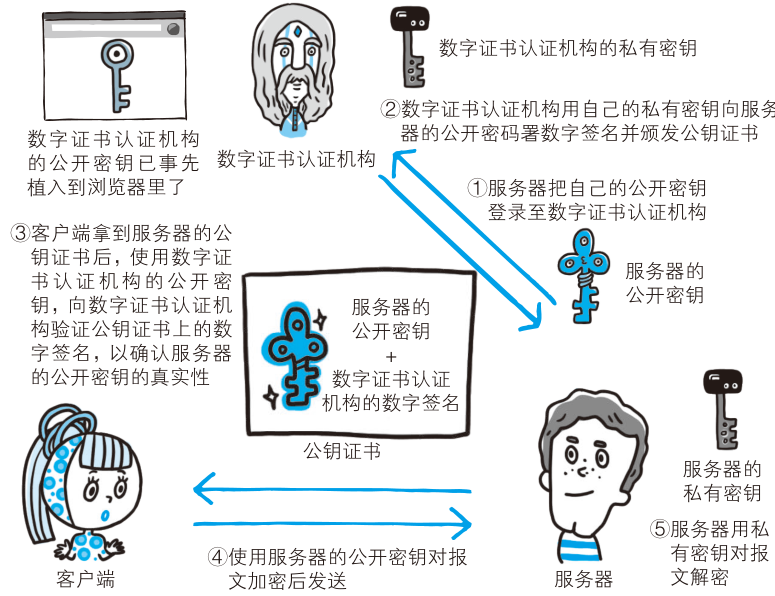
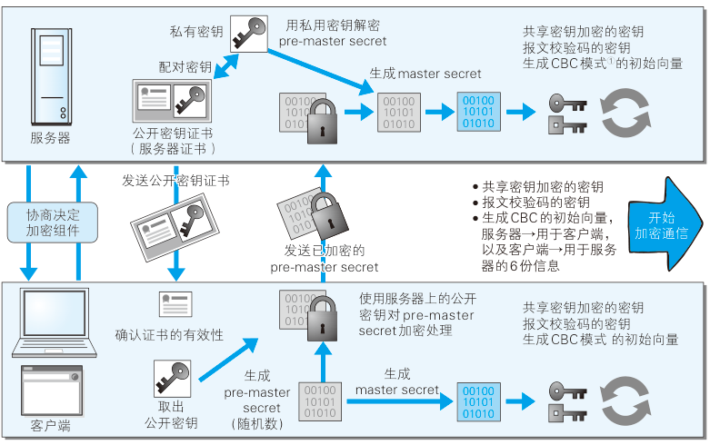

# https 基础

## HTTP 不足

### 明文通信

##### 明文通信

- HTTP 使用明文方式发送;
- 具有窃听风险;

##### 协议加密

- HTTP + SSL: 即 HTTPS;
- HTTP + TLS;

##### 报文内容加密

- 非对称加密;
- 对称加密;
- 内容仍具有篡改风险;

### 无身份验证

##### 无身份验证

- HTTP 不会验证通信方身份;
- 无法确定接收方和发送方;
- 无法进行访问权限控制;
- 无法阻止 DDOS 攻击;
- 服务器端和客户端具有伪装的风险;

##### SSL 证书

- SSL 具有证书机制;
- 证书由值得信任的第三方颁发, 用于验证身份;

### 报文完整性

##### 报文完整性

- HTTP 无法保证报文完整性;
- 无法阻止攻击者篡改报文内容, 即中间人攻击 (MITM);

##### 防止篡改

- 使用 MD5/SHA 等散列值校验;

## HTTPS 加密机制

### HTTPS 加密机制

- HTTP 基础之上加入加密处理, 认证和完整性保护等机制;
- 将 HTTP 通讯接口部分使用 SSL 和 TLS 协议代替;

### 公钥秘钥加密技术

#### 对称秘钥加密

##### 对称秘钥加密

- 加密和解密共享一个秘钥;

##### 风险

- 使用对称秘钥加密需要传递秘钥;
- 无法保证秘钥的安全传递和保管;

#### 非对称秘钥加密

##### 非对称秘钥加密

- 使用一对非对称秘钥;
- 使用公开秘钥进行加密, 使用私有秘钥进行解密;

##### 使用方法

- 加密方使用对方的公开密钥加密;
- 解密方使用自己的私有秘钥解密;
- 避免的私有秘钥的传递;

##### 缺点

- 加密和解密速度慢;

### HTTPS 的混合加密机制

- HTTPS 使用对称加密和非对称加密两者并用的混合加密方式;
- 首先使用非对称加密方式安全转发稍后使用的对称加密的秘钥;
- 确保传递秘钥安全的前提下使用对称加密;

## HTTPS 证书

### 背景

- HTTPS 的混合机密机制只能保证公开密钥的安全转发;
- 不能保证公开秘钥是真正的公开秘钥;
- 传输途中具有掉包的风险;

### 机制

- 数字证书认证机构 (CA) 为可信赖的第三方机构;
- 服务器端人员向 CA 申请公开秘钥的数字签名;
- CA 基于自己的私有秘钥加密数字签名, 生成公开密钥证书;
- 客户端基于 CA 的公开秘钥确定对公开秘钥证书进行验证;
  - CA 的公开秘钥事先保存至浏览器中;

### OpenSSL

- 基于 OpenSSL 构建私有认证机构, 即自认证机构;
- 该机构颁发的证书称为自签名证书;

## HTTPS 安全通信机制

### 通信步骤

- 第一次握手;
  - 客户端发送 Client Hello 报文开始 SSL 通信;
  - 服务器端发送 Server Hello 报文响应;
  - 服务器端发送 Certificate 报文, 其中包含公开密钥证书;
  - 服务器端发送 Server Hello Done 报文, 第一次 SSL 握手结束;
- 第二次握手;
  - 客户端发送 Client Key Exchange, 随机生成 Pre-master secret, 使用公开密钥加密发送至服务器;
    - Pre-master secret 用于构造之后对称加密中的共享秘钥;
  - 客户端发送 Change Cipher Spec 报文, 表明之后通信使用 Pre-master secret 校验;
  - 客户端发送 Finished 报文, 包含之前报文的整体校验值, 作为第二次握手成功的判定标准;
  - 服务器端发送 Change Cipher Spec 报文;
  - 服务器端发送 Finished 报文;
- 第三次握手;
  - 客户端发送 HTTP 请求;
  - 服务器端响应 HTTP 请求;
- 第四次握手;
  - 客户端发送 close_notify 报文断开 SSL 连接, 之后发送 TCP FIN 报文;

### SSL 和 TLS

- TLS 是基于 SSL 为原型开发的协议;
