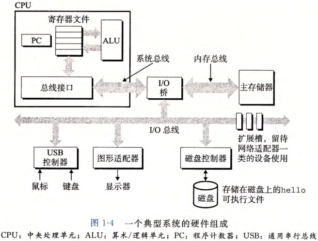
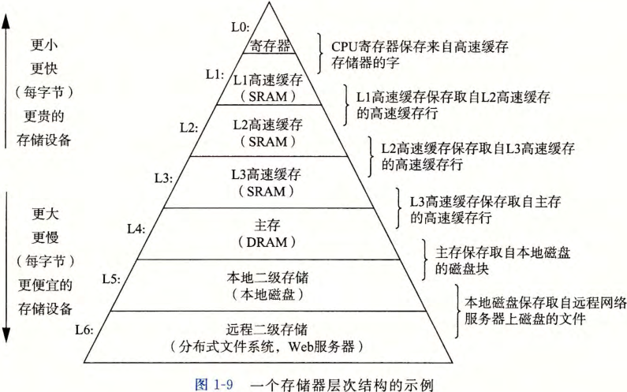
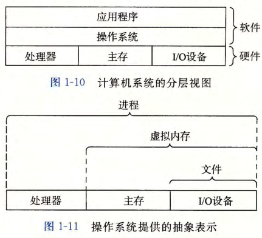
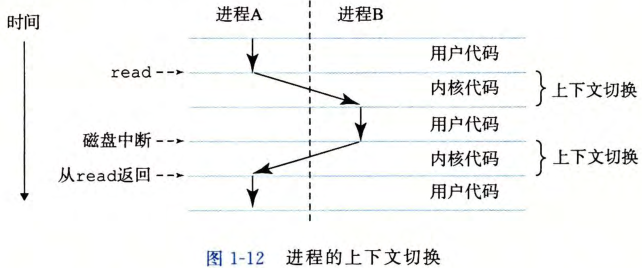

# 基础

## 基本术语

### 文本文件和二进制文件

- 文本文件: 只由 ASCII 字符构成的文件;
- 二进制文件: 非文本文件;

### 编译系统

- 预处理器: 处理宏, 注释等;
- 编译器: 高级语言 - 汇编语言;
- 汇编器: 汇编语言 - 机器语言;
- 链接器: 合并多个程序;

## 硬件

### 系统硬件组成

- 总线: 传递定长的字节块;
  - 字: 字节块长度 (32/64 位);
- I/O: 输入/输出设备, 通过控制器与总线连接;
- 内存: 临时存储设备;
- CPU: 解释/执行内存中的指令;

## 高速缓存

##### 原理

- 较大的存储设备比较小的存储设备速度慢;
- 通过加入缓存 (更小更快的存储设备) 加快速度;

##### 高速缓存存储器 (cache)

- 暂时存放 CPU 可能需要的信息;
- 通常分为多级;

##### 层次结构

- 上一级的存储器作为下一级存储器的高度缓存;

## 操作系统

### 操作系统

- 软件通过操作系统操作硬件;

### 进程

#### 进程

- 一个正在运行的程序的抽象;
- 每个进程好像独占使用硬件, 实则交错执行 (并发运行);
- CPU 可以执行多余其内核个数的进程, 通过 "上下文切换" 交错并发运行多个进程;

#### 上下文

- 跟踪进程运行的状态信息;
- 上下文切换即系统吧控制权从一个进程转向另一个进程;
- 通过系统内核 (kernel) 管理;

#### 内核

- 系统代码常驻内存的部分;

### 线程

- 一个进程可以有多个线程组成;
- 每个线程共享同一进程上下文;

### 虚拟内存

- 一个抽象概念, 给进程假象, 即进程独享主存;
- 进程的虚拟内存存储在硬盘上, 内存作为高速缓存;

### 文件

- 字节序列;

### 网络通信

- 系统通过网络与其他系统连接在一起;

## 并发

### 线程级并发

##### 线程级并发

- 构建在进程上的并发;

##### 多核处理器

- 将多个 CPU 集成在一个集成电路芯片上;

##### 超线程

- CPU 一个时钟周期中执行多个线程的技术;

### 指令级并行

- 处理器一个时钟周期执行多个指令;

### 单指令, 多数据并行

- 一条指令执行多个操作;
