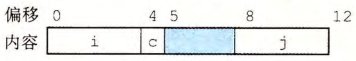

# 程序的机器级表示

## 机器语言

##### 机器语言

- 机器语言只是一个字节序列 (一系列指令的编码);
- 对产生该指令序列的源代码一无所知;

```c
// c 语言
long mult2(long, long);
void multstore(long x, long y, long *dest) {
long t = mult2(x, y);
*dest = t;
}

// 汇编语言
multstore:
pushq   %rbx
movq    %rdx, %rbx
call    mult2
movq    %rax, (%rbx)
popq    %rbx
ret

// 机器语言
53 48 89 d3 e8 00 00 00 00 48 89 03 5b c3
```

##### 反汇编器

- 将机器语言转换为类似汇编语言的格式;

## 访问信息

##### 通用目的寄存器

- 一个 CPU 包含一组 16 个存储 64 位值的通用目的寄存器;
- 存储整数数据和指针;
- 密码格式为 %xxx;

##### 操作符指示符

- 指令中使用的数据和存放结果的目的位置;
  - 立即数: 常数;
  - 寄存器: 寄存器内容;
  - 内存引用: 根据不同寻址模式计算内存地址 (有效地址);

##### 数据传输指令

- 将数据从一个位置复制到另一个位置;
  - MOV 类;

##### 压入和弹出栈数据

- 将数据压入栈或弹出栈;
  - pushq;
  - popq;

## 算术和逻辑操作

##### 加载有效地址

- 从内存读数据到寄存器;
  - leaq;

##### 一元和二元操作

- INC/DEC/NEG/NOT;
- ADD/SUB/IMUL/XOR/OR/AND;

##### 移位操作

- SAL/SHL/SAR/SHR;

##### 特殊的算术操作

- imulq/mulq;
- clto;
- idivq/divq;

## 控制

##### 条件码寄存器

- 描述算术运算和逻辑操作信息;
- 通过检测该寄存器执行条件分支指令;

##### 使用条件码

- 指令;
  - CMP 类;
  - TEST 类;
  - SET 类;
- 根据条件码的组合设置某个字节;
- 根据条件码跳转到程序的其他部分;
- 根据条件码有条件地传输数据;

##### 跳转指令

- 跳转到程序的其他部分;
  - j 类;

##### 使用条件控制实现条件分支

- 使用条件控制实现条件分支;
  - 使用条件码和跳转指令;
- 条件满足跳转到某一部分, 反之跳转到另一部分;

```c
t = test-expr;
if Ct)
goto true;
else-statement
goto done;
true :
then-statement
done :
```

##### 使用条件传送实现条件分支

- 通过数据的条件转译实现条件分支;
  - 使用条件传送指令: cmove 类;
- 计算一个条件操作的两种结果;
- 根据条件是否满足, 使用条件传送指令返回对应结果;

##### CPU 条件预测

- CPU 遇到条件跳转后, 预先猜测会执行的分支并执行;
  - 确保 CPU 指令流水线充满指令, 以提高性能;
- 若猜测错误就丢弃执行的分支并重新执行正确分支;
  - 猜测错误具有很高的乘法;
- 使用条件传送实现条件分支性能高于条件控制;
  - 条件传送不依赖于数据, 使用条件传送指令, 不使用跳转指令;
  - CPU 无需预测就可以执行;
  - 确保 CPU 流水线是满的;

```c
v = then-expr;
ve = else-expr;
t = test-expr;
if (!t) v = ve;
```

##### 循环

- 将循环转换为条件分支;

```c
// do while
loop:
body-statement
t = test-expr;
if (t)
goto loop;

// while
t = test-expr;
if (! t)
goto done;
loop:
body-statement
t = test-expr;
if (t)
goto loop;
done:

// for
init-expr;
t = test-expr;
if (! t)
goto done;
loop :
body-statement
update-expr;
t = test-expr;
if (t)
goto loop;
done:
```

##### switch 语句

- 使用跳转表数据结构: 代码段地址构成的数组;
  - 访问代码的时间始终为 1;
  - 而 if 为 n/2;
- 将 switch 转换为跳转表 + 条件分支;

## 过程

### 基础

##### 过程

- 一种代码封装方式;
- 用一组参数和可选的返回值实现某种功能;

##### 动作

- 简化: 过程 P 调用 Q, Q 执行后返回 P;
- 指令;
  - 传递控制;
  - 传递数据;
  - 分配和释放内存;

### 运行时栈

##### 运行时栈

- 使用栈数据结构提供的后进先出的机制实现过程调用机制;
- P 调用 Q 时, 对应信息添加到栈顶;
- 返回 P 时, 移除栈顶对应信息;

##### 栈帧

- 但过程需要的存储空间超出寄存器存储的大小时, 将会在运行时栈分配空间;
- 该过程在运行时栈上的占用空间称为栈帧;
- 当前执行的过程的帧总是在运行时栈顶;

##### 栈上的局部存储

- 过程对应数据首先存储在寄存器中;
- 出现以下情况分配栈帧;
  - 寄存器不足够存放所有数据;
  - 局部变量使用地址运算符;
  - 局部变量为数组或结构;

### 转移控制

- 记录过程 P 和 Q 的起始位置;
- 实现过程 P 调用 Q, Q 执行后返回 P 的动作;
- call/ret 指令;

### 数据传输

- 实现传递参数给 Q 的动作;
- 使用寄存器传递;

### 递归过程

1. 存储当前过程结果值至栈顶;
2. 调用递归函数, 添加对应信息值栈顶;
   1. 若递归完成, 依次释放栈顶空间;
   2. 若递归未完成, 跳转至 1;

## 数组分配和访问

### 一维数组

- 使用两个寄存器分别存储数组的起始地址和偏移量;

### 多维数组

- 计算偏移量;
  - 对于一个 m\*n 的数组
  - D[i][j]=x+L(n\*i+j);
  - L 为数组元素类型;
- 使用两个寄存器分别存储数组的起始地址和偏移量;

### 定长数组

- 编译时确定数组维度;

### 变长数组

- 运行时确定数组维度;

## 异构的数据结构

### 结构

- 不同类型对象聚合到一个对象中;
- 编译器维护结构第一个字节的地址和每个字段的偏移;

### 联合

- 一个对象使用多种类型之一;
- 联合的大小为其最大字段的大小;

### 数据对齐

- 类型对象的地址必须是 K (2,4,8) 的倍数;
- 用于提高内存访问的性能;
- 实际应用;
  - 结构中使用数据对齐;



## 在机器级程序中将控制和数据结合起来

### 指针

- 指针对应一个类型;
- 指针对应一个类型的内存地址;

### 内存越界引用和缓冲区溢出

##### 内存越界引用

- 访问不属于对应类型的内存地址, 常见于数组越界;

##### 缓冲区溢出

- 栈分配一定空间给某类型;
- 类型实际使用空间超过分配空间;
- 常见于字符串;

### 对抗缓冲区溢出攻击

- 栈随机化: 栈地址在程序每次运行发生变化;
- 栈破坏检测;
  - 栈帧中的缓冲区和栈状态之间存储一个随机产生的特殊值 (金丝雀值);
  - 通过检测金丝雀值是否发生变化检测;
- 限制可执行代码区域;
  - 虚拟内存空间逻辑上分成 "页";
  - 限制程序可以访问的页;

### 变长栈帧

- 寄存器存储 "帧指针" 用于存储需要分配的内存空间;

## 浮点代码

### 浮点体系结构

##### 任务

- 如何存储和访问浮点值;
- 浮点值指令;
- 函数传递浮点数参数和返回浮点数结果;
- 函数调用过程中寄存器的行为;

##### 指令集

- SSE;
- AVX;

##### 寄存器

- XMM 寄存器: 256 位;
- YMM 寄存器: 128 位;

### 浮点传送和转换操作

##### 浮点传送

- 浮点数值在寄存器的传输;
- vmov 类;

##### 转换操作

- 不同浮点格式之间, 浮点数和整数之间的转换;
- vcvt 类;
