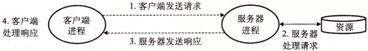

# 系统级 I/O 和网络编程

## 系统级 I/O

### Unix I/O

- Linux 文件为字节序列;
- 将所有的 I/O 设备抽象为文件;
- 设备的输入输出作为文件的读和写运行;

### 文件

- 普通文件;
  - 文本文件;
  - 二进制文件;
- 目录;
  - 包含一组链接的文件;
  - 链接映射到一个文件或目录;
- 套接字: 用于进程之间跨网络通信的文件;

### I/O 操作

- 打开文件/关闭文件;
- 读写文件;
- 文件元数据;
- 读取目录内容;
- 重定向;

### 共享文件

- 使用三个数据结构表示已打开的文件;
  - 描述符表: 进程与文件表的映射;
  - 文件表: 打开文件的集合;
  - v-node 表: 文件元数据;

## 网络编程

### C/S 架构

### 套接字接口

- 一组与 Unix I/O 函数集成的函数;
- 用于创建网络应用;
