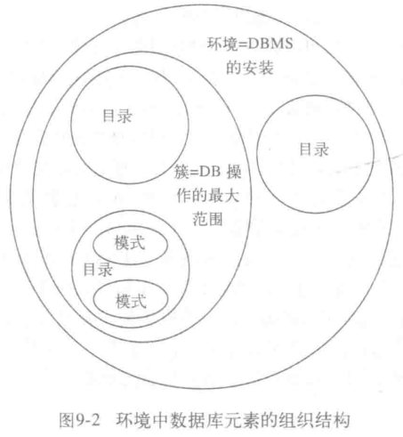
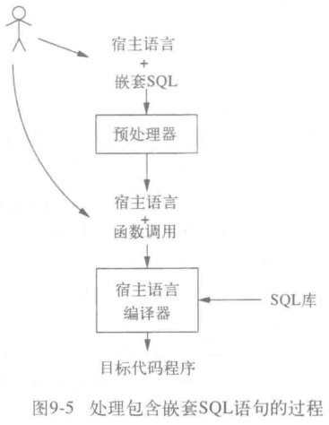

# 服务器环境下的 sql

## sql 环境

### 环境

- 模式: 表/视图/断言的集合;
  - 数据库的基本单位;
- 目录: 模式的集合;
- 簇: 目录的集合;
  - 每个用户具有对应簇;
  - 定义用户可访问的目录范围;



### 模式 (schema)

```sql
CREATE SCHEMA <模式名> <元素声明>
```

### 目录 (catalog)

```sql
CREATE CATALOG <目录名>
SET CATALOG <目录名>
```

### 连接

- SQL 客户端与服务端的链接;

### 会话

- 连接数据库时执行的 SQL 操作构成一个会话;

## SQL/宿主语言接口

### SQL/宿主语言接口

- 使用编程语言操作数据库;

### 实现方式

- 调用层接口;
  - 提供一个库;
  - 使用库中的方法调用 SQL;
- 直接嵌套 SQL;
  - 预处理器将 SQL 转换为具有一定意义的语句;
  - 解析语句, 使用调用层接口调用 SQL;



### 游标

- 游标可以遍历查询结果的元组;

## 存储过程

#### 存储过程

- 使用简单的语言将若干 SQL 组合;
- 作为模式存储在数据库中;
