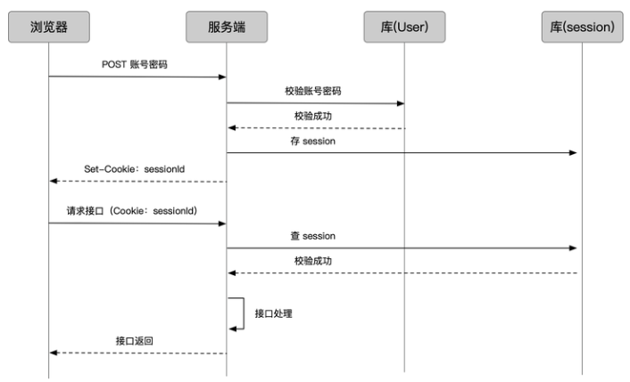
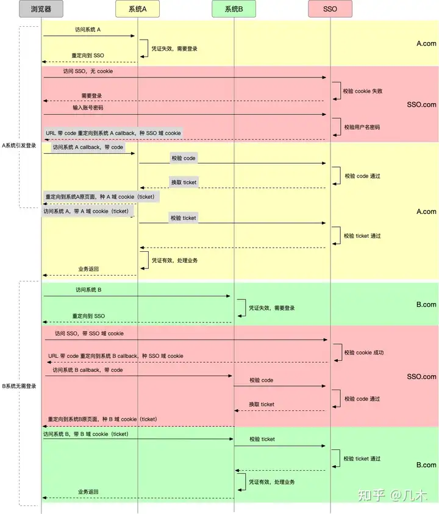
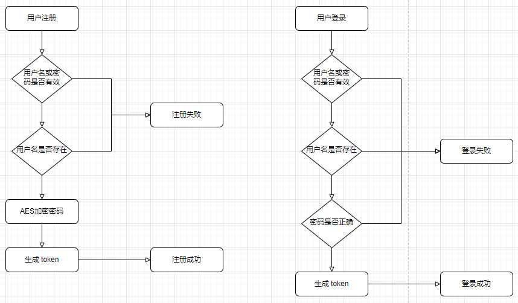

# 认证和授权

## 鉴权

### 服务器 session 管理

##### 基本原理

- 服务器自身维护一个 session 集合;
- 客户端首次访问应用, 服务器生成 session id;
- 服务器通过 cookie 返回客户端 session id;
- 客户端发送请求, cookie 携带 session id;
- 服务器查询 session 集合, 从而认证用户;



##### 失效时间

- session 具有失效时间;
- 达到失效时间, 服务器销毁 session, 并创建新的 session;
- 一般用户在失效时间中访问服务器, 服务器延长 session;

##### 缺点

- 会话信息存储在服务器中, 浪费服务器存储空间;
- 服务器集群部署时, 存在 session 共享问题;
- 服务器集群部署时, 存在 cookie 跨域问题;

### token

##### 基本原理

- 类似与服务器 session 管理;
- 服务器根据用户信息创建一个登录凭证 token;
  - 用户 id;
  - 创建时间;
  - 过期时间;
- 服务器将登录凭证进行数字签名 (加密), 通过 cookie 发送给客户端;
- 客户端发送请求时, 通过 cookie 携带 token;

##### 数字签名和加密

- 防止登录凭证信息被篡改;

##### 优缺点

- 缺点;
  - cookie 具有大小限制;
  - 跨域问题;
  - CSRF 攻击;
- 优点;
  - 服务器无状态管理;

##### token 存储方式

- token 也可存储在其他 storage 中;
- 也可以通过 HTTP 首部, url, 请求体携带;
- 但由于 token 较短, cookie 是主流方式;

### JWT

##### JWT

- 规范统一的 token 生成标砖;
- JWT 基于用户信息, 加密生成 JSON 对象;
- 客户端和服务器通信携带 JSON 对象;
- 服务器通过 JSON 对象判断用户身份;

##### 数据结构

- Header: JWT 元数据, 使用 Base64 将 JSON 对象转换为字符串;
- Payload: 存放各种数据, 使用 Base64 将 JSON 对象转换为字符串;
- Signature: 签名, 使用 Base64 将 JSON 对象转换为字符串;

##### 存储位置

- cookie;
- localStorage;

##### 使用方式

- 客户端与服务器通信时;
- 通过 cookie, HTTP Header, url, POST 请求体携带;

##### 优点

- 可加密数据;
- 可用于分布式数据库;
  - 使用非对称加密;
  - 令牌服务器使用私钥加密 token;
  - 其余服务器使用公钥解密 token;

## refresh token

### 单 token 的局限性

- token 容易被盗用;
- 如果有效期过短, 需要频繁进行登录操作;

### 双 token

- access token: 用于鉴权的 token, 有效期短;
- refresh token;
  - 用于重新获取 access token 的 token, 有效期长;
  - 独立服务, 验证方式苛刻;

### 单点登录

##### 单点登录

- 用户登录一次, 便可以访问所有具有对应权限的系统;
- 通过共享认证 (token, cookie 等), 无论在那个系统中完成登录, 便可以访问所有系统;
- 通常使用独立的 SSO 系统记录登录状态;

##### 简要流程

- 用户进入 A 系统, 无 ticket, 跳转至 SSO;
- 用户登录, 记录 SSO 凭证, 存储至 SSO 域 cookie, SSO 下发 ticket;
- 用户携带 ticket 访问 A 系统;
- 用户进入 B 系统, 无 ticket, 跳转至 SSO;
- SSO 域 cookie 具有 SSO 凭证, 无需登录下发 ticket;
- 用户携带 ticket 访问 B 系统;

##### 浏览器跨域限制

- 浏览器具有跨域限制;
- ticket 跨域存储困难;
- SSO 不下发 ticket, 而是一个具有 code 的 URL;
- 各个系统事先约定 callback 接口;
- 浏览器通过固定接口, 携带 code 访问 callback, 通过 code 获取 ticket;
  - code 一次性, 用完失效;
  - 获取 ticket 后, 存储至自己域的 cookie 中;
- 访问其他系统相同;



## 认证

### 基础

##### 认证流程

- 用户输入用户名和密码完成注册;
- 用户通过用户名和密码登录;
- 服务器验证通过后返回一个 token 存入 storage;
- 用户发送请求发送 token;
- 服务器通过 token 得知用户身份;



#### 数据库设计

##### user

```sql
CREATE TABLE public."user"
(
    user_id serial NOT NULL,
    login_name text NOT NULL,
    password text NOT NULL,
    user_name text,
    email text,
    mobile text,
    user_status integer NOT NULL,
    login_time bigint,
    last_login_time bigint,
    login_count bigint,
    created_time bigint NOT NULL,
    updated_time bigint NOT NULL,
    PRIMARY KEY (user_id),
    CONSTRAINT login_name UNIQUE (login_name),
    CONSTRAINT email UNIQUE (email),
    CONSTRAINT mobile UNIQUE (mobile)
);

ALTER TABLE IF EXISTS public."user"
OWNER to postgres;
```

##### role

```sql
CREATE TABLE public."role"
(
    role_id serial NOT NULL,
    role_name text NOT NULL,
    role_description text NOT NULL,
    created_time bigint NOT NULL,
    updated_time bigint NOT NULL,
    PRIMARY KEY (role_id),
    CONSTRAINT role_name UNIQUE (role_name)
);

ALTER TABLE IF EXISTS public."role"
OWNER to postgres;
```

##### permission

```sql
CREATE TABLE public."permission"
(
    permission_id serial NOT NULL,
    permission_name text NOT NULL,
    permission_description text NOT NULL,
    created_time bigint NOT NULL,
    updated_time bigint NOT NULL,
    PRIMARY KEY (permission_id),
    CONSTRAINT permission_name UNIQUE (permission_name)
);

ALTER TABLE IF EXISTS public."permission"
OWNER to postgres;
```

##### user_role

```sql
CREATE TABLE public."user_role"
(
    user_role_id serial NOT NULL,
    user_id integer NOT NULL,
    role_id integer NOT NULL,
    status integer NOT NULL,
    created_time bigint NOT NULL,
    updated_time bigint NOT NULL,
    PRIMARY KEY (user_role_id)
);

ALTER TABLE IF EXISTS public."user_role"
OWNER to postgres;
```

##### role_permission

```sql
CREATE TABLE public."role_permission"
(
    role_permission_id serial NOT NULL,
    role_id integer NOT NULL,
    permission_id integer NOT NULL,
    user_status integer NOT NULL,
    created_time bigint NOT NULL,
    updated_time bigint NOT NULL,
    PRIMARY KEY (role_permission_id)
);

ALTER TABLE IF EXISTS public."role_permission"
OWNER to postgres;
```

### 代码实现 (基于 node)

##### 路由

```typescript
// /user/signup
userRoute.use("/signup", userMiddleware.signUp, userController.signUp);
// /user/signin
userRoute.use("/signin", userMiddleware.signIn, userController.signIn);
```

##### 中间件

```typescript
class UserMiddleware {
  async signUp(req: Request, res: Response, next: NextFunction) {
    try {
      const { name, password }: Record<string, string> = req.body;
      // Whether name or password is valid
      const stringSchema = z.string({
        invalid_type_error: StatusCode.NAME_OR_PWD_IS_REQUIRED.message,
      });
      stringSchema.parse(name);
      stringSchema.parse(password);

      // Whether name is already existed
      const user = await prisma.user.findUnique({
        where: {
          login_name: name,
        },
      });
      if (user) throw new Error(StatusCode.NAME_ALREADY_EXISTS.message);

      next();
    } catch (error) {
      next(error);
    }
  }

  async signIn(req: Request, res: Response, next: NextFunction) {
    try {
      const { name, password }: Record<string, string> = req.body;
      // Whether name or password is valid
      const stringSchema = z.string({
        invalid_type_error: StatusCode.NAME_OR_PWD_IS_REQUIRED.message,
      });
      stringSchema.parse(name);
      stringSchema.parse(password);

      // Whether name is already existed
      const user = await prisma.user.findUnique({
        where: {
          login_name: name,
        },
      });
      if (!user) throw new Error(StatusCode.USER_IS_NOT_EXISTS.message);

      // Whether password is right
      if (aesEncrypt(password) !== user.password)
        throw new Error(StatusCode.PWD_IS_WRONG.message);
      next();
    } catch (error) {
      next(error);
    }
  }

  async signOut(req: Request, res: Response, next: NextFunction) {
    try {
      // whether it has a token or not
      if (!req.headers.authorization)
        throw new Error(StatusCode.TOKEN_IS_EMPTY.message);

      // get the token
      const token = req.headers.authorization.replace("Bearer ", "");

      // whether the token is right
      const decoded = (await parseToken(token)) as JwtPayload;

      req.body.token = token;
      req.body.name = decoded.name;
      next();
    } catch (error) {
      next(error);
    }
  }

  async auth(req: Request, res: Response, next: NextFunction) {
    try {
      next();
    } catch (error) {
      next(error);
    }
  }
}

export const userMiddleware = new UserMiddleware();
```

##### 控制器

```typescript
class UserController {
  async signUp(req: Request, res: Response, next: NextFunction) {
    try {
      const { name, password }: Record<string, string> = req.body;
      await userService.signUp(name, password);
      res.status(200).send(StatusCode.USER_CREATE_SUCCEED);
    } catch (error) {
      next(error);
    }
  }

  async signIn(req: Request, res: Response, next: NextFunction) {
    try {
      const { name, expiresMinutes }: { name: string; expiresMinutes: number } =
        req.body;
      const token = await userService.signIn(name, expiresMinutes);
      res.status(200).send({
        code: StatusCode.TOKEN_GENERATE_SUCCEED.code,
        message: StatusCode.TOKEN_GENERATE_SUCCEED.message,
        data: token,
      });
    } catch (error) {
      next(error);
    }
  }

  async signOut(req: Request, res: Response, next: NextFunction) {
    try {
      const name = req.body.name as string;
      await userService.signOut(name);
      res.status(200).send({
        code: StatusCode.SIGNOUT_SUCCEED.code,
        message: StatusCode.SIGNOUT_SUCCEED.message,
      });
    } catch (error) {
      next(error);
    }
  }
}

export const userController = new UserController();
```

##### 服务

```typescript
class UserService {
  async signUp(name: string, password: string) {
    const encryptPassword = aesEncrypt(password);
    const timeStamp = Date.now();
    await prisma.user.create({
      data: {
        login_name: name,
        password: encryptPassword,
        user_status: 0,
        created_time: timeStamp,
        updated_time: timeStamp,
      },
    });
  }

  async signIn(name: string, expiresMinutes?: number) {
    const token = generateToken(name, expiresMinutes);
    const timeStamp = Date.now();

    const result = await prisma.user.findUnique({
      where: {
        login_name: name,
      },
      select: {
        login_time: true,
        login_count: true,
      },
    });

    await prisma.user.update({
      where: {
        login_name: name,
      },
      data: {
        user_status: 1,
        login_time: timeStamp,
        login_count: result?.login_count ? result.login_count + BigInt(1) : 1,
        last_login_time: result?.login_time,
        updated_time: timeStamp,
      },
    });
    return token;
  }

  async signOut(name: string) {
    const timeStamp = Date.now();
    await prisma.user.update({
      where: {
        login_name: name,
      },
      data: {
        user_status: 0,
        updated_time: timeStamp,
      },
    });
  }
}

export const userService = new UserService();
```

## 授权

### 基础

##### rbac

- 基于角色的权限管理系统;
- 组成: 用户 + 角色 + 权限 + 会话;
  - 用户: 用户扮演多种角色;
  - 角色: 角色具有多种权限;
  - 权限: 能够进行的操作;
  - 会话: 用户 - 角色, 角色 - 权限的关系;


##### 数据库设计

- 理想设计中职位, 组织和用户组按需选择;
- 用户权限为用户自有权限 + 所在职位, 组织和用户组权限之和;


### 代码实现 (基于 node)
