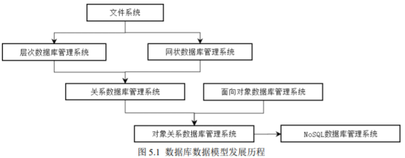

# 空间数据组织与管理

## 空间数据库概述

### 数据库基础

##### 数据库

- 长时间存储在计算机内;
- 有组织, 可共享的数据集合;
- 按照数据模型组织和存储;
- 较小的冗余度, 较高的数据独立性和扩展性;

##### 数据库模型

- 非关系模型;
  - 层次模型;
  - 网状模型;
- 关系模型;
- 面向对象模型;
- NoSQL 模型;

##### 数据库数据模型发展

### 空间数据库

**空间数据库**: 存储空间数据的数据库;

##### 特点

- 海量数据特征;
- 数据结构复杂;
- 数据关系多样;
- 数据应用广泛;

##### 分类

- 栅格数据库;
- 矢量数据库;

## 空间数据库设计

### 空间数据库的设计内容

- 给定应用环境;
- 设计最优数据库模型;
- 建立数据库及其应用系统;
- 有效存储数据, 满足应用需求;

### 空间数据库的设计步骤

- 需求分析;
- 概念模型设计;
- 逻辑模型设计;
- 物理模型设计;
- 数据库实施;
- 数据库的运行和维护;

## 空间数据特征与组织

### 空间数据的基本特征

- 空间特征: 空间坐标;
- 非结构化特征: 变长记录;
- 空间关系特征;
- 多尺度与多态性;
- 分类编码特征;
- 海量数据特征;

### 空间数据组织

**空间数据组织**: 空间数据储存的逻辑形式;

---

**空间数据的分层组织**

##### 分层依据

- 数据类型;
- 专题内容;
- 几何要素类型;
- 时间次序;

##### 优点

- 按需选择图层;
- 适用于矢量数据和栅格数据;

**缺点**: 不同层之间处理进行大量叠置操作;

---

**空间数据的分块组织**

##### 分块组织

- 将空间数据区域分割为若干块;
- 按块分别进行空间数据组织;

**优点**: 提高数据存取效率.  
**缺点**: 块之间的衔接处理.  
**与分层组织的关系**: 两者可同时采用, 并不冲突;

---

**空间数据的无缝组织**

##### 几何无缝数据组织

- 几何接边处理, 形式上的无缝;
- 数据组织分块存储;

##### 逻辑无缝数据组织

- 几何无缝数据组织基础之上;
- 逻辑接边处理, 建立逻辑关系;
- 数据组织分块存储;

##### 物理无缝数据组织

- 逻辑无缝数据组织基础之上;
- 物理接边处理, 合并成单一地理要素;
- 单个要素数据组织;

**和分层数据组织的关系**: 可同时使用;

---

**多尺度空间数据组织**

##### 静态方式

- 根据不同比例尺;
- 建立多个空间数据库;

##### 动态方式

- 建立较大比例尺的空间数据库;
- 其他比例尺的空间数据库通过算法自动生成;

##### 混合方式

- 建立少量不同比例尺的空间数据库;
- 其他比例尺的空间数据库通过算法自动生成;

---

##### 属性数据组织

- 与工作层对应的组织方式;
- 与地物类对应的组织方式;
- 混合方式;

## 空间数据管理

**空间数据管理**: 空间数据储存的物理形式;

### 矢量数据的管理

##### 矢量数据管理

- 矢量数据分为空间数据和属性数据;
- 空间数据不适合关系数据库, 属性数据适合;

---

##### 文件-关系数据库混合管理

- 文件系统管理空间数据;
- 关系数据库管理属性数据;
- 两者通过标识码连接;

---

##### 全关系型数据库管理

- 关系型数据库管理空间数据和属性数据;
- 使用关系数据库标准连接机制连接;

---

##### 对象-关系数据库管理

- 关系数据库中进行扩展;
- 直接管理非结构化的空间数据;

### 栅格数据的管理

**文件管理方式**: 采用文件方式管理栅格数据及其元数据;

---

##### 文件-数据库管理方式

- 采用文件方式管理栅格数据;
- 元数据存储在数据库中;

---

##### 关系数据库管理

- 栅格数据存储在二进制变长字段中;
- 元数据存储在对应关系表中;

### 时空大数据管理

##### 数据来源

- 基础测绘数据;
- 遥感图像数据;
- 导航定位数据;
- 互联网数据, 物联网数据;

**管理形式**: 分布式存储;

## 空间数据检索

### 空间数据索引概述

##### 索引

- 对数据库表中一列或多列的值进行排序的数据结构;
- 使用索引提高数据查询效率;

##### 空间索引

- 依据空间位置, 形状, 空间关系;
- 按一定顺序排列的数据结构;

### 空间数据索引算法

**对象范围索引**: 记录每个空间实体的外接矩形的最大最小坐标;

##### 查询方式

- 根据外接矩形范围, 寻找预检索窗口内的空间实体;
- 对检索窗口的空间实体作进一步判断;

---

##### 格网索引

- 将研究区域用划分格网;
- 记录各格网包含的空间实体;

##### 检索方法

- 计算检索对象所在格网;
- 在对应格网检索;

---

##### 四叉树空间索引

- 将研究区域进行四叉树分割;
- 使每个子块包含单个实体;

---

##### R 树

- 利用单个实体的外接矩形;
- 空间位置相近的外接矩形重新组织成一个更大的虚拟矩形;
- 采用树状结构存储;

---

##### R+ 树

- 对 R 树的改进;
- 允许虚拟矩形可以相互重叠并分割下层虚拟矩形;
- 允许一个空间实体被多个虚拟矩形包围;

### 空间数据库查询语言

**SQL**: 介于关系代数和关系演算之间的结构化查询语言;
