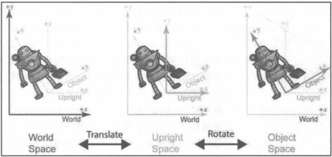

# 坐标空间

## 为什么需要多个坐标空间

##### 原因

- 某些信息仅在特定坐标系中是已知的;
- 例如一个点 a, 我们可能不知道其在世界坐标系中的位置;
- 但我们或许表达 a 相对于其他坐标系的位置;

## 有用的坐标空间

##### 世界空间(全局坐标空间/通用坐标空间)

- 坐标: 球面坐标;
- 原点: [0, 0];

##### 对象空间(体空间)

- 与特定对象关联的坐标空间;
- 每个对象都有自己独立的对象空间;

##### 相机空间

- 与用于渲染的视点相关联的对象空间;
- 使用左手坐标系;
- 原点为相机;

##### 直立空间

- 世界空间和对象空间转换的中间坐标空间;
- 直立空间轴线与世界空间平行;
- 直立空间原点和对象空间原点重合;

##### 直立空间的转换

- 对象空间 - 直立空间: 旋转;
- 直立空间 - 世界空间: 平移;

## 基向量和坐标空间转换

##### 基向量

- p, q, r 是三维空间的基向量;
- v 为基向量的线性组合;
- 世界空间的基向量一般为 [1, 0, 0], [0, 1, 0], [0, 0, 1]

$$v=xp+yq+zr$$

##### 良好的基向量

- 一般选择相互垂直的基向量;
- Span(p, q, r) 线性无关;

##### 正交基

- 相互垂直的基向量;

##### 标准正交基

- 单位长度的正交基;

##### 转换公式

- 已知对象空间在直立空间表示的标准正交基为 p, q, r;
- u 为直立空间中的坐标;
- b 为对象空间的坐标;

$u_x = bp \qquad u_y= bq \qquad u_z = br$
