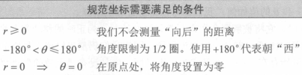
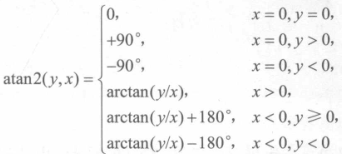

# 极坐标系

## 二维极坐标空间

### 使用二维极坐标定位点

##### 定位点

- $(r,\theta)$

##### 角度

- 以 x 正方向为起始方向;
- 逆时针旋转为正方向;

### 别名

##### 别名

- 同一个点可以使用无限多个极坐标描述;

##### r 的取值范围

- $[-\infty, \infty]$;
- 当 r < 0 时被认为向后移动;

##### 角度的取值范围

- $[-\infty, \infty]$;

##### 规范坐标

- 一个点首选的极坐标描述方式;

##### 转换方法

### 笛卡尔坐标和极坐标的转换

##### 笛卡尔坐标和极坐标的转换

- 其中角度需要修正;

$$x=r\cos\theta \qquad y = r\sin\theta$$
$$r = \sqrt{x^2 + y^2}$$
$$\theta = \arctan(\frac{y}{x})$$

## 三维极坐标空间

### 圆柱坐标

##### 圆柱坐标

- $(r,\theta, z)$;

### 球面坐标

##### 球面坐标

- 右手坐标系;
- $(r, \theta, \phi)$;
- 依次为距离, 方位角, 天顶角;

##### 方位角

- 起始方向对应于 +x;
- +y 的右手坐标系为正方向;

##### 天顶角

- 起始方向对应于 +z;
- +x 的右手坐标系为正方向;

### 图形学中球面坐标的转换

##### 原因

- 左手坐标系和右手坐标系的差异;

##### 图形学中球面坐标的转换

- 水平角度重命名为 h;
  - 起始方向对应于 +z;
  - +y 的左手坐标系为正方向;
- 垂直角度重命名为 p;
  - 起始方向对应于 +x;
  - +x 的左手坐标系为正方向;

### 球面坐标的别名

##### 规范坐标

##### 转换方法

### 笛卡尔坐标和极坐标的转换

##### 右手坐标系

$$x=r\sin\phi\cos\theta \qquad y = r\sin\phi\sin\theta \qquad z=r\cos\phi$$

##### 左手坐标系

$$x=r\cos p\sin h \qquad y=-r\sin p \qquad z=r\cos p\cos h$$
$$r=\sqrt{x^2+y^2+z^2}$$
$$h=atan2(x,z)$$
$$p=\arcsin(\frac{-y}{r})$$

## 使用极坐标指定向量

##### 使用极坐标指定向量

- 等效于笛卡尔坐标系;
