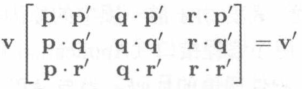
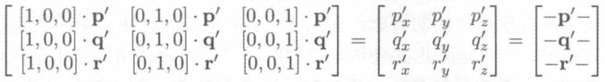
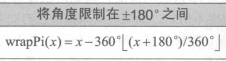
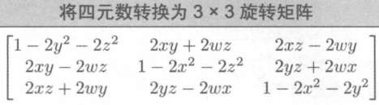

# 三维旋转

## 定向

##### 定向和方向的区别

- 方向可以使用两个参数表示 (极坐标);
- 定向需要三个参数 (欧拉角);

## 矩阵形式

### 矩阵的选择

##### 矩阵的选择

- 使用直立空间坐标的表示的对象空间的正交基构成的 3 \* 3 矩阵表示;

##### 对象空间坐标和直立空间坐标的转换

- 假设对象空间坐标, 直立空间坐标, 旋转矩阵依次为 o, u, m;

$$u = o \cdot m$$
$$o = u \cdot m^{-1}$$

### 方向余弦矩阵

##### 方向余弦矩阵和旋转矩阵的关系

- 两者相同;
- 方向余弦矩阵只是一种解释旋转矩阵的方式;

##### 旋转矩阵的元素值

- 旋转矩阵元素值为当前空间对应轴与目标空间对应轴的点积;
- 若两个空间的基向量都为标准正交基;
  - 当前空间的基向量使用目标空间的基向量表示;
- 故旋转矩阵元素值为两个空间对应基向量的夹角;

### 矩阵形式的优缺点

##### 矩阵形式的优点

- 可以直接在对象空间和直立空间之间转换;
- 可以嵌套多个坐标之间的转化关系;
- 可以通过矩阵求逆反向计算;

##### 矩阵形式的缺点

- 占用更多的空间, 数据冗余;
- 人类难以使用;

## 欧拉角

### 欧拉角约定

##### 欧拉角

- 围绕对象空间 3 个垂直轴的三个夹角;
- 首先将对象空间和直立空间的轴对齐;
- 依次为航向角 (方位角), 俯仰角和翻滚角, 即 +y, +x, +z 的夹角;
- 使用左手坐标系: +x 向右, +y 向上, +z 向前;
- 正方向使用左手旋转;

##### 名称

- 航向角 - 俯仰角 - 翻滚角;
- Yaw-Pitch-Roll;
- Heading-Pitch-Bank;

### 固定轴

##### 固定轴

- 旋转轴始终为直立空间的 3 个垂直轴;

##### 旋转顺序

- 依次为翻滚角, 俯仰角和航向角 (方位角), 即 +z, +x, +y 的夹角;
- 旋转顺序和欧拉角相反;
- 固定轴称其为外旋;
- 欧拉角称其为内旋;

### 欧拉角的优缺点

##### 欧拉角的优点

- 易于人类使用;
- 数据容易压缩;
- 任意一组 3 个数字都有效;

##### 欧拉角的缺点

- 定向的表示不是唯一的;
  - 角度可以任意添加 2pi;
  - 通过调整旋转顺序和旋转轴, 可以得到不同的表示方法: 万向节死锁;
- 两个定向之间的插值由于定向的表示不唯一, 具有问题;

##### 欧拉角的规范化

##### 定向插值的优化公式

- 一定使用规范化的欧拉角;
- 限制旋转角度在 180 度;

## 轴-角和指数映射

##### 欧拉旋转定理

- 任意两个定向 r1, r2;
- 都存在唯一的轴 n;
- 使得围绕 n 旋转一次即可从 r1 到 r2;

##### 轴-角

- 设旋转角 $\theta$ 和过原点的旋转轴, 该轴平行于单位向量 $\hat{n}$;

##### 指数映射

- $e = \theta \hat{n}$ 为使用指数映射描述轴-角形式的角位移;
- $\theta = ||e||$;

## 四元数

### 四元数表示法

##### 四元数表示法

- 标量分量 + 向量分量;
- [w, (x, y, z)];
- [w, **v**];

##### 意义

$$q = [w \quad v] = [\cos(\frac{\theta}{2}) \quad \sin(\frac{\theta}{2})\hat{n}]$$
$$q = [w \quad (x,y,z)] = [\cos(\frac{\theta}{2}) \quad \sin(\frac{\theta}{2})n_x \quad \sin(\frac{\theta}{2})n_y \quad \sin(\frac{\theta}{2})n_z]$$

### 四元数变负

##### 四元数变负

- -[w, (x, y, z)] = [-w, (-x, -y, -z)] = -[w, v] = [-w, -v];
- 四元数变负表示相同的角位移;

### 单位四元数

##### 单位四元数

- [1 **0**];
- [-1 **0**];

### 四元数的大小

##### 四元数的大小

$$||q|| = \sqrt{\omega^2 + x^2 + y^2 + z^2} $$

### 四元数的共轭和逆

##### 四元数的共轭

$$q^* = [w \quad -v] = [w \quad (-x,-y,-z)]$$

##### 四元数的逆

$$q^{-1}=\frac{q^*}{||q||}$$
$$q^{-1} \cdot q = [1,0]$$

### 四元数乘法

##### 四元数乘法

$$q_1q_2 = [\omega_1 \quad v_1][\omega_2 \quad v_2] = [\omega_1\omega_2 - v_1 \cdot v_2 \quad \omega_1v_2 + \omega_2v_1 + v_1 \times v_2]$$

##### 四元数的结合律和交换律

$$(ab)c = a(bc)$$
$$ab \neq ba$$

##### 四元数乘积的大小

$$||q_1q_2||=||q_1||||q_2||$$

##### 四元数乘积的倒数

$$(q_1 \cdots q_n)^{-1} = q_n^{-1}\ \cdots q_1^{-1}$$

##### 使用四元数乘法旋转三维矢量

- 设四元数 q 和三维向量 p;
- p 围绕 $\hat{n}$ 转换 $\theta$

$$p'=qpq^{-1}$$

##### 四元数连接多个旋转

$$p'=(q_1q_2)p(q_1q_2)^{-1}$$

### 四元数的差

##### 四元数的差

- 给定方向 a 和 b;
- 计算 a 到 b 旋转的角位移 d;

$$da=b$$
$$d=ba^{-1}$$

### 四元数点积

##### 四元数点积

$$q_1 \cdot q_2 = [\omega_1 \quad v_1][\omega_2 \quad v_2] = \omega_1\omega_2 + v_1 \cdot v_2$$

### 四元数的对数, 指数和标量乘法

##### 使用半角定义四元数

$$\alpha = \frac{\theta}{2} \qquad q = [\cos\alpha \quad \hat{n}\sin\alpha]$$

##### 四元数的对数

$$logq = log([\cos\alpha \quad \hat{n}\sin\alpha]) \equiv [0 \quad \alpha\hat{n}]$$

##### 四元数的指数函数

$$expp=exp([0 \quad \alpha\hat{n}]) = [\cos\alpha \quad \hat{n}\sin\alpha]$$

##### 四元数对数和指数的性质

$$exp(logq)=q$$

##### 四元数乘以标量

$$kq=k[\omega v]=[k\omega kv]$$

### 四元数指数

##### 四元数指数

$$q^t$$

##### 最短弧

- 四元数使用最短弧表示角度位移;
- 若 q 为绕 x 轴顺时针旋转 30 度;
- q^8 并不是绕 x 轴顺时针旋转 240 度, 而是 绕 x 轴逆时针旋转 120 度;

##### 四元数取幂公式

$$q^t=exp(tlogq)$$

### 四元数插值

##### 理论上的四元数 Slerp 公式

$$slerp(q_0,q_1,t)=(q_1q_0^{-1})^tq_0$$

##### 实际的四元数 Slerp 公式

$$slerp(q_0,q_1,t)=\frac{\sin(1-t)\omega}{\sin\omega}q_0+\frac{\sin t\omega}{\sin\omega}q_1$$

### 四元数的优缺点

##### 优点

- 平滑插值;
- 角位移的快速连接和逆;
- 矩阵形式的快速转换;
- 仅有四个数字;

##### 缺点

- 存储空间略大于欧拉角;
- 可能无效;
- 人类难以使用;

### 四元数概要

##### 四元数概要

- 四元数通过旋转轴和围绕旋转轴的量表示角位移;
- 四元数包括标量分量和向量分量;
- 三维的每个角位移具有两种不同的四元数表示, 两者互为倒数;
- 表示无角度的四元数为单位四元数;
- 所有表示角位移的四元数都是单位四元数, 大小为 1;
- 四元数的共轭表示相反的角位移;
- 四元数乘法可以链接多个旋转;
- 四元数取幂用于计算角位移的倍数, 总是采用最短的弧;

## 表示方法之间的转换

### 基础

##### 总览

### 欧拉角和矩阵的转换

##### 欧拉角转换为对象空间到直立空间的旋转矩阵

- 使用固定轴旋转;

##### 欧拉角转换为直立空间到对象空间的旋转矩阵

- 使用固定轴旋转;
- 对象空间到直立空间的转换的旋转矩阵的转置矩阵;

##### 矩阵转换为欧拉角

$$p = \arctan2(-m_{32})$$
$$h = \arctan2(m_{31}, m_{33})$$
$$b = \arctan2(m_{12}, m_{22})$$

### 四元数和矩阵的转换

##### 四元数转换为矩阵

##### 矩阵转换为四元数

- 选择绝对值最大的作为起始值;

### 欧拉角和四元数的转换

##### 欧拉角转换为对象空间到直立空间的四元数

##### 欧拉角转换为直立空间到对象空间的四元数

- 欧拉角转换为对象空间到直立空间的四元数求共轭;

##### 四元数转换为欧拉角

