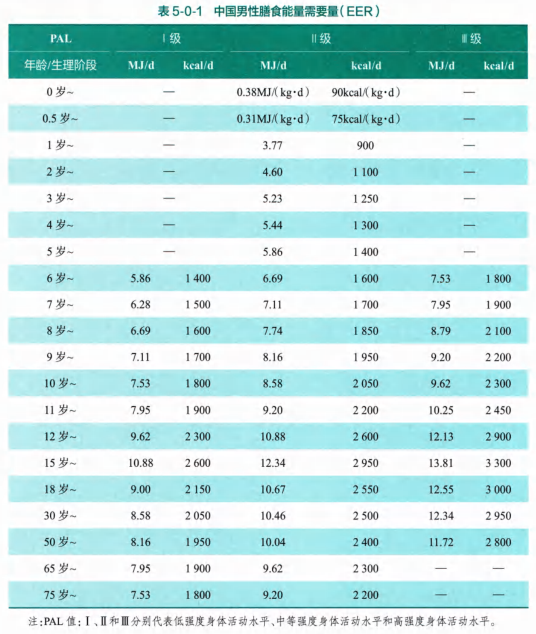
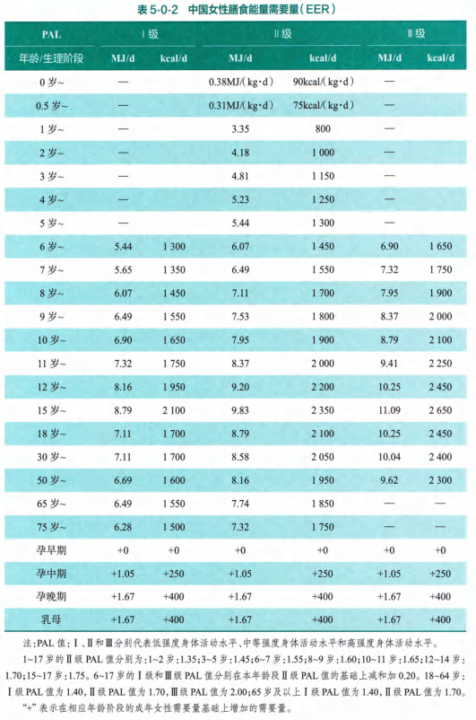

// ANKI

# 营养学

## 基础概念

##### 膳食营养素

- 必需营养素；
- 条件必需营养素：特定人群的必需营养素；
- 其他膳食成分；

##### 人体必需营养素

| 氨基酸   | 脂肪酸   | 碳水化合物 | 常量元素 | 微量元素 | 维生素            | 水  |
| -------- | -------- | ---------- | -------- | -------- | ----------------- | --- |
| 异亮氨酸 | 亚油酸   | 碳水化合物 | 钾       | 碘       | 维生素 A          |     |
| 亮氨酸   | α-亚麻酸 |            | 钠       | 硒       | 维生素 D          |     |
| 赖氨酸   |          |            | 钙       | 铜       | 维生素 E          |     |
| 蛋氨酸   |          |            | 镁       | 钼       | 维生素 K          |     |
| 苯丙氨酸 |          |            | 磷       | 铬       | 维生素 B1(硫胺素) |     |
| 苏氨酸   |          |            | 氯       | 钴       | 维生素 B2(核黄素) |     |
| 色氨酸   |          |            |          | 铁       | 烟酸 B3           |     |
| 缬氨酸   |          |            |          | 锌       | 维生素 B6         |     |
| 组氨酸   |          |            |          |          | 叶酸 B9           |     |
|          |          |            |          |          | 维生素 B12        |     |
|          |          |            |          |          | 泛酸 B5           |     |
|          |          |            |          |          | 生物素 B7         |     |
|          |          |            |          |          | 胆碱 B4           |     |
|          |          |            |          |          | 维生素 C          |     |

##### 膳食营养素参考摄入量

- EAR：平均摄入量；
- RNI：推荐摄入量；
- AI：适宜摄入量，由于 RNI 无法明确，通过观测或实验获得的摄入量；
- UL：可耐受最高摄入量；
- AMDR：宏量营养素可接受范围，指脂肪、蛋白质和碳水的摄入范围；
- PI/SPL：降低相关疾病风险的摄入量；

## 能量

### 中国居民膳食能量需要量（EER）

### 能量来源与消耗

##### 能量来源

- 碳水化合物（50-65%）；
- 脂肪（20-30%）；
- 蛋白质（10-20%）；

##### 能量消耗

- 基础代谢；
  - 体型；
  - 年龄；
  - 性别；
  - 内分泌；
  - 应激状态；
- 身体活动；
- 食物热效应：摄食过程的能量消耗；
- 生长发育；
- 妊娠；
- 哺乳；

### 摄入水平

- 摄入不足；
- 摄入过量：超重、肥胖、慢性病；

### 营养状况评价

- 体质指数（BMI）；

## 补剂

### 规划

- 午餐：钙镁锌 + 维生素 d + 叶黄素；
- 晚餐：复合维生素 + 维生素 c + 番茄红素；
- 睡前：nac + 甘氨酸镁；

### 钙镁锌

- 补充钙；
- 随餐服用；
- kirkland 钙镁锌：100/500 粒 === \w.\w/d；

### 维生素 d

- 抗氧化；
- 随餐服用；
- nature bell 阳光瓶：150/240 粒 === \w.\w/d；

### 叶黄素

- 护眼，抗氧化；
- 随餐服用；
- 普丽普莱叶黄素：70/120 粒 === \w.\w/d；

### 复合维生素

- 补充各种营养物质；
- 随餐服用；
- kirkland 复合维生素：120/500 粒 === \w.\w/d；

### 番茄红素

- 前列腺，抗氧化；
- 随餐服用；
- 普丽普莱番茄红素：100/200 粒：\w.\w/d；

### 维生素 c

- 抗氧化；
- 随餐服用；
- otc 维生素 c 片：2/100 粒 === \w.\w5/d；

### 镁

- 助眠，维生素 d 消耗镁；
- 睡前服用；
- doctor best 甘氨酸镁：130/240 粒 === \w.\w/d；

### nac

- 助眠 + 抗氧化 + 护肝肾；
- 睡前服用；
- now nac：71/60 粒 === \w.\wd/d；

## 食物

### 概述

- 能量需求：2400 大卡；
- 物质配比：碳水（40%）+ 脂肪（35%）+ 蛋白质（25%）；

### 通用要求

- 饮食顺序：蔬菜 + 肉类 + 主食；

### 二餐计划

##### 饮食计划

- 午餐：什么都有；
- 晚餐：代餐；

##### 代餐配比

- 燕麦 60 g；
- 全脂奶粉 50 g；
- 鸡蛋 2 个；
- 核桃 3 颗；
- 果蔬粉 15 g；
- 奇亚籽 10 g；
- 果糖 10 g；

##### 制作及食用

- 100 ml 温水浸泡奶粉、奇亚籽和果蔬粉；
- 150 ml 热水浸泡麦片，等温度降低至温水；
- 奶粉混合物倒至麦片；
- 先吃鸡蛋、核桃，在等待麦片降温的时间；
- 后吃麦片混合物；

### 三餐计划

##### 饮食计划

- 早餐：代餐
- 午餐：什么都有；
- 晚餐：不吃主食；

##### 代餐配比

- 全脂奶粉 40 g；
- 鸡蛋 2 个；
- 核桃 3 颗；
- 果蔬粉 15 g；
- 奇亚籽 10 g；

##### 制作及食用

- 同二餐；
