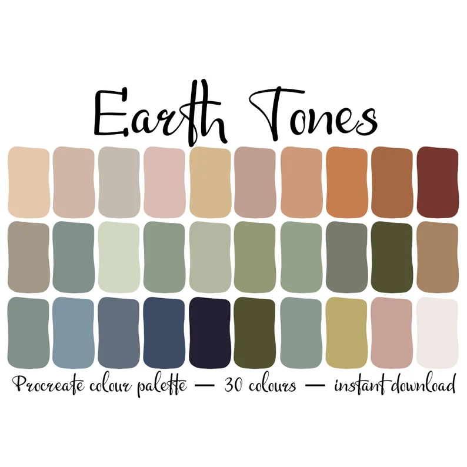

# 衣服

## 尺寸

##### 打底衫

- 胸围: 100 cm;
- 肩宽: 50 cm;

##### 内搭

- 胸围: 110 cm;
- 肩宽: 50 cm;

##### 外套

- 胸围: 120 cm;
- 肩宽: 50 cm;

##### 裤子

- 长度: 110 cm;
- 腰围: 85-90 cm;
- 臀围: 105-110 cm;

##### 鞋子

- 长度: 28 / 28.5 cm;

## 配色

##### 基本原则

- 白色/灰色/黑色/大地色;

##### 鞋

- 黑/白;

##### 裤子

- 深色为主;
- 黑/大地色;

##### 内搭

- 浅色为主;
- 白/灰/大地色;

##### 外套

- 黑/大地色;
