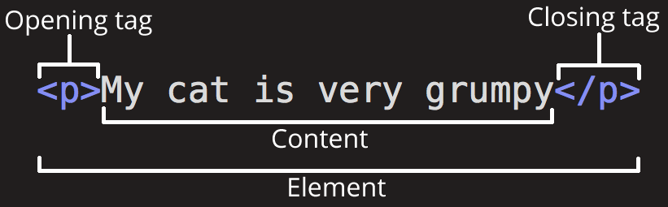
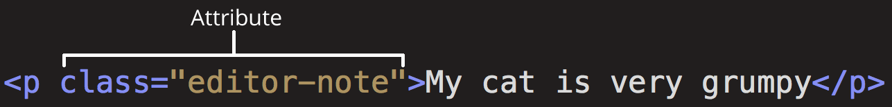

# html 基础

## html 语法

##### html 注释

```html
<!-- commentary -->
```

##### 引号中表示引号

```html
<!-- 不同种类引号嵌套使用 -->
<p id="''">test</p>
<p id='""'>test</p>
<!-- 使用转义字符 -->
&quot; `&apos;`
```

##### 空格的数量机制

- 无论多少个空格，
- 都视为一个空格。

##### 转义字符

| 特殊符号 | 转义字符 |
| -------- | -------- |
| \<       | `&lt;`   |
| >        | `&gt;`   |
| "        | `&quot;` |
| '        | `&apos;` |
| &        | `&amp;`  |

## html 标签

##### html element 组成

- opening tag；
- closing tag；
- content。



##### 块级标签

- 自动换行且独占一行；
  - 无论宽度都独占一行；
  - 行内 + 块级 or 块级 + 行内 or 块级 + 块级都是两行；
- 不可嵌套于 inline element，可嵌套于 block-level elements；
- 常见的块级标签：div/p.hx/li/table/header/main。。。

##### 行内标签

- 无法设置宽高，通过文本内容确定，不换行；
- 可嵌套于 block-level elements 和 inline element；
- 常见的行内标签：span/a/img/input/button。。。

##### empty element

- 仅包含单个 tag；
- img。。。

## html 属性

### html 属性基础



### 常见属性

#### id 属性

- 标识元素，不能包含空白，唯一值；
- 基于 `id#value` 或 `id=value` 引用；

```html
<p id="exciting">The most exciting paragraph on the page. One of a kind!</p>
```

## 响应式设计

### 基础

- 根据用户行为和设备环境；
- 使用不同的页面布局和资源；

### meta 标签

- 用于检查不同设备屏幕尺寸；

```html
<meta
  name="viewport"
  content="width=device-width, initial-scale=1, maximum-scale=1, user-scalable=no"
/>
```

### 媒体查询

- 基于媒体查询使用不同布局，元素尺寸；

### 相对尺寸

- 使用百分比/rem/vx 等相对尺寸；
- 实现弹性布局；

### 响应式多媒体

- 基于 source 标签或 srcset 属性实现响应式多媒体；

## html5 新特性

- 语义化标签；
- 视频和音频标签；
- 表单元素；
- canvas 标签；
- svg 标签；
- web 存储；
- worker；
- WebSocket；
- 拖动 API；
- history API；
