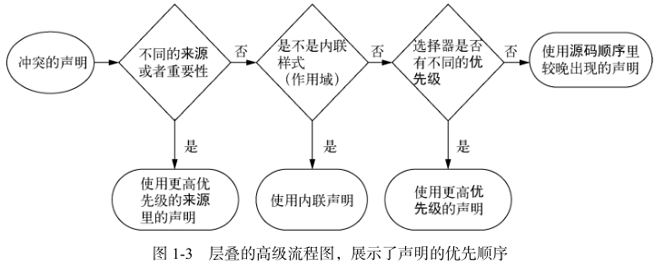

# 层叠, 优先级和继承

## 层叠

### 基础

##### 层叠

- css 规则发生冲突时;
- 如何解决冲突;

##### 机制

- 样式表的来源;
- 选择器优先级;
- 源码顺序;



### 样式表的来源

##### 样式表种类

- 浏览器默认 style sheet;
- 用户 style sheet;
- 第三方 style sheet;
- 第三方 style sheet 中的 !important 声明;
- 用户 style sheet 中的 !important 声明;
- 浏览器默认 style sheet 中的 !important 声明;

##### !important

- 无视特殊性和优先级,
- 强行将 !important 对应的样式,
- 设置为标签样式;

```css
#winning {
  background-color: red;
  border: 1px solid black;
}

.better {
  background-color: gray;
  border: none !important;
}
```

### 优先级

##### 选择器优先级

- Identifiers + Classes + Elements,
  - Identifiers: ID 选择器;
  - Classes: 类选择器, 属性选择器, 伪类;
  - Element: 元素选择器, 伪元素选择器;
- 越大优先级越高;

| 选择器        | Identifiers | Classes | Elements | 特殊性 |
| ------------- | ----------- | ------- | -------- | ------ |
| h1            | 0           | 0       | 1        | 001    |
| p.class       | 0           | 1       | 0        | 010    |
| h1 + p[class] | 0           | 1       | 1        | 011    |
| \#id          | 1           | 0       | 0        | 100    |

### 经验法则

##### 经验法则

- 不要使用 id;
- 不要使用 !important;

## 继承

### 基础

##### 继承

- 子标签继承父标签的属性;

##### 可继承属性和不可继承属性

- 可继承属性: 样式;
  - font 相关;
  - color 相关;
  - text 相关;
  - list 相关;
- 不可继承属性: 布局, 尺寸;
  - 盒子模型相关;
  - position 相关;
  - float 相关;
  - display 相关;

### 特殊值

##### inherit

- 表明子标签使用父标签对应样式

```css
#sidebar h2 {
  color: inherit;
}
```

##### initial

- 表明子标签使用浏览器默认值;

```css
#sidebar h2 {
  color: initial;
}
```

##### 其他属性

- unset;
- revert;
- all;

## 简写属性

##### 简写属性

- 同时给多个属性复制的属性;

```css
font: italic bold 18px/1.2 "Helvetica", "Arial", sans-serif;
```

##### 简写属性会默默覆盖其他样式

- 简写属性隐式设置省略值;
- 可能覆盖其他样式定义的值;

##### 理解简写属性的顺序

- 简写属性尽量无视顺序;
- 上下左右;
  - 1: 全部;
  - 2: 上下, 左右;
  - 3: 上, 左右, 下;
  - 4: 上, 下, 左, 右;
- 水平竖直: 水平, 竖直;
