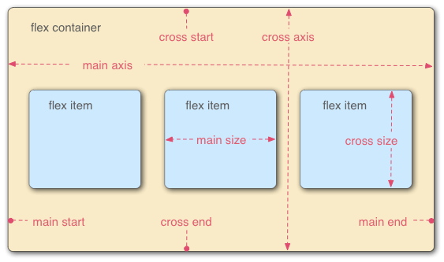

# flexbox

## flex 模型

- main axis;
  - main start;
  - main end;
- cross axis;
  - cross start;
  - cross end;
- flex container;
- flex items;
- main size;
- cross size;



## flex-flow 属性

### 基础

##### 作用

- 设置 flex main-axis 方向和换行方向;

```css
element {
  flex-flow: column;
}

element {
  flex-flow: column-reverse wrap;
}
```

##### 成分属性

- flex-wrap 属性;
- flex-direction 属性;

##### 简写机制

- flex-wrap;
- flex-direction;
- flex-wrap + flex-direction;

### flex-direction 属性

##### 作用

- 设置 flex items main-axis 方向;

```css
#col-rev {
  flex-direction: column-reverse;
}
```

#### 属性值

##### row

- 默认值, 按行排列;
- 从 block-start 到 block-end;

##### row-reverse

- 按行排列;
- 从 block-end 到 block-start;

##### column

- 按列排列;
- 从 inline-start 到 inline-end;

##### column-reverse

- 按列排列;
- 从 inline-end 到 inline-start;

### flex-wrap 属性

##### 作用

- 设置 flex item 换行;

```css
.content {
  display: flex;
  flex-wrap: wrap;
}
```

#### 属性值

##### nowrap

- 默认值;
- 不换行;

##### wrap

- 自动换行;
- 从 main-start 到 main-end;

##### wrap-reverse

- 自动换行;
- 从 main-end 到 main-start;

## flex 属性

### 基础

##### 作用

- 设置 flex item 拉伸参数;

```css
#flex-container > .flex-item {
  flex: auto;
}
```

##### 成分属性

- flex-grow 属性
- flex-shrink 属性
- flex-basis 属性

##### 简写机制

- auto;
- flex-grow;
- flex-basis;
- flex-grow + flex-shrink;
- flex-grow + flex-basis;
- flex-grow + flex-shrink + flex-basis;

##### 常见属性值

- flex: 1 = flex: 1 1 0%;
- flex: 2 = flex: 2 1 0%;
- flex: auto = flex: 1 1 auto;

### flex-grow 属性

##### 作用

- 设置 flex item 拉伸参数;

```css
.box1 {
  flex-grow: 2;
}
```

##### 机制

- 在 cross/main-axis 方向拉伸;
- 若多个 flex item cross/main-axis 方向大小依次为 a_1, a_2,...a_n
- flex-grow 依次为 b_1, b_2,...b_n 时;
- 当存在剩余空间, 且假设其大小为 x;
- 对应 flex item 大小增加溢出空间 x 的 $\frac{a_i * b_i}{\sum^n_{i=1}{a_i * b_i}}$

##### 属性值

- number 类型;
- flex item flex-grow 默认为 0;

### flex-shrink 属性

##### 作用

- 设置 flex item 拉伸参数;

```css
.box1 {
  flex-shrink: 2;
}
```

##### 机制

- 在 cross/main-axis 方向收缩;
- 若多个 flex item cross/main-axis 方向大小依次为 a_1, a_2,...a_n
- flex-grow 依次为 b_1, b_2,...b_n 时;
- 当 flex item 溢出容器, 且假设其溢出空间大小为 x;
- 对应 flex item 大小缩小溢出空间 x 的 $\frac{a_i * b_i}{\sum^n_{i=1}{a_i * b_i}}$

##### 属性值

- number 类型;
- flex item flex-grow 默认为 1;

### flex-basic 属性

##### 作用

- 设置 flex item 基础尺寸;

```css
.box1 {
  flex-basis: 3px;
}
```

##### 机制

- 设置 flex item 在 cross/main-axis 方向的基础尺寸;

#### 属性值

##### 关键字

- auto:
  - 默认值;
  - 根据 width/height 属性设置;
  - 若无 width/height 属性;
  - 根据容器内容设置;
- content;
  - 根据容器内容设置大小;

##### length 类型

- 不作详述;

##### percentage 类型

- 不作详述;

## order 属性

##### 作用

- 更改 flex/grid item 顺序;

##### 语法格式

```css
main > article {
  flex: 1;
  order: 2;
}
```

##### 属性值

- integer 类型;

##### 排序机制

- order 属性值越小越靠前;

## 垂直/水平对齐

### 方向

- align: cross axis 方向;
- justify: main axis 方向;

### align/justify-items 属性

##### 作用

- 设置 flex/grid 所有 item 的网格对齐样式;
- item 在 flex/gird 网格中的 cross/main axis 位置;
- justify-items 在 flex 无效;
  - flex 为一维结构;
  - flex 在 main axis 无网格概念;

```css
.flex {
  align-items: center;
}
```

#### 属性值

##### normal

- 替换元素: start;
- 其余元素: stretch;

##### stretch

- cross/cross/main-size 拉伸;
- margin box edges 和 outline edges 对齐;

##### center

- 垂直居中;

##### start

- 标签与其容器的 cross/cross/main-start edge 对齐;

##### end

- 标签与其容器的 cross/cross/main-end edge 对齐;

##### flex-start

- flex 标签的 cross/cross/main-start margin edges 与 outline 的 cross/cross/main-start edge 对齐;

##### flex-end

- flex 标签的 cross/cross/main-end margin edges 与 outline 的 cross/cross/main-end edge 对齐;

### align/justify-self 属性

##### 作用

- 设置单个 flex/grid item 对齐样式;

```css
.flex-items {
  align-self: stretch;
}
```

##### 属性值

- 同 align-item 属性;

### align/justify-content 属性

##### 作用

- 设置 flex/grid 的 item 内部内容的对齐样式;
- item 内容在 item 盒子模型的对齐位置;

```css
#container {
  display: flex;
  justify-content: space-between; /* Can be changed in the live sample */
}
```

#### 属性值

##### normal

- flex/gird: stretch;

##### stretch

- cross/main-size 拉伸;
- margin box edges 和 outline edges 对齐;

##### center

- 水平居中;

##### start

- 标签与其容器的 cross/main-start edge 对齐;

##### end

- 标签与其容器的 cross/main-end edge 对齐;

##### flex-start

- flex 标签的 cross/main-start margin edges 与 outline 的 cross/main-start edge 对齐;

##### flex-end

- flex 标签的 cross/main-end margin edges 与 outline 的 cross/main-end edge 对齐;

##### left

- 标签与其容器的 left edge 对齐;

##### right

- 标签与其容器的 right edge 对齐;

##### space-between

- 沿 cross/main-axis 水平分布;
- item 之间间距相等;
- 两端 item 与容器两端对齐;

##### space-around

- 沿 cross/main-axis 水平分布;
- item 之间间距相等;
- 两端 item 与容器两端间距为 item 之间间距的一半;

##### space-evenly

- 沿 cross/main-axis 水平分布;
- item 之间间距相等;
- 两端 item 与容器两端间距和 item 之间间距相同;
