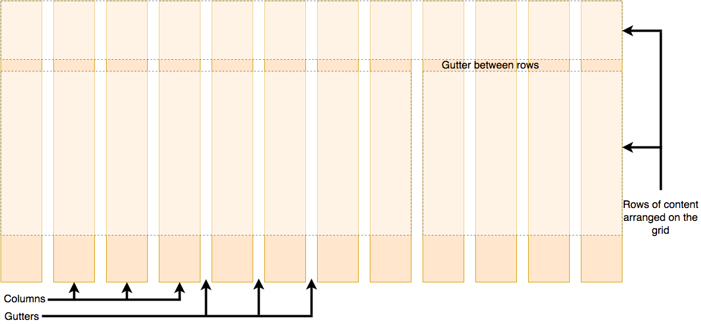
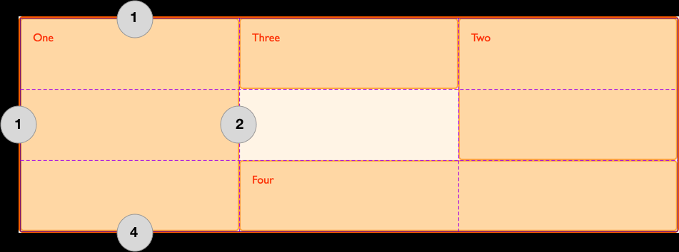

# grid

## grid 布局

### 组成部分

- rows；
- columns；
- gutters：columns 和 rows 之间的空隙；

### 示意图



### grid 属性值

##### 作用

- 容器创建 grid 布局；

```css
.container {
  display: grid;
}
```

## grid-template-rows 属性

##### 作用

- 设置 grid 行名 (custom-ident)；
- 设置 grid 行轨道大小；

```css
.container {
  grid-template-rows: 1fr 2fr 1fr;
}

.container {
  grid-template-rows: [linename1] 100px [linename2 linename3];
}
```

#### 属性值

##### none

- 使用 grid-auto-rows 属性；

##### [linename]

- 设置 grid 行名；
- 名称除保留字之外的有效字符串；
- 同一行可取多个行名，包裹在同一[] 下，，分隔；

```css
.container {
  grid-template-rows: [linename1] 100px [linename2 linename3];
}
```

##### length 类型

- 非负值；

##### percentage 类型

- 非负值；

##### flex 类型

- 非负值；
- 设置各轨道 flex 比例系数，fr 后缀；
- 单独使用视为 minmax(auto，flex)；

##### max-content

- 设置尽可能大的最大宽度；

##### min-content

- 设置尽可能大的最小宽度；

##### minmax(min, max)

- 不作详述；

##### auto

- 单独使用视为 minmax(min-content，max-content)；

##### repeat()

- 不作详述；

## grid-template-columns 属性

- 同 grid-template-rows 属性；
- 将行换做列即可；

## grid-auto-rows 属性

##### 机制

- 当无 grid-template-rows 属性；
- 或其属性值为 none 时；
- 自动使用 grid-auto-rows 属性；

```css
#grid {
  display: grid;
  grid-auto-rows: 100px;
}
```

#### 属性值

- 同 grid-template-row；

## grid-auto-columns 属性

- 同 grid-auto-rows 属性；
- 将行换做列即可；

## repeat() 函数

##### 作用

- 作为 grid-template-rows(columns) 的属性值；
- 使用更简洁的方式表示重复的 track list 参数；

- repeat count + tracks；
  - repeat count；
    - int；
    - auto-fill；
    - auto-fit；
  - tracks；
    - tracks size；
- 可存在多个 tracks sizes；
  - 空格分隔；
  - 表示 abc，abc 形式，依次重复多个 tracks sizes；

```css
#container {
  display: grid;
  grid-template-columns: repeat(2, 50px 1fr) 100px;
}
```

##### 尽可能多的列

- 使用 repeat() 函数；
- 使用 auto-fill；
- 使用 minmax()；
  - 第一个参数为设置的最小值；
  - 第二个参数为 1fr，自动拉伸；

```css
.container {
  display: grid;
  grid-template-columns: repeat(auto-fill, minmax(200px, 1fr));
}
```

##### auto-fill 和 auto-fit

- 相同之处；
  - 设置重复次数为尽可能大的数字；
  - 使对应方向不会溢出；
  - 最小为 1；
- 不同之处；
  - 当容器宽度大于所有重复子元素的总宽度；
  - auto-fill 保留空白通道；
  - auto-fit 折叠空白通道；
    - 空白通道空间平均分配给其他通道；

## minmax() 函数

##### 作用

- 用于 gird 布局；
- 设置最大最小值范围；
- minmax(min，max)；

```css
#container {
  display: grid;
  grid-template-columns: minmax(min-content, 300px) minmax(200px, 1fr) 150px;
}
```

## gap 属性

### 作用

- 设置 flex/gird/multiple column 布局 gutters 尺寸；

```css
#flexbox {
  display: flex;
  gap: 20px 5px;
}
```

### 成分属性

- row-gap；
- column-gap；

### 简写机制

- 1 value；
  - gap
  - row-gap = column-gap = gap；
- 2 value：
  - row-gap column-gap；

### column-gap 属性

##### column-gap 属性

- 见 multiple columns；

### row-gap 属性

- 同 column-gap 属性；
- 将列换做行即可；

## 基于网格线的放置

### grid-column 属性

##### 作用

- 设置 grid item 基于 grid column 的位置和尺寸；

##### 定位机制



##### 语法格式

```css
#item {
  grid-column: 2 / 4;
}
```

##### 成分属性

- grid-column-end；
- grid-column-start；

##### 简写机制

- 1 value；
  - grid-colum-start；
- 2 value；
  - gird-colum-start / grid-colum-start；

### grid-column-start 属性

##### 作用

- 设置 grid item 基于 grid column 的起始位置和尺寸；

```css
#item {
  grid-column-start: span 2;
}
```

#### 属性值

##### auto

- 默认值；
- 默认 span 为 1；

##### integer

- 可正可负；
  - 正数：基于正数第 i 列；
  - 负数：基于倒数第 i 列 ；

##### span

- span [int]；
- 若省略 int，默认为 1；
- 表示 grid 横跨 int 个列；
- 单独使用时；
- `grid-column-start: span 2` 等效于 `grid-column: i / span 2`；

```css
#item {
  grid-column-start: 1 / span 2;
}
```

##### custom-ident

- custom-ident 对应列；

### grid-column-end 属性

- 同 grid-colum-start 属性；
- 表示终止位置；

### grid-row 属性

- 同 grid-column；
- 把列换成行；

## 网格区域命名

### grid-template-areas 属性

##### 作用

- 容器命名网格区域，与 grid-row/column，grid area 联合使用；
  - 同一行同一引号包裹；
  - 同一行不同列空格分隔；
  - 不同行引号分隔；

```css
#page {
  display: grid;
  width: 100%;
  height: 250px;
  grid-template-areas:
    "a a ."
    "a a ."
    ". b c";
  grid-template-rows: 50px 1fr 30px;
  grid-template-columns: 150px 1fr;
}
```

##### 原则

- 一旦使用，必须填充所有网格；
- 使用 。视为该网格不命名；
- 命名网格区域必须为矩形；
- 同一命名网格必须相连；

#### 属性值

##### none

- 不定义 grid areas；

##### string

- 除标识符外的有效字符串；

### grid-area 属性

##### 作用

- 指定 grid item 的命名网格区域；
- 设置 grid item 基于 grid column/row 的位置和尺寸；
  - grid-row-start / grid-column-start / grid-row-end / grid-column-end；

```css
/* 指定 grid item 的命名网格区域 */
#page {
  display: grid;
  width: 100%;
  height: 250px;
  grid-template-areas:
    "a a ."
    "a a ."
    ". b c";
  grid-template-rows: 50px 1fr 30px;
  grid-template-columns: 150px 1fr;
}
#item1 {
  grid-area: a;
}
/* 设置 grid item 基于 grid column/row 的位置和尺寸 */
#item1 {
  grid-area: 2 / 2 / auto / span 3;
}
```
