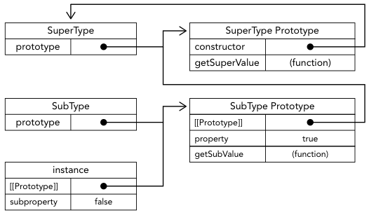
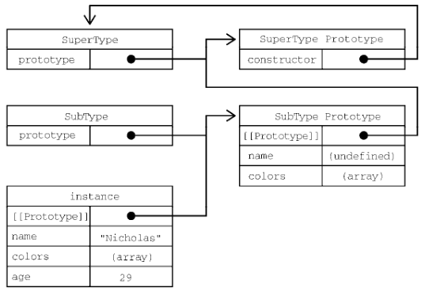
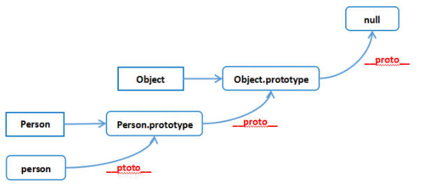

# 对象

## 基础

##### 创建 object

- new 操作符；
- object literal notation (推荐使用)；
- Object.create()

```typescript
let person = new Object();
let person = {};
const person2 = Object.create(person);
```

##### 定义属性

```typescript
let person = new Object();
person.name = "Nicholas";
people["name"] = "Nicholas";
let person = {
  name: "Nicholas";
};
```

##### object 中的属性名转换

- 数字转化为字符串；
- 字符串和标识符转换成标识符；

```typescript
let people = new Object();
people[5] = true;
console.log(people); // { '5': true }

people.name = "kxh";
console.log(people); // { name: 'kxh' }

people["name"] = "kxh";
console.log(people); // { name: 'kxh' }
```

## 对象进阶

### 对象属性

- 表示属性值行为，必须通过 defineProperty() 自定义；
- 属性行为；
  - configurable：表示属性可被删除/重新定义，默认为 true；
  - enumerable：表示属性可枚举，应用于 for-in 循环，默认为 true；
  - writable：表示属性值可被改变，默认为 true；
  - value：表示属性值，默认为 undefined；
  - get：当属性被读时调用的函数，默认值为 undefined；
  - set：当属性被写时调用的函数，默认值为 undefined；
    - 只定义 get，表明只读；
    - 只定义 set，表示只写；

### 对象语法增强

##### 属性值简写

```typescript
// 传统
let name = "Matt";
let person = {
  name: name,
};
// 属性值简写
let name = "Matt";
let person = {
  name,
};
```

##### 可计算属性

```typescript
// 传统
const nameKey = "name";
let person = {};
person[nameKey] = "Matt"; // { name: 'Matt' }
// 可计算属性
const jobKey = "job";
let person = {
  [nameKey]: "Matt",
}; // { name: 'Matt' }
console.log(person); // { name: 'Matt' }
```

##### 简写方法名

```typescript
// 传统
let person = {
  sayName: function (name) {
    console.log("My name is ${name}");
  },
};
// 简写方法名, 广泛应用于 class
let person = {
  sayName(name) {
    console.log("My name is ${name}");
  },
};
```

### Object 解构

##### Object 解构

```typescript
// 未赋值的属性为 undefined
let person = {
  name: "Matt",
  age: 27,
};
let { name, job } = person;
console.log(name); // Matt
console.log(job); // undefined

// 函数参数使用解构
let person = {
  name: "Matt",
  age: 27,
};
function printPerson(foo, { name: personName, age: personAge }, bar) {
  console.log(arguments);
  console.log(personName, personAge);
}
printPerson("1st", person, "2nd");
// ['1st', { name: 'Matt', age: 27 }, '2nd']
// 'Matt', 27
```

## 设计模式

### 工厂模式

```typescript
// 无法自定义返回对象类型
function createPerson(name, age, job) {
  let o = new Object();
  o.name = name;
  o.age = age;
  o.job = job;
  o.sayName = function () {
    console.log(this.name);
  };
  return o;
}
let person1 = createPerson("Nicholas", 29, "Software Engineer");
```

### 构造函数模型

##### 创建构造函数

- 只能使用普通函数形式定义；
- 创建一个新对象；
  - object 的 \[\[prototype\]\] 赋值 constructor function 的 prototype 属性；
  - constructor function 的 this 指向 object；
  - 执行 constructor function 内部代码；
  - 返回 object；
- 不同 Person 实例的 constructor 指向 Person；

```typescript
function Person(name, age, job) {
  this.name = name;
  this.age = age;
  this.job = job;
  this.sayName = function () {
    console.log(this.name);
  };
}

let person1 = new Person("Nicholas", 29, "Software Engineer");
let person2 = new Person("Greg", 27, "Doctor");
console.log(person1.constructor === Person); // true
console.log(person2.constructor === Person); // true
// Person 实例可被表示为自定义类型
console.log(person1 instanceof Person); // true
```

##### 构造函数和普通函数的 this 指向

- 对象函数调用，this 指向 object；
- 普通函数调用时不使用 new()，this 默认指向 global；

```typescript
let person = new Person("Nicholas", 29, "Software Engineer");
person.sayName(); // "Nicholas"
Person("Greg", 27, "Doctor"); // adds to window
window.sayName(); // "Greg"
```

### 原型模式

##### prototype 属性

- prototype 属性包含特定引用类型实例共享的属性和方法；
- prototype 属性的 enumerable 定义为 false，不可枚举

```typescript
function Person() {}
Person.prototype.name = "Nicholas";
Person.prototype.age = 29;
Person.prototype.job = "Software Engineer";
Person.prototype.sayName = function () {
  console.log(this.name);
};
let person1 = new Person();
person1.sayName(); // "Nicholas"
let person2 = new Person();
person2.sayName(); // "Nicholas"
console.log(person1.sayName == person2.sayName); // true
```

##### prototype 属性机制

- 每当创建一个 function，自动定义一个 prototype 属性，指向原型对象；
  - 原型对象为一个 object；
    - 原型对象自动定义一个 constructor 属性；
    - constructor 属性指向 function；
- 若 function 为 constructor function；
  - 根据 constructor function 创建的实例自动定义一个 \[\[prototype\]\]，
  - 实例的 \[\[prototype\]\] 指向 constructor function 的 prototype 属性；
  - 不同实例指向同一个 prototype 属性；
  - \[\[prototype\]\] 在浏览器中往往使用 \_\_proto\_\_ 属性；
- 因为构造函数也有可能是另一个构造函数的示例，从而导致原型链的形成；


##### 对象属性的访问流程

- 一个属性被访问；
- 首先根据其名称在实例本身进行搜索；
- 若未找到，再从实例指向的 prototype 中进行搜索；

##### 重写 prototype 问题

```typescript
// 对象实例仅有对 prototype 的引用
function Person() {}
let friend = new Person();
Person.prototype = {
  constructor: Person,
  name: "Nicholas",
  age: 29,
  job: "Software Engineer",
  sayName() {
    console.log(this.name);
  },
};
friend.sayName(); // error
```


##### 原型链的终点

- Object.prototype 对象；

## 常用 API

##### 创建对象

```typescript
// 创建一个 me 对象, 并将 me.prototype 指向 person
const me = Object.create(person);
```

##### 操作属性

```typescript
// 定义属性种类
// 使用 defineProperty() 定义对象属性
// 三个参数依次为对象, 属性名, 属性描述
Object.defineProperty(object1, "property1", {
  value: 42,
  writable: false,
});
// 定义多个属性种类
const object1 = {};
Object.defineProperties(object1, {
  property1: {
    value: 42,
    writable: true,
  },
  property2: {},
});

// 获取属性描述
const descriptor1 = Object.getOwnPropertyDescriptor(object1, "property1");
console.log(descriptor1.configurable);
console.log(descriptor1.value);
// 获取 object1 所有属性名
console.log(Object.getOwnPropertyNames(object1));
// 获取 object1 所有 symbol 属性
const objectSymbols = Object.getOwnPropertySymbols(object1);

// 合并属性
// 将可枚举的属性浅复制, 合并至目标 object
const target = { a: 1, b: 2 };
const source = { b: 4, c: 5 };
const returnedTarget = Object.assign(target, source); // Object { a: 1, b: 4, c: 5 }

// 判断是否具有实例属性
const object1 = {};
object1.property1 = 42;
// 判断 object1 实例是否具有 property1 属性
console.log(object1.hasOwnProperty("property1"));
```

##### 对象判等

```typescript
// === 的缺陷
// 不同的 0 看作相等
console.log(+0 === -0); // true
// 不同的 NaN 看作不相等
console.log(NaN === NaN); // false
// 使用 is()
console.log(Object.is(-0, 0)); // false
console.log(Object.is(NaN, NaN)); // true
```

##### 原型

```typescript
const bar = new Bar();
// 检验 bar 实例指向的 [[prototype]] 是否是 Bar 的 prototype 属性
console.log(Bar.prototype.isPrototypeOf(bar)); // true
// 获得 bar 实例的 [[prototype]] 属性
Object.getPrototypeOf(bar);
// 设置 bar 实例的 [[prototype]] 属性
Object.setPrototypeOf(bar, { foo: "bar" });
console.log(bar.foo); // "bar"
```

##### 枚举

```typescript
const object1 = {
  a: "somestring",
  b: 42,
  c: false,
};
// 获取 object 所有可被枚举的属性名数组
console.log(Object.keys(object1)); // ["a", "b", "c"]
// 获取 object 所有可被枚举的属性值数组
console.log(Object.values(object1)); //["somestring", 42, false]
// 获取 object 所有可被枚举的属性数组
for (const [key, value] of Object.entries(object1)) {
  console.log(`${key}: ${value}`);
}
```

##### in 操作符

```typescript
// 判断对象是否具有属性, 包括实例属性和原型属性
function Person() {}
Person.prototype.name = "Nicholas";
let person1 = new Person();
console.log("name" in person1); // true

// 判断对象是否具有原型属性
!object.hasOwnProperty(prop) && prop in object;
```

##### 枚举顺序

- 以下操作无明确枚举顺序；
  - for-in；
  - Object.keys()；
- 以下操作有明确枚举顺序
  - 枚举顺序；
    - 先数字属性升序排列，
    - 后字符串和 symbol 根据插入顺序排列。
  - 方法/函数。
    - Object.getOwnPropertyNames()；
    - Object.getOwnPropertySymbols；
    - Object.assign()；

##### 原型和继承关系

```typescript
// instanceof 操作符
console.log(instance instanceof Object); // true
console.log(instance instanceof SuperType); // true
// isPrototypeOf() 方法
console.log(Object.prototype.isPrototypeOf(instance)); // true
console.log(SuperType.prototype.isPrototypeOf(instance)); // true
console.log(SubType.prototype.isPrototypeOf(instance)); // true
```

## 继承

### 原型链

##### 原型链

```typescript
function SuperType() {
  this.property = true;
}
SuperType.prototype.getSuperValue = function () {
  return this.property;
};
function SubType() {
  this.subproperty = false;
}
// 继承 SuperType
SubType.prototype = new SuperType();
// 新方法
SubType.prototype.getSubValue = function () {
  return this.subproperty;
};

// SubType 及其示例 instance 指向 SubType.prototype, SubType.prototype 指向 SuperType.prototype
// 通过原型链访问到 SuperType.prototype.getSuperValue
let instance = new SubType();
console.log(instance.getSuperValue()); // true
```



##### 默认原型

- 任何 reference type 都继承于 Object。


##### 原型链问题

- SuperType 属性共享，某一实例的引用值属性的修改会导致所有引用值属性的修改；
- SubType 创建时无法传递参数至 SuperType。

### 盗用构造函数

##### 语法格式

```typescript
function SuperType() {
  this.colors = ["red", "blue", "green"];
}
function SubType() {
  // 继承 SuperType 属性
  SuperType.call(this);
}
let instance1 = new SubType();
instance1.colors.push("black");
console.log(instance1.colors); // "red,blue,green,black"
let instance2 = new SubType();
console.log(instance2.colors); // "red,blue,green"
```

##### 传递参数

```typescript
function SuperType(name) {
  this.name = name;
}
function SubType() {
  // 继承 SuperType 属性并传递参数
  SuperType.call(this, "Nicholas");
  this.age = 29;
}
let instance = new SubType();
console.log(instance.name); // "Nicholas";
console.log(instance.age); // 29
```

##### 盗用构造函数缺点

- SuperType() 中的方法无法复用；
- 无法使用 SuperType.Prototype 中的方法；

### 组合继承

##### 组合继承

```typescript
// 原型链和盗用构造函数的结合
// 使用 prototype chaining 继承 prototype 上的属性
// 使用 Constructor Stealing 继承 constructor function 上的属性
function SuperType(name) {
  this.name = name;
  this.colors = ["red", "blue", "green"];
}
SuperType.prototype.sayName = function () {
  console.log(this.name);
};
function SubType(name, age) {
  // 继承 SuperType 属性
  SuperType.call(this, name);
  this.age = age;
}
// 继承 SuperType 方法
SubType.prototype = new SuperType();
SubType.prototype.sayAge = function () {
  console.log(this.age);
};
```



##### 缺点

- 调用两次 SuperType()；
- SubType 的 prototype 具有冗余属性；

### 原型式继承

```typescript
// 等效于 Object.create(o)
function object(o) {
  function F() {}
  F.prototype = o;
  return new F();
}
```

### 寄生式继承

- 方法难以复用；

```typescript
function createAnother(original) {
  // 首先继承 original 属性
  let clone = object(original);
  // 创建自己实例属性
  clone.sayHi = function () {
    console.log("hi");
  };
  return clone;
}
```

### 寄生式组合继承

- 结合寄生继承和组合继承；
- 只调用一次 SuperType()；

```typescript
function Sup(name) {
  this.name = name;
}

Sup.prototype.sayName = function () {
  console.log(this.name);
};

function Sub(name, age) {
  Sup.call(this, name);
  this.age = age;
}

function MyCreate(obj) {
  function fn() {}
  fn.prototype = obj;
  return new fn();
}

Sub.prototype = MyCreate(Sup.prototype);
Sub.prototype.sayAge = function () {
  console.log(this.age);
};

const p1 = new Sup("kxr");
const p2 = new Sub("kxh", 25);
p1.sayName(); // kxr
p2.sayName(); // kxh
p2.sayAge(); // 25
```

## 最佳实践

### 不可修改的对象

- 使用 Object.freeze()；
- 定义 object writable 属性；
- 定义 object set 属性；

### 数据劫持

##### 使用 Object.defineProperty()

- 通过 Object.defineProperty() 和订阅者模式实现响应式；
- 通过遍历 object 属性，在 getter 和 setter 中添加订阅逻辑；
- 修改 object 属性，触发 setter 对应订阅逻辑；

```typescript
const obj = {
  name: "刘逍",
  age: 20,
};
const p = {};
for (let key in obj) {
  Object.defineProperty(p, key, {
    get() {
      console.log(`${key}属性被读取`);
      return obj[key];
    },
    set(val) {
      console.log(`${key}属性被修改`);
      obj[key] = val;
    },
  });
}
```

##### 使用 Proxy 和 Reflect

- 使用 Proxy 创建 obj 代理；
- 通过 Reflect 修改 obj；

```typescript
const obj = {
  name: "刘逍",
  age: 20,
};

const p = new Proxy(obj, {
  get(target, propName) {
    console.log(`${propName}属性被读取`);
    return Reflect.get(target, propName);
  },

  set(target, propName, value) {
    console.log(`${propName}属性被修改`);
    Reflect.set(target, propName, value);
  },

  deleteProperty(target, propName) {
    console.log(`${propName}属性被删除`);
    return Reflect.deleteProperty(target, propName);
  },
});
```

### a == 1 && a == 2 && a == 3

##### 重写 toString() 或 valueOf()

- 对于数组和对象皆可以；

```typescript
let a = {
  i: 1,
  toString: function () {
    return a.i++;
  },
};
console.log(a == 1 && a == 2 && a == 3); // true

let a = [1, 2, 3];
a.toString = a.shift;
console.log(a == 1 && a == 2 && a == 3); // true
```

##### 使用 Object.defineProperty()

```typescript
var _a = 1;
Object.defineProperty(globalThis, "a", {
  get: function () {
    return _a++;
  },
});
console.log(a === 1 && a === 2 && a === 3); //true
```

### 复杂的原型链

- 实例的 \_\_proto\_\_ 指向构造函数的 prototype；
- 构造函数也是一个函数对象，其 \_\_proto\_\_ 指向 Function.prototype；
- 原型对象是一个普通对象，其 \_\_proto\_\_ 指向 Object.prototype；
- Object 本身也是一个函数对象，其 \_\_proto\_\_ 指向 Function.prototype；
- Object 的 prototype 也有 \_\_proto\_\_ 指向 null；

```typescript
person1.__proto__ === Person.prototype;
Person.__proto__ === Function.prototype;
Person.prototype.__proto__ === Object.prototype;
Object.__proto__ === Function.prototype;
Object.prototype.__proto__ === null;
```


