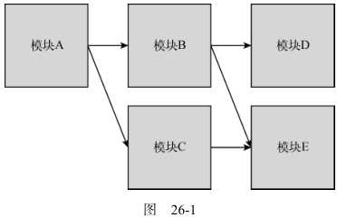

# 模块

## 模块模式

### 基本概念

##### 依赖关系

- 使用有向图表示依赖关系;



##### 加载策略

- 同步加载: 按顺序依次加载;
  - 性能问题: 同步加载堵塞进程;
  - 复杂性: 管理加载顺序;
- 异步加载: 按需加载, 加载后执行回调;
- 动态加载: 运行时确定是否加载某模块, 加大静态分析难度;

##### 静态分析

- 检查代码结构, 在不执行代码的情况下推断其行为;

##### 循环依赖

- 依赖之间循环依赖;

### ES6 之前的模块加载器

##### 命名空间

- 导出一个对象, 对象上有若干类;
- 可配合 IIFE 实现静态方法类;

##### Commonjs

```typescript
// 加载模块
var moduleB = require('./moduleB');
// 导出模块
module.exports = {
stuff: moduleB.doStuff();
};
```

##### AMD

```typescript
define("moduleA", ["require", "exports"], function (require, exports) {
  var moduleB = require("moduleB");
  exports.stuff = moduleB.doStuff();
});
```

##### UMD

- 统一 Commonjs 和 AMD

## ES6 模块

### 模块标签

##### 定义模块标签

```html
<script type="module">
  // 模块代码
</script>
<script type="module" src="path/to/myModule.js"></script>
```

##### 执行顺序

- 首先执行普通 script 标签;
- 其次执行模块标签;
- 同类标签根据代码顺序同步执行;

```html
<!-- 第二个执行 -->
<script type="module">
  // 模块代码
</script>
<!-- 第三个执行 -->
<script type="module" src="path/to/myModule.js"></script>
<!-- 第一个执行 -->
<script></script>
```

### 工作者模块

```typescript
// 第二个参数默认为{ type: 'classic' }
const scriptWorker = new Worker("scriptWorker.js");
const moduleWorker = new Worker("moduleWorker.js", { type: "module" });
```

### 模块导出

##### 命名导出

```typescript
export const foo = "foo";
// 别名
export { foo as myFoo };
// 一个模块可声明多个命名导出
const foo = "foo";
const bar = "bar";
const baz = "baz";
export { foo, bar as myBar, baz };
```

##### 默认导出

```typescript
// 一个模块只能有一个默认导出
const foo = "foo";
export default foo;

// default 别名关键字
export { foo as default }; // 等同于 export default foo;
```

##### 命名导出和默认导出

```typescript
// 支持同时使用两种导出
const foo = "foo";
const bar = "bar";
export { foo as default, bar };
```

### 模块导入

##### 命名导出的导入

```typescript
// foo.js
const foo = "foo",
  bar = "bar",
  baz = "baz";
export { foo, bar, baz };

// * 导入所有
import * as Foo from "./foo.js";
console.log(Foo.foo); // foo
console.log(Foo.bar); // bar
console.log(Foo.baz); // baz
// 自定义导入
import { foo, bar, baz as myBaz } from "./foo.js";
console.log(foo); // foo
console.log(bar); // bar
console.log(myBaz); // baz
```

##### 默认导出的导入

```typescript
// 等效
import { default as foo } from "./foo.js";
import foo from "./foo.js";
```

##### 命名导出和默认导出的导入

```typescript
// 等效
import foo, { bar, baz } from "./foo.js";
import { default as foo, bar, baz } from "./foo.js";
import foo, * as Foo from "./foo.js";
```

### 模块转移导出

```typescript
// 导出所有
export * from "./foo.js";
// 使用别名
export { foo, bar as myBar } from "./foo.js";
// 重用默认导出
export { default } from "./foo.js";
// 命名导出转换为默认导出
export { foo as default } from "./foo.js";
```

## ESM

### 基本概念

##### 关系依赖图

- 不同模块之间的依赖关系;

##### 模块记录

- 将导入的依赖文件解析成特定的数据结构;

##### 模块实例

- 模块记录的具体内容;
- 组成部分;
  - 模块代码: 记录模块中的源码;
  - 模块状态: 记录模块中变量, 函数...;

##### 模块映射 (module map)

- 模块加载器缓存模块实例;
- 使用模块映射管理模块实例的缓存;
- 模块实例对应一个 URL;

##### 异步加载

- 构建, 实例化和求值三个阶段分别完成;
- ESM 模块规划文件解析, 实例化和求值使用异步机制处理;
- 但未规定文件获取的机制, 具体机制根据不同环境下的模块文件加载器而定;

### 构建

#### 具体任务

- 获取并加载模块文件;
- 解析模块文件并创建模块记录;

#### 获取文件

- 通过 script 或者手动指定获取入口文件;
- 根据入口文件的 import 语句获取模块依赖文件;
- 深度优先的后序遍历, 根据 import 语句不断获取模块依赖文件;

#### 解析

- 将模块文件解析为模块记录;
- 模块记录创建后, 立刻添加至模块映射;

### 实例化

##### 具体任务

- 为变量, 函数分配内存空间;

##### 主要过程

- js 引擎创建模块环境记录管理模块记录中的变量;
- 将变量绑定到对应的内存空间地址;
  - 仅绑定地址但不初始化;
  - 函数例外, 函数会进行初始化;
- 基于深度优先的后序遍历遍历模块记录;

### 求值

- JS 引擎执行代码;
- 对每个模块进行求值并赋值;
- 整个模块求值完成后才会修改至模型映射;
- 由于存在副作用, 每个模块只运行一次;
- 基于深度优先的后序遍历;

### ESM 进阶

##### 导出变量和导入变量

- 导入模块导入导出变量的内存地址;
- 导出模块与导入模块中的变量, 指向了同一内存地址;
- 导出模块中对应变量的更改, 会更新所有导入模块中的变量;

##### ESM 动态 import

- import() 运行时导入模块, 作为单独的入口文件处理;
- 返回一个 await 对象;
- 该过程是可嵌套的, 即动态导入的文件可以进行另外的动态导入;
- 实现按需加载和代码分割;
- 浏览器会通过 http 请求实现;

```typescript
const module = await import(modulePath);
module.fn();
```

### 实例详解

- 构建阶段生成模块记录并构建模块映射;
- 实例化阶段为变量分配内存空间;
- 求值阶段;
  - 执行 index.js 文件;
  - index.js 导入 a.js, 执行 a.js;
  - a.js 导入 b.js, 执行 b.js;
  - 执行 `let b = "原始值-b模块内变量"`, 初始化 b 变量;
  - 执行 `console.log("b模块引用a模块: ", a);`;
    - 此时 a 仅分配内存地址认为初始化;
    - 故 a 为 uninitialized;
  - 执行 `let b = "修改值-b模块内变量"`, 修改 b 变量;
  - 导出 `{b}`;
  - 返回 a.js;
  - 执行 `let a = "原始值-a模块内变量";`, 初始化 a 变量;
  - 执行 `console.log("a模块引用b模块: ", b);`;
    - 此时 `{b}` 已经初始化, 打印 `{b}`;
  - 执行 `a = "修改值-a模块内变量";`, 修改 a 变量;
  - 导出 `{a}`;
  - 返回 index.js
  - 执行 `console.log("入口模块引用a模块: ", a);`;
    - 此时 `{a}` 已经初始化, 打印 `{a}`;

```typescript
// index.js
import * as a from "./a.js";
console.log("入口模块引用a模块: ", a);

// a.js
import * as b from "./b.js";
let a = "原始值-a模块内变量";
console.log("a模块引用b模块: ", b);
a = "修改值-a模块内变量";
export { a };

// b.js
import * as a from "./a.js";
let b = "原始值-b模块内变量";
console.log("b模块引用a模块: ", a);
b = "修改值-b模块内变量";
export { b };

// 执行结果
// b模块引用a模块:  [Module: null prototype] { a: <uninitialized> }
// a模块引用b模块:  [Module: null prototype] { b: '修改值-b模块内变量' }
// 入口模块引用a模块:  [Module: null prototype] { a: '修改值-a模块内变量' }
```

## commonJS

### 同步加载

- commonJS 用于 node 端;
- 文件加载速度远快于 esm;
- 模块加载使用同步机制;
  - 一次性进行构建, 实例化和求值三个极端;

### 加载机制

- commonJS 深度优先的后序遍历;
- 在查找下一个模块之前, 执行模块代码 (直到 require 语句), 并实时缓存该模块;

### 导出变量和导入变量

- 导入模块对导出变量进行值拷贝;
- 导入模块中的变量是导出模块中的副本;
- 导出模块中对应变量的更改, 不会更新导入模块中的变量;

### 实例详解

- 执行 index.js 文件, 缓存该模块;
- 加载 a.js, 进入 a.js;
- 执行 a.js, 缓存该模块;
- 执行 `exports.a = "原始值-a模块内变量";`;
  - 初始化 a 并添加至缓存;
- 加载 b.js, 进入 b.js;
- 执行 b.js, 缓存该模块;
- 执行 `exports.b = "原始值-b模块内变量";`;
  - 初始化 b 并添加至缓存;
- 加载 a.js;
  - 此时 a.js 已经被缓存, 读取 a.js 的缓存, 对 a 进行值拷贝;
- 执行 `console.log("b模块引用a模块", a);`, 打印 a;
- 执行 `exports.b = "修改值-b模块内变量";`;
  - 更新 b 模块缓存中的 b;
- 返回 a.js;
- 执行 `console.log("a模块引用b模块: ", b);`, 打印 b;
- 执行 `exports.a = "修改值-a模块内变量";`;
  - 更新 a 模块缓存中的 a;
- 返回 index.js;
- 执行 `console.log("入口模块引用a模块: ", a);`, 打印 a;

```typescript
//index.js
var a = require("./a");
console.log("入口模块引用a模块: ", a);

// a.js
exports.a = "原始值-a模块内变量";
var b = require("./b");
console.log("a模块引用b模块: ", b);
exports.a = "修改值-a模块内变量";

// b.js
exports.b = "原始值-b模块内变量";
var a = require("./a");
console.log("b模块引用a模块", a);
exports.b = "修改值-b模块内变量";

// 输出结果
// b模块引用a模块 { a: '原始值-a模块内变量' }
// a模块引用b模块:  { b: '修改值-b模块内变量' }
// 入口模块引用a模块:  { a: '修改值-a模块内变量' }
```
