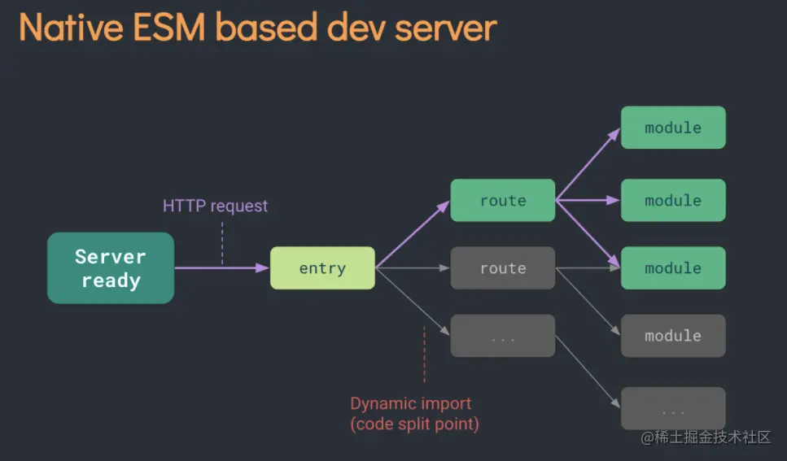
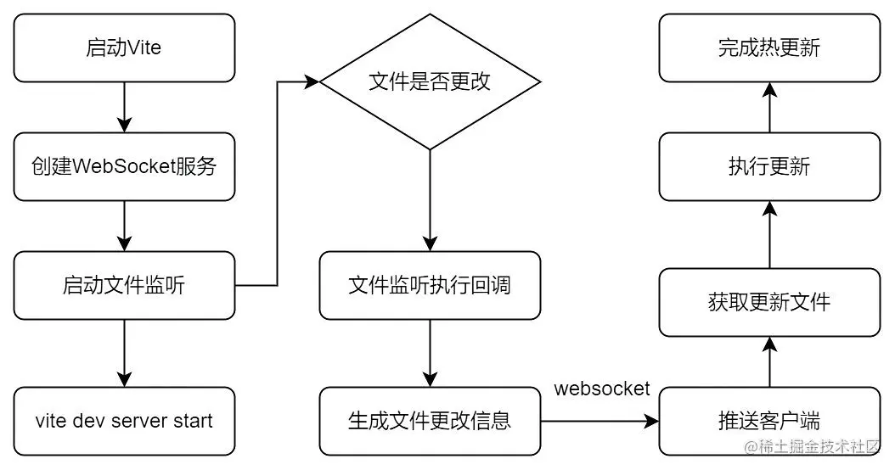

# vite 教程

## 基础

### 特点

- 基于 No bundle 和 esbuild 实现冷启动；
- 基于 ESM HMR 机制和浏览器缓存策略实现热更新；
- 基于 ESM 模块实现按需加载；

### esbuild

##### 环境

- vite 在测试环境，使用 esbuild 进行 ts - js 的转换；

##### esbuild 功能

- 加载；
- 压缩；
- 打包；
- tree shaking：移除未使用的代码；
- source map；

### rollup

##### 环境

- vite 在生产环境，使用 rollup 进行项目打包；
- 目的是使用 rollup 丰富的插件生态；

##### rollup 构建过程

- 构建阶段和输出阶段；
- 获取入口文件，生产抽象语法树；
- 对入口文件进行依赖解析；
- 生产最终代码；
- 写入目标文件；

## 冷启动

### 冷启动

- 之前大型应用构建需要预先对整个应用代码进行依赖解析，打包构建，最后启动服务器；
- 需要大量的时间启动开发服务器；

### 基本原理

- Vite 将应用代码区分为依赖和源码两类；
- 用于提高应用冷启动时间；

#### 依赖

- 开发过程中不会变动的 js；
- 基于 esbuild 的预构建依赖机制处理大型依赖和不同格式的模块化标准；
  - 大型依赖：对依赖进行合并，减少模块和请求数量；
  - 不同模块化标准的兼容性：将 CJS，UMD 等标准转换为 ESM；

#### 源码

- 需要转换为 js 的文件 (jsx，tsx，ts css)；
- 基于浏览器的 ESM 模块按需加载，只有在源码使用时才会被加载；

## 按需加载

### 原理

- 基于 ES6 import 函数，其使用 http 请求动态加载模块文件；
- Vite 启动一个 koa 服务器拦截 http 请求，对其进行 ESM 转换和整合，最后使用 ESM 返回给浏览器；
- Vite 不对文件进行打包，使用原生 ESM 提供源码，只在浏览器使用时提供源码；；

### 示意图

- 浏览器使用 import 函数动态加载使用的模块；
- 没有使用的模块不会参与构建过程；
- 大量模块不会影响构建速度；



## 热更新

##### 核心流程

- 创建一个 WebSocket 用于客户端和服务器通信；
- 使用 Chokidar 启动并监听文件变更；
- 代码变更后，服务器生成文件变更信息并推送到客户端；
- 客户端根据更新信息进行更新；



##### 浏览器缓存策略

- 源码模块的请求使用协商缓存进行缓存；
- 依赖模块的请求使用强缓存进行缓存 (Cache-Control：max-age=31536000，immutable)；

## 配置

### react

```bash
pnpm create vite my-vue-app --template react-ts
```

##### tsconfig

```json
{
  "compilerOptions": {
    "target": "ES2020",
    "useDefineForClassFields": true,
    "lib": ["ES2020", "DOM", "DOM.Iterable"],
    "module": "ESNext",
    "skipLibCheck": true,

    /* Bundler mode */
    "moduleResolution": "bundler",
    "allowImportingTsExtensions": true,
    "resolveJsonModule": true,
    "isolatedModules": true,
    "noEmit": true,
    "jsx": "react-jsx",

    /* Linting */
    "strict": true,
    "noUnusedLocals": true,
    "noUnusedParameters": true,
    "noFallthroughCasesInSwitch": true
  },
  "exclude": ["**/test.ts"],
  "include": ["src"],
  "references": [{ "path": "./tsconfig.node.json" }]
}
```
