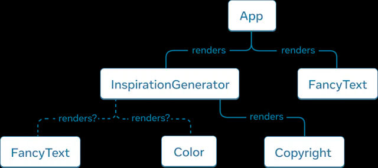
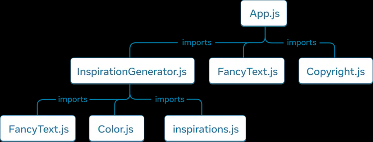

# UI

## 组件

### 定义组件

##### 定义组件

```typescript
// 普通函数形式
function Profile() {
  // ..;
}
// 箭头函数形式
const Profile = () => {
  //..;
};
```

##### 命名规范

- 必须大驼峰；

##### 组件返回值

- 组件必须有返回值；
- 返回 null/0/undefined 表示组件无内容；

### 使用组件

```typescript
<ComponentName />
```

### 嵌套组件

##### 嵌套组件

- 组件可嵌套；
- 上层组件称为父组件；
- 嵌套组件称为子组件；

```typescript
function Gallery() {
  return (
    <section>
      <h1>Amazing scientists</h1>
      <Profile />
    </section>
  );
}
```

### 导出组件

##### 命名导出

```typescript
// 普通函数形式
export function Button() {}
// 常量形式
const Button;
export Button;
```

##### 默认导出

```typescript
// 普通函数形式
export default function Button() {}
// 常量形式
const Button;
export default Button;
```

##### 命名导出和默认导出的限制

- 一个文件只能有一个默认导出；
- 但可以有多个命名导出；
- 推荐使用命名导出；

### 导入组件

##### 命名组件导入

```typescript
import { Button } from "./button.js";
```

##### 默认组件导入

```typescript
import Button from "./button.js";
```

## jsx

### jsx 基础

- 一种 js 的语法拓展；
- 允许你在 js 中书写 html；

### jsx 原则

##### 组件返回值永远有一个父标签

```typescript
<>
  
</>
```

##### 闭合所有标签

- 空标签采用 <element /> 形式；
- 正常标签采用 <element></element> 形式；

##### 命名规范

- 标签名不区分大小写；
- 所有属性名使用小驼峰形式；
- 几乎所有的属性名不能使用 - ；
- 属性名不能与 js，html 冲突，冲突改名；

### 大括号

- jsx 中可通过 {} 传递变量，函数，对象和表达式等；

```typescript
<h1>{name}'s To Do List</h1>;

<div
  style={{
    backgroundColor: "black";
    color: "pink";
  }}
></div>

<h1>{firstName + "" + lastName}'s To Do List</h1>

const items = {
  title: "delete";
  action:{()=>{deleteItem()}}
};
```

### 优点

- 可读性高；
- 表达能力强；
- 静态类型检查；
- 组件化；

## 属性

### 传递机制

- 父组件向子组件传递属性；
- 子组件使用 {} 或者 props 读取属性；

```typescript
function Avatar({ person, size }) {
  // person and size are available here
}

export default function Profile() {
  return (
    <Avatar person={{ name: "Lin Lanying", imageId: "1bX5QH6" }} size={100} />
  );
}
```

### 属性默认值

- 当父组件传递属性值为 undefined 时，使用默认值；
- 传递 null 视为传递属性值为 null；

```typescript
function Avatar({ person, size = 100 }) {
  // ..;
}
```

### 改变属性

- react 中属性不可变的；
- 如果需要改变属性；
- 传递一组新属性用于代替旧属性；

### children 属性

- 组件属性使用 children 属性；
  - children 为关键字；
  - 表示被嵌套的内容；

```typescript
import Avatar from "./Avatar.js";

function Card({ children }) {
  return <div className="card">{children}</div>;
}

export default function Profile() {
  return (
    <Card>
      <Avatar />
    </Card>
  );
}
```

## 条件渲染

### if 语句

```typescript
function Item({ name, isPacked }) {
  let itemContent = name;
  if (isPacked) {
    itemContent = name + " ✔";
  }
  return <li className="item">{itemContent}</li>;
}
```

### 条件运算符

```typescript
function Item({ name, isPacked }) {
  return <li className="item">{isPacked ? name + " ✔" : name}</li>;
}
```

### && 操作符

```typescript
function Item({ name, isPacked }) {
  return (
    <li className="item">
      {name} {isPacked && "✔"}
    </li>
  );
}
```

## 渲染列表

### 定义列表

- 使用 filter() 方法筛选数组；
- 使用 map() 方法生成列表；

```typescript
export default function List() {
  const chemists = people.filter((person) => person.profession === "chemist");
  const listItems = chemists.map((person) => (
    <li key={person.id}>{person.name}</li>
  ));
  return <ul>{listItems}</ul>;
}
```

### key 值

##### key 属性

- react 生成列表元素时必须定义 key；
- 用于标识每个列表元素；

##### key 原则

- key 必须唯一；
- key 不可改变；

##### key 和属性的关系

- 组件不可将 key 作为属性传递；
- 若组件需要 id；
- 自定义 id 属性；

```typescript
<Profile key={id} userId={id} />
```

## 组件树

### UI Tree

##### 基础

- react 使用树表示组件结构；
- 对应父子组件结构关系；


##### 条件渲染

- react 条件渲染中；
- 组件可能不渲染，但依旧占据 UI Tree 中的位置；



##### 移除机制

- 当 UI Tree 中某个节点被移除时；
- 其所有子节点全部被移除；


### 模块依赖树

- react 树表示模块依赖关系；
- 根据 import 语句构建树；



## event handlers

### 定义 event handlers

##### 传递函数

- 定义函数；
- 作为属性传递至对应 event；

```typescript
export default function Button() {
  function handleClick() {
    console.log("You clicked me!");
  }
  return <button onClick={handleClick}>Click me</button>;
}
```

##### 行内形式

- 使用箭头函数；

```typescript
<button onClick={(e) => {
  handleClick(e);
  console.log('You clicked me!');
}}>
```

### event handler 作为属性传递

```typescript
function Button({ onClick, children }) {
  return <button onClick={onClick}>{children}</button>;
}

export default function UploadButton() {
  return (
    <Button onClick={() => console.log("Uploading!")}>Upload Image</Button>
  );
}
```

### 停止传播和默认行为;

- 停止传播：stopPropagation()；
- 默认行为：preventDefault()；

## 最佳实践

### 自定义组件

##### 自定义 svg 组件

```typescript
// style 用于修改 svg 组件的大小和颜色
const LayerOutlined: React.FC<{ style: React.CSSProperties }> = ({ style }) => {
  return (
    // span, 修改 svg 样式
    // 设置 padding 和 lineHeight 重置样式
    // fontSize 配合 svg 标签中的 width 和 height 修改 svg 大小
    // color 修改 svg 颜色
    // viewbox 设置 svg 显示区域, 这里和 antd 保持一致
    // svg 中其他属性默认
    <span
      style={{
        padding: "0px",
        lineHeight: "0px",
        fontSize: "14px",
        color: "#595959",
        ...style,
      }}
    >
      <svg
        className="icon"
        viewBox="64 64 896 896"
        version="1.1"
        xmlns="http://www.w3.org/2000/svg"
        p-id="1394"
        width="1em"
        height="1em"
      >
        // svg 代码忽略
      </svg>
    </span>
  );
};
```

### 受控组件和非受控组件

##### 受控组件

- 组件内部 state 完全被 props 控制的组件；

##### 非受控组件

- 组件内部 state 不被 props 控制的组件；
- 内部状态自身管理；

##### 应用场景

- 非受控组件：内部状态不受外部状态影响；
- 受控组件：内部状态受外部状态影响，或需要对外部状态进行通信；

### $$typeof 属性

- react Root 标签具有 $$typeof 属性，其值为 Symbol；
- 作用为防止 XSS 攻击；
- 用于 React 标识 Root 标签，防止 XSS 伪造元素；
