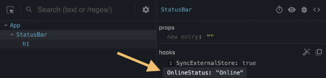

# react hook

## 基础

### 作用

- 易用性: 避免 class 的生命周期, 继承, this 指向等问题;
- 逻辑复用和代码拆分: 易于代码可读性和可维护性;
- 将渲染逻辑和业务逻辑解耦, 易于组件测试;
- 提高组件灵活性: 同一组件使用多个 hook;

### 条件语句

- hook 禁止放置于条件语句;
- react 确保每次渲染, hook 调用顺序一致;
- 放置于条件语句, 可能打乱调用顺序;
- 确保 hook 记录链表顺序;

### 使用限制

- 只能在函数式组件和自定义 hook 使用;
- 必须在组件顶层使用;

## useState

### 基础

##### 基本使用

- state: 当前状态;
- setState: 更新状态函数;
- initialState: 初始状态;

```typescript
import { useState } from "react";

const [state, setState] = useState(initialState);
```

##### 私有性

- 同一组件的多个实例的 state 是相互独立隔绝的;

### 传递 state

- 把 state 添加至多个组件共同的父组件;
- 通过 event handle 作为属性将 setFunction 传递给子组件;
- 使子组件改变父组件的 state;

### 更新 object 和 array

##### 更新机制

- array 和 object 在 react 是 mutable, 但你要视其为 readonly;
- 不能改变在 state 中已经存在的 array 或 object;
  - 改变了也没有什么作用;
  - 因为仅仅改变的是快照;

##### 更新方法

- 使用 ... 操作符创建 object 副本;
  - 嵌套对象需要嵌套使用 ... 操作符;
- 使用 ...操作符, contact(), filter(), slice() 和 map() 方法创建 array 副本;

### state 更新机制

- 由于 react 快照机制;
- set 函数不会实时更新中的 state;
- 只有在下一次渲染中 state 才会更新;

```typescript
function handleClick() {
  setAge(age + 1); // setAge(42 + 1)
  setAge(age + 1); // setAge(42 + 1)
  setAge(age + 1); // setAge(42 + 1)
}
```

### updater function

##### updater function

- 突破闭包, 访问最新 state;
- 使用前一个语句的返回值进行更新计算;

```typescript
<button
  onClick={() => {
    setNumber((n) => n + 1); // setNumber(0 + 1);
    setNumber((n) => n + 1); // setNumber(1 + 1);
    // 结果为 2
  }}
></button>
```

##### 命名规范

- state 的首字母命名其函数参数;

```typescript
setEnabled((e) => !e);
setLastName((ln) => ln.reverse());
setFriendCount((fc) => fc * 2);
```

### 重置 State

##### state 存储机制

- state 根据其对应的 component 在 UI Tree 中的位置;
- 存储在 UI Tree 的对应位置中;
- 不同实例中的相同 state 是相互隔离的


##### state 重置机制

- state 只有在 UI tree 中的位置发生变化或移除时;
- state 才会在 react 下一次渲染中重置;
- 只要是同一组件, 且在 UI Tree 中位置不变, 无论该位置的组件是否为同一实例;
- react 就视其为同一个实例, 所在位置的 state 值不会发生重置;


##### 重置同一逻辑位置的 state

- 在不同物理位置渲染同一组件的不同实例;
- 设置 key 属性标识;

```typescript
// 在不同物理位置渲染同一组件的不同实例
const Scoreboard = ()=> {
  const [isPlayerA, setIsPlayerA] = useState(true);
  return (
    <div>
      {isPlayerA && <Counter person="Taylor" />}
      {!isPlayerA && <Counter person="Sarah" />}
      <button onClick={() => setIsPlayerA(!isPlayerA);}>Next player!</button>
    </div>
  );
}
// 设置 key 属性
const Scoreboard = () => {
  const [isPlayerA, setIsPlayerA] = useState(true);
  return (
    <div>
      {isPlayerA ? <Counter key="Taylor" person="Taylor" /> : <Counter key="Sarah" person="Sarah" />}
      <button onClick={() => setIsPlayerA(!isPlayerA);}>Next player!</button>
    </div>
  );
}
```

## useReducer

### 基本使用

```typescript
import { useReducer } from "react";

function reducer(state, action) {
  // ...
}

function MyComponent() {
  // state: 当前状态
  // dispatch: 状态更新函数
  // reducer: 状态处理函数
  // initialArg: 初始状态
  const [state, dispatch] = useReducer(reducer, initialArg);
  // ...
}
```

### dispatch

- 更新状态函数;
- 内嵌一个自定义对象 (可选), 标识更新操作;
  - 惯例使用 type 属性;

```typescript
function handleDeleteTask(taskId) {
  dispatch(
    {
      type: "deleted";
      id: taskId;
    }
  );
}
```

### reducer

- 状态处理函数;
- 第一个参数为 state 本身, 第二个参数为 dispatch 传递对象 (可选);
- 根据 dispatch 对象执行不同操作;

```typescript
function reducer(state, action) {
  switch (action.type) {
    case "added": {
      // ...
    }
    case "deleted": {
      // ...
    }
    default: {
      // ...
    }
  }
}
```

### useState 和 useReducer 的异同

##### 相同

- 相同的快照机制;

##### useState

- 适用于简单状态;

##### useReducer

- 适用于复杂状态;
  - useReducer 具有更少的代码量;
  - useReducer 具有更好的可读性;
  - useReducer 具有更容易调试;
  - useReducer 具有更容易测试;

## useContext

### createContext

- 创建 context;
- 大驼峰命名;

```typescript
import { createContext } from "react";

// initialValue: context 初始值
export const LevelContext = createContext(initialValue);
```

### LevelContext

- 定义 context;

```typescript
import { LevelContext } from "./LevelContext.js";

export default function Section({ level, children }) {
  return (
    <section className="section">
      <LevelContext.Provider value={level}>{children}</LevelContext.Provider>
    </section>
  );
}
```

### useContext

- 使用 useContext;

```typescript
import { useContext } from "react";
import { LevelContext } from "./LevelContext.js";

export default function Heading({ children }) {
  const level = useContext(LevelContext);
  // ..;
}
```

### Context 运算机制

- context 可基于其层级进行运算;

```typescript
export default function Section({ children }) {
  const level = useContext(LevelContext);
  return (
    <section className="section">
      <LevelContext.Provider value={level + 1}>
        {children}
      </LevelContext.Provider>
    </section>
  );
}
```

## useRef

### 基础

##### 定义 ref

```typescript
import { useRef } from "react";
const App = () => {
  const ref = useRef(0);
  //...
};
```

##### 使用 useRef

```typescript
import { useRef } from "react";
const App = () => {
  const ref = useRef(0);
  //...
  const value = ref.current;
  ref.current = newValue;
};
```

### useRef 的特性

- 使用 ref.current 读写 ref;
- 改变 ref 不触发渲染;
- ref 突破快照, 实时更新, 读写最新值;
- 渲染过程中无法读取 ref;

```typescript
function MyComponent() {
  // Don't write a ref during rendering
  myRef.current = 123;

  useEffect(() => {
    // You can read or write refs in effects
    myRef.current = 123;
  });

  function handleClick() {
    // You can read or write refs in event handlers
    doSomething(myOtherRef.current);
  }

  // Don't read a ref during rendering
  return <h1>{myOtherRef.current}</h1>;
}
```

### 传递 ref

- ref 为引用类型, ref.current 为值类型;
- 传递 ref.current 不会导致 ref 的改变;

### 操作 DOM

##### 基本使用

```typescript
import { useRef } from "react";
const App = () => {
  const inputRef = useRef(null);
  function handleClick() {
    inputRef.current.focus();
  }
  return (
    <>
      <input ref={inputRef} />
      <button onClick={handleClick}>Focus the input</button>
    </>
};
```

##### 传递 ref 对应 dom

- react 不允件引用其他组件的 DOM 节点;
- 若要引用, 使用 forwardRef api;

```typescript
import { forwardRef, useRef } from "react";

const MyInput = forwardRef((props, ref) => {
  return <input {...props} ref={ref} />;
});

export default function Form() {
  const inputRef = useRef(null);

  function handleClick() {
    inputRef.current.focus();
  }

  return (
    <>
      <MyInput ref={inputRef} />
      <button onClick={handleClick}>Focus the input</button>
    </>
  );
}
```

## useImperativeHandle

### 基本使用

- useImperativeHandle(ref, createHandle, dependencies?);
- 配合 forwardRef api 暴漏命令式句柄 (DOM 自定义对象);

```typescript
import { forwardRef, useRef, useImperativeHandle } from "react";

const MyInput = forwardRef(function MyInput(props, ref) {
  const inputRef = useRef(null);

  useImperativeHandle(
    ref,
    () => {
      return {
        focus() {
          inputRef.current.focus();
        },
        scrollIntoView() {
          inputRef.current.scrollIntoView();
        },
      };
    },
    []
  );

  return <input {...props} ref={inputRef} />;
});
```

### 依赖项

- 使用 Object.is 比较依赖项;
- dependencies 发生改变时, 重新执行 createHandle;

```typescript
import { useEffect } from "react";
const App = () => {
  useImperativeHandle(
    ref,
    () => {
      // ...
    },
    [dependencies]
  );
  // ...
};
```

### 自定义句柄

- 配合 forwardRef api;
- 暴漏部分 DOM (命令式句柄), 而不是整个 DOM 节点;

```typescript
import { useRef } from "react";
import MyInput from "./MyInput.js";

export default function Form() {
  const ref = useRef(null);

  function handleClick() {
    ref.current.focus();
    // This won't work because the DOM node isn't exposed:
    ref.current.style.opacity = 0.5;
  }

  return (
    <form>
      <MyInput placeholder="Enter your name" ref={ref} />
      <button type="button" onClick={handleClick}>
        Edit
      </button>
    </form>
  );
}
```

### 自定义方法

- 命令式句柄暴漏方法不必与 DOM 方法匹配;

```typescript
import { forwardRef, useRef, useImperativeHandle } from "react";

const MyInput = forwardRef(function MyInput(props, ref) {
  const inputRef = useRef(null);

  useImperativeHandle(
    ref,
    () => {
      return {
        focusAndScrollIntoView() {
          inputRef.current.focus();
          inputRef.current.scrollIntoView();
        },
      };
    },
    []
  );

  return <input {...props} ref={inputRef} />;
});
```

## useEffect

### 基本使用

```typescript
import { useEffect } from "react";
import { createConnection } from "./chat.js";

function ChatRoom({ roomId }) {
  const [serverUrl, setServerUrl] = useState("https://localhost:1234");

  // react 渲染后触发 useEffect
  useEffect(() => {
    const connection = createConnection(serverUrl, roomId);
    connection.connect();
    // 下一次 useEffect 触发前指定 return 中的箭头函数
    return () => {
      connection.disconnect();
    };
    // 指定依赖
  }, [serverUrl, roomId]);
}
```

### useEffect 依赖

##### 运行机制

- 只有 dependencies 发生改变时, 才会执行 useEffect;
- 若 dependencies 为 [], 仅会在组件 mounts 时执行一次 useEffect;
- 若 dependencies 为 空, 每次组件渲染都会执行 useEffect;

```typescript
import { useEffect } from "react";
const App = () => {
  useEffect(() => {
    // ...
  }, [dependencies]);
  // ...
};
```

##### 依赖原则

- 依赖避免使用 object 和 function, 避免 useEffect 大量调用, 引起性能问题;
  - js 中 object 和 function 实例相互隔离;
  - react 使其为不同的 value;
  - 始终触发 useEffect;
- react 要求 dependencies 无法自定义, 必须包含 useEffect 中的所有 reactive value;
  - 但是实际情况下忽略;

### useEffect 中的 return

- 在每次 useEffect 执行前执行 return 中的箭头函数;
- 若未指定 return, 默认返回一个空函数;

```typescript
import { useEffect } from "react";
const App = () => {
  useEffect(() => {
    const connection = createConnection();
    connection.connect();
    return () => {
      connection.disconnect();
    };
  }, [dependencies]);
};
```

### 同步操作

- useEffect 回调函数必须为同步函数, 故无法使用 await;
- 执行异步函数, 必须使用 promise;

```typescript
useEffect(() => {
  fetchBio(person).then((result) => {
    setBio(result);
  });
}, [person]);
```

### 生命周期

##### component 生命周期

- mount: 添加至屏幕;
- update: props/state 变化;
- unmount: 从屏幕移除.

##### useEffect 和生命周期的关系

- effect 独立于 component 的 lifecycle;
- component 的一次 lifecycle 可以触发多次 effect;

##### useEffect 作用时机

- Browser paint 之后;
- 但仍在本次 render 中;
- 此时 useState 已经更新;

### useLayoutEffect

- 在浏览器绘制之前触发的 useEffect 版本;
- 已经在虚拟 DOM 更新, 但未更新至真实 DOM;
- 该 hook 会阻止浏览器重新绘制屏幕, 导致堵塞组件渲染;
- 尽量首选 useEffect, 不使用 useLayoutEffect;

```typescript
import { useEffect } from "react";
import { createConnection } from "./chat.js";

function ChatRoom({ roomId }) {
  const [serverUrl, setServerUrl] = useState("https://localhost:1234");

  // react 渲染之后, 浏览器更新之前触发 useLayoutEffect
  useLayoutEffect(() => {
    const connection = createConnection(serverUrl, roomId);
    connection.connect();
    // 下一次 useLayoutEffect 触发前指定 return 中的箭头函数
    return () => {
      connection.disconnect();
    };
    // 指定依赖
  }, [serverUrl, roomId]);
}
```

### useInsertionEffect

- `useInsertionEffect(setup, dependencies?)`;
- 适用于 css in js;
- 在布局效果触发之前将元素插入到 dom 中;
- 只能在客户端运行;

```typescript
import { useInsertionEffect } from "react";

// Inside your CSS-in-JS library
function useCSS(rule) {
  useInsertionEffect(() => {
    // ... inject <style> tags here ...
    // 指定依赖
  }, [dep0, dep1]);
  return rule;
}
```

## useMemo 和 useCallback

### useMemo

##### 基本使用

- 缓存回调函数的返回值;
- 避免多次渲染之间重复计算;

```typescript
import { useMemo } from "react";

function TodoList({ todos, tab }) {
  const visibleTodos = useMemo(() => {
    return getFilteredTodos(todos, filter);
  }, [todos, filter]);
}
```

##### 依赖项

- 组件重新渲染时, 只有当 [] 中依赖发生变化, 执行回调函数, 更新其返回值;
- 依赖禁止使用 object 和 function;
  - js 中 object 和 function 实例相互隔离;
  - react 使其为不同的 value;
  - 导致 useMemo 无效;
- 可使用 useMemo 缓存 object 和 function;

```typescript
function Dropdown({ allItems, text }) {
  const searchOptions = { matchMode: "whole-word", text };

  const visibleItems = useMemo(() => {
    return searchItems(allItems, searchOptions);
  }, [allItems, searchOptions]);
}

// 使用 useMemo 缓存另一个 useMemo 的依赖项
function Dropdown({ allItems, text }) {
  const searchOptions = useMemo(() => {
    return { matchMode: "whole-word", text };
  }, [text]);

  const visibleItems = useMemo(() => {
    return searchItems(allItems, searchOptions);
  }, [allItems, searchOptions]);
}
```

##### 与 memo 连用

- memo 只有在其所有属性均不变的情况下, 才会缓存子组件;
- 故使用 useMemo 缓存 object 和 function;

```typescript
export default function Page({ productId, referrer }) {
  const handleSubmit = useMemo(() => {
    return (orderDetails) => {
      post("/product/" + productId + "/buy", {
        referrer,
        orderDetails,
      });
    };
  }, [productId, referrer]);

  return <Form onSubmit={handleSubmit} />;
}
```

### useCallback

##### 基本使用

- useMemo 的语法糖;
- useCallback 缓存回调函数地址;
- 组件重新渲染时, 只有当 [] 中的属性发生变化时, 执行回调函数, 更新其函数地址;

```typescript
const visibleTodos = useCallback(getFilteredTodos(todos, filter), [
  todos,
  filter,
]);
```

##### 依赖项

- 同 useMemo;

##### 与 memo 连用

- 同 useMemo;

```typescript
export default function Page({ productId, referrer }) {
  const handleSubmit = useCallback(
    (orderDetails) => {
      post("/product/" + productId + "/buy", {
        referrer,
        orderDetails,
      });
    },
    [productId, referrer]
  );

  return <Form onSubmit={handleSubmit} />;
}
```

## useDeferredValue

### 基本使用

- `const deferredValue = useDeferredValue(value)`;
- 延迟更新部分 UI, 将 UI 更新变为非堵塞;
- value 为需要推迟更新的值;
- 初始渲染, useDeferredValue 返回提供值;
- 更新渲染期间, react 首先尝试使用旧值进行重新渲染;
- 渲染完成后, 立刻尝试使用新值进行重新渲染, 该渲染可以中断;

```typescript
import { useState, useDeferredValue } from "react";

// 必须为原始值类型
function SearchPage() {
  const [query, setQuery] = useState("");
  const deferredQuery = useDeferredValue(query);
  // ...
}
```

### 加载新内容时显示旧内容

- 与 Suspense 或 lazy 搭配使用;

```typescript
import { Suspense, useState, useDeferredValue } from "react";
import SearchResults from "./SearchResults.js";

export default function App() {
  const [query, setQuery] = useState("");
  const deferredQuery = useDeferredValue(query);
  return (
    <>
      <label>
        Search albums:
        <input value={query} onChange={(e) => setQuery(e.target.value)} />
      </label>
      <Suspense fallback={<h2>Loading...</h2>}>
        <SearchResults query={deferredQuery} />
      </Suspense>
    </>
  );
}
```

### 表示内容已过期

- 根据 query 和 deferredQuery 的状态判断数据是否过期;

```typescript
import { Suspense, useState, useDeferredValue } from "react";
import SearchResults from "./SearchResults.js";

export default function App() {
  const [query, setQuery] = useState("");
  const deferredQuery = useDeferredValue(query);
  const isStale = query !== deferredQuery;
  return (
    <>
      <label>
        Search albums:
        <input value={query} onChange={(e) => setQuery(e.target.value)} />
      </label>
      <Suspense fallback={<h2>Loading...</h2>}>
        <div
          style={{
            opacity: isStale ? 0.5 : 1,
            transition: isStale
              ? "opacity 0.2s 0.2s linear"
              : "opacity 0s 0s linear",
          }}
        >
          <SearchResults query={deferredQuery} />
        </div>
      </Suspense>
    </>
  );
}
```

### 优化 UI 性能

- SlowList 使用 memo 包裹;
- SlowList 使用 useDeferredValue 值作为属性;
- 推迟 SlowList 渲染, 避免堵塞 UI, 影响用户体验;

```typescript
const SlowList = memo(function SlowList({ text }) {
  // ...
});

function App() {
  const [text, setText] = useState("");
  const deferredText = useDeferredValue(text);
  return (
    <>
      <input value={text} onChange={(e) => setText(e.target.value)} />
      <SlowList text={deferredText} />
    </>
  );
}
```

## useDebugValue

### 基本使用

- `useDebugValue(value, format?)`;
- 用于 react devtools 调试;

```typescript
import { useDebugValue } from "react";

function useOnlineStatus() {
  // ...
  useDebugValue(isOnline ? "Online" : "Offline");
  // ...
}
```

### 自定义 hook 添加标签

- 自定义 hook 中使用 useDebugValue;
- devtools 显示标签;
- 可添加 format 函数, 对 value 进行处理;

```typescript
useDebugValue(date, (date) => date.toDateString());
```



## useId

- `const id = useId()`;
- 生成一个唯一 id;
- 禁止用作 key;

```typescript
import { useId } from "react";

function PasswordField() {
  const passwordHintId = useId();
  // ...
}
```

## useSyncExternalStore

### 基本使用

- `const snapshot = useSyncExternalStore(subscribe, getSnapshot, getServerSnapshot?)`;
- 订阅外部存储;
- 存储快照不不可变数据类型;
- 尽量使用 react 内部状态管理;

```typescript
import { useSyncExternalStore } from "react";
import { todosStore } from "./todoStore.js";

// subscribe 为一个接受 callback 的函数, 存储更改时, 调用对应 callback
// subscribe 返回一个取消订阅的函数
// getSnapshot, 返回外部存储数据快照, 返回值不同, react 重新渲染
function TodosApp() {
  const todos = useSyncExternalStore(
    todosStore.subscribe,
    todosStore.getSnapshot
  );
  // ...
}

let nextId = 0;
let todos = [{ id: nextId++, text: "Todo #1" }];
let listeners = [];
export const todosStore = {
  addTodo() {
    todos = [...todos, { id: nextId++, text: "Todo #" + nextId }];
    emitChange();
  },
  subscribe(listener) {
    listeners = [...listeners, listener];
    return () => {
      listeners = listeners.filter((l) => l !== listener);
    };
  },
  getSnapshot() {
    return todos;
  },
};

function emitChange() {
  for (let listener of listeners) {
    listener();
  }
}
```

## useTransition

### 基本使用

- `const [isPending, startTransition] = useTransition()`;
- 不堵塞用户界面的情况下更新状态;

```typescript
import { useTransition } from "react";

// isPending 标签是否具有待处理的 startTransition
// startTransition 调用若干 set 函数, 将对应状态更新为 transition
// startTransition 函数立刻执行, 不会延迟运行回调
function TabContainer() {
  const [isPending, startTransition] = useTransition();

  function selectTab(nextTab) {
    startTransition(() => {
      setTab(nextTab);
    });
  } // ...
}
```

### 将 UI 更新变为非堵塞

- 不使用 useTransition 更新渲染时间过长的组件 SlowComponent;
  - 该组件会冻结用户 UI, 影响用户交互;
- 使用 useTransition 不会冻结用户 UI, 可打断 SlowComponent 渲染;

### 过渡期间标识 UI

- 使用 useTransition 返回的布尔值标识 UI 当前状态;

```typescript
export default function TabButton({ children, isActive, onClick }) {
  const [isPending, startTransition] = useTransition();
  if (isActive) {
    return <b>{children}</b>;
  }
  if (isPending) {
    return <b className="pending">{children}</b>;
  }
  //...
}
```

### 用于路由

```typescript
function Router() {
  const [page, setPage] = useState("/");
  const [isPending, startTransition] = useTransition();

  function navigate(url) {
    startTransition(() => {
      setPage(url);
    });
  }
  // ...
}
```

### 疑难杂症

##### 不能在 startTransition 中实时更新输入

- startTransition 只能转换 state 状态;
- 更新输入应该实时改变, 同步更新;
- 可声明两个单独的状态变量或者使用 useDeferredValue;

```typescript
function handleChange(e) {
  // ❌ Can't use Transitions for controlled input state
  startTransition(() => {
    setText(e.target.value);
  });
}
```

##### startTransition 函数必须为同步函数

```typescript
startTransition(() => {
  // ❌ Setting state *after* startTransition call
  setTimeout(() => {
    setPage("/about");
  }, 1000);
});

setTimeout(() => {
  startTransition(() => {
    // ✅ Setting state *during* startTransition call
    setPage("/about");
  });
}, 1000);
```

## react hook 最佳实践

### 性能优化

##### 相关 hook 和 api

- useMemo;
- useCallback;
- memo;

##### 基本原则

- 若无必要, 不使用 useMemo 和 useCallback;

##### 比较开销

```typescript
// 考虑计算 props 变化和重新计算/渲染的收益
const c = useMemo(() => a + b, [a, b]);
```

##### memo 属性要求

```typescript
// 只有组件每个引用类型属性都使用 useCallback/useMemo, memo 才会生效
const func = useCallback(() => {
  // ...
}, []);
const ExpensiveComponent = React.memo(({ func }) => {
  return <div onClick={func}>hello</div>;
});
```

### 定义 hook

##### 相互调用 hook

- custom hook 无法相互调用, 否则报错;
  - 即两个 hook A 和 B;
  - 不能 A 中调用 B, B 中有调用 A;

##### 避免重复初始化初始值

- 使用 useState/useRef/useEffect 等 hook 时;
- 避免重复初始化不必要的值;

```typescript
const playerRef = useRef(null);
if (playerRef.current === null) {
  playerRef.current = new VideoPlayer();
}

useEffect(() => {
  if (mapRef.current === null) {
    mapRef.current = new MapWidget(containerRef.current);
  }

  const map = mapRef.current;
  map.setZoom(zoomLevel);
}, [zoomLevel]);
```

### 闭包问题

##### 常见场景

- 在使用 setTimeout, setInterval, Promise.then, addEventListen, 回调函数的场景下;
- 一定会存在闭包问题;

##### 具体表现

- 在 setInterval 中使用 useState;
- 由于函数闭包, state 永远是定义时的快照;
- 如下例, count 永远指向 1;

```typescript
const App = () => {
  const [count, setCount] = useState(0);
  useEffect(() => {
    const id = setInterval(() => {
      setCount(count + 1); // count 永远获取的是 0
    }, 1000);
    return () => clearInterval(id);
  }, []);
  return <h1>{count}</h1>;
};
```

##### 数组依赖

- 监听 count 变化;
- 不断创建新的 setInterval;
- 但不断清除 setInterval, 耗费性能;

```typescript
const App = () => {
  const [count, setCount] = useState(0);
  useEffect(() => {
    const id = setInterval(() => {
      setCount(count + 1); // count 永远获取的是 0
    }, 1000);
    return () => clearInterval(id);
  }, [count]);
  return <h1>{count}</h1>;
};
```

##### 使用 updater function

```typescript
// 使用 updater function 获取最新的 state 值;
// 不用清除 setInterval
// 但该方法无法获取并使用其他属性
const App = () => {
  const [count, setCount] = useState(0);
  useEffect(() => {
    const id = setInterval(() => {
      setCount((c) => c + 1); // count 永远获取的是 0
    }, 1000);
  }, []);
  return <h1>{count}</h1>;
};
```

##### 使用 ref

```typescript
// 使用 ref 存储 count
// 不用清除 setInterval
// 可以使用组件中的其余属性
const App = () => {
  const [count, setCount] = useState(0);
  const countRef = useRef(0);
  countRef.current = count;
  useEffect(() => {
    const id = setInterval(() => {
      setCount(countRef.current + 1);
    }, 1000);
    return () => clearInterval(id);
  }, []);
  return <h1>{count}</h1>;
};
```

### 模拟生命周期

##### componentDidMount

- 使用 useEffect 和空依赖数组实现;

```typescript
useEffect(() => {
  // componentDidMount 逻辑
  return () => {
    // componentWillUnmount 逻辑
  };
}, []);
```

##### componentDidUpdate

- 使用 useEffect 和依赖数组实现;

```typescript
useEffect(() => {
  // componentDidUpdate 逻辑
}, [dependencies]);
```

##### shouldComponentUpdate

- 使用 memo 实现;

```typescript
const MemoizedComponent = React.memo(Component);
```

##### componentDidCatch

- 自定义 ErrorBoundary 组件;

```typescript
function ErrorBoundary({ children }) {
  const [error, setError] = useState(null);
  const [errorInfo, setErrorInfo] = useState(null);

  if (error) {
    // ...
  }
  return children;
}
```
