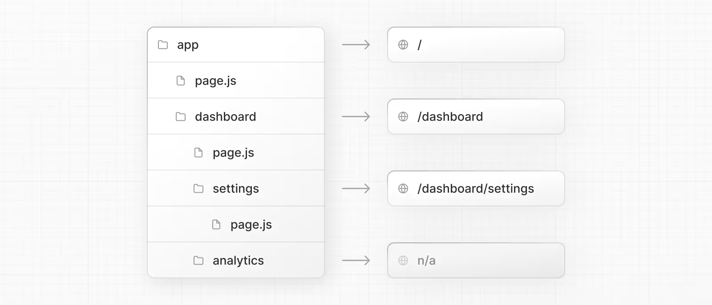
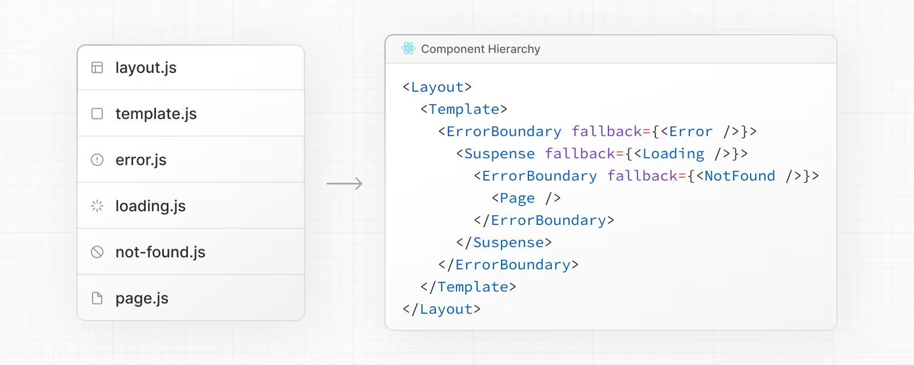
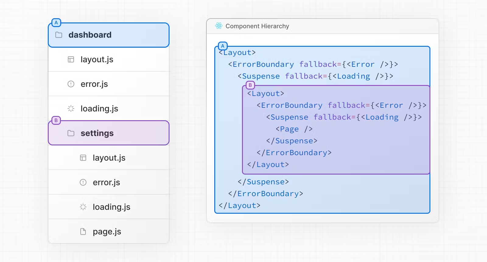
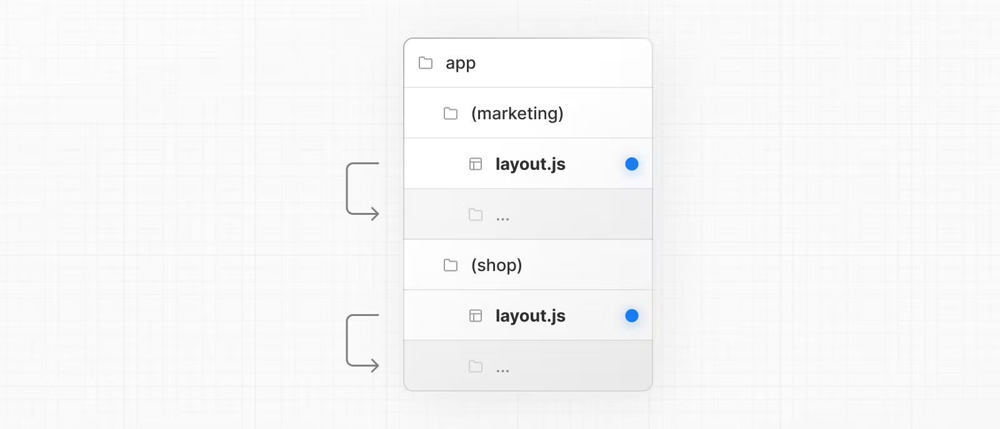
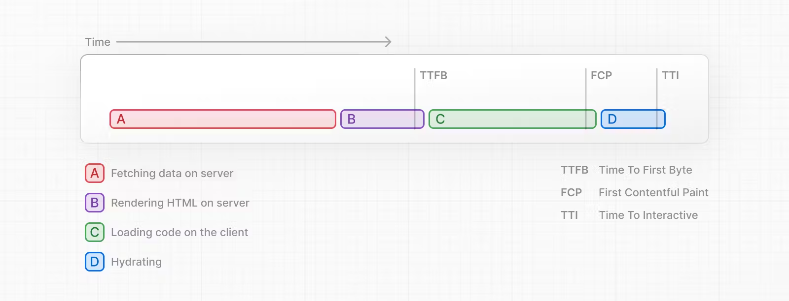
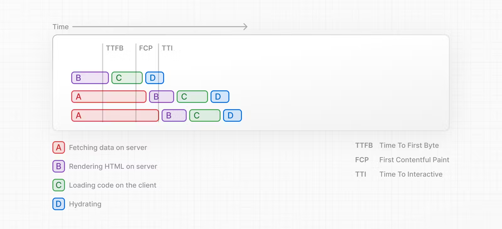
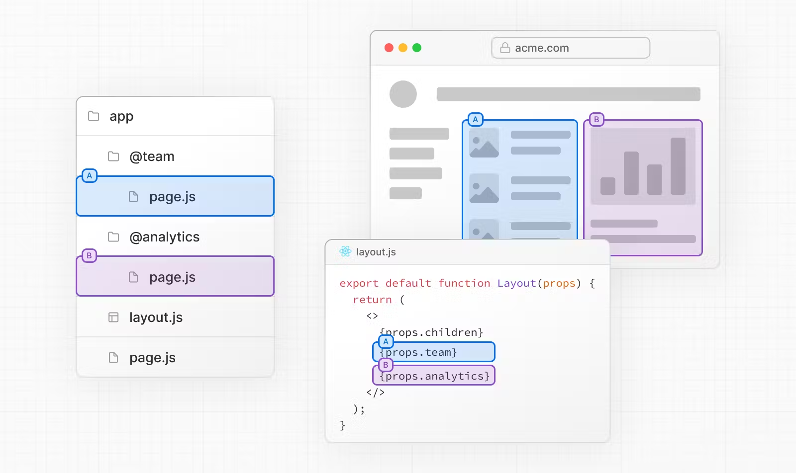
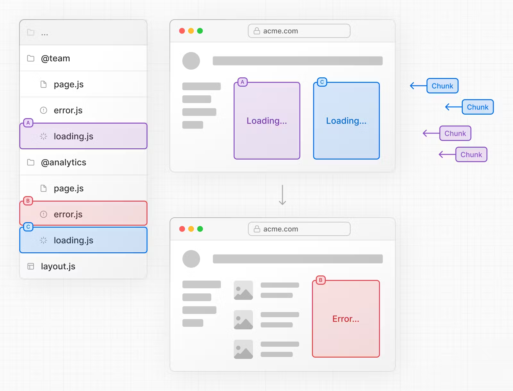
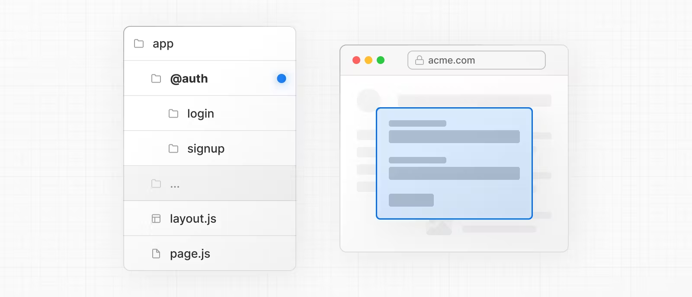
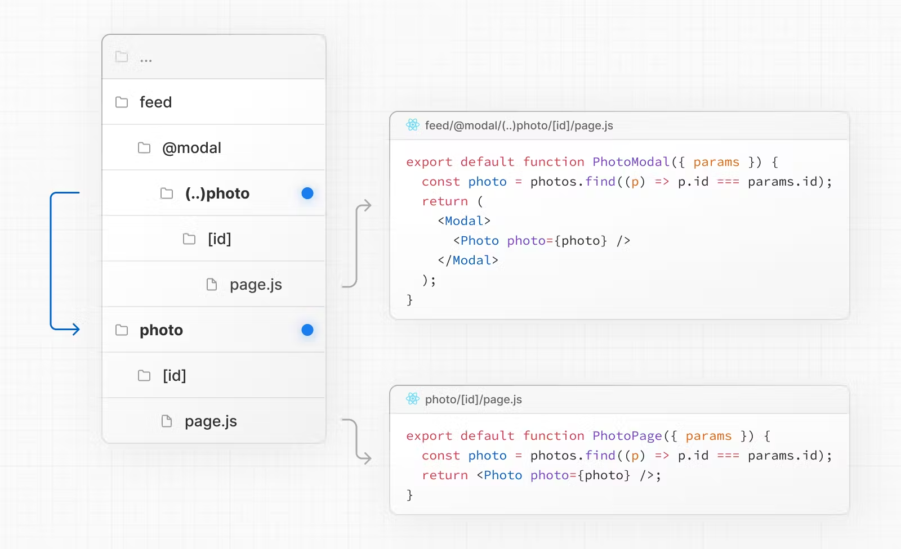

# 路由

## 基础

##### 嵌套路由

- 使用文件层级建立文件路由；
- 一个文件夹映射一个 URL 片段；
- 文件夹中使用 page.ts 文件保证该 URL 可以被公开访问；



##### 文件命名

- layout：共享页面框架；
- page：单独页面文件；
- loading：共享加载 UI；
- not-found：共享 404 UI；
- error：共享错误 UI；
- global-error：全局错误 UI；
- route：服务端端 API；

##### 访问层级

- 共享 UI 文件可以被其本身和所有子路由访问；

##### 公开访问

- 只有文件夹中存在 page.js 或 route.js 文件；
- 该路由才可以公开访问；

##### 渲染层级

- 从外到内依次排列；
  - layout.js
  - template.js
  - error.js (React error boundary)
  - loading.js (React suspense boundary)
  - not-found.js (React error boundary)
  - page.js or nested layout.js
- 嵌套路由中的子路由嵌套在父路由的最深层级中；




## Page 和 Layout

### Page

- 单一路由 UI；
- 总是路由树的叶节点；
- 使该路由可以被公开访问；
- 默认为 ssr；

### layout

##### layout

- 多个 page 共享 UI；
- 其状态持久化存储；
- layout 作用于其层级及其之下的所有路由；
- 接受 children 属性作为 page；
  - children 等效于 parallel route 中的 @children；
  - 但不需要映射到 @children 文件夹下；
    - app/page.js 等同于 app/@children/page.js

```typescript
export default function DashboardLayout({
  children, // will be a page or nested layout
}: {
  children: React.ReactNode;
}) {
  return (
    <section>
      {/* Include shared UI here e.g. a header or sidebar */}
      <nav></nav>
      {children}
    </section>
  );
}
```

##### root layout

- 必须使用，作为最高层级的 layout，作用于整个应用程序；
- 必须使用 html\> 和 \<body 标签；

```typescript
export default function RootLayout({
  children,
}: {
  children: React.ReactNode;
}) {
  return (
    <html lang="en">
      <body>{children}</body>
    </html>
  );
}
```

##### 嵌套路由

- layout 可被嵌套；
- 等效于 page.js 的位置；
- 从外到内逐层渲染；

### template

- 类似于 template；
- 同被多个路由使用，但不共享一个 template，而是每个路由建立自己的 template 实例；
- 每次导航至新路由，重新加载 DOM，初始化状态；
- 接受 children 属性作为 page；

```typescript
export default function Template({ children }: { children: React.ReactNode }) {
  return <div>{children}</div>;
}
```

## 导航

### Link 标签

##### Link 标签

- 导航至指定路由；
- 路由路径使用绝对路径；
- a 标签的封装；

```typescript
import Link from "next/link";

export default function Page() {
  return <Link href="/dashboard">Dashboard</Link>;
}
```

##### 连接列表

- 使用模板字符串插值生成连接列表；

```typescript
import Link from "next/link";

export default function PostList({ posts }) {
  return (
    <ul>
      {posts.map((post) => (
        <li key={post.id}>
          <Link href={`/blog/${post.slug}`}>{post.title}</Link>
        </li>
      ))}
    </ul>
  );
}
```

##### hash

- Link 标签可导航至指定 hash；

```typescript
<Link href="/dashboard#settings">Settings</Link>
```

##### 自动滚动

- Link 导航至新路由时，自动滚动至顶部；
- Link 使用前向或后向导航时，保留滚动位置；
- 可传递 scroll={false} 禁止；

```typescript
// next/link
<Link href="/dashboard" scroll={false}>
  Dashboard
</Link>
```

### 工作机制

#### 预读取 (prefetching)

##### 预读取

- 在用户访问之前预先读取 UI；

##### 静态路由和动态路由

- 静态路由总是被预读取；
- 动态路由：只有第一个 loading.js 之前的预读取并缓存 30 s；

#### 缓存 (caching)

- 客户端缓存 UI；
- 避免多次请求同一 UI，改善性能，减轻服务器压力；

#### 部分渲染 (Partial Rendering)

- 导航至新路由时；
- 只有改变的路由片段重新渲染，共享的路由片段不变；

#### 硬导航和软导航

- 浏览器默认使用硬导航；
  - 重新加载页面并初始化浏览器和 react 状态；
- next 默认使用软导航；
  - 只加载改变的部分，保留浏览器和 react 状态；

### hook

##### useRoute()

- 使用编程方式运行时导航至路由；
- 仅作用于 csr 组件；

```typescript
"use client";

import { useRouter } from "next/navigation";

export default function Page() {
  const router = useRouter();

  return (
    <button type="button" onClick={() => router.push("/dashboard")}>
      Dashboard
    </button>
  );
}
```

##### usePathname()

- 读取当前 url pathName；
- 仅作用于 csr 组件；

```typescript
"use client";

import { usePathname } from "next/navigation";
import Link from "next/link";

export function Links() {
  const pathname = usePathname();

  return (
    <Link
      className={`link ${pathname === "/about" ? "active" : ""}`}
      href="/about"
    >
      About
    </Link>
  );
}
```

## 特殊路由

### 路由组

##### 路由组

- 使用 (folderName) 命名规范；
- 保证该文件夹不会映射到路由片段；

##### 功能

- 组织路由结构；
- 划分模块功能；
- 创建多个 root layout；



##### 路由冲突

- 不同路由组下的嵌套路由若解析为相同的 URL，报错；
  - (marketing)/about/page.js 和 (shop)/about/page.js；

### 动态路由

##### 动态路由

- 使用 [folderName] 命名规范；
- 作为 params 属性传递至 layout，page，route 和 generateMetadata()；
- [folderName] 对应的路由片段名称可在运行时改变；

```typescript
export default function Page({ params }: { params: { slug: string } }) {
  return <div>My Post: {params.slug}</div>;
}
```

##### Catch-all Segments

- 使用 [。。.folderName] 命名规范；
- 动态设置一系列子路由；

| Route                      | Example URL | params                      |
| -------------------------- | ----------- | --------------------------- |
| app/shop/[...slug]/page.js | /shop/a     | `{ slug: ['a'] }`           |
| app/shop/[...slug]/page.js | /shop/a/b   | `{ slug: ['a', 'b'] }`      |
| app/shop/[...slug]/page.js | /shop/a/b/c | `{ slug: ['a', 'b', 'c'] }` |

##### Optional Catch-all Segments

- 使用 \[\[。。.folderName\]\] 命名规范；
- 动态且可选的设置一次子路由，即可以不设置子路由；

| Route                            | Example URL | params                      |
| -------------------------------- | ----------- | --------------------------- |
| app/shop/\[\[...slug\]\]/page.js | /shop       | `{}`                        |
| app/shop/\[\[...slug\]\]/page.js | /shop/a     | `{ slug: ['a'] }`           |
| app/shop/\[\[...slug\]\]/page.js | /shop/a/b   | `{ slug: ['a', 'b'] }`      |
| app/shop/\[\[...slug\]\]/page.js | /shop/a/b/c | `{ slug: ['a', 'b', 'c'] }` |

##### generateStaticParams()

- 构建时静态生成路由；
- 而不是运行时生成路由；
- 定义在 page.js 文件中；

```typescript
export async function generateStaticParams() {
  const posts = await fetch("https://.../posts").then((res) => res.json());

  return posts.map((post) => ({
    slug: post.slug,
  }));
}

export default function Page({ params }: { params: { slug: string } }) {
  const { slug } = params;
  // ...
}
```

## loading

### loading

- 预先设置加载 UI；
- 导航至新路由时立刻加载 loading UI；
- 一旦路由 UI 渲染完成，自动替换 loading UI；
- 设置在 react Suspense 组件中；

```typescript
export default function Loading() {
  // You can add any UI inside Loading, including a Skeleton.
  return <LoadingSkeleton />;
}
```

### 自定义 Suspense

##### ssr 流程

- 客户端获取页面数据；
- 服务器端渲染 html；
- 客户端接受服务器端发送 html，css 和 js，生成非交互式用户界面；
- react hydrate 非交互式用户界面，使其可交互；



##### 同步

- ssr 流程中的步骤为同步操作；
- 上一步骤没有完成，下一步骤无法进行；
- 用户等待时间过长，影响用户体验；

##### Streaming

- Streaming 允许将页面资源分解为若干 chunk；
- 逐块将其从服务端发送至客户端；
- 使得可以迅速渲染部分页面 UI；

##### Streaming 和 React Component

- 一个 React Component 视为一个 chunk；
- 优先发送部分 Component，提高用户体验；



##### 示例

```typescript
import { Suspense } from "react";
import { PostFeed, Weather } from "./Components";

export default function Posts() {
  return (
    <section>
      <Suspense fallback={<p>Loading feed...</p>}>
        <PostFeed />
      </Suspense>
      <Suspense fallback={<p>Loading weather...</p>}>
        <Weather />
      </Suspense>
    </section>
  );
}
```

### SEO

- next 会在 UI 发送至客户端之前等待 generateMetadata()；
- 确保所有组件具有 head 标签；

## 错误处理

### error.js

- 多个 page 共享 UI；
- 作用于其层级及其之下的所有路由；
- 使用 react ErrorBoundary 组件；
- 必须是 csr 组件；
  - 具有 error 和 reset 两个属性；
    - error：报错内容；
    - reset()：恢复函数；

```typescript
"use client"; // Error components must be Client Components

import { useEffect } from "react";

export default function Error({
  error,
  reset,
}: {
  error: Error & { digest?: string };
  reset: () => void;
}) {
  useEffect(() => {
    // Log the error to an error reporting service
    console.error(error);
  }, [error]);

  return (
    <button
      onClick={
        // Attempt to recover by trying to re-render the segment
        () => reset()
      }
    >
      Try again
    </button>
  );
}
```

### 工作机制

- 一旦 error.js 作用的路由报错；
- error.js 组件渲染，并替换作用路由的对应组件；


### 从错误中恢复

- 使用 reset() 函数；
- 重新渲染报错组件，如果成功，替换 error.js；

### 嵌套路由

- error.js 可被嵌套；
- 等效于 page.js 的位置；
- 错误冒泡至最近的 error.js；

### layout 和 template 的错误处理

- error.js 不会捕获 layout 和 template 的错误；
  - 因为 error.js 嵌套在 layout 和 template 内；
- 使用 global-error.js 文件进行捕获；

### global-error.js

- 必须是 csr 组件；
- 必须使用 html\> 和 \<body 标签；

```typescript
"use client";

export default function GlobalError({
  error,
  reset,
}: {
  error: Error & { digest?: string };
  reset: () => void;
}) {
  return (
    <html>
      <body>
        <h2>Something went wrong!</h2>
        <button onClick={() => reset()}>Try again</button>
      </body>
    </html>
  );
}
```

### 服务端报错

- 若服务端报错；
- next 抛出 Error 对象作为 error 属性转发给最近的 error.js；
- Error 对象；
  - message：错误信息；
  - digest：错误哈希；

## Parallel Routes 和 Intercepting Routes

### 平行路由 (Parallel Routes)

#### Parallel Routes

- 使用 @folder 命名规范；
  - @folder 不是路由片段；
- 作为插槽，同一个 layout 中渲染多个 page；
- 接受 children 和若干 folder 作为其属性；



```typescript
export default function Layout(props: {
  children: React.ReactNode;
  analytics: React.ReactNode;
  team: React.ReactNode;
}) {
  return (
    <>
      {props.children}
      {props.team}
      {props.analytics}
    </>
  );
}
```

#### loading 和 error

- 每一个 parallel route 具有独立的 loading 和 error；



#### default.js

- 如果 next 未匹配到 parallel route；
- 可定义 default.js 作为回退；

#### 选择路由

- 根据条件选择性渲染；

```typescript
import { getUser } from "@/lib/auth";

export default function Layout({
  dashboard,
  login,
}: {
  dashboard: React.ReactNode;
  login: React.ReactNode;
}) {
  const isLoggedIn = getUser();
  return isLoggedIn ? dashboard : login;
}
```

### 拦截路由 (Intercepting Routes)

#### 应用场景

- 不切换当前路由对应上下文的情况下显示其他路由的内容；

#### Intercepting Routes

- (。。)folderName；
  - (。)：路由片段同级；
  - (。。)：路由片段上级；
  - (。。)(。。)：路由片段上两级；
  - (。。。)：app 根目录；
- folderName 为其他路由名称；
- 使用 (。。) 匹配级别；

### 弹窗设计

#### 仅使用平行路由

##### 仅使用平行路由

- 使用 @folder 作为弹窗所在文件夹；
- 通过导航到匹配的路由显示；



```typescript
// modal.js
import { Modal } from "components/modal";
export default function Login() {
  return (
    <Modal>
      <h1>Login</h1>
      {/* ... */}
    </Modal>
  );
}
```

##### default.js

- 设置 default.js 作为弹窗未激活时不会被渲染；

```typescript
// default.js
export default function Default() {
  return null;
}
```

##### 关闭弹窗

- 可通过 Link 或者 useRouter() 进行回退；
  - useRouter() 为 csr hook；

```typescript
"use client";
import { useRouter } from "next/navigation";
import { Modal } from "components/modal";

export default async function Login() {
  const router = useRouter();
  return (
    <Modal>
      <span onClick={() => router.back()}>Close modal</span>
      <h1>Login</h1>
      ...
    </Modal>
  );
}
```

#### 平行路由 + 拦截路由

- 使用 @folder 作为弹窗所在文件夹；



### hook

##### useSelectedLayoutSegment(s)

- csr hook；
- 获取当前的活动的 route segment；

```typescript
"use client";
import { useSelectedLayoutSegment } from "next/navigation";

export default async function Layout(props: {
  //...
  auth: React.ReactNode;
}) {
  const loginSegments = useSelectedLayoutSegment("auth");
  // ...
}
```

## route handler

### route handler

- 使用 route.js 命名规范；
- 同一路由层级不能同时存在 page.js 和 route.js；
- 一般位于 page.js 同级目录下的 api 文件下；


### NextResponse 和 NextRequest

- 基于 Response 和 Request 封装；
- 拓展其功能；

```typescript
import { type NextRequest } from "next/server";

export async function GET(request: NextRequest) {
  const token = request.cookies.get("token");
  const requestHeaders = new Headers(request.headers);
}
```

### 支持 http 方法

- get；
- post；
- put；
- patch；
- delete；
- head；
- options；

### 特殊行为

#### 缓存数据

- 使用 get 请求；
- 返回 Response() 对象；

```typescript
export async function GET() {
  const res = await fetch("https://data.mongodb-api.com/...", {
    headers: {
      "Content-Type": "application/json",
      "API-Key": process.env.DATA_API_KEY,
    },
  });
  const data = await res.json();

  return Response.json({ data });
}
```

#### 退出缓存

- 使用 get 之外的 http 方法；
- 使用 next 动态函数；
  - cookie/headers；

#### 验证缓存

- 使用 next.revalidate 选项；

```typescript
export async function GET() {
  const res = await fetch("https://data.mongodb-api.com/...", {
    next: { revalidate: 60 }, // Revalidate every 60 seconds
  });
  const data = await res.json();

  return Response.json(data);
}
```

#### 动态函数

##### cookies()

- 读取请求 cookies；
- 只读；

```typescript
import { cookies } from "next/headers";

export async function GET(request: Request) {
  const cookieStore = cookies();
  const token = cookieStore.get("token");

  return new Response("Hello, Next.js!", {
    status: 200,
    headers: { "Set-Cookie": `token=${token.value}` },
  });
}
```

##### headers

- 读取请求 headers；
- 只读；

```typescript
import { headers } from "next/headers";

export async function GET(request: Request) {
  const headersList = headers();
  const referer = headersList.get("referer");

  return new Response("Hello, Next.js!", {
    status: 200,
    headers: { referer: referer },
  });
}
```

#### 重定向

```typescript
import { redirect } from "next/navigation";

export async function GET(request: Request) {
  redirect("https://nextjs.org/");
}
```

#### 动态路由

- 读取动态路由片段；
- 暴露在 `{params}` 属性中；

```typescript
export async function GET(
  request: Request,
  { params }: { params: { slug: string } }
) {
  const slug = params.slug; // 'a', 'b', or 'c'
}
```

#### url query param

```typescript
import { type NextRequest } from "next/server";

export function GET(request: NextRequest) {
  const searchParams = request.nextUrl.searchParams;
  const query = searchParams.get("query");
  // query is "hello" for /api/search?query=hello
}
```

#### Post 请求

```typescript
export async function POST(request: Request) {
  const formData = await request.formData();
  const name = formData.get("name");
  const email = formData.get("email");
  return Response.json({ name, email });
}
```

#### cors

```typescript
export const dynamic = "force-dynamic"; // defaults to force-static

export async function GET(request: Request) {
  return new Response("Hello, Next.js!", {
    status: 200,
    headers: {
      "Access-Control-Allow-Origin": "*",
      "Access-Control-Allow-Methods": "GET, POST, PUT, DELETE, OPTIONS",
      "Access-Control-Allow-Headers": "Content-Type, Authorization",
    },
  });
}
```

## Middleware

### Middleware

- 使用 middleware.js 命名规范；
- 位于 app 同级目录；
- 在请求完成之前执行一定操作；
  - 重写；
  - 重定向；
  - 读写 cookies；
  - 读写 headers；
  - 直接响应；
- 仅支持 edge 运行时；

```typescript
import { NextResponse } from "next/server";
import type { NextRequest } from "next/server";

// This function can be marked `async` if using `await` inside
export function middleware(request: NextRequest) {
  return NextResponse.redirect(new URL("/home", request.url));
}

// See "Matching Paths" below to learn more
export const config = {
  matcher: "/about/:path*",
};
```

### 匹配路径

- 使用 mather 设置匹配路径；
- 必须以 / 开头；
- ：path 匹配任意一个路由片段，如 /about/b；
- ：path\* 匹配任意个路由片段，如 /about/a/b/c；

```typescript
export const config = {
  matcher: ["/about/:path*", "/dashboard/:path*"],
};

// 支持正则表达式
export const config = {
  matcher: ["/((?!api|_next/static|_next/image|favicon.ico).*)"],
};
```

### 常见操作

##### 读写 cookies

```typescript
import { NextResponse } from "next/server";
import type { NextRequest } from "next/server";

export function middleware(request: NextRequest) {
  // Assume a "Cookie:nextjs=fast" header to be present on the incoming request
  // Getting cookies from the request using the `RequestCookies` API
  let cookie = request.cookies.get("nextjs");
  console.log(cookie); // => { name: 'nextjs', value: 'fast', Path: '/' }
  const allCookies = request.cookies.getAll();
  console.log(allCookies); // => [{ name: 'nextjs', value: 'fast' }]

  request.cookies.has("nextjs"); // => true
  request.cookies.delete("nextjs");
  request.cookies.has("nextjs"); // => false

  // Setting cookies on the response using the `ResponseCookies` API
  const response = NextResponse.next();
  response.cookies.set("vercel", "fast");
  response.cookies.set({
    name: "vercel",
    value: "fast",
    path: "/",
  });
  cookie = response.cookies.get("vercel");
  console.log(cookie); // => { name: 'vercel', value: 'fast', Path: '/' }
  // The outgoing response will have a `Set-Cookie:vercel=fast;path=/test` header.

  return response;
}
```

##### 读写 headers

```typescript
import { NextResponse } from "next/server";
import type { NextRequest } from "next/server";

export function middleware(request: NextRequest) {
  // Clone the request headers and set a new header `x-hello-from-middleware1`
  const requestHeaders = new Headers(request.headers);
  requestHeaders.set("x-hello-from-middleware1", "hello");

  // You can also set request headers in NextResponse.rewrite
  const response = NextResponse.next({
    request: {
      // New request headers
      headers: requestHeaders,
    },
  });

  // Set a new response header `x-hello-from-middleware2`
  response.headers.set("x-hello-from-middleware2", "hello");
  return response;
}
```

##### 直接返回响应

```typescript
import { NextRequest } from "next/server";
import { isAuthenticated } from "@lib/auth";

// Limit the middleware to paths starting with `/api/`
export const config = {
  matcher: "/api/:function*",
};

export function middleware(request: NextRequest) {
  // Call our authentication function to check the request
  if (!isAuthenticated(request)) {
    // Respond with JSON indicating an error message
    return Response.json(
      { success: false, message: "authentication failed" },
      { status: 401 }
    );
  }
}
```
