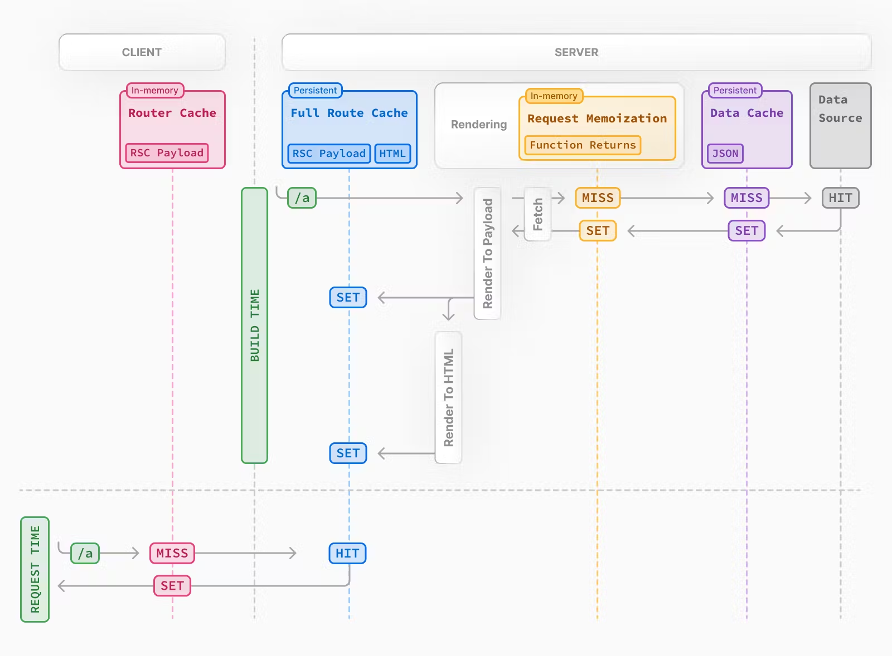
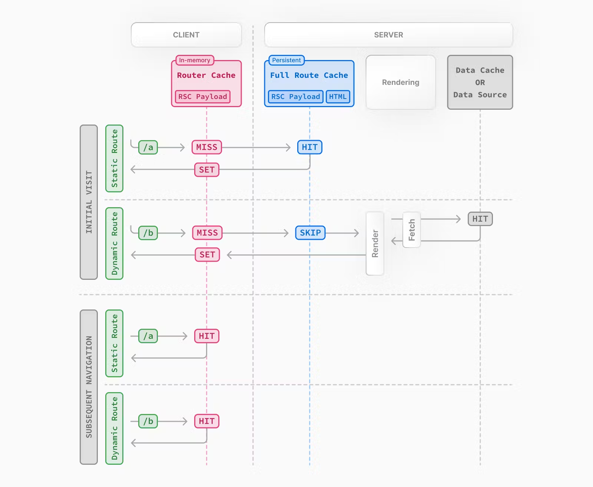
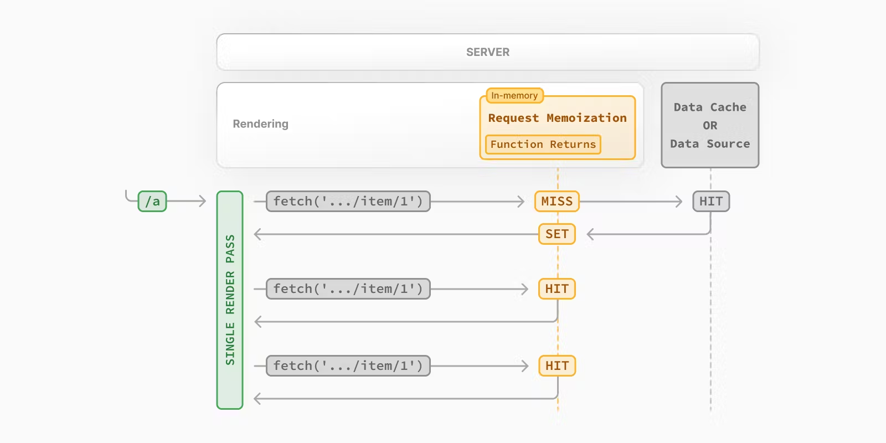
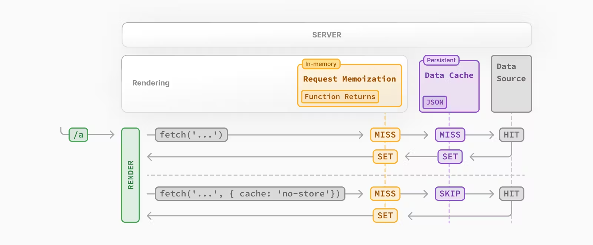
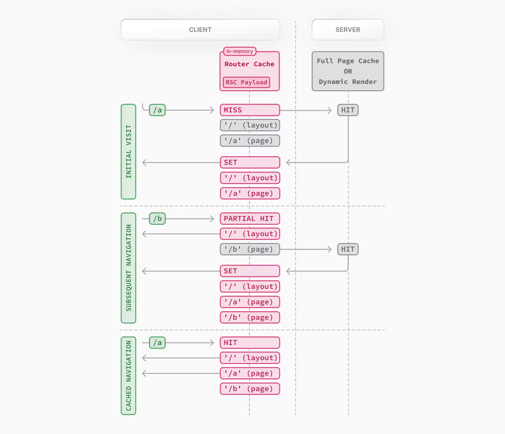

# 缓存

## 概述

### 概述

| Mechanism           | What                       | Where  | Purpose                                         | Duration                        |
| ------------------- | -------------------------- | ------ | ----------------------------------------------- | ------------------------------- |
| Request Memoization | Return values of functions | Server | Re-use data in a React Component tree           | Per-request lifecycle           |
| Data Cache          | Data                       | Server | Store data across user requests and deployments | Persistent (can be revalidated) |
| Full Route Cache    | HTML and RSC payload       | Server | Reduce rendering cost and improve performance   | Persistent (can be revalidated) |
| Router Cache        | RSC Payload                | Client | Reduce server requests on navigation            | User session or time-based      |



### 动态渲染和静态渲染

- 静态路由默认被缓存；
- 动态路由在请求时渲染，不会进行 Router Cache 以外的缓存；



### 工作流程

##### 服务器渲染

- React 将 RSC 转换成 RSC Payload；
- next 将 RSC Payload 和对应 js 转换为 html；

##### Full Route Cache

- next 在服务器缓存对应路由的 RSC Payload 和其渲染结果 HTML；

##### react hydration

- 立刻接受预先渲染的无交互逻辑的 HTML，仅限于首屏加载；
- 接受 RSC payload，构建组件树，并更新 DOM；
- next 水合 client component 和 js 代码，使其具有交互性；

##### Router Cache

- 客户端缓存 RSC Payload；

##### Subsequent Navigation

- next 检查对应路由是否具有 Router Cache；
  - 若已缓存，跳过请求返回 RSC Payload；
  - 若未缓存，向服务器发送请求，并将请求结果缓存至 Route Cache；

## Request Memoization

### memoize

- react 行为；
- react 拓展 fetch API，自动缓存具有相同 URL 和 option 的请求；
- 多个组件同时调用相同请求只需请求一次；

```typescript
async function getItem() {
  // The `fetch` function is automatically memoized and the result
  // is cached
  const res = await fetch("https://.../item/1");
  return res.json();
}

// This function is called twice, but only executed the first time
const item = await getItem(); // cache MISS
// The second call could be anywhere in your route
const item = await getItem(); // cache HIT
```

### 工作机制

- Request Memoization 作用于同一次渲染流程；
- 客户端第一次发送请求，服务器执行函数并缓存数据至内存；
- 客户端再次发送请求，直接从缓存中获取数据；
- 该次渲染完毕，清空内存中的缓存数据；



### 应用范围

- 只作用于 fetch 的 GET 请求；
- 只作用于 React Component tree；

### 生命周期

- 单次渲染流程；
- 可通过选择退出清空缓存；
  - 使用 AbortController；

```typescript
const { signal } = new AbortController();
fetch(url, { signal });
```

## Data Cache

### Data Cache

- next 行为；
- next 拓展 fetch API，缓存请求结果数据；
- 任何类型请求均被缓存；

### 工作机制

- 客户端发送请求，next 健在对应数据是否缓存；
  - 若未缓存，服务期执行代码返回数据，持久化缓存至 Data Cache，并对其 memoize；
  - 若已缓存，直接返回数据，并对其 memoize；
- 对于 next config 中设置 `{ cache: 'no-store' }` 的数据；
  - 服务期执行代码返回数据，并对其 memoize；



### 生命周期

- 持久化存储；
- 可通过重新验证或者选择退出清空缓存；

### 选择退出

- 设置 `cache: 'no-store'` 选项；

```typescript
// Opt out of caching for an individual `fetch` request
fetch(`https://...`, { cache: "no-store" });
```

## Full Route Cache

### Full Route Cache

- next 在构建时自动缓存 route 请求结果；
- next 在服务器缓存对应路由的 RSC Payload 和其渲染结果 HTML；

### 生命周期

- 持久化存储；
- 可通过清空 Data Cache，使用动态函数，重新部署清空缓存；

## Route Cache

### Route Cache

- next 行为；
- 将 RSC Payload 缓存至客户端内存中；
- 提高路由导航性能；

### 工作机制

- next 检查对应路由是否具有 Router Cache；
  - 若已缓存，跳过请求，直接返回缓存 RSC Payload；
  - 若未缓存，向服务器发送请求，并将请求对应 RSC Payload 缓存至 Route Cache；



### 生命周期

- 用户会话期间；
- 固定时间间隔自动清空；
  - 动态渲染：30s；
  - 静态渲染：5min；
- 可通过重新验证，使用动态函数清空缓存；

### prefetch

- 使用 `prefetch={true}` 或 router。prefetch；
- 强制缓存 5min，无论静态路由还是动态路由；

## 其他

### react 原生数据缓存

- 使用 react 的 cache api；
- 实验性行为，只能应用于 ssr，以后才学；

```typescript
// util.ts
import { cache } from "react";
export const getItem = cache(async (id: string) => {
  const item = await db.item.findUnique({ id });
  return item;
});

// page.ts
import { getItem } from "@/utils/get-item";
export const revalidate = 3600; // revalidate the data at most every hour
export default async function Page({
  params: { id },
}: {
  params: { id: string };
}) {
  const item = await getItem(id);
  // ...
}
```

### 数据验证

##### 数据验证

- 清除数据缓存，重新获取数据；

##### 验证策略

- 基于时间自动验证数据；
- 手动重新验证数据；
  - 使用 revalidateTag() api；
    - 定义 next config 中的 tag 标签；
    - 使用 revalidateTag() 基于 tag 标签验证
  - 使用 revalidatePath() api；

```typescript
// 基于时间自动验证数据 (秒)
fetch("https://...", { next: { revalidate: 3600 } });

// 使用 revalidatePath() api
("use server");
import { revalidatePath } from "next/cache";
export async function createPost() {
  try {
    // ...
  } catch (error) {
    // ...
  }
  revalidatePath("/posts");
}

// 使用 revalidateTag() api
export default async function Page() {
  const res = await fetch("https://...", { next: { tags: ["collection"] } });
  const data = await res.json();
  // ...
}
("use server");
import { revalidateTag } from "next/cache";
export default async function action() {
  revalidateTag("collection");
}
```

### 缓存交互

- Data Cache 的清空会作用于 Full Route Cache；
- Full Route Cache 的清空不会作用于 Data Cache；
- Data Cache 和 Route Cache；
  - Route Handler 中 Data Cache 的清空不会作用于 Route Cache；
    - 因为无法判断具体的路由片段；
  - Server Action 中 Data Cache 的清空会作用于 Route Cache；

## API

| API                                    | Router Cache               | Full Route Cache      | Data Cache            | React Cache |
| -------------------------------------- | -------------------------- | --------------------- | --------------------- | ----------- |
| Link prefetch                          | Cache                      |                       |                       |             |
| router.prefetch                        | Cache                      |                       |                       |             |
| router.refresh                         | Revalidate                 |                       |                       |             |
| fetch                                  |                            |                       | Cache                 | Cache       |
| fetch options.cache                    |                            |                       | Cache or Opt out      |             |
| fetch options.next.revalidate          |                            | Revalidate            | Revalidate            |             |
| fetch options.next.tags                |                            | Cache                 | Cache                 |             |
| revalidateTag                          | Revalidate (Server Action) | Revalidate            | Revalidate            |             |
| revalidatePath                         | Revalidate (Server Action) | Revalidate            | Revalidate            |             |
| const revalidate                       |                            | Revalidate or Opt out | Revalidate or Opt out |             |
| const dynamic                          |                            | Cache or Opt out      | Cache or Opt out      |             |
| cookies                                | Revalidate (Server Action) | Opt out               |                       |             |
| headers, useSearchParams, searchParams |                            | Opt out               |                       |             |
| generateStaticParams                   |                            | Cache                 |                       |             |
| React.cache                            |                            |                       |                       | Cache       |
| unstable_cache                         |                            |                       |                       |             |
