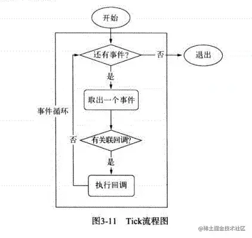

# node 基础

## 单线程

##### 主线程

- js 负责解释和执行代码的线程只有一个，称为主线程；

##### 工作线程

- 浏览器或 node 存在其他线程，处理 http，dom，IO 等，统称为工作线程；

##### 意义

- 避免多线程同步的问题；
- 降低应用程序内存占用；
- 降低上下文切换开销；

## 非堵塞 IO

### 基本原理

- 基于操作系统异步 IO 接口，后台进行 IO 操作；
- node 线程继续执行其他任务；
- IO 操作完成后，node 通知应用程序，进行对应操作；

### 优缺点

- 提高 IO 并发处理能力，提高服务器性能；

### 流程

- node 调用操作系统 IO 接口；
- 操作系统接受并挂起 IO 请求，立刻返回给 node，node 继续执行其他任务；
- 操作系统基于线程池异步处理 IO 操作；
- IO 操作完成后，操作系统向 node 发送信号，并保存结果；
- node 接受信号，读取处理结果，执行对应回调函数；

## 事件驱动

### 事件驱动

- 基于事件监听，事件循环和任务队列；
- 某事件触发，node 执行对应事件处理程序；

### 事件循环

##### 简要流程

- node 启动，创建事件循环和主线程；
- node 将所有的 IO 请求，定时器请求和异步函数放入任务队列中；
- 主线程开始一次循环；
  - 首先执行同步函数；
  - 其次检查任务队列是否具有可执行的任务；
- 若任务队列存在已完成任务，依次取出并放置于主线程执行；
  - 若任务为 IO 请求或定时器；
    - node 调用系统 IO 异步接口或定时器接口；
    - 将该任务设置为挂起状态，继续执行其他任务；
    - 系统 IO 异步操作或定时器超时，操作系统通知 node 任务完成，node 将其加入任务队列；
  - 其余任务调用对应回调函数，进入轮询等待阶段，直至任务执行完成；
- 若不存在，进行下一次循环；



##### 6 个阶段

- 6 个阶段；
  - timers 阶段；
    - 处理 setTimeout 和 setInterval；
    - 检查每一个计时器，判断是否到达时间，达到执行回调函数；
  - pending callback/IO callback；
    - 处理上一阶段少数未被执行的 IO 回调；
  - idle prepare：node 内部使用；
  - poll：检索并执行 IO 相关的回调函数；
    - 如果其他队列出现回调，进入 check 阶段；
    - 反之再该阶段一直等待；
  - check：执行 setImmediate() 回调；
  - close callback：执行一些 close() 的回调函数(socket，file)；
- 每个阶段具有自己的任务队列；
- 每个阶段之间首先清理 process。nextTick() 对应回调，再清理其他微任务回调；

### 宏任务和微任务

- 与浏览器一致，只是作用时机不同；
- 浏览器在每一个宏任务执行前，都要检查，执行和保证微任务队列为空；
- node 只在 6 个阶段之间检查，执行和保证微任务队列为空；
- 相关 API；
  - 微任务：process。nextTick()；
  - 宏任务：setImmediate()；

### 同步任务和异步任务

- 同步任务：主线程排队执行，堵塞线程，常以 sync 结尾；
- 异步任务：基于事件循环和任务队列，不堵塞线程；

```typescript
// 堵塞函数
copyBigFileSync("A.txt", "B.txt");
// 堵塞线程, 所有操作将在函数执行完成后才会执行
console.log("copy finished");

// 非阻塞式函数
console.log("start copying ... ");
copyBigFile("A.txt", "B.txt", () => {
  // ...
});
// 未堵塞线程, 后续操作立刻执行
console.log("copy finished");
```
