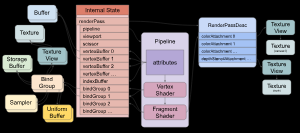
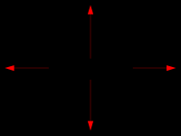
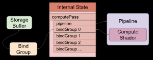

# webgpu 基础

## 基本概念

### 根本任务

- 纹理上绘制点/线/三角形；
- gpu 上进行运算；

### 着色器

##### 着色器

- 着色器是运行在 webgpu 上的函数；

##### 顶点着色器 (vertex shader)

- 计算顶点位置，返回 3 个顶点构造三角形；

##### 片段着色器 (fragment shader)

- 计算像素颜色，绘制三角形；

##### 计算着色器 (compute shader)

- 执行自定义操作；

### 基本机制

##### 简化图

- pipeline 包含顶点着色器和片段着色器；
  - 可通过计算着色器创建 pipeline；
- 着色器通过 bind groups 引用资源；
- pipeline 定义 attributes 引用缓冲区数据；
- attributes 从缓冲区提取数据，并传送给顶点着色器；
- 顶点着色器可能传送数据给片段着色器；
- 片段着色器通过 RenderPassDesc 写入纹理；



##### 不可变

- 大多数 webgpu 资源创建后无法更改；
- 若想更改，创建一个新资源；

##### 命令缓冲区

- webgpu 通过创建和执行命令设置状态；

##### 裁剪空间

- 纹理坐标；



## 绘制三角形

### 绘制模式

- point-list：每 1 个顶点绘制 1 个 point；
- line-list：每 2 个顶点绘制 1 个 line；
- triangle-list：每 3 个顶点绘制 1 个 triangle；

### 基本流程

```typescript
async function init() {
  // 创建适配器
  const adapter = await navigator.gpu?.requestAdapter();
  const device = await adapter?.requestDevice();
  if (!device) {
    console.error("need a browser that supports WebGPU");
    return;
  }
  // 获取 canvas 并创建 webgpu 上下文
  const canvas = document.querySelector("canvas")!;
  const context = canvas.getContext("webgpu")!;
  const presentationFormat = navigator.gpu.getPreferredCanvasFormat();
  context.configure({
    device,
    format: presentationFormat,
  });

  // 定义着色器
  const module = device.createShaderModule({
    label: "our hardcoded red triangle shaders", // 可选, 但推荐总是使用
    code: `
      // 顶点着色器
      // 返回顶点坐标
      @vertex fn vs(
        @builtin(vertex_index) vertexIndex : u32
      ) -> @builtin(position) vec4f {
        let pos = array(
          vec2f( 0.0,  0.5),  // top center
          vec2f(-0.5, -0.5),  // bottom left
          vec2f( 0.5, -0.5)   // bottom right
        );

        return vec4f(pos[vertexIndex], 0.0, 1.0);
      }

      // 片段着色器, 定义颜色, 依次为 rgba
      @fragment fn fs() -> @location(0) vec4f {
        return vec4f(1.0, 0.0, 0.0, 1.0);
      }
    `,
  });

  // 根据着色器定义用于渲染的 pipeline
  const pipeline = device.createRenderPipeline({
    label: "our hardcoded red triangle pipeline",
    layout: "auto",
    vertex: {
      module,
      entryPoint: "vs",
    },
    fragment: {
      module,
      entryPoint: "fs",
      targets: [{ format: presentationFormat }], // 指定目标纹理格式
    },
  });

  // 定义 RenderPassDesc
  const renderPassDescriptor: GPURenderPassDescriptor = {
    label: "our basic canvas renderPass",
    colorAttachments: [
      {
        view: context.getCurrentTexture().createView(), // 定义纹理试图
        clearValue: [0.3, 0.3, 0.3, 1], // 空值填充颜色, rgba
        loadOp: "clear", // 绘制之前如何处理纹理
        storeOp: "store", // 是否保存纹理
      },
    ],
  };

  // 创建命令缓冲区
  const encoder = device.createCommandEncoder({ label: "our encoder" }); // 创建命令编码器
  const pass = encoder.beginRenderPass(renderPassDescriptor); // 创建渲染通道编码器
  pass.setPipeline(pipeline); // 设置管线
  pass.draw(3); // 执行顶点着色器 3 次
  pass.end(); // 结束命令
  const commandBuffer = encoder.finish(); // 完成命令编码器
  // 提交并执行命令
  device.queue.submit([commandBuffer]);
}
```

## GPU 计算



```typescript
async function init() {
  // 定义适配器
  const adapter = await navigator.gpu?.requestAdapter();
  const device = await adapter?.requestDevice();
  if (!device) {
    console.error("need a browser that supports WebGPU");
    return;
  }

  // 定义计算着色器
  const module = device.createShaderModule({
    label: "doubling compute module",
    code: `
      @group(0) @binding(0) var<storage, read_write> data: array<f32>;
 
      @compute @workgroup_size(1) fn computeSomething(
        @builtin(global_invocation_id) id: vec3u
      ) {
        let i = id.x;
        data[i] = data[i] * 2.0;
      }
    `,
  });

  // 根据着色器定义用于计算的 pipeline
  const pipeline = device.createComputePipeline({
    label: "doubling compute pipeline",
    layout: "auto",
    compute: {
      module,
      entryPoint: "computeSomething",
    },
  });

  // 计算着色器输入数据
  const input = new Float32Array([1, 3, 5]);
  // 定义工作缓冲区存储输入数据
  const workBuffer = device.createBuffer({
    label: "work buffer",
    size: input.byteLength, // 缓冲区大小
    usage:
      GPUBufferUsage.STORAGE |
      GPUBufferUsage.COPY_SRC |
      GPUBufferUsage.COPY_DST, // 缓冲区作用
  });
  // 复制数据至工作缓冲区
  device.queue.writeBuffer(workBuffer, 0, input);

  // js 无法直接读取 webgpu 缓冲区数据
  // 定义特殊的缓冲区用于读取结果数据
  const resultBuffer = device.createBuffer({
    label: "result buffer",
    size: input.byteLength,
    usage: GPUBufferUsage.MAP_READ | GPUBufferUsage.COPY_DST,
  });

  // 设置 bindGroup 绑定资源
  const bindGroup = device.createBindGroup({
    label: "bindGroup for work buffer",
    layout: pipeline.getBindGroupLayout(0), // 对应 @group(0)
    entries: [{ binding: 0, resource: { buffer: workBuffer } }], // 对应 @group(0) @binding(0)
  });

  // 创建命令缓冲区
  const encoder = device.createCommandEncoder({
    label: "doubling encoder",
  }); // 创建命令编码器
  const pass = encoder.beginComputePass({
    label: "doubling compute pass",
  }); // 创建计算通道编码器
  pass.setPipeline(pipeline); // 设置管线
  pass.setBindGroup(0, bindGroup); // 设置绑定组
  pass.dispatchWorkgroups(input.length); // 执行计算着色器三次
  pass.end(); // 结束计算通道编码器
  encoder.copyBufferToBuffer(workBuffer, 0, resultBuffer, 0, resultBuffer.size); // 复制缓冲区
  const commandBuffer = encoder.finish(); // 结束命令编码器
  // 提交并执行命令
  device.queue.submit([commandBuffer]);

  // 读取结果
  await resultBuffer.mapAsync(GPUMapMode.READ);
  const result = new Float32Array(resultBuffer.getMappedRange());
  // 打印结果
  console.log("input", input);
  console.log("result", result);
  // 取消引用
  resultBuffer.unmap();
}
```
