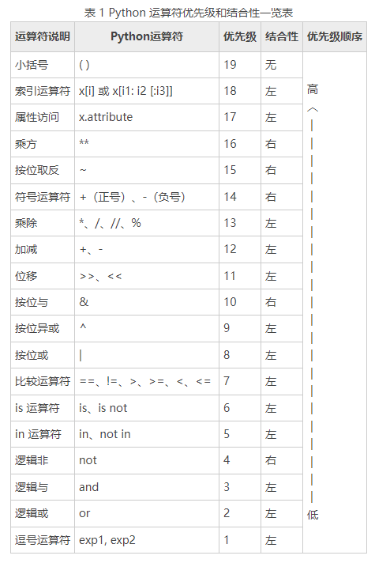

# 数据类型

## 字符串

### 基础

##### string

- sequences 类型，故可使用索引；

```python
# 单引号
'This is also a string.'
# 双引号
"This is a string."
# 三引号, 可跨行, 自动添加换行符
"""
Three
double
quotes
"""
```

##### 引号中使用引号

```python
# 引号嵌套于不同种类的引号;
# 使用转义字符 \\;
'I told my friend, "Python is my favorite language!"'
"The language 'Python' is named after Monty Python, not the snake."
'One of Python\'iter strengths is its diverse and supportive community.'
```

### f-strings

##### f-strings

- 字符串前加 f；
- 字符串中使用 {} 表示替换变量或表达式；

```python
# 变量
first_name = "ada"
last_name = "lovelace"
full_name = f"{first_name} {last_name}"
# 表达式
message = f"Hello, {full_name.lower()}!"
```

##### 转义字符限制

- 大括号内不可使用转义字符；

##### f-strings 显示{}

- 连续输入两个大括号，即 `{{ 和 }}`；

### 空白与转义字符

##### 空白

- 空格；
- 制表符；
- 换行符；

##### 常见转义字符

| 转义字符 | 定义       |
| -------- | ---------- |
| \        | 续行符     |
| \        | 反斜杠     |
| '        | 单引号     |
| "        | 双引号     |
| \b       | 退格       |
| \r       | 回车       |
| \t       | 水平制表符 |
| \v       | 垂直制表符 |
| \oyy     | 八进制     |
| \xyy     | 十六进制   |

### API

- str.strip([chars]) 方法-> str：去除字符串左右，chars 对应字符的*任意组合*，返回副本；
- str.lstrip([chars]) 方法 ->：去除字符串左，chars 对应字符的*任意组合*，返回副本；
- str.rstrip([chars]) 方法 ->：去除字符串右，chars 对应字符的*任意组合*，返回副本；

##### str.rstrip() 方法

- str.rstrip([chars])
  - 去除字符串右，chars 对应字符的*任意组合*；
  - 其余同 str.strip() 方法；

##### str.removeprefix() 方法

- str.removeprefix(prefix)

- 如果 str 以 prefix 开头，将 prefix 移除；
- prefix：前缀字符串；
- 返回值：字符串副本；

##### str.removesuffix() 方法

- str.removesuffix(suffix)

- 如果 str 以 suffix 结尾，将 suffix 移除；
- suffix：后缀字符串；
- 返回值：字符串副本；

#### 字符串形式

##### str.title() 方法

- str.title()；
  - 返回 str 标题形式；
  - 返回值：副本；

##### str.upper() 方法

- str.upper()；
  - 返回 str 大写形式；
  - 返回值：副本；

##### str.lower() 方法

- str.lower()；
  - 返回 str 小写形式；
  - 返回值：副本；

#### 分割/链接字符串

##### str.split() 方法

- str.split(sep=None，maxsplit=-1)；
  - 根据指定字符分割字符串；
  - sep：分割字符串的字符；
    - 当 sep 为默认值时，任意形式和任意数量的空白符号；
  - maxsplit (可选)：分割次数，默认为 -1，即无限次；
  - 返回值：列表；

```python
>>> '1 2 3'.split()
['1', '2', '3']
>>> '1,2,3'.split(',')
['1', '2', '3']
>>> '1,2,3'.split(',', maxsplit=1)
['1', '2,3']
```

##### str.join() 方法

- str.join(iterable)；
  - 将 iterable 通过 str 连接；
  - iterable：待连接的可迭代对象；
  - str：连接字符；
  - 返回值：str；

#### 字符串匹配

##### str.replace() 方法

- str.replace(old，new[，count])；
  - old 字符串替换为 new 字符串；
  - old：待替换字符串；
  - new：替换字符串；
  - count：替换最大个数 (可选)；
  - 返回值：副本；

##### str.endswith() 方法

- str.endswith(suffix[，start[，end]])；
  - 匹配 str 中 [start，end) 范围内是否以 suffix 结尾；
  - suffix：指定后缀；
  - start：起始值，默认为 0 (可选)；
  - end：终止值，默认为 len(str) (可选)；
  - 返回值；
    - True：以 suffix 结尾；
    - Fasle：不以 suffix 结尾；

##### str.startswith() 方法

- str.startswith(suffix[，start[，end]])；
  - 匹配 str 中 [start，end) 范围内是否以 suffix 开头；
  - 其余同 str.endswith() 方法；

#### 其他

##### str.count() 方法

- str.count(sub[，start[，end]])；

  - 返回无重叠 sub 子字符串的出现次数；
  - sub：子字符串；
  - start：搜索范围起始索引，默认为 0 (可选)；
  - end：搜索范围结束索引，默认为最后一个字符 (可选)；
  - 返回值：出现次数；

## 数字

### 整数和浮点数

##### 整数

- 不带小数点的数字；

##### 其余进制表示

- 二进制：0b；
- 八进制：前缀 0o；
- 十六机制：前缀 0x；

##### 浮点数

- 带小数点的数字

##### 精度损失

```python
# 由于二进制和十进制的转换;
# float 类型具有精度损失;
>>> 0.2 + 0.1
0.30000000000000004
>>> 3 * 0.1
0.30000000000000004
```

##### 浮点数与整数混合运算

- 结果为浮点数；

### 数字中的下划线

##### 机制

```python
# python 忽视数字中的下划线;
# 使数字具有可读性;
>>> universe_age = 14_000_000_000
>>> print(universe_age)
14000000000
```

### API

#### 转换函数

##### int() 函数

- int(x，base=10)；
  - 将数字/字符串转换为 int() 类型；
  - x：number/string 类型；
  - base：int，转换进制，默认为 10 进制，范围 2 - 36；
  - 返回值：int 类型；

##### float() 函数

- float(x)；
  - 将数字/字符串转换为 float() 类型；
  - x：number/string 类型；
  - 返回值：float 类型；

#### 数学运算

##### abs() 函数

- abs(x)；
  - 返回数字绝对值；
  - x：number 类型；
  - 返回值：num 类型；

##### round() 函数

- round(number[，ndigits])；
  - 四舍五入；
  - number：number；
  - ndigits：保留小数位数，默认为 None；
  - 返回值：number；

## 布尔类型和 None

### 布尔类型

##### 布尔值

- 真值；
- 假值；
  - None，False；
  - 0，0.0；
  - 空字符串/列表/元素/range/集合/字典；

##### 布尔运算

- and；
- or；
- not；

### None

##### None

- 表示空；

## 可迭代类型

### 基本概念

##### 可迭代类型

- sequence types；
  - list；
  - tuple；
  - range；
- text sequence types：str；
- set types；
  - set；
  - frozenset；
- mapping types：dict；

### 通用 API

##### len() 函数

- len(iter)；
  - 求可迭代对象长度；
  - iter：可迭代对象；
  - 返回值：可迭代对象长度；

##### min() 函数

- min(iter)；
  - 求可迭代对象最小值；
  - iter：可迭代对象；
  - 返回值：可迭代对象最小值；

##### max() 函数

- max(iter)；
  - 求可迭代对象最大值；
  - iter：可迭代对象；
  - 返回值：可迭代对象最大值；

##### sum() 函数

- max(iter)；
  - 求可迭代对象总和；
  - iter：可迭代对象；
  - 返回值：可迭代对象总和；

## 运算符

### 算术运算符

| 运算符 | 含义 |
| ------ | ---- |
| +      | 加   |
| -      | 减   |
| \*     | 乘   |
| /      | 除   |
| //     | 整除 |
| %      | 取余 |
| \*\*   | 乘方 |

### 关系运算符

| 运算符 | 含义     | 机制                                |
| ------ | -------- | ----------------------------------- |
| ==     | 相等     | 若相等返回 True, 反之返回 False     |
| !=     | 不相等   | 若不相等返回 True, 反之返回 False   |
| \>     | 大于     | 若大于返回 True, 反之返回 False     |
| \>=    | 大于等于 | 若大于等于返回 True, 反之返回 False |
| \<     | 小于     | 若小于返回 True, 反之返回 False     |
| \<=    | 小于等于 | 若小于等于返回 True, 反之返回 False |

### 赋值运算符

| 运算符 | 含义                          |
| ------ | ----------------------------- |
| =      | 赋值                          |
| +=     | a += b 等效于 a = a + b       |
| -=     | a -= b 等效于 a = a - b       |
| \*=    | a \*= b 等效于 a = a \* b     |
| /=     | a /= b 等效于 a = a / b       |
| //=    | a //= b 等效于 a = a // b     |
| % =    | a %= b 等效于 a = a % b       |
| \*\*=  | a \*\*= b 等效于 a = a \*\* b |

### 逻辑运算符

| 布尔运算符 | 定义 | 机制               |
| ---------- | ---- | ------------------ |
| and        | 与   | 一假即假, 全真才真 |
| or         | 或   | 一真即真, 全假才假 |
| not        | 非   | 真假取反           |

##### 短路机制

```python
# x 为假, 直接返回假
x and y

# x 为真, 直接返回真
x or y
```

##### not 优先级

- not 优先级很低；
- 最好使用 ()；

### 成员运算符

| 成员运算符    | 机制                                               |
| ------------- | -------------------------------------------------- |
| x in iter     | 若 x 为 iter 中的元素, 返回 ture, 否则返回 false   |
| x not in iter | 若 x 不为 iter 中的元素, 返回 ture, 否则返回 false |

##### 字符串机制

- 判断 x 是否为 iter 的子串；
- 空字符串是所有字符串的子串；

### 身份运算符

| 身份运算符 | 意义                                              |
| ---------- | ------------------------------------------------- |
| is         | 若两者引用同一对象, 返回 true, 反之返回 false     |
| is not     | 若两者不是引用同一对象, 返回 true, 反之返回 false |

### 优先级

##### 优先级

- 运算符的优先次序；


