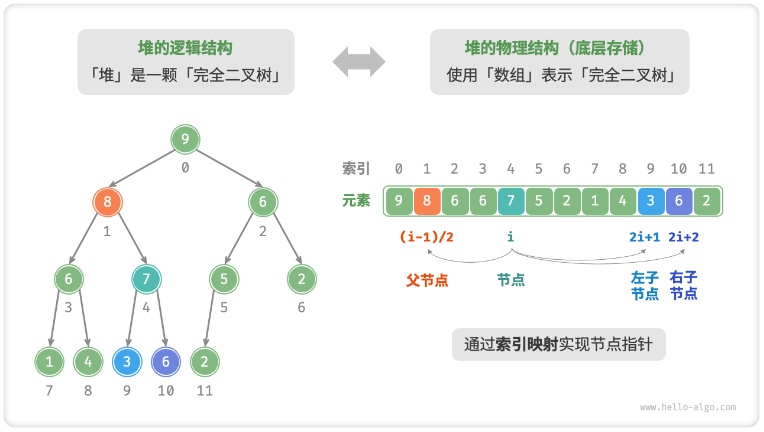

# 队列

## 队列

### 基础

##### 队列

- 先入先出；
- 线性数据结构；

##### 队首和队尾

- 队首：队列头部；
- 队尾：队列尾部；

##### 入队和出队

- 入队：队尾添加元素；
- 出队：队首删除元素；

### 队列操作

| 方法名 | 描述                         | 时间复杂度 |
| ------ | ---------------------------- | ---------- |
| push() | 元素入队, 即将元素添加至队尾 | $O(1)$     |
| pop()  | 队首元素出队                 | $O(1)$     |
| peek() | 访问队首元素                 | $O(1)$     |

### 队列实现

#### 链表实现

```typescript
import { DoublyLinkedList } from "../linked_list/doubly_linked_list";
import { DoublyLinkedListNode } from "../linked_list/doubly_linked_list_node";

export class QueueWithLinkedList<T> {
  list: DoublyLinkedList<T>;
  front: DoublyLinkedListNode<T> | null;
  rear: DoublyLinkedListNode<T> | null;
  constructor() {
    this.list = new DoublyLinkedList<T>();
    this.rear = null;
    this.front = null;
  }

  isEmpty() {
    return this.list.isEmpty();
  }

  enQueue(node: DoublyLinkedListNode<T>) {
    const head = this.list.head;
    if (this.isEmpty()) {
      this.front = node;
    }
    this.list.insert(node, head);
    this.rear = node;
  }

  deQueue() {
    if (this.isEmpty()) throw new Error("empty");
    const front = this.front as DoublyLinkedListNode<T>;
    this.list.delete(front);
    this.front = front.before as DoublyLinkedListNode<T>;
    if (this.isEmpty()) {
      this.rear = null;
      this.front = null;
    }
  }
}
```

#### 环形数组

- 数组删除元素时间复杂度为 O(n)；
- 使用 front 和 rear 变量记录队列队首队尾位置；
- 入队和出队操作对应变量 + 1；
- 当 front 或 rear 越过数组时，回到数组头部；

```typescript
export class QueueArray {
  private _capacity: number;
  private _size: number;
  private _front: number;
  private _rear: number;
  private _array: unknown[];
  constructor(capacity: number) {
    this._capacity = capacity;
    this._size = 0;
    this._front = 0;
    this._rear = 0;
    this._array = new Array(capacity);
  }

  isEmpty() {
    return this._size === 0;
  }

  isFull() {
    return this._size === this._capacity;
  }

  enQueue(value: unknown) {
    if (this.isFull()) return false;
    this._array[this._rear] = value;
    this._size += 1;
    if (this._rear === this._capacity - 1) this._rear = 0;
    else this._rear += 1;
    return true;
  }

  deQueue() {
    if (this.isEmpty()) return false;
    this._array[this._front] = undefined;
    this._size -= 1;
    if (this._front === this._capacity - 1) this._front = 0;
    else this._front += 1;
    return true;
  }
}
```

### 双向队列

- 栈和队列的集合体；
- 允许在头部和尾部进行插入和删除操作；

## 队列基础题目

### 用队列实现栈

##### 题目

- [225](https://leetcode.cn/problems/implement-stack-using-queues/)；

##### 思路

- 使用两个队列 in，out；
- 始终让 out 的队首为最新添加的元素；
- 现将新元素压入 in，再依次将 out 的元素压入 in；
- 交换 in 和 out；

```typescript
var MyStack = function () {
  this.in = [];
  this.out = [];
};

/**
 * @param {number} x
 * @return {void}
 */
MyStack.prototype.push = function (x) {
  this.in.push(x);
  while (this.out.length > 0) {
    this.in.push(this.out.shift());
  }
  [this.out, this.in] = [this.in, this.out];
};

/**
 * @return {number}
 */
MyStack.prototype.pop = function () {
  return this.out.shift();
};

/**
 * @return {number}
 */
MyStack.prototype.top = function () {
  return this.out[0];
};

/**
 * @return {boolean}
 */
MyStack.prototype.empty = function () {
  return this.out.length === 0;
};

/**
 * Your MyStack object will be instantiated and called as such:
 * var obj = new MyStack()
 * obj.push(x)
 * var param_2 = obj.pop()
 * var param_3 = obj.top()
 * var param_4 = obj.empty()
 */
```

##### 复杂度

- 时间：1；
- 空间：n；

## 堆

### 基础

##### 堆

- 特定条件的完全二叉树；

##### 大顶堆

- 任意节点的值大于等于子节点的值；

##### 小顶堆

- 任意节点的值小于等于子节点的值；

##### 堆顶和堆底

- 堆顶：根节点；
- 堆底：底层最靠右的节点；

##### 节点和索引的映射



### 基本操作

##### 访问堆顶元素

- 直接返回堆顶；

##### 入堆

- 首先添加至堆底；
- 自底向顶依次比较；
  - 若插入值大于比较值，交互节点值；
  - 直至无需交换或到达根节点；

##### 出堆

- 交换堆顶元素和堆底元素；
- 删除堆底元素；
- 自顶向底依次比较；
  - 若插入值小于比较值，交互节点值；
  - 直至无需交换或到达叶子节点；

##### 堆化操作

- 列表元素原封不动添加至堆；
- 从数组末端遍历数组，依次执行从顶至底堆化操作；
- 时间复杂度为 O(n)；

### 数组实现

```typescript
class MaxHeap {
  siftDown(nums, n, i) {
    while (true) {
      let l = 2 * i + 1;
      let r = 2 * i + 2;
      let ma = i;
      if (l < n && nums[l] > nums[ma]) ma = l;
      if (r < n && nums[r] > nums[ma]) ma = r;
      if (ma === i) break;
      [nums[i], nums[ma]] = [nums[ma], nums[i]];
      i = ma;
    }
  }

  siftUp(nums, i) {
    while (i >= 0) {
      const parent = Math.floor((i - 1) / 2);
      if (val > nums[parent]) {
        [nums[i], nums[parent]] = [nums[parent], nums[i]];
        i = parent;
      } else {
        break;
      }
    }
  }

  heapify(nums) {
    for (let i = Math.floor(nums.length / 2) - 1; i >= 0; i--) {
      this.siftDown(nums, nums.length, i);
    }
  }

  push(nums, val) {
    nums.push(val);
    this.siftUp(nums, nums.length - 1);
  }

  pop(nums) {
    [nums[0], nums[nums.length - 1]] = [nums[nums.length - 1], nums[0]];
    this.siftDown(nums, nums.length - 1, 0);
    return nums.pop();
  }
}
```

## 优先队列

### 基础

##### 优先队列

- 一种特殊的队列；
- 队列元素赋予优先级；
- 优先级高的队列元素优先出列；

##### 使用场景

- 任务调度器；
- 查找第 k 个最小元素；

##### 二叉堆实现方式

- 数组；
- 链表；
- 二叉堆实现；

```typescript
class MaxHeap {
  siftDown(nums, n, i) {
    while (true) {
      let l = 2 * i + 1;
      let r = 2 * i + 2;
      let ma = i;
      if (l < n && nums[l][1] > nums[ma][1]) ma = l;
      if (r < n && nums[r][1] > nums[ma][1]) ma = r;
      if (ma === i) break;
      [nums[i], nums[ma]] = [nums[ma], nums[i]];
      i = ma;
    }
  }

  siftUp(nums, i) {
    while (i > 0) {
      const parent = Math.floor((i - 1) / 2);
      if (nums[i][1] > nums[parent][1]) {
        [nums[i], nums[parent]] = [nums[parent], nums[i]];
        i = parent;
      } else {
        break;
      }
    }
  }

  heapify(nums) {
    for (let i = Math.floor(nums.length / 2) - 1; i >= 0; i--) {
      this.siftDown(nums, nums.length, i);
    }
  }

  push(nums, val) {
    nums.push(val);
    this.siftUp(nums, nums.length - 1);
  }

  pop(nums) {
    [nums[0], nums[nums.length - 1]] = [nums[nums.length - 1], nums[0]];
    this.siftDown(nums, nums.length - 1, 0);
    return nums.pop();
  }
}
```

## 优先队列题目

### 前 K 个高频元素

##### 题目

- [347](https://leetcode.cn/problems/top-k-frequent-elements/)；

##### 思路

- 使用优先队列和哈希表；
- 使用哈希表记录数组各个元素的频数；
- 构建优先队列，优先级为元素频数；
- 基于 top-k 的思想得到前 k 个高频元素；

```typescript
/**
 * @param {number[]} nums
 * @param {number} k
 * @return {number[]}
 */
var topKFrequent = function (nums, k) {
  class MaxHeap {
    siftDown(nums, n, i) {
      while (true) {
        let l = 2 * i + 1;
        let r = 2 * i + 2;
        let ma = i;
        if (l < n && nums[l][1] > nums[ma][1]) ma = l;
        if (r < n && nums[r][1] > nums[ma][1]) ma = r;
        if (ma === i) break;
        [nums[i], nums[ma]] = [nums[ma], nums[i]];
        i = ma;
      }
    }

    siftUp(nums, i) {
      while (i > 0) {
        const parent = Math.floor((i - 1) / 2);
        if (nums[i][1] > nums[parent][1]) {
          [nums[i], nums[parent]] = [nums[parent], nums[i]];
          i = parent;
        } else {
          break;
        }
      }
    }

    heapify(nums) {
      for (let i = Math.floor(nums.length / 2) - 1; i >= 0; i--) {
        this.siftDown(nums, nums.length, i);
      }
    }

    push(nums, val) {
      nums.push(val);
      this.siftUp(nums, nums.length - 1);
    }

    pop(nums) {
      [nums[0], nums[nums.length - 1]] = [nums[nums.length - 1], nums[0]];
      this.siftDown(nums, nums.length - 1, 0);
      return nums.pop();
    }
  }

  const map = {};
  for (const num of nums) {
    if (map[num] == null) {
      map[num] = 1;
    } else {
      map[num]++;
    }
  }

  const res = [];
  const heap = new MaxHeap();
  const queue = [];
  for (const entries of Object.entries(map)) {
    queue.push([Number(entries[0]), entries[1]]);
  }
  heap.heapify(queue);
  for (let i = 0; i < k; i++) {
    res.push(heap.pop(queue)[0]);
  }

  return res;
};
```

##### 复杂度

- 时间：nlogn；
- 空间：n；
