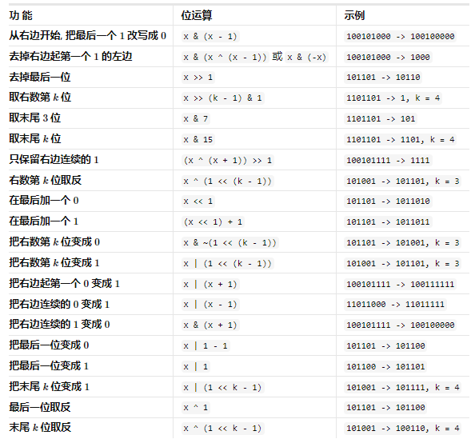

# 基础算法

## 枚举算法

### 概述

- 穷举算法；
- 列举问题所有的解，遭到满足条件的解；

### 优化思路

- 添加约束条件，缩小求解范围；

## 枚举算法题目

### 统计平方和三元组数量

##### 题目

- [1925](https://leetcode.cn/problems/count-square-sum-triples/)；

##### 思路

- 从 [1，n] 枚举 a 和 b；
- 判断 c 是否小于 n；

```typescript
/**
 * @param {number} n
 * @return {number}
 */
var countTriples = function (n) {
  let res = 0;
  for (let a = 1; a <= n; a++) {
    for (let b = 1; b <= n; b++) {
      const c2 = a * a + b * b;
      const c = Math.floor(Math.sqrt(c2));
      if (c * c === c2 && c <= n) res++;
    }
  }
  return res;
};
```

##### 复杂度

- 时间：n^2；
- 空间：1；

## 递归算法

### 概述

- 重复的将规模大的问题分解为子问题；

### 两个过程

- 递推过程：原问题分解为形式相同，规模更小的子问题；
- 回归过程：从子问题一步步合并成原问题；

### 解题思路

- 写出递归公式；
- 确定终止条件；

```python
def recursion(大规模问题):
    if 递归终止条件:
        递归终止时的处理方法

    return recursion(小规模问题)
```

### 注意点

##### 栈溢出

- 递归通过堆栈实现；
- 一次递归使用一个栈空间；
- 避免递归深度过大导致栈溢出；

##### 重复计算

- 递归过程中往往计算重复值；
- 可使用数组/哈希表存储已经计算的值；

## 递归算法题目

### 两两交换链表中的节点

##### 题目

- [24](https://leetcode.cn/problems/swap-nodes-in-pairs/)；

##### 思路

- 创建哑节点指向 next；
- 创建当前节点 cur，下一个 n，下一个的下一个 nn；
- 修改三个指针的关系，看代码即可，修改顺序不能错；

```typescript
/**
 * Definition for singly-linked list.
 * function ListNode(val, next) {
 *     this.val = (val===undefined ? 0 : val)
 *     this.next = (next===undefined ? null : next)
 * }
 */
/**
 * @param {ListNode} head
 * @return {ListNode}
 */
var swapPairs = function (head) {
  const dummy = new ListNode(-1, head);
  let cur = dummy;
  while (cur != null && cur.next != null && cur.next.next != null) {
    let n = cur.next;
    let nn = cur.next.next;
    cur.next = nn;
    n.next = nn.next;
    nn.next = n;
    cur = n;
  }
  return dummy.next;
};
```

##### 复杂度

- 时间：n；
- 空间：n；

### 24 点游戏

##### 题目

- [679](https://leetcode.cn/problems/24-game/description/)；

##### 思路

- 基于递归思想，将 4 个数求 24 转换为 3 个数，以此类推；
- 基于交换律，总计 6 种情况；

```typescript
/**
 * @param {number[]} nums
 * @return {boolean}
 */
var judgePoint24 = function (nums) {
  if (nums.length == 1) return Math.abs(nums[0] - 24) < 0.000001;
  for (let i = 0; i < nums.length; i++)
    for (let j = i + 1; j < nums.length; j++) {
      let rest = nums.filter((value, index) => index != i && index != j);
      if (
        judgePoint24([nums[i] + nums[j], ...rest]) ||
        judgePoint24([nums[i] * nums[j], ...rest]) ||
        judgePoint24([nums[i] - nums[j], ...rest]) ||
        judgePoint24([nums[j] - nums[i], ...rest]) ||
        judgePoint24([nums[i] / nums[j], ...rest]) ||
        judgePoint24([nums[j] / nums[i], ...rest])
      )
        return true;
    }
  return false;
};
```

##### 复杂度

- 时间：n!；
- 空间：1；

## 位运算

### 基础操作

| 运算符 | 描述           | 规则                                                                                     |
| ------ | -------------- | ---------------------------------------------------------------------------------------- |
| `\|`   | 按位或运算符   | 只要对应的两个二进位有一个为 $1$ 时, 结果位就为 $1$.                                     |
| `&`    | 按位与运算符   | 只有对应的两个二进位都为 $1$ 时, 结果位才为 $1$.                                         |
| `<<`   | 左移运算符     | 将二进制数的各个二进位全部左移若干位. `<<` 右侧数字指定了移动位数, 高位丢弃, 低位补 $0$. |
| `>>`   | 右移运算符     | 对二进制数的各个二进位全部右移若干位. `>>` 右侧数字指定了移动位数, 低位丢弃, 高位补 $0$. |
| `^`    | 按位异或运算符 | 对应的两个二进位相异时, 结果位为 $1$, 二进位相同时则结果位为 $0$.                        |
| `~`    | 取反运算符     | 对二进制数的每个二进位取反, 使数字 $1$ 变为 $0$, $0$ 变为 $1$.                           |

### 位运算的应用

##### 判断整数奇偶

- 偶数对应二进制末尾定义为 0，反之为 1；
- 使用 1 对其进行按位与；

```typescript
(x & 1) === 0; // 偶数
(x & 1) === 1; // 奇数
```

##### 选取指定位

- 构造二进制数 x，使其在指定位为 1 其余为 0；
- 两数进行按位与运算；

##### 指定位设置 1;

- 构造二进制数 x，使其在指定位为 1 其余为 0；
- 两数进行按位或运算；

##### 指定位设置 0;

- 构造二进制数 x，使其在指定位为 0 其余为 1；
- 两数进行按位与运算；

##### 指定位翻转

- 构造二进制数 x，使其在指定位为 1 其余为 0；
- 两数进行按位异或运算；

##### 常见二进制操作



## 位运算题目

### 位 1 的个数

##### 题目

- [191](https://leetcode.cn/problems/number-of-1-bits/)；

##### 思路

- 诸位进行按位与运算；

```typescript
/**
 * @param {number} n
 * @return {number}
 */
var hammingWeight = function (n) {
  let res = 0;
  while (n) {
    res += n & 1;
    n = n >> 1;
  }
  return res;
};
```

##### 复杂度

- 时间：k；
- 空间：1；

### 丢失的数字

##### 题目

- [268](https://leetcode.cn/problems/missing-number/)；

##### 思路

- 哈希表思路：构造 set，循环一遍数组即可；
- 异或；
  - 构造 [0，n] 的异或和；
  - 遍历数组元素求异或，剩下的即为未出现数字；

```typescript
/**
 * @param {number[]} nums
 * @return {number}
 */
var missingNumber = function (nums) {
  let res = 0;
  for (let i = 1; i <= nums.length; i++) {
    res ^= i;
  }
  for (let i = 0; i < nums.length; i++) {
    res ^= nums[i];
  }

  return res;
};
```

##### 复杂度

- 时间：n；
- 空间：1；
