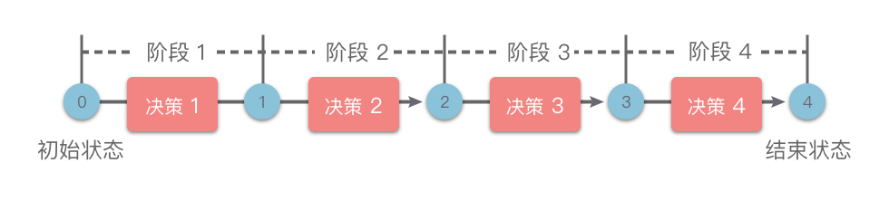

# 动态规划

## 基础

### 基本思想

- 将问题分解为子问题；
- 通过存储子问题的解，避免重复计算；

### 基本术语

- dp 表：记录子问题的解；
- 初始状态：最小子问题的状态；
- 状态转移公式：dp 的递推公式；

### dp 问题特性

##### 最优子结构

- 原问题的最优解，是从子问题的最优解构建得来；

##### 无后效性

- 给定确定状态；
- 未来状态只和当前状态有关，与过去状态无关；
- 存在严重后效性的问题，难以使用动态规划解决；

### dp 解题思路

- 划分阶段；
  - 将问题按照特定顺序分解为互相联系的阶段，即子问题的求解；
  - 完成前一阶段才可进行下一阶段；
- 定义状态：根据问题变量设置状态，建立 dp 表；
- 状态转移：建立不同阶段之间的状态转移公式；
- 初始条件和边界条件：确定初始条件和边界条件；

## 动态规划基础题目

### 斐波那契数

##### 题目

- [509](https://leetcode.cn/problems/fibonacci-number/)；

##### 思路

- 划分阶段：根据整数顺序进行划分；
- 定义状态：dp[i] 为第 i 个斐波那契数；
- 状态转移方程：dp[i] = dp[i-1] + dp[i-2]；
- 初始条件：dp[0]=0，dp[1]=1；
- 边界条件：i===n；

```typescript
/**
 * @param {number} n
 * @return {number}
 */
var fib = function (n) {
  const dp = new Array(n + 1);
  dp[0] = 0;
  dp[1] = 1;

  for (let i = 2; i < n + 1; i++) {
    dp[i] = dp[i - 1] + dp[i - 2];
  }

  return dp[n];
};
```

##### 复杂度

- 时间：n；
- 空间：n；

### 爬楼梯

##### 题目

- [70](https://leetcode.cn/problems/climbing-stairs/)；

##### 思路

- 划分阶段：根据楼梯阶层划分为 0 - n；
- 定义状态：dp[i] 为爬到第 i 阶的方案数；
- 状态转移方程；
  - 设爬到第 i 阶有 dp\[i\] 种方案；
  - 由于只能上 1 阶或 2 阶；
  - 因此第 i 阶的上一轮只能在 i - 1 阶或 i-2 阶上；
  - 故 dp\[i\] = dp\[i-1\] + dp\[i-2\]；
- 初始条件：dp[1]=1，dp[2]=2

```typescript
/**
 * @param {number} n
 * @return {number}
 */
var climbStairs = function (n) {
  const dp = new Array(n + 1);
  dp[1] = 1;
  dp[2] = 2;

  for (let i = 3; i <= n; i++) {
    dp[i] = dp[i - 1] + dp[i - 2];
  }

  return dp[n];
};
```

##### 复杂度

- 时间：n；
- 空间：n；

### 圆环回原点问题

##### 题目

- 圆环上有 10 个点，编号为 0~9，从 0 点出发，每次可以逆时针和顺时针走一步，问走 n 步回到 0 点共有多少种走法；

##### 思路

- 划分阶段：根据步数和到达位置划分；
- 定义状态：dp[n][index] 为走 n 步到达 index 位置的走法数量；
- 状态转移方程；
  - index 只能从 index-1 和 index+1 走来；
  - dp[n][index] = dp[n-1][(index+1)%len]+dp[n-1][(index-1+len)%len]；
- 初始条件；
  - dp[0][0]=1；
- 终止条件：到达 [m-1，n-1]；

```python
class Solution:
    def backToOrigin(self,n):
        length = 10
        dp = [[0 for i in range(length)] for j in range(n+1)]
        dp[0][0] = 1
        for i in range(1,n+1):
            for j in range(length):
                dp[i][j] = dp[i-1][(j-1+length)%length] + dp[i-1][(j+1)%length]
        return dp[n][0]
```

##### 复杂度

- 时间：n2；
- 空间：n2；

### 不同路径 1

##### 题目

- [62](https://leetcode.cn/problems/unique-paths/)；

##### 思路

- 划分阶段：根据行列号进行划分；
- 定义状态：dp[row][col] 为到达该点不同路径数量；
- 状态转移方程；
  - 只能向下，向右移动；
  - dp[row][col] = dp[row-1][col] + dp[row][col-1]；
- 初始条件；
  - 左上角至 [0，0] 数量为 1，故 dp[0][0] = 1；
  - 左上角至首行首列数量为 1，故 dp[0][：] = dp[：][0] =- 1；
- 终止条件：到达 [m-1，n-1]；

```typescript
/**
 * @param {number} m
 * @param {number} n
 * @return {number}
 */
var uniquePaths = function (m, n) {
  const dp = new Array(m).fill(0).map(() => new Array(n).fill(1));

  for (let row = 1; row < m; row++) {
    for (let col = 1; col < n; col++) {
      dp[row][col] = dp[row - 1][col] + dp[row][col - 1];
    }
  }

  return dp[m - 1][n - 1];
};
```

##### 复杂度

- 时间：mn；
- 空间：mn；

### 不同路径 2

##### 题目

- [63](https://leetcode.cn/problems/unique-paths-ii/)；

##### 思路

- 划分阶段：根据行列号进行划分；
- 定义状态：dp[row][col] 为到达该点不同路径数量；
- 状态转移方程；
  - 只能向下，向右移动；
  - dp[row][col] = dp[row-1][col] + dp[row][col-1]；
  - 如果 dp[row][col]为障碍物，赋值为 0；
- 初始条件；
  - 左上角至 [0，0] 数量为 1，故 dp[0][0] = 1；
  - 左上角至首行首列数量为 1，故 dp[0][：] = dp[：][0] = 1；
  - 如果在首行首列遇到障碍，跳出循环；
- 终止条件：到达 [m-1，n-1]；

```typescript
/**
 * @param {number[][]} obstacleGrid
 * @return {number}
 */
var uniquePathsWithObstacles = function (obstacleGrid) {
  const m = obstacleGrid.length;
  const n = obstacleGrid[0].length;

  const dp = Array.from(
    {
      length: m,
    },
    () => new Array(n).fill(0)
  );
  for (let i = 0; i < m; i++) {
    if (obstacleGrid[i][0] === 1) break;
    dp[i][0] = 1;
  }
  for (let i = 0; i < n; i++) {
    if (obstacleGrid[0][i] === 1) break;
    dp[0][i] = 1;
  }

  for (let i = 1; i < m; i++) {
    for (let j = 1; j < n; j++) {
      if (obstacleGrid[i][j] === 1) continue;
      dp[i][j] = dp[i - 1][j] + dp[i][j - 1];
    }
  }

  return dp[m - 1][n - 1];
};
```

##### 复杂度

- 时间：mn；
- 空间：mn；

### 不同的二叉搜索树

##### 题目

- [96](https://leetcode.cn/problems/unique-binary-search-trees/)；

##### 思路

- 数学题，建议死记硬背；
  - f[i] 表示以 i 为根的二叉搜索树的个数，g[i] 表示 i 个节点可以构成的个数；
  - g[i]=f[1]+f[2]+。。。+f[i]；
  - i 为根节点时，使用 i - 1 个节点构造左树，n- i 个节点构造右树，f[i]=g[i-1]\*g[n-i]；
  - 综上 $g(i)=\sum_{1\leq j \leq i}{g(j-1)\times g(i-j)}$
- 划分阶段：根据节点索引划分；
- 定义状态：dp[i]表示 i 个节点可以构成的二叉树数量；
- 状态转移公式：g[i] 换 dp[i]；
- 起始条件：dp[0]=1，即空树；
- 终止条件，返回 dp[n]；

```typescript
/**
 * @param {number} n
 * @return {number}
 */
var numTrees = function (n) {
  const dp = new Array(n + 1).fill(0);
  dp[0] = 1;

  for (let i = 1; i <= n; i++) {
    for (let j = 1; j <= i; j++) {
      dp[i] += dp[j - 1] * dp[i - j];
    }
  }

  return dp[n];
};
```

##### 复杂度

- 时间：n^2；
- 空间：n；

## 记忆化搜索

### 记忆化搜素

- 存储已经遍历过的状态信息；
- 计算子问题时判断对应状态是否存储；

### 记忆化搜素和递推

- 记忆化搜索；
  - 自顶向下，自然的递归方式；
  - 简单易懂；
  - 存在栈溢出问题；
- 递推；
  - 自底向上；
  - 不存在栈溢出问题；
  - 无法处理复杂的状态转移方程；

### 解题步骤

- 定义状态和状态转移方程；
- 定义数组缓存子问题解；
- 定义递归函数，首先检查缓存是否存在对应的解；

## 记忆化搜索题目

### 矩阵中的最长递增路径

##### 题目

- [329](https://leetcode.cn/problems/longest-increasing-path-in-a-matrix/)；

##### 思路

- 对于每个单元格，可以上下左右移动；
- 遍历过的单元格不在遍历；
- 二维数组存储当前单元格的最大路径长度；

```typescript
/**
 * @param {number[][]} matrix
 * @return {number}
 */
var longestIncreasingPath = function (matrix) {
  const dirctionList = [
    [0, 1],
    [0, -1],
    [1, 0],
    [-1, 0],
  ];
  const dfs = (matrix, row, col, rows, cols, memo) => {
    if (memo[row][col] !== 1) return memo[row][col];
    let max = 1;
    for (const [dx, dy] of dirctionList) {
      const curRow = row + dx;
      const curCol = col + dy;
      if (
        curCol < 0 ||
        curCol >= cols ||
        curRow < 0 ||
        curRow >= rows ||
        matrix[curRow][curCol] <= matrix[row][col]
      )
        continue;
      max = Math.max(max, 1 + dfs(matrix, curRow, curCol, rows, cols, memo));
    }
    memo[row][col] = max;
    return max;
  };

  if (matrix.length === 0) return 0;
  const m = matrix.length;
  const n = matrix[0].length;
  const memo = Array.from(
    {
      length: m,
    },
    () => new Array(n).fill(1)
  );
  let res = 1;
  for (let i = 0; i < m; i++) {
    for (let j = 0; j < n; j++) {
      res = Math.max(res, dfs(matrix, i, j, m, n, memo));
    }
  }

  return res;
};
```

##### 复杂度

- 时间：n^2；
- 空间：n^2；

## 线性 dp

### 线性 dp

- 具有线性阶段划分的动态规划方法；
- 根据输入方法划分；
  - 单串线性 dp；
  - 双串线性 dp；
  - 矩阵线性 dp；
  - 无串线性 dp；



### 单串线性 dp

##### 概述

- 问题输入为单个数组或单个字符串；
- 状态一般定义为 dp[i]；
  - nums[i] 结尾的子数组的相关状态；
  - nums[i-1] 结尾的子数组的相关状态；

##### 子数组和子序列

- 子序列：不改变数组原有顺序的元素序列，可不连续；
  - 状态一般是前 i 个元素；
- 子数组：数组中的连续子序列；
  - 状态一般是以 nums[i] 结尾；

### 双串线性 dp 问题

- 问题输入为两个数组或两个字符串；
- 状态一般定义为 dp[i][j]；
  - nums1[i] 和 nums2[j] 结尾的子数组的相关状态；
  - nums2[i-1] 和 nums2[j] 结尾的子数组的相关状态；

### 矩阵线性 dp 问题

- 问题输入为二维矩阵；
- 状态一般定义为 dp[i][j]，表示从 [0，0] 到 [i，j] 的相关状态；

### 无串线性 dp 问题

- 问题输入不是显式的数组，字符串或矩阵；
- 但可以分解为若干子问题的线性 dp 问题；

## 线性 dp 题目

### 最长递增子序列

##### 题目

- [300](https://leetcode.cn/problems/longest-increasing-subsequence/)；

##### 思路

- 划分阶段：根据子序列末端索引划分；
- 定义状态：dp[i] 即以 nums[i] 结尾的最长递增子序列长度；
- 状态转移方程；
  - 对于任意 `0 <= j < i`；
  - 若 nums[i]>nums[j]，dp[i] = dp[j] + 1，反之为 1；
  - 即 `dp[i] = max(dp[i],dp[j]+1), (0 <= j < i, nums[i]>nums[j])`；
- 初始条件：默认每个状态皆为长度为 1 的递增子序列；
- 终止条件：返回 max(dp)；

```typescript
/**
 * @param {number[]} nums
 * @return {number}
 */
var lengthOfLIS = function (nums) {
  const dp = new Array(nums.length).fill(1);
  for (let i = 1; i < nums.length; i++) {
    for (let j = 0; j < i; j++) {
      if (nums[i] > nums[j]) {
        dp[i] = Math.max(dp[i], dp[j] + 1);
      }
    }
  }

  return Math.max(...dp);
};
```

##### 复杂度

- 时间：n^2；
- 空间：n；

### 最长递增子序列的个数

##### 题目

- [673](https://leetcode.cn/problems/number-of-longest-increasing-subsequence/)；

##### 思路

- 求最长递增子序列思路同最长递增子序列；
- 定义状态：额外定义 count[i]，表示第 i 个字符前，最长递增子序列的个数；
- 状态转移公式；
  - 如果 dp[j]+1>dp[i]，表示第一次找到 dp[j]+1 长度的子序列，count[i]=count[j]；
  - 如果 dp[j]+1=dp[i]，表示当前长度已经找到，组合数相加，count[i]+=count[j]；
- 起始条件：count[i]=1；
- 终止条件：到达数组末端；
  - 首先获取最长递增子序列长度；
  - 获得该长度的组合数；

```typescript
/**
 * @param {number[]} nums
 * @return {number}
 */
var findNumberOfLIS = function (nums) {
  const dp = new Array(nums.length).fill(1);
  const count = new Array(nums.length).fill(1);
  for (let i = 1; i < nums.length; i++) {
    for (let j = 0; j < i; j++) {
      if (nums[i] > nums[j]) {
        if (dp[j] + 1 > dp[i]) {
          dp[i] = dp[j] + 1;
          count[i] = count[j];
        } else if (dp[j] + 1 === dp[i]) {
          count[i] += count[j];
        }
      }
    }
  }

  let res = 0;
  const max = Math.max(...dp);
  for (let i = 0; i < count.length; i++) {
    if (dp[i] === max) res += count[i];
  }

  return res;
};
```

##### 复杂度

- 时间：n^2；
- 空间：n；

### 俄罗斯套娃信封问题

##### 题目

- [354](https://leetcode.cn/problems/russian-doll-envelopes/description/)；

##### 思路

- 根据宽度对信封进行升序排列，相同宽度根据高度降序排列；
- 然后问题就转变为对信封高度求最长递增子序列；
- 使用动态规划会超时，所以使用二分查找方法；

```typescript
/**
 * @param {number[][]} envelopes
 * @return {number}
 */
var maxEnvelopes = function (envelopes) {
  envelopes = envelopes.sort((a, b) => {
    if (a[0] === b[0]) return b[1] - a[1];
    return a[0] - b[0];
  });

  const minStack = [envelopes[0][1]];
  for (let i = 1; i < envelopes.length; i++) {
    const num = envelopes[i][1];
    if (num > minStack[minStack.length - 1]) {
      minStack.push(num);
    } else {
      let left = 0;
      let right = minStack.length;
      while (left < right) {
        const mid = Math.floor(left + (right - left) / 2);
        if (num < minStack[mid]) right = mid;
        else if (num === minStack[mid]) right = mid;
        else if (num > minStack[mid]) left = mid + 1;
      }
      minStack[left] = num;
    }
  }

  return minStack.length;
};
```

##### 复杂度

- 时间：n^2；
- 空间：n；

### 最大子数组和

##### 题目

- [53](https://leetcode.cn/problems/maximum-subarray/)；

##### 思路

- 划分状态：根据子数组末端索引划分；
- 定义状态：dp[i] 为第 i 个数结尾的连续子数组的最大和；
- 状态转移方程；
  - 如果 `dp[i-1]<0`，dp[i-1]+nums[i] 必然小于 nums[i]；
  - 反之必然大于 nums[i]；
    $$
    dp[i] = \begin{cases}
    nums[i] &if\ dp[i]<0 \\
    dp[i-1]+nums[i] &if\ dp[i]\geq 0
    \end{cases}
    $$
- 初始条件：dp[0] = 0；
- 终止条件：达到数组末端，返回 dp[i]；

```typescript
/**
 * @param {number[]} nums
 * @return {number}
 */
var maxSubArray = function (nums) {
  const dp = new Array(nums.length + 1);
  dp[0] = 0;

  for (let i = 0; i < nums.length; i++) {
    if (dp[i] > 0) dp[i + 1] = dp[i] + nums[i];
    else dp[i + 1] = nums[i];
  }
  dp.shift();

  return Math.max(...dp);
};
```

##### 复杂度

- 时间：n；
- 空间：n；

### 最长公共子序列

##### 题目

- [1143](https://leetcode.cn/problems/longest-common-subsequence/)；

##### 思路

- 划分阶段：根据两个字符串结尾索引划分；
- 定义状态：dp[i][j] 表示为 t1 前 i 个元素和 t2 前 j 个元素的最长公共子序列长度；
- 状态转移方程；
  - 双重遍历两个字符串；
  - 维护最大 dp[i][j]，记作 res；
  - 若 t1[i-1] === t2[j-1]，即两个字符串最后一位相同 dp[i][j] = dp[i-j][j-1]+1；
  - 反之两个字符串最后一位不相同，dp[i][j] = max(dp[i-1][j]，dp[i][j-1])
- 初始条件：d[0][j] = dp[j][0] = 0；
- 终止条件：双重遍历结束，返回 res；

```typescript
/**
 * @param {string} text1
 * @param {string} text2
 * @return {number}
 */
var longestCommonSubsequence = function (text1, text2) {
  const dp = new Array(text1.length + 1)
    .fill(0)
    .map(() => new Array(text2.length + 1).fill(0));

  for (let i = 1; i < text1.length + 1; i++) {
    for (let j = 1; j < text2.length + 1; j++) {
      if (text1[i - 1] === text2[j - 1]) dp[i][j] = dp[i - 1][j - 1] + 1;
      else dp[i][j] = Math.max(dp[i - 1][j], dp[i][j - 1]);
    }
  }

  return dp[text1.length][text2.length];
};
```

##### 复杂度

- 时间：mn；
- 空间：mn；

### 最长重复子数组

##### 题目

- [718](https://leetcode.cn/problems/maximum-length-of-repeated-subarray/)；

##### 思路

- 划分阶段：根据两个字符串结尾索引划分；
- 定义状态：dp[i][j] 表示为 t1 第 i 个元素为末尾项和 t2 第 j 个元素为末尾项的最长公共子数组长度；
- 状态转移方程；
  - 双重遍历两个字符串；
  - 维护最大 dp[i][j]，记作 res；
  - 若 t1[i-1] === t2[j-1]，即两个字符串最后一位相同 dp[i][j] = dp[i-j][j-1]+1；
  - 反之两个字符串最后一位不相同，dp[i][j] = 0；
- 初始条件：d[0][j] = dp[j][0] = 0；
- 终止条件：双重遍历结束，返回 res；

```typescript
/**
 * @param {number[]} nums1
 * @param {number[]} nums2
 * @return {number}
 */
var findLength = function (nums1, nums2) {
  const m = nums1.length;
  const n = nums2.length;
  const dp = Array.from({ length: m + 1 }, () => new Array(n + 1).fill(0));
  let res = 0;
  for (let i = 1; i <= m; i++) {
    for (let j = 1; j <= n; j++) {
      if (nums1[i - 1] === nums2[j - 1]) {
        dp[i][j] = dp[i - 1][j - 1] + 1;
      } else {
        dp[i][j] = 0;
      }
      res = Math.max(res, dp[i][j]);
    }
  }

  return res;
};
```

##### 复杂度

- 时间：mn；
- 空间：mn；

### 编辑距离

##### 题目

- [72](https://leetcode.cn/problems/edit-distance/)；

##### 思路

- 划分阶段：根据两个字符串结尾索引划分；
- 定义状态：dp[i][j] 表示为 s 的前 i 个字符修改为 t 的前 j 个字符，需要的最小编辑步数；
- 状态转移方程；
  - `dp[i,j]` 中，对应字符为 `s[i-1],t[j-1]`；
  - 若 s[i-1] === t[j-1]，无需任何操作，dp[i，j]=dp[i-1，j-1]；
  - 反之，三种操作对应三种情况；
    - 添加：对应状态为 `dp[i-1,j] + 1`；
    - 删除：对应状态为 `dp[i,j-1] + 1`；
    - 替换：对应状态为 `dp[i-1,j-1] + 1`；
- 初始条件；
  - word1 前 0 个字符插入 j 次变为 word2 前 j 个字符：dp[0][j] = j；
  - 同理删除 i 次 dp[i][0]=i；
- 终止条件：双层遍历完毕，返回 dp[-1][-1]；

##### 动态规划

```typescript
/**
 * @param {string} word1
 * @param {string} word2
 * @return {number}
 */
var minDistance = function (word1, word2) {
  const dp = Array.from(
    { length: word1.length + 1 },
    () => new Array(word2.length + 1)
  );
  for (let i = 0; i < word1.length + 1; i++) {
    dp[i][0] = i;
  }
  for (let i = 0; i < word2.length + 1; i++) {
    dp[0][i] = i;
  }

  for (let i = 1; i < word1.length + 1; i++) {
    for (let j = 1; j < word2.length + 1; j++) {
      if (word1[i - 1] === word2[j - 1]) {
        dp[i][j] = dp[i - 1][j - 1];
      } else {
        dp[i][j] = Math.min(dp[i - 1][j - 1], dp[i - 1][j], dp[i][j - 1]) + 1;
      }
    }
  }

  return dp[word1.length][word2.length];
};
```

##### 复杂度

- 时间：mn；
- 空间：mn；

### 最小路径和

##### 题目

[64](https://leetcode.cn/problems/minimum-path-sum/);

##### 思路

- 划分阶段：根据行列号进行划分；
- 定义状态：dp[row][col] 为到达该点的最小路径和；
- 状态转移方程；
  - 只能向下，向右移动；
  - dp[row][col] = min(dp[row-1][col]，dp[row][col-1]) + grid[row][col]；
- 初始条件；
  - 显然 dp[0][0] = grid[0][0]；
  - 左上角至首行首列只能向左或向下；
    - dp[row][0] = dp[row-1][0] + grid[row][col]；
    - dp[0][col] = dp[0][col-1] + grid[row][col]；
- 终止条件：到达 [m-1，n-1]；

```typescript
/**
 * @param {number[][]} grid
 * @return {number}
 */
var minPathSum = function (grid) {
  const rows = grid.length;
  const cols = grid[0].length;

  const dp = Array.from({ length: rows }, () => new Array(cols));
  dp[0][0] = grid[0][0];
  for (let i = 1; i < rows; i++) {
    dp[i][0] = dp[i - 1][0] + grid[i][0];
  }
  for (let i = 1; i < cols; i++) {
    dp[0][i] = dp[0][i - 1] + grid[0][i];
  }

  for (let i = 1; i < rows; i++) {
    for (let j = 1; j < cols; j++) {
      dp[i][j] = Math.min(dp[i - 1][j], dp[i][j - 1]) + grid[i][j];
    }
  }

  return dp[rows - 1][cols - 1];
};
```

##### 复杂度

- 时间：mn；
- 空间：mn；

### 最大正方形

##### 题目

- [221](https://leetcode.cn/problems/maximal-square/description/)；

##### 思路

- 划分阶段：根据正方形右下角坐标进行划分；
- 定义状态：dp[i][j] 表示以 [i，j] 为右下角的最大正方形边长；
- 状态转移方程；
  - 维护最大边长 res；
  - 若 matrix[i][j] === 0，不可能为正方形，dp[i][j] = 0；
  - 反之，dp[i][j] 由该位置的上方，左侧，左上方的最小值约束；
    - 即 min(dp[i-1][j-1]，dp[i-1][j]，dp[i][j-1]) + 1；
- 起始条件：首行首列，有 1 为 1，反之为 0；
- 终止条件：遍历矩阵，返回 res；

```typescript
/**
 * @param {character[][]} matrix
 * @return {number}
 */
var maximalSquare = function (matrix) {
  const rows = matrix.length;
  const cols = matrix[0].length;

  const dp = Array.from({ length: rows }, () => new Array(cols).fill(0));

  let res = 0;
  for (let i = 0; i < rows; i++) {
    for (let j = 0; j < cols; j++) {
      if (matrix[i][j] === "0") continue;
      if (i === 0 || j === 0) dp[i][j] = 1;
      else
        dp[i][j] = Math.min(dp[i - 1][j - 1], dp[i - 1][j], dp[i][j - 1]) + 1;
      res = Math.max(res, dp[i][j]);
    }
  }

  return res * res;
};
```

##### 复杂度

- 时间：mn；
- 空间：mn；

### 整数拆分

##### 题目

- [343](https://leetcode.cn/problems/integer-break/)；

##### 思路

- 划分阶段：根据正整数 n 划分 0 - n；
- 定义状态：dp[i] 为 n 划分后的最大乘积；
- 状态转移方程；
  - 当 i >= 2，i 拆分的第一个正整数假设为 j (`1<=j<i`)；
  - 若只拆分两个整数，乘积为 j \* (i-j)；
  - 反之，乘积为 j \* dp[i-j]；
  - 遍历 j，dp[i] = $max_{1\leq j \le i}\{max(j \times (i-j), j \times dp[i-j])\}$
- 初始条件，0 和 1 无法拆分，dp[0]=dp[1]=0；
- 终止条件：dp[n]；

```typescript
/**
 * @param {number} n
 * @return {number}
 */
var integerBreak = function (n) {
  const dp = new Array(n + 1).fill(0);
  for (let i = 2; i < n + 1; i++) {
    for (let j = 1; j < i; j++) {
      dp[i] = Math.max((i - j) * j, dp[i - j] * j, dp[i]);
    }
  }
  return dp[n];
};
```

##### 复杂度

- 时间：n^2；
- 空间：n；

### 乘积最大子数组

##### 题目

- [152](https://leetcode.cn/problems/maximum-product-subarray/)；

##### 思路

- 划分阶段：根据数组元素划分；
- 定义状态：dp[i] 即以 nums[i] 结尾的乘积最大子数组；
- 状态转移方程；
  - 由于数组存在负数，正数与负数相乘，会让最大乘积变最小乘积，反之依然，故维护数组最大值和最小值；
  - dpMax[i]=max(dpMax[i-1]\*nums[i-1]，nums[i-1]，dpMin[i-1]\*nums[i-1])；
  - dpMin[i]=min(dpMin[i-1]\*nums[i-1]，nums[i-1]，dpMax[i-1]\*nums[i-1])；
- 初始条件：dpMax[0]=dpMin[0]=nums[0]；
- 终止条件：遍历数组，返回 dpMax[i]；

```typescript
/**
 * @param {number[]} nums
 * @return {number}
 */
var maxProduct = function (nums) {
  const dpMax = new Array(nums.length);
  const dpMin = new Array(nums.length);
  dpMax[0] = dpMin[0] = nums[0];

  for (let i = 1; i < nums.length; i++) {
    dpMax[i] = Math.max(
      dpMax[i - 1] * nums[i],
      nums[i],
      dpMin[i - 1] * nums[i]
    );
    dpMin[i] = Math.min(
      dpMin[i - 1] * nums[i],
      nums[i],
      dpMax[i - 1] * nums[i]
    );
  }

  return Math.max(...dpMax);
};
```

##### 复杂度

- 时间：n；
- 空间：1；

### 打家劫舍 1

##### 题目

- [198](https://leetcode.cn/problems/house-robber/)；

##### 思路

- 划分阶段：根据房屋简述划分；
- 定义状态：dp[i] 表示前 i 间为止能偷窃的最高金额；
- 状态转移方程；
  - 当偷窃第 i 间房屋时；
  - 如果偷窃该房屋，则房屋 i-1 间无法偷窃，dp[i]=dp[i-2]+nums[i-1]；
  - 反之 dp[i]=dp[i-1]；
- 初始状态：dp[0] = 0，dp[1]=nums[0]；
- 终止条件：遍历数组，返回 dp[-1]；

```typescript
/**
 * @param {number[]} nums
 * @return {number}
 */
var rob = function (nums) {
  const dp = new Array(nums.length + 1);
  dp[0] = 0;
  dp[1] = nums[0];

  for (let i = 2; i < nums.length + 1; i++) {
    dp[i] = Math.max(dp[i - 1], dp[i - 2] + nums[i - 1]);
  }

  return dp[nums.length];
};
```

##### 复杂度

- 时间：n；
- 空间：1；

### 打家劫舍 2

##### 题目

- [213](https://leetcode.cn/problems/house-robber-ii/)；

##### 思路

- 偷第一间，就不能偷最后一件；
- 故将问题分解为两个子问题，无视第一间和无视最后一件；
- 即偷窃 [0，-2] 和 [1，-1] 范围内首尾不相连的房屋；
- 转变为 2 个打家劫舍 1；

```typescript
/**
 * @param {number[]} nums
 * @return {number}
 */
var rob = function (nums) {
  const helper = (nums) => {
    const dp = new Array(nums.length + 1);
    dp[0] = 0;
    dp[1] = nums[0];

    for (let i = 2; i < nums.length + 1; i++) {
      dp[i] = Math.max(dp[i - 1], dp[i - 2] + nums[i - 1]);
    }

    return dp[nums.length];
  };

  if (nums.length === 1) return nums[0];
  const v1 = helper(nums.slice(1));
  const v2 = helper(nums.slice(0, -1));

  return Math.max(v1, v2);
};
```

##### 复杂度

- 时间：n；
- 空间：n；

### 解码方法

##### 题目

- [091](https://leetcode.cn/problems/decode-ways/)；

##### 思路

- 划分阶段：根据前 i 个字符串划分；
- 定义状态：dp[i] 表示前 i 个字符串可能构成的方案数；
- 状态转移方程；
  - 使用一个字符：`dp[i] = dp[i] + dp[i-1] (s[i-1]!=0)`；
  - 使用两个字符：`dp[i] = dp[i] + dp[i-2] (s[i-2]!=0, s[i-2:i-1]<=26)`；
- 起始条件：dp[0]=1，其余为 0；
- 终止条件：遍历数组，返回 dp[n]；

```typescript
/**
 * @param {string} s
 * @return {number}
 */
var numDecodings = function (s) {
  const n = s.length;
  const dp = new Array(s.length + 1).fill(0);
  dp[0] = 1;

  for (let i = 1; i <= n; i++) {
    if (s[i - 1] !== "0") dp[i] += dp[i - 1];
    if (i > 1 && s[i - 2] !== "0" && Number(s.slice(i - 2, i)) <= 26)
      dp[i] += dp[i - 2];
  }

  return dp[n];
};
```

##### 复杂度

- 时间：n；
- 空间：n；

### 正则表达式匹配

##### 题目

- [10](https://leetcode.cn/problems/regular-expression-matching/)；

##### 思路

- 划分阶段：根据 s 和 p 前 i 个字符串划分；
- 定义状态：dp[i][j] 表示 s 的前 i 个字符与 p 的前 j 个字符是否匹配；
- 状态转移方程；
  - 如果 s[i-1]===p[j-1] 或者 p[j-1] = 。，说明对应字符匹配，dp[i][j]=dp[i-1][j-1]；
  - 如果 p[j-1]=\*，对 p 的第 j -1 个字符进行若干次匹配；
    - 如果 s[i-1]!==p[j-2] 且 p[j-2] != 。，说明第 i 个字符和第 j-1 个字符无法匹配；
      - dp[i][j]=dp[i][j-2]；
    - 反之匹配；
      - 0 个：dp[i][j]=dp[i][j-2]；
      - 1 个：dp[i][j]=dp[i-1][j-2]；
      - 2 个：dp[i][k]=dp[i-2][j-2]；
      - 。。。
      - 1 - n 个优化公式：dp[i][j]=dp[i-1][j]，直接死记硬背吧；
- 起始条件；
  - dp[0][0]=true，其余为 false；
  - p[j-1]="\*"，取决于 j-2 是否也为 \*，即 dp[0][j]=dp[0][j-2]；
- 终止条件：遍历数组，返回 dp[m][n]；

```typescript
/**
 * @param {string} s
 * @param {string} p
 * @return {boolean}
 */
var isMatch = function (s, p) {
  const m = s.length;
  const n = p.length;

  const dp = Array.from(
    {
      length: m + 1,
    },
    () => new Array(n + 1).fill(false)
  );
  dp[0][0] = true;
  for (let i = 1; i <= n; i++) {
    if (p[i - 1] === "*") dp[0][i] = dp[0][i - 2];
  }

  for (let i = 1; i <= m; i++) {
    for (let j = 1; j <= n; j++) {
      if (s[i - 1] === p[j - 1] || p[j - 1] === ".")
        dp[i][j] = dp[i - 1][j - 1];
      else if (p[j - 1] === "*")
        if (s[i - 1] !== p[j - 2] && p[j - 2] !== ".") dp[i][j] = dp[i][j - 2];
        else dp[i][j] = dp[i][j - 2] || dp[i - 1][j];
    }
  }

  return dp[m][n];
};
```

##### 复杂度

- 时间：mn；
- 空间：mn；

### 通配符匹配

##### 题目

- [44](https://leetcode.cn/problems/wildcard-matching/)；

##### 思路

- 思路类似于正则表达式匹配；
- 划分阶段：根据 s 和 p 前 i 个字符串划分；
- 定义状态：dp[i][j] 表示 s 的前 i 个字符与 p 的前 j 个字符是否匹配；
- 状态转移方程；
  - 如果 s[i-1]===p[j-1] 或者 p[j-1] = ？，说明对应字符匹配，dp[i][j]=dp[i-1][j-1]；
  - 如果 p[j-1]=\*，则 p[j-1] 匹配 s 任意数量字符；
    - 0 个：dp[i][j]=dp[i][j-1]；
    - 1 个：dp[i][j]=dp[i-1][j-1]；
    - 2 个：dp[i][k]=dp[i-2][j-1]；
    - 。。。
    - 1 - n 个优化公式：dp[i][j]=dp[i-1][j]，直接死记硬背吧；
- 起始条件；
  - dp[0][0]=true，其余为 false；
  - s 为空，p 以若干个 \* 前导，dp[0][j]=true；
- 终止条件：遍历数组，返回 dp[m][n]；

```typescript
/**
 * @param {string} s
 * @param {string} p
 * @return {boolean}
 */
var isMatch = function (s, p) {
  const m = s.length;
  const n = p.length;
  const dp = Array.from(
    {
      length: s.length + 1,
    },
    () => new Array(p.length + 1).fill(false)
  );
  dp[0][0] = true;
  for (let i = 1; i <= n; i++) {
    if (p[i - 1] !== "*") break;
    dp[0][i] = true;
  }

  for (let i = 1; i <= m; i++) {
    for (let j = 1; j <= n; j++) {
      if (s[i - 1] === p[j - 1] || p[j - 1] === "?")
        dp[i][j] = dp[i - 1][j - 1];
      else if (p[j - 1] === "*") dp[i][j] = dp[i - 1][j] || dp[i][j - 1];
    }
  }

  return dp[m][n];
};
```

##### 复杂度

- 时间：mn；
- 空间：mn；

### 跳跃游戏 1

##### 题目

- [55](https://leetcode.cn/problems/jump-game/)；

##### 思路

- 划分阶段：根据数组索引划分；
- 定义状态：dp[i] 表示从位置 0 出发，到达位置 i，可以跳出的最大距离；
- 状态转移公式；
  - 如果经过 [0，i-1]，可以到达 i：dp[i-1]>=i，则 dp[i]=max(dp[i-1]，i+nums[i])；
  - 反之 dp[i-1] \< i，则 dp[i]=dp[i-1]；
- 初始条件：dp[0]=nums[0]；
- 终止条件：返回 dp[n-1]；

```typescript
/**
 * @param {number[]} nums
 * @return {boolean}
 */
var canJump = function (nums) {
  const n = nums.length;
  const dp = new Array(n).fill(0);
  dp[0] = nums[0];

  for (let i = 1; i < n; i++) {
    if (dp[i - 1] >= i) dp[i] = Math.max(dp[i - 1], nums[i] + i);
    else dp[i] = dp[i - 1];
  }

  return dp[n - 1] >= n - 1;
};
```

##### 复杂度

- 时间：n；
- 空间：n；

### 跳跃游戏 2

##### 题目

- [45](https://leetcode.cn/problems/jump-game-ii/)；

##### 思路

- 划分阶段：根据数组索引划分；
- 定义状态：dp[i] 表示从位置 0 出发，到达位置 i，需要的最少步骤；
- 状态转移公式；
  - 对于位置 i，如果可以从位置 j 调到；
    - j+nums[j]>=i；
    - dp[i]=min[dp[i]，dp[j]+1]；
    - 遍历位置 j；
- 初始条件：dp[i]=Infinity；
- 终止条件：返回 dp[n-1]；

```typescript
/**
 * @param {number[]} nums
 * @return {number}
 */
var jump = function (nums) {
  const n = nums.length;
  const dp = new Array(n).fill(Infinity);
  dp[0] = 0;
  for (let i = 0; i < n; i++) {
    for (let j = 0; j < i; j++) {
      if (j + nums[j] >= i) dp[i] = Math.min(dp[i], dp[j] + 1);
    }
  }
  return dp[n - 1];
};
```

##### 复杂度

- 时间：n^2；
- 空间：n；

### 单词拆分

##### 题目

- [139](https://leetcode.cn/problems/word-break/)；

##### 思路

- 划分阶段：根据前 i 个字符划分；
- 定义状态：dp[i] 表示 s[0：i] 是否能拆分为单词；
- 状态转移方程；
  - 遍历 j (`1<=j<i`)；
  - s[j-1：i] 在字典中，dp[i]=dp[j-1]；
    - j-1 是第 j 个，所以 j 前面的 dp 为 dp[j-1]；
  - 反之 dp[i]=false；
- 起始条件：dp[0]=true，其余为 false；
- 终止条件：返回 dp[n]；

```typescript
/**
 * @param {string} s
 * @param {string[]} wordDict
 * @return {boolean}
 */
var wordBreak = function (s, wordDict) {
  const n = s.length;
  const dp = new Array(n + 1).fill(false);
  dp[0] = true;

  for (let i = 1; i <= n; i++) {
    for (let j = 1; j <= i; j++) {
      if (dp[i] === true) break;
      const str = s.slice(j - 1, i);
      if (wordDict.includes(str)) dp[i] = dp[j - 1];
    }
  }

  return dp[n];
};
```

##### 复杂度

- 时间：n^2；
- 空间：n；

### 三角形最小路径和

##### 题目

- [120](https://leetcode.cn/problems/triangle/)；

##### 思路

- 划分阶段：根据行数和列数划分；
- 定义状态：dp[i][j] 表示移动至第 i 行，第 j 列的最小路径和；
- 状态转移方程；
  - 上一步行数为 i-1 行，列数为 j-1 列或 j 列；
  - dp[i][j]=min(dp[i-1][j-1]，dp[i-1][j])+triangle[i-1][j-1]
- 起始条件：dp[1][1]=triangle[0][0]；
- 终止条件：返回 min(dp[i])；

```typescript
/**
 * @param {number[][]} triangle
 * @return {number}
 */
var minimumTotal = function (triangle) {
  const n = triangle.length;
  const dp = Array.from(
    {
      length: n + 1,
    },
    () => new Array(n + 1).fill(Infinity)
  );
  dp[1][1] = triangle[0][0];

  for (let i = 2; i <= n; i++) {
    for (let j = 1; j <= i; j++) {
      dp[i][j] =
        Math.min(dp[i - 1][j], dp[i - 1][j - 1]) + triangle[i - 1][j - 1];
    }
  }

  return Math.min(...dp[n]);
};
```

##### 复杂度

- 时间：n^2；
- 空间：n^2；

### 鸡蛋掉落

##### 题目

- [887](https://leetcode.cn/problems/super-egg-drop/)；

##### 思路

- 逆向思路；
  - 已知 k 个鸡蛋，最多扔 x 次，求最多可以检测多少层；
- 划分阶段：根据鸡蛋个数和扔鸡蛋次数划分；
- 定义状态：dp[i][j] 表示一共 i 个鸡蛋，最多扔 j 次，最多可以监测的楼层个数；
  - 因为一共 n 层楼，所以 j 最多是 n；
- 状态转移方程；
  - 在 1 - n 层任意一层 x 扔鸡蛋；
  - 如果鸡蛋没碎，i=i，j=j-1，最多可以检查 dp[i][j-1] 层楼层；
  - 如果碎了，i=i-1，j=j-1，最多可以检查 dp[i-1][j-1] 层楼层；
  - 加上第 x 层，dp[i][j]=dp[i][j-1]+dp[i-1][j-1]+1；
- 初始条件：dp=0；
- 终止条件：k 个鸡蛋全部使用且 dp[i][j] >= n，返回最小的 j；

```typescript
/**
 * @param {number} k
 * @param {number} n
 * @return {number}
 */
var superEggDrop = function (k, n) {
  const dp = Array.from(
    {
      length: k + 1,
    },
    () => new Array(n + 1).fill(0)
  );

  for (let i = 1; i <= k; i++) {
    for (let j = 1; j <= n; j++) {
      dp[i][j] = dp[i][j - 1] + dp[i - 1][j - 1] + 1;
      if (i === k && dp[i][j] >= n) return j;
    }
  }

  return n;
};
```

##### 复杂度

- 时间：nk；
- 空间：nk；

### 交错字符串

##### 题目

- [97](https://leetcode.cn/problems/interleaving-string/)；

##### 思路

- 划分阶段：根据 s1 的前 i 个字符和 s2 的前 j 个字符划分；
- 定义状态：dp[i][j] 为 s1 的前 i 个字符和 s2 的前 j 个字符能否组成 s3 的前 i+j 个字符；
- 状态转移方程；
  - 若 s3 最后一个字符为 i：dp[i][j]=dp[i-1][j]；
  - 反之：dp[i][j]=dp[i][j-1]；
- 起始条件；
  - dp[0][0]=true；
  - 若 s1 或 s2 为空，遍历 s1/s2，其余 s3 相同的子字符串对应 dp 为 true；
- 终止条件：返回 dp[m][n]；

```typescript
/**
 * @param {string} s1
 * @param {string} s2
 * @param {string} s3
 * @return {boolean}
 */
var isInterleave = function (s1, s2, s3) {
  const m = s1.length;
  const n = s2.length;
  if (m + n !== s3.length) return false;
  const dp = Array.from(
    {
      length: m + 1,
    },
    () => new Array(n + 1).fill(false)
  );
  dp[0][0] = true;
  for (let i = 1; i <= m; i++) {
    if (s1[i - 1] !== s3[i - 1]) break;
    dp[i][0] = true;
  }
  for (let i = 1; i <= n; i++) {
    if (s2[i - 1] !== s3[i - 1]) break;
    dp[0][i] = true;
  }

  for (let i = 1; i <= m; i++) {
    for (let j = 1; j <= n; j++) {
      if (s1[i - 1] === s3[i + j - 1]) dp[i][j] = dp[i - 1][j];
      if (s2[j - 1] === s3[i + j - 1]) dp[i][j] = dp[i][j] || dp[i][j - 1];
    }
  }

  return dp[m][n];
};
```

##### 复杂度

- 时间：n^2；
- 空间：n^2；

### 买卖股票的最佳时机 3

##### 题目

- [123](https://leetcode.cn/problems/best-time-to-buy-and-sell-stock-iii/description/)；

##### 思路

- 划分阶段：根据索引和持有股票状态划分；
- 定义状态：dp[i][j] 表示 [0，i]区间，不同持有股票的状态，所获得的最大价值；
  - 四种股票状态：不进行任何操作 + 第一次持有股票 + 第一次不持有股票 + 第二次持有股票 + 第二次不持有股票；
- 状态转移方程；
  - dp[i][0]：dp[i][0]=dp[i-1][0]；
  - dp[i][1]：具有第一次持有股票的状态；
    - 不操作：dp[i][1]=dp[i-1][1]；
    - 买入股票：dp[i][1]=dp[i-1][0]-prices[i]；
    - 选取两者最大值；
  - dp[i][2]：具有第一次未持有股票状态；
    - 不操作：dp[i][2]=dp[i-1][2]；
    - 卖出股票：dp[i][1]=dp[i-1][1]+prices[i]；
    - 选取两者最大值；
  - 3 和 4 状态同理；
- 初始条件：dp[0][0/2/4] = 0，dp[0][1/3]=-prices[0]；
- 终止条件：返回 dp[n][4]；

```typescript
/**
 * @param {number[]} prices
 * @return {number}
 */
var maxProfit = function (prices) {
  const n = prices.length;
  const dp = Array.from(
    {
      length: n,
    },
    () => new Array(5).fill(0)
  );
  dp[0][1] = dp[0][3] = -prices[0];

  for (let i = 1; i < n; i++) {
    dp[i][0] = dp[i - 1][0];
    dp[i][1] = Math.max(dp[i - 1][1], dp[i - 1][0] - prices[i]);
    dp[i][2] = Math.max(dp[i - 1][2], dp[i - 1][1] + prices[i]);
    dp[i][3] = Math.max(dp[i - 1][3], dp[i - 1][2] - prices[i]);
    dp[i][4] = Math.max(dp[i - 1][4], dp[i - 1][3] + prices[i]);
  }

  return Math.max(...dp[n - 1]);
};
```

##### 复杂度

- 时间：n；
- 空间：n^2；

## 背包问题

### 0-1 背包

##### 问题概述

- 给定 n 个物品，重量为 cap 的背包；
- 物品重量为 `wgt[i]`，价值为 `val[i]`；
- 每个物品只能选择一次；
- 求背包能够放入物品的最大值；

##### 基本思路

- 划分状态：根据物品序号和当前背包重量划分；
- 定义状态：dp[i][c] 为前 i 件物品放入一个 c 重量的背包，可获得的最大价值；
- 状态转移方程；
  - 只考虑第 i 件物品，只有放入和不放入两个选项；
    - 不放入物品，dp[i][c] = dp[i-1][c]；
    - 放入物品，dp[i][c] = dp[i-1]\[c-wgt[i-1]\] + val[i-1]；
      - i - 1 即前 i - 1 件物品；
      - c - wgt[i-1] 即去除第 i 件物品重量；
      - val[i-1] 即第 i 件物品价值；
  - 根据背包重量上限判断第 i 件物品能否放入；
- 初始条件：无物品或背包为 0，价值为 0，即 dp[i][0] 和 dp[0][i] 为 0；
- 终止条件：遍历到 dp 表末端，返回 dp[n][c]；

```typescript
/* 0-1 背包: 动态规划 */
function knapsackDP(wgt, val, cap) {
  const n = wgt.length;
  // 初始化 dp 表
  const dp = Array(n + 1)
    .fill(0)
    .map(() => Array(cap + 1).fill(0));
  // 状态转移
  for (let i = 1; i <= n; i++) {
    for (let c = 0; c <= cap; c++) {
      if (wgt[i - 1] > c) {
        // 若超过背包重量, 则不选物品 i
        dp[i][c] = dp[i - 1][c];
      } else {
        // 不选和选物品 i 这两种方案的较大值
        dp[i][c] = Math.max(
          dp[i - 1][c],
          dp[i - 1][c - wgt[i - 1]] + val[i - 1]
        );
      }
    }
  }
  return dp[n][cap];
}
```

##### 滚动数组优化

- 每个状态只和左上方和上方状态和有关，即只和 dp 表当前行和上一行有关 (第 i 件物品和 i - 1 物品)；
- 只使用一个一维数组保存上一状态和当前状态 (背包重量)；
- 使用倒序方式遍历更新一维数组；
  - 上方状态：不会改变，不用考虑；
  - 左上方状态：倒序遍历避免当前状态覆盖上一状态；

```typescript
function knapsackDPComp(wgt, val, cap) {
  const n = wgt.length;
  const dp = Array(cap + 1).fill(0);
  for (let i = 1; i <= n; i++) {
    // 倒序遍历
    for (let c = cap; c >= 0; c--) {
      if (wgt[i - 1] <= c) {
        dp[c] = Math.max(dp[c], dp[c - wgt[i - 1]] + val[i - 1]);
      }
    }
  }
  return dp[cap];
}
```

### 完全背包

##### 问题概述

- 给定 n 个物品，重量为 cap 的背包；
- 物品重量为 `wgt[i]`，价值为 `val[i]`；
- 每个物品数量没有限制；
- 求背包能够放入物品的最大值；

##### 基本思路

- 状态转移方程；
  - 只考虑第 i 件物品，只有放入和不放入两个选项；
    - 不放入物品，dp[i][c] = dp[i-1][c]；
    - 放入物品，dp[i][c] = dp[i]\[c-wgt[i-1]\] + val[i-1]；
      - i 即前 i 件物品，因为完全背包没有物品限制；
      - c - wgt[i-1] 即去除第 i 件物品重量；
      - val[i-1] 即第 i 件物品价值；
  - 根据背包重量上限判断第 i 件物品能否放入；

```typescript
/* 完全背包: 动态规划 */
function unboundedKnapsackDP(wgt, val, cap) {
  const n = wgt.length;
  // 初始化 dp 表
  const dp = Array.from({ length: n + 1 }, () =>
    Array.from({ length: cap + 1 }, () => 0)
  );
  // 状态转移
  for (let i = 1; i <= n; i++) {
    for (let c = 0; c <= cap; c++) {
      if (wgt[i - 1] > c) {
        // 若超过背包重量, 则不选物品 i
        dp[i][c] = dp[i - 1][c];
      } else {
        // 不选和选物品 i 这两种方案的较大值
        dp[i][c] = Math.max(dp[i - 1][c], dp[i][c - wgt[i - 1]] + val[i - 1]);
      }
    }
  }
  return dp[n][cap];
}
```

##### 空间优化

- 每个状态只和左方状态和上方有关，即只和 dp 表当前行和上一行有关 (第 i 件物品和 i - 1 物品)；
- 只使用一个一维数组保存上一状态和当前状态 (背包重量)；
- 使用正序方式遍历更新一维数组；
  - 上方状态：不会改变，不用考虑；
  - 左方状态：正序遍历，保证左方状态的更新；

```typescript
/* 完全背包: 空间优化后的动态规划 */
function unboundedKnapsackDPComp(wgt, val, cap) {
  const n = wgt.length;
  // 初始化 dp 表
  const dp = Array.from({ length: cap + 1 }, () => 0);
  // 状态转移
  for (let i = 1; i <= n; i++) {
    for (let c = 0; c <= cap; c++) {
      if (wgt[i - 1] <= c) {
        // 不选和选物品 i 这两种方案的较大值
        dp[c] = Math.max(dp[c], dp[c - wgt[i - 1]] + val[i - 1]);
      }
    }
  }
  return dp[cap];
}
```

### 多重背包

##### 问题概述

- 给定 n 个物品，重量为 cap 的背包；
- 物品重量为 `wgt[i]`，价值为 `val[i]`，件数为 `count[i]`；
- 求背包能够放入物品的最大值；

##### 基本思路

- 01 背包转换；
  - 对于第 i 件物品，可以最多选择 count[i] 次；
  - 从 0 - count[i] 进行遍历，转换为 01 背包问题；
- 划分状态：根据物品序号和当前背包重量划分；
- 定义状态：dp[i][c] 为前 i 件物品放入一个 c 重量的背包，可获得的最大价值；
- 状态转移方程；
  - 只考虑第 i 件物品，只有放入和不放入两个选项；
    - 不放入物品，dp[i][c] = dp[i-1][c]；
    - 放入物品 k 次，dp[i][c] = dp[i]\[c-k\*wgt[i-1]\] + k\*val[i-1]；
      - i 即前 i 件物品，因为完全背包没有物品限制；
      - c - k\*wgt[i-1] 即去除第 i 件物品重量；
      - k\*val[i-1] 即第 i 件物品价值；
  - 根据背包重量上限判断 k 个第 i 件物品能否放入；
- 初始条件：无物品或背包为 0，价值为 0，即 dp[i][0] 和 dp[0][i] 为 0；
- 终止条件：遍历到 dp 表末端，返回 dp[n][c]；

```typescript
/* 多重背包: 动态规划 */
function unboundedKnapsackDP(wgt, val, cap, count) {
  const n = wgt.length;
  // 初始化 dp 表
  const dp = Array.from({ length: n + 1 }, () =>
    Array.from({ length: cap + 1 }, () => 0)
  );
  // 状态转移
  for (let i = 1; i <= n; i++) {
    for (let c = 0; c <= cap; c++) {
      for (let k = 0; k <= Math.min(count[i - 1]); k++) {
        if (k * wgt[i - 1] > c) {
          // 若超过背包重量, 则不选物品 i
          dp[i][c] = dp[i - 1][c];
        } else {
          // 不选和选物品 i 这两种方案的较大值
          dp[i][c] = Math.max(
            dp[i - 1][c],
            dp[i - 1][c - k * wgt[i - 1]] + k * val[i - 1]
          );
        }
      }
    }
  }
  return dp[n][cap];
}
```

##### 空间优化

- 参考 01 背包；

### 分组背包

##### 问题概述

- 01 背包变种；
- 给定 n 组物品，重量为 cap 的背包；
- 第 i 组物品件数为 `groupCount[i]`，第 n 组第 i 个物品重量为 `wgt[i][j]`，价值为 `val[i][j]`；
- 每组物品只能选择一个；
- 求背包能够放入物品的最大值；

##### 基本思路

- 划分状态：根据物品组数和当前背包重量划分；
- 定义状态：dp[i][c] 为前 i 组物品放入一个 c 重量的背包，可获得的最大价值；
- 状态转移方程；
  - 只考虑第 i 组物品，只有放入和不放入两个选项；
    - 不放入该组物品，dp[i][c] = dp[i-1][c]；
    - 放入该组第 j 个物品，dp[i][c] = dp[i-1]\[c-wgt[i-1][j]\] + val[i-1][j]；
      - i - 1 即前 i - 1 件物品；
      - c - wgt[i-1][j] 即去除第 i 件物品重量；
      - val[i-1][j] 即第 i 件物品价值；
  - 根据背包重量上限判断 k 个第 i 件物品能否放入；
- 初始条件：无物品或背包为 0，价值为 0，即 dp[i][0] 和 dp[0][i] 为 0；
- 终止条件：遍历到 dp 表末端，返回 dp[n][c]；

```typescript
/* 0-1 背包: 动态规划 */
function knapsackDP(wgt, val, cap, groupCount) {
  const n = wgt.length;
  // 初始化 dp 表
  const dp = Array(n + 1)
    .fill(0)
    .map(() => Array(cap + 1).fill(0));
  // 状态转移
  for (let i = 1; i <= n; i++) {
    for (let c = 0; c <= cap; c++) {
      for (let j = 0; i < groupCount[i - 1]; j++) {
        if (wgt[i - 1][j] > c) {
          // 若超过背包重量, 则不选物品 i
          dp[i][c] = dp[i - 1][c];
        } else {
          // 不选和选物品 i 这两种方案的较大值
          dp[i][c] = Math.max(
            dp[i - 1][c],
            dp[i - 1][c - wgt[i - 1][j]] + val[i - 1][j]
          );
        }
      }
    }
  }
  return dp[n][cap];
}
```

##### 空间优化

- 同 01 背包；

### 二维背包问题

##### 问题概述

- 给定 n 个物品，重量为 cap 的背包，容量为 v；
- 物品重量为 `wgt[i]`，价值为 `val[i]`，容量为 `vol[i]`；
- 每个物品只能选择一次；
- 求背包能够放入物品的最大值；

##### 基本思路

- 划分状态：根据物品序号和当前背包重量划分；
- 定义状态：dp[i][c][v] 为前 i 件物品放入一个 c 重量，v 容量的背包，可获得的最大价值；
- 状态转移方程；
  - 只考虑第 i 件物品，只有放入和不放入两个选项；
    - 不放入物品，dp[i][c][v] = dp[i-1][c][v]；
    - 放入物品，dp[i][c] = dp[i-1]\[c-wgt[i-1]\]\[v-volume[i-1\] + val[i-1]；
      - i - 1 即前 i - 1 件物品；
      - c - wgt[i-1] 即去除第 i 件物品重量；
      - v - vol[i-1] 即去除第 i 件物品容量；
      - val[i-1] 即第 i 件物品价值；
  - 根据背包重量上限和容量上限判断第 i 件物品能否放入；
- 初始条件：无物品，背包重量为 0，背包容量为 0，价值为 0，即 dp[i][0][0]，dp[0][i][0] 和 dp[0][0][i] 为 0；
- 终止条件：遍历到 dp 表末端，返回 dp[n][c][v]；

```typescript
/* 0-1 背包: 动态规划 */
function knapsackDP(wgt, val, vol, cap, v) {
  const n = wgt.length;
  // 初始化 dp 表
  const dp = Array(n + 1)
    .fill(0)
    .map(() =>
      Array(cap + 1)
        .fill(0)
        .map(() => Array(v + 1).fill(0))
    );
  // 状态转移
  for (let i = 1; i <= n; i++) {
    for (let c = 0; c <= cap; c++) {
      for (let v = 0; v <= vol; v++) {
        if (wgt[i - 1] > c || vol[i - 1] > v) {
          // 若超过背包重量, 则不选物品 i
          dp[i][c][v] = dp[i - 1][c][b];
        } else {
          // 不选和选物品 i 这两种方案的较大值
          dp[i][c][v] = Math.max(
            dp[i - 1][c][v],
            dp[i - 1][c - wgt[i - 1]][v - vol[i - 1]] + val[i - 1]
          );
        }
      }
    }
  }
  return dp[n][cap][v];
}
```

##### 滚动数组优化

- 参考 01 背包；

### 混合背包

##### 问题概述

- 给定 n 个物品，重量为 cap 的背包；
- 物品重量为 `wgt[i]`，价值为 `val[i]`，件数为 `count[i]`；
  - 0：无穷件；
  - i：i 件；
- 求背包能够放入物品的最大值；

##### 基本思路

- 01 背包，完全背包和多重背包的混合；
- 根据 count 的不同分别使用不同背包的解决方法；

```typescript
/* 多重背包: 动态规划 */
function unboundedKnapsackDP(wgt, val, cap, count) {
  const n = wgt.length;
  // 初始化 dp 表
  const dp = Array.from({ length: n + 1 }, () =>
    Array.from({ length: cap + 1 }, () => 0)
  );
  // 状态转移
  for (let i = 1; i <= n; i++) {
    if (count[i - 1] === 1) {
      // 01 背包
    } else if (count[i - 1] === 0) {
      // 无穷背包
    } else {
      // 多重背包
    }
  }
  return dp[n][cap];
}
```

## 背包问题变种

### 背包问题第二层循环 0 和 1

- 第二层循环是否以 0 或 1 为起点/终点；
- 关键在于 `dp[0][i] (i!=0)` 是否恒定不变；
  - 大部分最值问题和存在问题，恒定不变，所以 1 即可；
  - 但是组合问题，可能发生变化，所以需要 0；

### 最值问题

##### 问题概述

- 背包问题变种；
- 求各种最大值，最小值；

##### 基本思路

- 背包问题默认 dp；
- 状态转移方程；
  - 01 背包：dp[i][c] = Math.max(dp[i - 1][c]，dp[i-1]c - wgt[i - 1]] + value)；
  - 完全背包：dp[i][c] = Math.max(dp[i - 1][c]，dp[i]c - wgt[i - 1]] + value)；
  - value；
    - 物品价值：val[i - 1]；
    - 常数：1；
    - 。。。；

### 组合问题

##### 问题概述

- 背包问题变种；
- 求总重量不超过重量上限的情况下，可以选择的方案数/组合；

##### 基本思路

- 状态转移方程；
  - 只考虑第 i 件物品，根据背包重量上限判断第 i 件物品能否放入；
    - 无法放入物品物品，dp[i][c] = dp[i-1][c]；
    - 可以放入物品，有不放入和放入两个选择，将背包问题的求最大值改为相加；
      - 01 背包：dp[i][c] = dp[i-1][c] + dp[i-1]\[c-wgt[i-1]\]；
      - 完全背包 dp[i][c] = dp[i-1][c] + dp[i]\[c-wgt[i-1]\]；
- 初始条件：dp[i][0] 或 dp[0][i] = 1，其余为 0，根据具体问题分析；

### 是否存在问题

##### 问题概述

- 背包问题变种；
- 背包是否存在某个物品组合，满足某个特定条件；

##### 基本思路

- 状态转移方程；
  - 只考虑第 i 件物品，根据背包重量上限判断第 i 件物品能否放入；
    - 无法放入物品物品，dp[i][c] = dp[i-1][c]；
    - 可以放入物品，判断上一状态是否存在；
      - 01 背包：dp[i][c] = dp[i-1][c] || dp[i-1]\[c-wgt[i-1]\]；
      - 完全背包 dp[i][c] = dp[i-1][c] || dp[i]\[c-wgt[i-1]\]；
- 初始条件：dp[i][0] 或 dp[0][i] = true，其余状态默认为 false，根据具体问题分析；

### 求恰好装满背包

##### 问题概述

- 背包问题变种；
- 求背包恰好装满的最值/组合数量/方案数；

##### 基本思路

- 涉及初始条件和终止条件的变化；
- 初始条件；
  - 最值问题；
    - 背包上限为 0，必然装满背包，即 dp[i][0] = 0；
    - 其余初始状态假设都不能放入背包，定义为 -Infinity/Infinity；
  - 组合问题；
    - 背包上限为 0，必然装满背包，即 dp[i][0] = 1；
    - 其余初始状态假设方案均为 0；
  - 存在问题；
    - 背包上限为 0，必然装满背包，即 dp[i][0] = true；
    - 其余初始状态假设方案均为 false；
- 终止条件：遍历到 dp 表末端，根据具体问题，返回 dp[n][c]；
  - 最值问题：判断 dp[n][c] 是否等于 -Infinity/Infinity，根据问题返回对应值；
  - 其余问题：直接返回；

## 背包问题题目

### 分割等和子集

##### 题目

- [416](https://leetcode.cn/problems/partition-equal-subset-sum/)；

##### 思路

- 转换问题描述，即从数组选择一些元素，使子集和恰好等于整个数组元素和的一般；
- 转换为 01 背包问题；
  - nums 代表物品价值，nums 总和的一半代表背包特定价值；
  - 判断背包是否存在若干物品组合，使得背包价值等于特定值；
- 状态转移方程：01 背包 + 存在问题；
  - 物品数量 nums.length；
  - 物品价值：nums[i]；

```typescript
/**
 * @param {number[]} nums
 * @return {boolean}
 */
var canPartition = function (nums) {
  const sum = nums.reduce((a, b) => a + b, 0);
  if (sum % 2 === 1) return false;
  const n = nums.length;
  const cap = sum / 2;

  const dp = Array.from(
    {
      length: n + 1,
    },
    () => new Array(cap + 1).fill(false)
  );
  for (let i = 0; i <= n; i++) {
    dp[i][0] = true;
  }

  for (let i = 1; i <= n; i++) {
    for (let j = 0; j <= cap; j++) {
      if (nums[i - 1] > j) {
        dp[i][j] = dp[i - 1][j];
      } else {
        dp[i][j] = dp[i - 1][j] || dp[i - 1][j - nums[i - 1]];
      }
    }
  }

  return dp[n][cap];
};
```

##### 复杂度

- 时间：n \* target；
- 空间：target；

### 目标和

##### 题目

- [494](https://leetcode.cn/problems/target-sum/)；

##### 思路

- 问题分析；
  - 数组所有元素和为 sum，添加正号的和为 x，添加负号的和为 s，x + s = sum；
  - 又因为 x-s = target，x = (sum+target)/2；
  - 又因为 x 必然是整数，所以 sum+target 必然是偶数，且 target 必然小于 sum；
- 转换为 01 背包问题；
  - nums 代表物品价值，x 代表背包特定价值；
  - 计算 nums 若干物品组合的方案，使得背包价值等于特定值；
- 状态转移方程：01 背包 + 组合问题；
  - 物品数量 nums.length；
  - 物品价值/重量：nums[i]；

```typescript
/**
 * @param {number[]} nums
 * @param {number} target
 * @return {number}
 */
var findTargetSumWays = function (nums, target) {
  const sum = nums.reduce((a, b) => a + b, 0);
  const temp = sum + target;
  if (temp % 2 === 1 || temp < 0) return 0;

  const W = temp / 2;
  const n = nums.length;
  const value = nums;
  const weight = nums;
  const dp = Array.from(
    {
      length: n + 1,
    },
    () => new Array(W + 1).fill(0)
  );
  for (let i = 0; i <= n; i++) {
    dp[i][0] = 1;
  }

  for (let i = 1; i <= n; i++) {
    for (let j = 0; j <= W; j++) {
      if (weight[i - 1] > j) dp[i][j] = dp[i - 1][j];
      else dp[i][j] = dp[i - 1][j] + dp[i - 1][j - weight[i - 1]];
    }
  }

  return dp[n][W];
};
```

##### 复杂度

- 时间：2^n；
- 空间：n；

### 零钱兑换 1

##### 题目

- [322](https://leetcode.cn/problems/coin-change/)；

##### 思路

- 转换为完全背包问题；
  - 即 n 种不同硬币，每种硬币无线选取，恰好凑成指定金额，求最少硬币数量；
  - 完全背包问题 + 恰好装满背包
- 状态转移方程：完全背包；
- 初始条件：恰好装满背包；

```typescript
/**
 * @param {number[]} coins
 * @param {number} amount
 * @return {number}
 */
var coinChange = function (coins, amount) {
  const n = coins.length;
  const value = coins;

  const dp = Array.from(
    {
      length: n + 1,
    },
    () => new Array(amount + 1).fill(Infinity)
  );
  for (let i = 0; i <= n; i++) {
    dp[i][0] = 0;
  }

  for (let i = 1; i <= n; i++) {
    for (let j = 0; j <= amount; j++) {
      if (value[i - 1] > j) {
        dp[i][j] = dp[i - 1][j];
      } else {
        dp[i][j] = Math.min(dp[i - 1][j], dp[i][j - value[i - 1]] + 1);
      }
    }
  }

  return dp[n][amount] === Infinity ? -1 : dp[n][amount];
};
```

##### 复杂度

- 时间：amount \* size；
- 空间：amount \* size；

### 零钱兑换 2

##### 题目

- [518](https://leetcode.cn/problems/coin-change-ii/)；

##### 思路

- 转换为完全背包问题；
  - 即 n 种不同硬币，每种硬币无线选取，恰好凑成指定金额，求组合方案数；
  - 完全背包问题 + 刚好凑满 + 组合问题
- 状态转移方程：完全背包 + 组合问题；
  - 相加 + 第二层循环从 0 开始；
- 初始条件：组合问题 + 刚好凑满；
  - dp[0][0] = 1，其余为 Infinity

```typescript
/**
 * @param {number} amount
 * @param {number[]} coins
 * @return {number}
 */
var change = function (amount, coins) {
  const n = coins.length;
  const value = coins;

  const dp = Array.from(
    {
      length: n + 1,
    },
    () => new Array(amount + 1).fill(0)
  );
  for (let i = 0; i <= n; i++) {
    dp[i][0] = 1;
  }

  for (let i = 1; i <= n; i++) {
    for (let j = 0; j <= amount; j++) {
      if (value[i - 1] > j) {
        dp[i][j] = dp[i - 1][j];
      } else {
        dp[i][j] = dp[i - 1][j] + dp[i][j - value[i - 1]];
      }
    }
  }

  return dp[n][amount];
};
```

##### 复杂度

- 时间：amount \* size；
- 空间：amount \* size；

## 区间 dp

### 区间动态规划

- 通过区间长度划分状态，使用区间左右索引作为状态维度；
- 一个状态由一个区间长度更小的状态转移；
- 通过小区间的最优解，进行合并，得到大区间的最优解；

### 常见分类

- 单个区间从中间向两侧转移：`[i+1,j-1]` ===> `[i,j]`；
- 多个区间合并，转移至大区间；`[i,k] + [k,j]` ===> `[i,j]`；

### 基本思路

##### 从中间向两侧

- 状态转移方程：`dp[i][j]=max(dp[i+1][j-1], dp[i+1][j], dp[i][j-1]) + cost[i][j]`；
  - 由于使用下方，左方和左下方状态；
  - i 倒序遍历，j 正序遍历；
- 根据具体题目处理 `j>=i 或 j>i`；
  - 默认区 `i>=j`，再判断 i===j 的特殊情况；
- 解题思路；
  - 枚举区间起点；
  - 枚举区间终点；
  - 定义状态转移方程；

```python
for i in range(size - 1, -1, -1):
    for j in range(i+1, size):
        dp[i][j] = max(dp[i + 1][j - 1], dp[i + 1][j], dp[i][j - 1]) + cost[i][j]
```

##### 多个区间合并

- 状态转移方程：`dp[i][j]=max(dp[i][j], dp[i][k],dp[k][j] + cost[i][j]) (i<=k<=j)`；
- 根据具体题目，考虑 k 的开闭区间；
- 解题思路；
  - 枚举区间长度；
  - 枚举区间起点，根据区间长度得到区间终点；
  - 枚举区间分割点；
  - 定义状态转移方程；

```python
for l in range(1, n+1):
    for i in range(n):
        j = i + l - 1
        if j >= n:
            break
        dp[i][j] = float('-inf')
        for k in range(i+1, j):
            dp[i][j] = max(dp[i][j], dp[i][k] + dp[k][j] + cost[i][j])

```

## 区间 dp 题目

### 最长回文子序列

##### 题目

- [516](https://leetcode.cn/problems/longest-palindromic-subsequence/)；

##### 思路

- 划分阶段：根据区间两端索引划分；
- 定义状态：dp[i][j] 表示 [i，j] 区间内的最长回文子序列长度；
- 状态转移方程；
  - 如果 `s[i] === s[j]`；
    - 如果 i===j，`dp[i][j]=1`
    - 反之 `dp[i][j] = dp[i+1][j-1]+2`
  - 反之 `dp[i][j]=max(dp[i][j-1], dp[i+1][j])`；
- 初始条件：全部为 0；
- 终止条件：返回 dp[0][size-1]；

```typescript
/**
 * @param {string} s
 * @return {number}
 */
var longestPalindromeSubseq = function (s) {
  const size = s.length;
  const dp = Array.from(
    {
      length: size,
    },
    () => new Array(size).fill(0)
  );

  for (let i = size - 1; i >= 0; i--) {
    for (let j = i; j < size; j++) {
      if (s[i] === s[j] || i === j) {
        if (i === j) dp[i][j] = 1;
        else dp[i][j] = dp[i + 1][j - 1] + 2;
      } else dp[i][j] = Math.max(dp[i][j], dp[i + 1][j], dp[i][j - 1]);
    }
  }

  return dp[0][size - 1];
};
```

##### 复杂度

- 时间：n^2；
- 空间：n^2；

### 最长回文子串

##### 题目

- [5](https://leetcode.cn/problems/longest-palindromic-substring/description/)；

##### 思路

- 划分阶段：根据区间两端索引划分；
- 定义状态：`dp[i][j]` 表示 `s[i,j]` 区间是否为回文子串；
- 状态转移方程；
  - 维护最长子串长度和起始位置 len 和 start；
  - 如果 `s[i] === s[j]`；
    - 如果 j===i，`dp[i][j] = true`；
    - 如果 j===i+1，`dp[i][j] = true`；
    - 反之 `dp[i][j] = dp[i+1][j-1]`；
  - 反之 `dp[i][j]=false`；
- 初始条件：`dp[i][i]` = true，其余为 false；
- 终止条件：返回 s.slice(start，start+len)；

```typescript
/**
 * @param {string} s
 * @return {string}
 */
var longestPalindrome = function (s) {
  const n = s.length;
  const dp = Array.from({ length: n }, () => new Array(n).fill(false));
  let start = 0;
  let len = -1;
  for (let i = n - 1; i >= 0; i--) {
    for (let j = i; j < n; j++) {
      if (s[i] !== s[j]) continue;
      if (i === j || i + 1 === j) dp[i][j] = true;
      else dp[i][j] = dp[i + 1][j - 1];

      if (dp[i][j] && j - i + 1 > len) {
        start = i;
        len = j - i + 1;
      }
    }
  }

  return len === -1 ? s : s.slice(start, start + len);
};
```

##### 复杂度

- 时间：n^2；
- 空间：n^2；

### 回文子串

##### 题目

- [647](https://leetcode.cn/problems/palindromic-substrings/description/)；

##### 思路

- 同最长回文子串；
- 初始值设置为字符串长度，
- 最大长度和起始位置替换为次数即可；

```typescript
/**
 * @param {string} s
 * @return {number}
 */
var countSubstrings = function (s) {
  const size = s.length;
  const dp = Array.from(
    {
      length: size,
    },
    () => new Array(size).fill(false)
  );
  for (let i = 0; i < size; i++) {
    dp[i][i] = true;
  }

  let res = 0;
  for (let i = size - 1; i >= 0; i--) {
    for (let j = i; j < size; j++) {
      if (s[i] === s[j]) {
        if (j - i <= 1) dp[i][j] = true;
        else dp[i][j] = dp[i + 1][j - 1];

        if (dp[i][j] === true) res++;
      } else {
        dp[i][j] = false;
      }
    }
  }

  return res;
};
```

##### 复杂度

- 时间：n^2；
- 空间：n^2；

### 戳气球

##### 题目

- [312](https://leetcode.cn/problems/burst-balloons/)；

##### 思路

- 超出边界的气球为 1，因此数组两端添加两个数字为 1 的虚拟气球；
- 划分阶段：根据区间两端索引划分；
- 定义状态：`dp[i][j]` 表示戳破 `(i,j)` 区间所有气球获得的硬币数量；
- 状态转移方程；
  - 假设`(i,j)`最后一个被戳破的气球索引为 k；
  - `dp[i][j]` 分割为 `dp[i][k] 和 dp[k][j]`；
  - `dp[i][j] = dp[i][k] + dp[k][j] + arr[i]*arr[j]*arr[k]`
- 初始条件：`dp[i][j] = 0`；
- 终止条件：`dp[0][size-1]`；

```typescript
/**
 * @param {number[]} nums
 * @return {number}
 */
var maxCoins = function (nums) {
  nums.push(1);
  nums.unshift(1);

  const size = nums.length;
  const dp = Array.from(
    {
      length: size,
    },
    () => new Array(size).fill(0)
  );

  for (let l = 3; l <= size; l++) {
    for (let i = 0; i < size; i++) {
      j = i + l - 1;
      if (j >= size) continue;
      for (let k = i + 1; k < j; k++) {
        dp[i][j] = Math.max(
          dp[i][j],
          dp[i][k] + dp[k][j] + nums[i] * nums[j] * nums[k]
        );
      }
    }
  }

  return dp[0][size - 1];
};
```

##### 复杂度

- 时间：n^3；
- 空间：n^2；

### 有效的括号字符串

##### 题目

- [678](https://leetcode.cn/problems/valid-parenthesis-string/)；

##### 思路

- 划分阶段：子串索引位置划分；
- 定义状态：dp[i][j] 为 s[i，j] 是否为有效字符串；
- 状态转移方程；
  - 长度为 1：若 s[i] 为 \*，可看做空字符串，dp[i][j] = true；
  - 长度为 2：若两个字符串可分别看作`()`，dp[i][j] = true；
  - 其余情况；
    - 一个有效字符串：若两个字符串可分别看作`()`，dp[i][j] = dp[i+1][j-1]；
    - 多个有效字符串：dp[i][j]=dp[i][k]&&dp[k+1][j]；
- 起始条件：dp[i][j] = false；
- 终止条件：返回 dp[0][size-1]；

```typescript
/**
 * @param {string} s
 * @return {boolean}
 */
var checkValidString = function (s) {
  const n = s.length;
  const dp = Array.from(
    {
      length: n,
    },
    () => new Array(n).fill(false)
  );

  for (let i = n - 1; i >= 0; i--) {
    for (let j = i; j < n; j++) {
      if (i === j && s[i] === "*") dp[i][j] = true;
      else if (
        i + 1 === j &&
        (s[i] === "(" || s[i] === "*") &&
        (s[j] === ")" || s[j] === "*")
      )
        dp[i][j] = true;
      else if (
        (s[i] === "(" || s[i] === "*") &&
        (s[j] === ")" || s[j] === "*")
      ) {
        dp[i][j] = dp[i + 1][j - 1];
        for (let k = i; k < j; k++) {
          if (dp[i][j]) break;
          dp[i][j] = dp[i][k] && dp[k + 1][j];
        }
      }
    }
  }

  return dp[0][n - 1];
};
```

##### 复杂度

- 时间：n^3；
- 空间：n^2；
