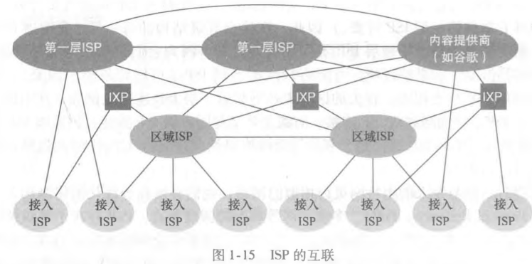
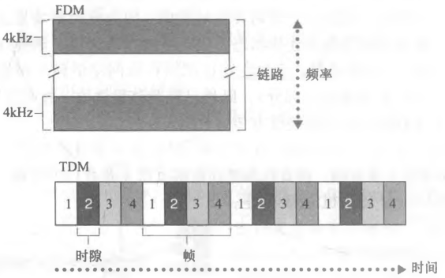
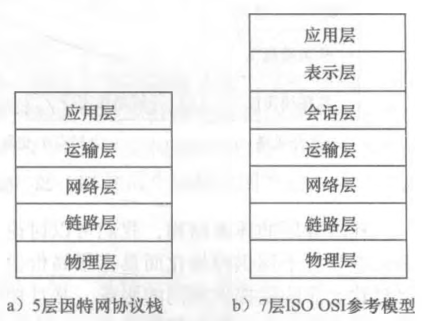
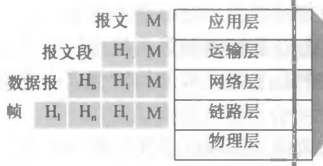

# 计算机网络和因特网

## 因特网

##### 具体构成

- 主机/端设备；
- 通讯链路；
- 分组交换机；
- ISP (Internet Service Provider)；
- TCP/IP；
- RFC；

##### 套接字接口

- 端设备数据交换的规则；
- 端设备进程的抽象；

##### 协议

- 多个通讯实体之间交换报文的格式和顺序；
- 执行交换报文等事件采取的动作；

##### 网络中的网络

- ISP 具有层级关系；
- 下级 ISP 接入上级 ISP；
- 第三方创建 IXP 作为一个汇集点与多个 ISP 进行交互；

## 网络核心

### 分组交换

##### 分组

- 将长报文分割成若干小数据块；
- 分组通过通信链路和链路层交换机传送；

##### 存储转发传输

- 交换机输出该分组的第一个 bit 前；
- 必须接受到整个分组；

##### 排队时延

- 交换机连接多条链路；
- 若分组达到交换机时，交换机正处理其他分组；
- 分组存储在输出缓冲中等待，即排队时延；

##### 分组丢失(丢包)

- 若分组到达交换机时输出缓存已满
- 该分组或输出缓存中的某一分组将发生丢包现象；

##### 转发表

- 根据 ip/mac 将输入链路发送的分组映射为输出链路；

##### 路由选择协议

- 自动设置转发表；

### 电路交换

##### 电路交换

- 电路交换中，端与端之间的通信预留了对应资源；

##### 电路交换的复用

- 频分复用：链路中的链接专用一个频段；
- 时分复用：；
  - 时间划分为固定时间的帧；
  - 帧具有多个间隙；
  - 不同链接专用一个间隙；

##### 分组交换和电路交换的对比

- 分组交换具有更高的效率；
- 分组交换的延迟不可测；

## 分组交换中的时延, 吞吐量

### 时延

##### 处理时延

- 处理分组转发，纠错等操作需要的时间；

##### 排队时延

- 等待链路处理其他分组的时间；

##### 传输时延

- 路由器/交换机处理整个分组需要的时间；
- 分组长度/链路传输速率；

##### 传播时延

- 分组在链路传播的物理时间；

##### 总时延

- 上述时延的总和；

### 吞吐量

##### 瞬时吞吐量

- 链路的瞬时速率；

##### 平均吞吐量

- 链路的平均速率；

##### 最大吞吐量

- 整个链路过程中的各段链路吞吐量的最小值；

## 协议层次及其服务模型

### 分层的体系结构

##### 协议分层

- 以分层的方式组织协议；
- 某个协议属于某层；
- 具有概念化和结构化的有点；

##### 协议栈

- 各层的所有协议；
- 常用协议栈；
  - 因特网协议栈；
  - ISO OSI 参考模型；

### OSI 模型

##### 相同 5 层

- 相同的 5 层意义大致相同；

##### 表示层

- 负责数据如何描述；

##### 会话层

- 负责数据的交换，同步和恢复等；

##### OSI 模型与因特网模型的关系

- 因特网模型中的应用层负责表示层和会话层的工作；

### 封装

- 下一层分组在上一次分组的基础上额外添加信息；

